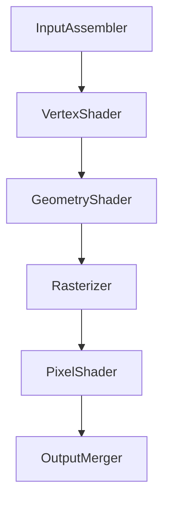
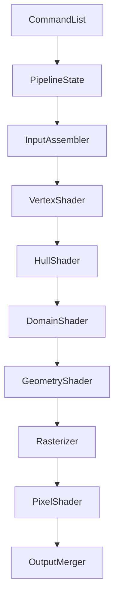
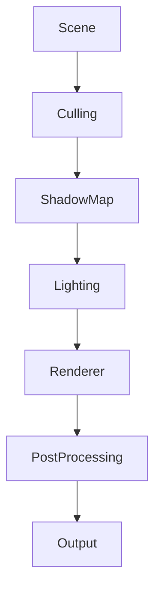
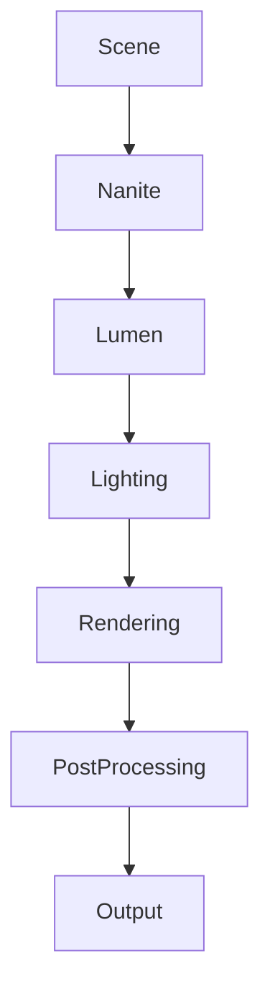

<head>
  
</head>

もちろんです！以下に、**DirectX 11**, **DirectX 12**, **Unity (Universal Render Pipeline - URP)**, **Unreal Engine 5** のそれぞれのグラフィックスパイプラインをMarkdown形式で図示し、各ファイルやフォルダについての詳細な説明を追加しました。視覚的に理解しやすいようにセクションを分けて整理しています。

---

## グラフィックスパイプラインの概要

グラフィックスパイプラインは、3Dシーンを2D画像にレンダリングするための一連のステップです。以下では、各技術ごとのパイプラインを図とともに説明します。

### 1. DirectX 11 グラフィックスパイプライン

**ステージ詳細:**

1. **Input Assembler (入力アセンブラー)**
   - 頂点データをメモリから収集します。
   
2. **Vertex Shader (頂点シェーダー)**
   - 3D座標を2Dスクリーン空間に変換します。

3. **Geometry Shader (ジオメトリシェーダー)**
   - ジオメトリデータを処理します（オプション）。

4. **Rasterizer (ラスタライザー)**
   - ベクターグラフィックスをピクセルに変換します。

5. **Pixel Shader (ピクセルシェーダー)**
   - 各ピクセルの色を決定します。

6. **Output Merger (アウトプットマージャー)**
   - 最終的な画像を生成します。

---

### 2. DirectX 12 グラフィックスパイプライン

DirectX 12はDirectX 11に比べてより柔軟で、明示的なリソース管理が可能です。

**ステージ詳細:**

1. **Command List (コマンドリスト)**
   - レンダリングコマンドを記録します。

2. **Pipeline State (パイプラインステート)**
   - グラフィックスパイプラインの設定を行います。

3. **Input Assembler (入力アセンブラー)**
   - 頂点データを収集します。

4. **Vertex Shader (頂点シェーダー)**
   - 頂点データを処理します。

5. **Hull Shader (ハルシェーダー)**
   - テッセレーションの準備をします。

6. **Domain Shader (ドメインシェーダー)**
   - テッセレーション後のデータを処理します。

7. **Geometry Shader (ジオメトリシェーダー)**
   - ジオメトリデータを処理します。

8. **Rasterizer (ラスタライザー)**
   - ベクターグラフィックスをピクセルに変換します。

9. **Pixel Shader (ピクセルシェーダー)**
   - 各ピクセルの色を決定します。

10. **Output Merger (アウトプットマージャー)**
    - 最終的な画像を生成します。

---

### 3. Unity グラフィックスパイプライン (Universal Render Pipeline - URP)

Unityは複数のレンダリングパイプラインを提供していますが、ここでは**Universal Render Pipeline (URP)**について説明します。

**ステージ詳細:**

1. **Scene (シーン)**
   - 3Dシーンデータを管理します。

2. **Culling (カリング)**
   - 表示されるオブジェクトを決定します。

3. **Shadow Map (シャドウマップ)**
   - シャドウの計算を行います。

4. **Lighting (ライティング)**
   - ライティング計算を適用します。

5. **Renderer (レンダラー)**
   - オブジェクトを描画します。

6. **Post Processing (ポストプロセッシング)**
   - ブルームやトーンマッピングなどの効果を適用します。

7. **Output (アウトプット)**
   - 最終的な画像をスクリーンに表示します。

---

### 4. Unreal Engine 5 グラフィックスパイプライン

Unreal Engine 5は最新のグラフィックス技術を統合しています。

**ステージ詳細:**

1. **Scene (シーン)**
   - 3Dシーンデータを管理します。

2. **Nanite**
   - 仮想化ジオメトリシステムで、高詳細モデルを効率的にレンダリングします。

3. **Lumen**
   - グローバルイルミネーションとリアルタイムリフレクションを提供します。

4. **Lighting (ライティング)**
   - ダイナミックおよびスタティックなライティング計算を適用します。

5. **Rendering (レンダリング)**
   - オブジェクトをマテリアルと共に描画します。

6. **Post Processing (ポストプロセッシング)**
   - 深度のぼかしやモーションブラーなどの効果を適用します。

7. **Output (アウトプット)**
   - 最終的な画像をスクリーンに表示します。

---

## グラフィックスパイプライン比較表

| ステージ                 | DirectX 11                         | DirectX 12                         | Unity URP                             | Unreal Engine 5                  |
|--------------------------|------------------------------------|------------------------------------|---------------------------------------|----------------------------------|
| **Input Assembly**       | Input Assembler                    | Input Assembler                    | Culling                               | Culling                          |
| **Vertex Processing**    | Vertex Shader                      | Vertex Shader                      | Shadow Map                            | Nanite                           |
| **Tessellation**         | Geometry Shader (Optional)         | Hull Shader, Domain Shader         |                                       | Nanite                           |
| **Geometry Processing**  | Geometry Shader                    | Geometry Shader                    | Lighting                              | Lumen                            |
| **Rasterization**        | Rasterizer                         | Rasterizer                         | Renderer                              | Lighting                         |
| **Fragment Processing**  | Pixel Shader                       | Pixel Shader                       | Renderer                              | Rendering                        |
| **Output**               | Output Merger                      | Output Merger                      | Post Processing → Output               | Post Processing → Output         |

---

## 説明と注意点

- **DirectX 11** は固定されたパイプラインを持ち、各ステージが明確に定義されています。
- **DirectX 12** はより柔軟で、リソース管理やマルチスレッド処理が可能です。Hull Shader と Domain Shader が追加され、テッセレーションがサポートされています。
- **UnityのURP** はパフォーマンスとクロスプラットフォーム対応を重視し、簡略化されたパイプラインを提供します。
- **Unreal Engine 5** はNaniteやLumenなどの最新技術を統合し、従来のパイプラインを拡張しています。

### Mermaidダイアグラムの使用について

上記のMermaidダイアグラムを正しく表示するためには、MarkdownレンダラーがMermaidをサポートしている必要があります。以下の方法を試してください：

1. **GitHub**: 最近のGitHubはMermaidをサポートしています。リポジトリのREADME.mdなどで確認できます。
2. **Markdownエディタ**: [Markdown Preview Enhanced](https://shd101wyy.github.io/markdown-preview-enhanced/) や [Typora](https://typora.io/) など、Mermaidをサポートするエディタを使用します。
3. **オンラインツール**: [Mermaid Live Editor](https://mermaid-js.github.io/mermaid-live-editor/) を使ってダイアグラムを作成し、画像としてエクスポートしてMarkdownに挿入します。

---

## まとめ

各グラフィックスパイプラインのステージとその役割を理解することで、異なる技術間の違いや特長を把握しやすくなります。Mermaidを活用することで、Markdown内で視覚的な図を簡単に作成・共有できますので、ぜひ試してみてください。

もしさらに詳しい情報や追加の質問があれば、お気軽にお知らせください！