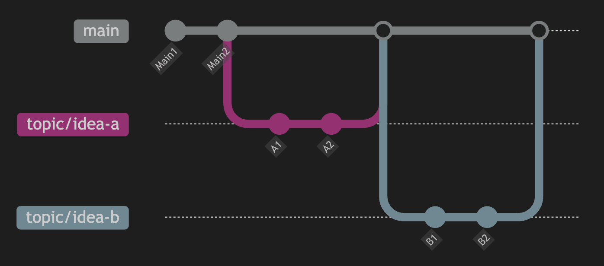
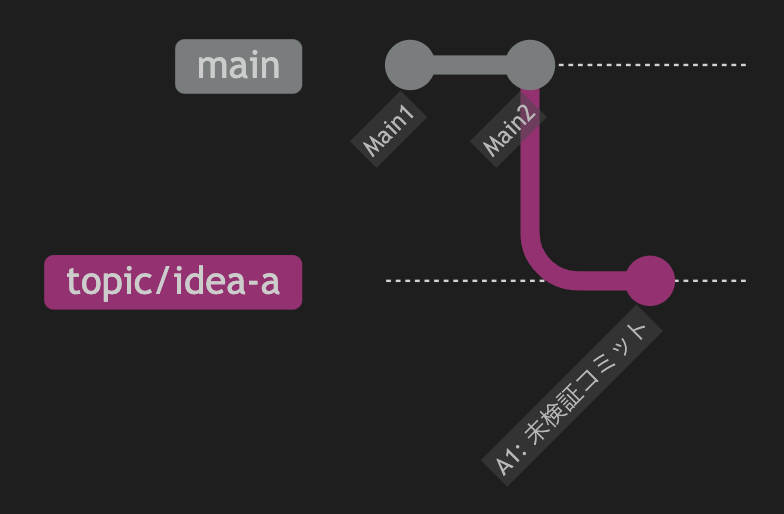
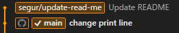
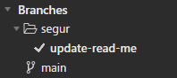

# ブランチ運用法
ブランチの使い方には色んな流派がありますが、ここでは有名な GitHub Flow を紹介します

 

# GitHub Flow
GitHubでは、数千人規模のプログラマーが、1つのリポジトリで共同開発することもあります。

そんな状況でも、混乱が発生しないように編み出されたブランチ運用法が、 GitHub Flow です。

以下のルールを守って、ブランチを運用します。

+ mainブランチからtopicブランチを生やす。
+ mainブランチは常にリリース可能な状態にしておく。
+ topicブランチはこまめにプッシュする。

 

# mainブランチからtopicブランチを生やす
何か作業をするときは、mainブランチからtopicブランチを生やします。
mainブランチ上で作業しないようにしましょう。  
あくまで、mainブランチはtopicブランチをマージするときだけ進みます。

## topicブランチ命名例
topicブランチの名前は、なんのためのブランチなのか説明する内容にしましょう。

たとえば、 ボタン機能を追加 した場合、以下のような命名案があります。

+ topic/作業名  
    - 例: topic/add-button

+ 作業種別/作業名
    - 例: feature/add-button

ここでの作業種別とは、以下のようなものです。  
・feature : 機能開発  
・fix : バグ修正

+ 作業者名/作業名
    - 例: jozen/add-button

+ 作業者名/課題番号/作業名
    - 例: /123/add-button

ここでの課題番号とは、課題管理ツール（GitHub Issue, JIRA等）で発行される番号のことです。

(/ と - の違いは後ほど説明)

単語の区切りは - が一般的ですが、 _ や大文字区切りでも、Gitは動作します。

 

# mainブランチは常にリリース可能な状態にしておく
他のメンバーが安心してmainブランチを利用するために、動作が不安定になるtopicブランチを、mainブランチにマージしてはいけません。

例えば、  
実行するとエラーが発生する状態のtopicブランチをAさんが作ったとします。それをmainブランチにマージしてしまうと、Bさんがそのmainブランチを利用するときにエラーが発生してしまいます。  
Bさんからすると、なぜエラーが発生するのかを調査する必要があり、ムダな時間をとられてしまいます。  
動作が不安定なtopicブランチをmainブランチにマージしてはいけません。

 

OK: UnityAssetを導入し、動作確認せずに、topicブランチにコミットする。 

❌: UnityAssetを導入し、動作確認せずに、topicブランチにコミットし、それをmainブランチにマージする。  

OK: UnityAssetを導入し、topicブランチにコミットする。動作確認をしたところ、エラーが見つかったので、修正してから、mainブランチにマージする。

 

# topicブランチは定期的にPushする
チーム開発では、作業の共有が重要になります。

情報共有をこまめにするほうが、ブランチが競合したり、作業が重複することを避けることができます。

なるべく毎日プッシュするようにしましょう！

 

# 用語について
## GitHub Flow ≠ Git Flow
ブランチ運用法について調べると、Git Flowという用語を見かけますが、これはGitHub Flowとは別の流派です。

Git Flowは、GitHub Flowにdevelopブランチを追加するアイデアです。

## topicブランチ = featureブランチ
ブランチについて調べると、featureブランチという用語を見かけますが、これはtopicブランチの別名です。

+ GitHub Flowでは、topicブランチ
+ Git Flowでは、featureブランチ
と呼ぶ慣習があります。

日本語だと、機能ブランチ・支流・枝などと呼ぶ人もいます。

 

## mainブランチ = masterブランチ
ブランチについて調べると、masterブランチという用語を見かけますが、これはmainブランチの昔の名称です。
masterには「奴隷の主人」という意味があり、人権問題の観点からセンシティブなので、あまり使われなくなりました。

https://www.publickey1.jp/blog/20/githubmainmastermain.html

日本語だと、統合ブランチ・本流・幹などと呼ぶ人もいます。

 

# ブランチの整理
ブランチ名にスラッシュを入れる  
名前/update-read-me というブランチを作って、READMEの内容を変更し、コミットするとします。

 

Forkの左側の Branches を見ると、作成した「名前」のフォルダーができます。  
ブランチ名に / を入れると、Forkがフォルダーとして表示してくれます。

 

ブランチが大量にあると、フォルダーで整理した方が、見通しがよくなるかもしれませんね。
「-」はフォルダーにはならないので、使い分けましょう。

