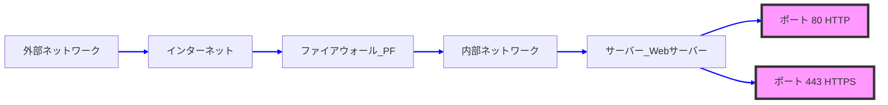
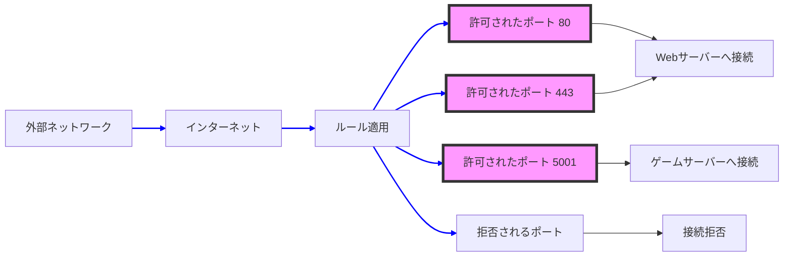
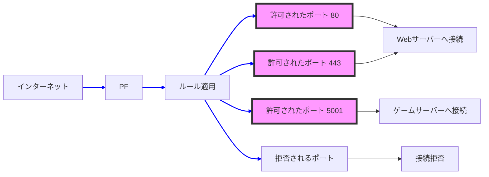
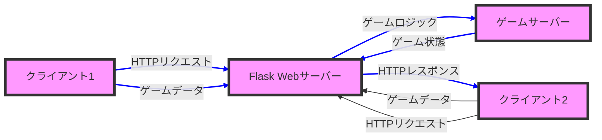
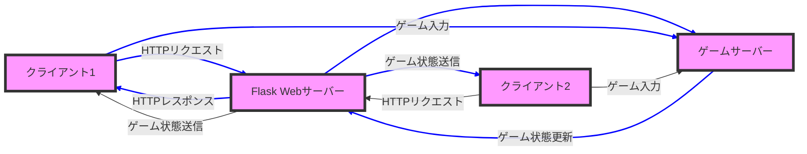

<head>
  <script type="module">
    import mermaid from 'https://cdn.jsdelivr.net/npm/mermaid@10/dist/mermaid.esm.min.mjs';
    mermaid.initialize({ startOnLoad: true });
  </script>
</head>

ピンポンの対戦ゲームを実装するための最終的なフォルダ構成と、HTML、Python（Flask）コードは以下のようになります。この実装では、ゲーム状態を管理し、スコアの表示、勝敗の判定、リスタートボタンの追加を行います。

### フォルダ構成

```
/PingPong
│
├── app.py                # Flaskアプリケーションのメインファイル
├── /templates
│   └── index.html        # ゲームのHTMLページ
├── /static
│   └── style.css         # スタイルシート（必要に応じて）
└── /PingPong_venv        # 仮想環境（Flaskや依存パッケージがインストールされる）
```

### Flask（Python）コード (`app.py`)

```python
from flask import Flask, render_template, jsonify, request

app = Flask(__name__)

# プレイヤー位置やボール位置などの初期データ
game_state = {
    "player1_y": 150,
    "player2_y": 150,
    "ball_x": 200,
    "ball_y": 150,
    "ball_dx": 3,
    "ball_dy": 3,
    "score": {"player1": 0, "player2": 0},
    "game_over": False
}

@app.route('/')
def index():
    return render_template('index.html')

@app.route('/get_state', methods=['GET'])
def get_state():
    return jsonify(game_state)

@app.route('/update_position', methods=['POST'])
def update_position():
    data = request.get_json()
    player = data.get("player")
    position = data.get("position")
    
    if player == "player1":
        game_state["player1_y"] = position
    elif player == "player2":
        game_state["player2_y"] = position
    
    return jsonify(success=True)

@app.route('/update_ball', methods=['POST'])
def update_ball():
    # ボールの移動
    game_state["ball_x"] += game_state["ball_dx"]
    game_state["ball_y"] += game_state["ball_dy"]

    # 上下の壁で反射
    if game_state["ball_y"] <= 0 or game_state["ball_y"] >= 300:  # 300はキャンバスの高さ
        game_state["ball_dy"] = -game_state["ball_dy"]

    # パドルとの当たり判定
    if game_state["ball_x"] <= 20 and game_state["ball_y"] >= game_state["player1_y"] and game_state["ball_y"] <= game_state["player1_y"] + 60:
        game_state["ball_dx"] = -game_state["ball_dx"]
    elif game_state["ball_x"] >= 380 and game_state["ball_y"] >= game_state["player2_y"] and game_state["ball_y"] <= game_state["player2_y"] + 60:
        game_state["ball_dx"] = -game_state["ball_dx"]

    # 得点処理（ボールが左端または右端を超えた場合）
    if game_state["ball_x"] <= 0:  # プレイヤー2の得点
        game_state["score"]["player2"] += 1
        check_game_over()
        reset_ball()
    elif game_state["ball_x"] >= 400:  # プレイヤー1の得点
        game_state["score"]["player1"] += 1
        check_game_over()
        reset_ball()

    return jsonify(success=True)

# ボールの初期位置をリセット
def reset_ball():
    game_state["ball_x"] = 200
    game_state["ball_y"] = 150
    game_state["ball_dx"] = 3
    game_state["ball_dy"] = 3

# 勝敗判定
def check_game_over():
    if game_state["score"]["player1"] >= 10:
        game_state["game_over"] = True
        game_state["winner"] = "Player 1"
    elif game_state["score"]["player2"] >= 10:
        game_state["game_over"] = True
        game_state["winner"] = "Player 2"

# ゲームのリセット
@app.route('/restart_game', methods=['POST'])
def restart_game():
    game_state["score"] = {"player1": 0, "player2": 0}
    game_state["game_over"] = False
    game_state["winner"] = None
    game_state["player1_y"] = 150
    game_state["player2_y"] = 150
    game_state["ball_x"] = 200
    game_state["ball_y"] = 150
    game_state["ball_dx"] = 3
    game_state["ball_dy"] = 3
    return jsonify(success=True)

if __name__ == '__main__':
    app.run(host="0.0.0.0", port=5001)
```

### HTMLコード (`templates/index.html`)

```html
<!DOCTYPE html>
<html lang="en">
<head>
    <meta charset="UTF-8">
    <meta name="viewport" content="width=device-width, initial-scale=1.0">
    <title>Ping Pong Game</title>
    <style>
        canvas { background: #000; display: block; margin: auto; }
        body { text-align: center; }
        #score { font-size: 20px; margin-top: 10px; }
        #winner { font-size: 24px; color: red; margin-top: 10px; }
        #restartButton { font-size: 18px; margin-top: 20px; }
    </style>
</head>
<body>
    <h1>Ping Pong Game</h1>
    <canvas id="gameCanvas" width="400" height="300"></canvas>
    <div id="score">
        Player 1: <span id="scorePlayer1">0</span> - Player 2: <span id="scorePlayer2">0</span>
    </div>
    <div id="winner"></div>
    <button id="restartButton" style="display:none;">Restart Game</button>

    <script>
        const canvas = document.getElementById('gameCanvas');
        const ctx = canvas.getContext('2d');

        let player1Y = 150;
        let player2Y = 150;
        let ballX = 200;
        let ballY = 150;
        let scorePlayer1 = 0;
        let scorePlayer2 = 0;
        let gameOver = false;
        let winner = "";

        // キャンバスにゲームオブジェクトを描画する
        function drawGame() {
            ctx.clearRect(0, 0, canvas.width, canvas.height);
            // プレイヤー1のパドル
            ctx.fillStyle = "white";
            ctx.fillRect(10, player1Y, 10, 60);
            // プレイヤー2のパドル
            ctx.fillRect(380, player2Y, 10, 60);
            // ボール
            ctx.beginPath();
            ctx.arc(ballX, ballY, 10, 0, Math.PI * 2);
            ctx.fill();

            // スコアを更新
            document.getElementById('scorePlayer1').textContent = scorePlayer1;
            document.getElementById('scorePlayer2').textContent = scorePlayer2;

            // ゲームオーバー表示
            if (gameOver) {
                document.getElementById('winner').textContent = winner + " Wins!";
                document.getElementById('restartButton').style.display = "inline";
            }
        }

        async function updateGameState() {
            const response = await fetch('/get_state');
            const state = await response.json();
            player1Y = state.player1_y;
            player2Y = state.player2_y;
            ballX = state.ball_x;
            ballY = state.ball_y;
            scorePlayer1 = state.score.player1;
            scorePlayer2 = state.score.player2;
            gameOver = state.game_over;
            winner = state.winner;
        }

        async function sendPlayerPosition(player, position) {
            await fetch('/update_position', {
                method: 'POST',
                headers: { 'Content-Type': 'application/json' },
                body: JSON.stringify({ player, position })
            });
        }

        document.addEventListener('mousemove', (event) => {
            const mouseY = event.clientY;
            sendPlayerPosition("player1", mouseY);
        });

        document.getElementById('restartButton').addEventListener('click', async () => {
            await fetch('/restart_game', { method: 'POST' });
            document.getElementById('restartButton').style.display = "none";
            document.getElementById('winner').textContent = "";
        });

        // 定期的にゲーム状態を更新する
        setInterval(async () => {
            if (!gameOver) {
                await updateGameState();
                drawGame();
                await fetch('/update_ball', { method: 'POST' });
            }
        }, 1000 / 60);
    </script>
</body>
</html>
```

<br>

<br>


#### 1. **ポートの解説**
ポートは、ネットワーク上の特定のサービスを識別するための論理的な番号です。ポート番号とIPアドレスの組み合わせで、通信相手を特定します。例えば、HTTPサーバーは通常ポート80、HTTPSサーバーは443番を使用します。この関係を以下の図で視覚化できます。



### 説明：
- 外部ネットワーク（インターネット）からサーバーへ接続する際、通信先のポート番号が指定されます。
- 例えば、WebサーバーへのHTTP接続はポート80、HTTPS接続はポート443を使用します。
- 各サービスは、異なるポート番号で区別されており、同一のサーバー内でも異なるサービスを提供することが可能です。

#### 2. **PF（Packet Filter）の解説**
PF（Packet Filter）は、ネットワークトラフィックをフィルタリングするためのツールで、ネットワークのセキュリティを強化するために使用されます。PFでは、どの通信を許可し、どの通信を拒否するかのルールを設定します。次の図でPFがどのように機能するかを示します。

<div class="mermaid">
graph LR
    A[外部ネットワーク] --> B[インターネット]
    B --> C[ファイアウォール PF]
    C --> D[内部ネットワーク]
    D --> E[サーバー Webサーバー]
    E --> F[ポート 80 HTTP]
    E --> G[ポート 443 HTTPS]
    
    %% ノードにクラスを適用
    F:::port
    G:::port

    %% リンクのスタイルを設定
    linkStyle default stroke:#00f,stroke-width:2px;

    %% クラスの定義
    classDef port fill:#f9f,stroke:#333,stroke-width:4px;
</div>



### 説明：
- **PF**（Packet Filter）は、ネットワーク通信がサーバーに到達する前に、その通信をチェックします。
- PFは、設定されたルールに従って、特定のポート（例えば、ポート80や443）は許可し、その他のポートへの接続は拒否します。
- 設定ルールにより、サービスごとにポートが開放され、セキュリティポリシーを強化します。

#### 3. **PFの動作**
PF（Packet Filter）は、設定されたルールに基づいて、ネットワークトラフィックを処理します。これにより、どのトラフィックが許可され、どのトラフィックが拒否されるかが決まります。以下の図でPFの動作を具体的に示します。



### 解説：
- PFは、外部からの接続に対して設定されたルールを適用します。
- 設定ルールでは、ポート80（HTTP）、443（HTTPS）、5001などが許可され、これらのポートを使った接続はサーバーに到達します。
- その他のポートへの接続は拒否され、セキュリティ上のリスクを減らします。

---

これらの図を使用することで、ポートとPF（Packet Filter）の役割を視覚的に理解しやすくすることができます。Mermaidを使うことで、複雑なネットワーク設定やファイアウォールの仕組みを直感的に確認でき、システム設計やセキュリティ設定の理解を深めることができます。


<br>


以下にFlaskを使用して別のパソコンと対戦ゲームを実現する仕組みを示す図と解説を加えました。これにより、Flaskを用いたウェブアプリケーションを通じて、対戦ゲームがどのように実現されるかが分かります。

### 4. **Flaskを用いた対戦ゲームの仕組み**

FlaskはPythonの軽量Webフレームワークで、HTTPリクエストを処理し、ゲームのクライアントとサーバー間でリアルタイムでデータをやり取りできます。以下の図は、Flaskを通じて異なるパソコン間での対戦ゲームの流れを示しています。



### 解説：
- **クライアント1** と **クライアント2** はそれぞれ別のパソコンで、ブラウザを通じてゲームをプレイします。
- 両者はFlask WebサーバーにHTTPリクエストを送り、ゲームデータを共有します。Flaskはこれを受け取り、ゲームサーバーと連携してゲームのロジックを処理します。
- ゲームサーバーは、対戦中の状態（例えば、プレイヤーの位置やスコア）をFlaskに返し、FlaskがそのデータをクライアントにHTTPレスポンスとして送信します。これにより、リアルタイムでゲームの状態が更新され、両方のクライアントが同期されます。

---

### 5. **ゲームのフロー**

以下は、ゲームのフローを示した図です。Flask Webサーバーを介して、クライアント1とクライアント2がどのように通信し、ゲーム状態が管理されるかを示しています。



### 解説：
- **クライアント1** と **クライアント2** はそれぞれ自分のゲーム入力をFlask Webサーバーに送信します。
- Webサーバーは受け取ったデータを基に **ゲームサーバー** でゲームロジックを更新し、その結果を再度クライアントに送信します。
- これにより、両方のクライアントが同じゲーム状態をリアルタイムで反映し、対戦が進行します。

---

これらの図と解説を通じて、Flaskを使った対戦ゲームの仕組みとその動作を視覚的に理解できます。ゲームデータのやり取りとリアルタイムでの同期がどのように行われるかを把握しやすくなるでしょう。