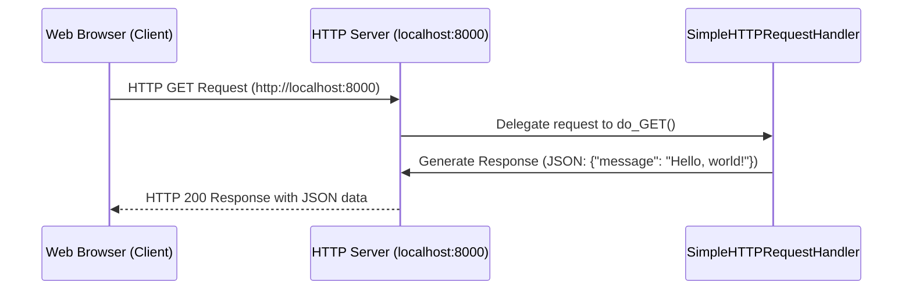

以下に、サーバーの仕組みやネットワークの基本的な知識について詳しく解説します。また、`mermaid`を使って通信フローを図示します。

### 全体の流れと通信フロー

まず、このサーバーがどのように動作しているかを示す図を`mermaid`で作成し、その後、サーバーの仕組みやネットワークに関する詳細な説明に進みます。

このシーケンス図の流れに沿って、サーバーの動作を詳しく解説していきます。

### Webサーバーの仕組みとポートの概要

Webサーバーとクライアント（この場合はブラウザ）の通信には、いくつかの重要な要素があります：

1. **IPアドレスとホスト名**
   - 通信の際、クライアントはまず接続先のサーバーの場所（IPアドレス）を知る必要があります。
   - `localhost` は自分のコンピュータを指す特別なホスト名で、ループバックアドレス `127.0.0.1` に関連付けられています。これにより、ローカルサーバーにアクセスする際に、他のネットワークを経由せずに自分のマシン内で直接通信ができます。

2. **ポート（Port）**
   - ポートは、IPアドレスと併せて使われる「通信の入り口」を表す番号です。Webサーバーでは通常ポート80番（HTTP）や443番（HTTPS）を利用しますが、ここではサンプルとして8000番を使用しています。
   - ポート番号により、同じマシン上で複数のサービスを提供することが可能になります。

3. **HTTPリクエストとレスポンス**
   - クライアント（ブラウザ）は、HTTPリクエストを送信し、サーバーはHTTPレスポンスを返します。
   - ここでは、ブラウザが `http://localhost:8000/` にGETリクエストを送信し、サーバーがレスポンスとしてJSONデータを返すようになっています。

### コードの処理内容とネットワークフローの詳細

1. **サーバーの立ち上げ**
   - `run()`関数で`HTTPServer`を指定したポート（8000番）で開始し、クライアントからのリクエスト待機状態に入ります。
   - サーバーアドレスとして`('', 8000)`が指定されていますが、空文字列`''`はすべてのローカルIPにバインドすることを意味し、どのローカルIPからのリクエストも受け付ける設定です。

2. **クライアント（ブラウザ）からのGETリクエスト**
   - ブラウザで `http://localhost:8000` にアクセスすると、GETリクエストがサーバーに送信されます。リクエストにはヘッダー情報やメソッド情報（この場合は`GET`）が含まれています。
   - リクエストを受け取ったサーバーは、このリクエストをハンドラーである `SimpleHTTPRequestHandler` の `do_GET` メソッドに渡します。

3. **ハンドラーによるレスポンスの生成**
   - `do_GET` メソッドで、サーバーがブラウザに返すレスポンスを生成します。
   - `send_response(200)` により、HTTPステータスコード200（成功）を返し、`send_header`でヘッダー情報（JSON形式）を付与します。
   - `self.wfile.write(json.dumps(response_data).encode('utf-8'))` は、レスポンスボディとしてJSON形式でメッセージを送信する処理です。

4. **レスポンスの送信**
   - 上記で生成したレスポンスがブラウザに送信されます。ブラウザはこのレスポンスを受け取り、レスポンスの内容を表示するか、あるいはJavaScriptなどでデータとして処理します。

### 周辺知識：なぜWebサーバーが必要か？

1. **クライアントとサーバーの分離**
   - Webアプリケーションの構造では、クライアント（ユーザーが操作する部分）とサーバー（データ処理やファイルの保存などのバックエンド）が分離されているため、Webサーバーが不可欠です。
   - サーバーはリクエストを受け取り、指定されたリソースを返したり、データを処理したりする役割を持ちます。

2. **HTTPとポートの活用**
   - サーバーは指定されたポートでリクエストを受け付けるため、複数のアプリケーションを同時に運用することができます。
   - ポート番号は、サービスごとに一意に指定されるため、同一IPアドレス上でも複数のWebサービスが稼働可能です。

### ローカルでのテストと実運用の違い

- **ローカルサーバーでのテスト**
  - このサンプルコードのように、`localhost`とローカルポートを利用してAPIの動作をテストできます。
  - 外部からのアクセスはできないため、安全なテスト環境として利用できます。

- **実運用サーバーでの使用**
  - 実際に公開する場合、クラウド上のサーバー（AWS、GCPなど）や専用のWebサーバーを使用します。また、セキュリティのためにHTTPSを使用し、認証や認可の仕組みも組み込みます。

以上が、Webサーバーとネットワークの仕組みに関する詳細な説明です。このサンプルコードは、Webサーバーの基本的な概念を学ぶために非常に有用です。