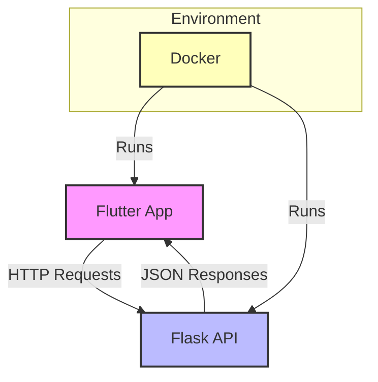

以下に、Docker、Flask、Flutterの関係を示したMermaid図を提供します。この図では、FlaskがバックエンドとしてREST APIを提供し、FlutterがフロントエンドとしてそのAPIを呼び出す様子を示しています。Dockerはこれらのアプリケーションをコンテナ化して、環境の一貫性を保つ役割を果たします。

### 図の説明

- **Flutter App (A)**:
  - ユーザーインターフェースを提供し、ユーザーの操作を受け付けます。
  - HTTPリクエストをFlask APIに送信し、データを取得します。

- **Flask API (B)**:
  - バックエンドロジックを実装し、REST APIを提供します。
  - Flutterからのリクエストに応じて、データベースとやり取りを行い、JSON形式でレスポンスを返します。

- **Docker (C)**:
  - FlutterアプリとFlask APIの両方をコンテナ化し、同じ環境で動作させます。
  - 環境依存の問題を解消し、アプリケーションのデプロイを容易にします。

### まとめ

この図は、Dockerを使用してFlaskバックエンドとFlutterフロントエンドをコンテナ化し、それぞれがREST APIを介して通信する構造を示しています。このアーキテクチャは、開発環境と本番環境の一貫性を保ちつつ、フロントエンドとバックエンドの分離を実現します。