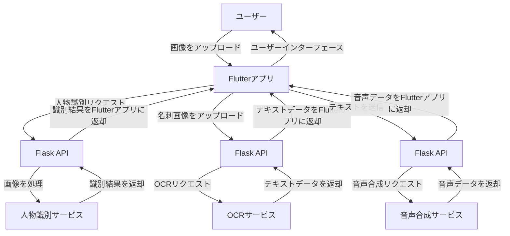

もちろんです！以下に、人物識別アプリ、OCR名刺管理アプリ、音声合成アプリの構成を示すMermaid図を作成しました。この図では、各サービスの関係性とデータフローを示しています。

### 説明
- **ユーザー**がFlutterアプリを通じて画像やテキストをアップロードします。
- **Flutterアプリ**はそれぞれの**Flask API**にリクエストを送信します。
- 各**Flask API**は、特定のサービス（人物識別サービス、OCRサービス、音声合成サービス）にリクエストを行い、結果を取得します。
- 取得した結果をFlutterアプリに返し、最終的にユーザーに表示します。

この図は、システム全体のデータフローを視覚的に理解するのに役立ちます。どのようにサービスが連携しているかを示すために、それぞれのAPIやサービスの役割を明確にしています。