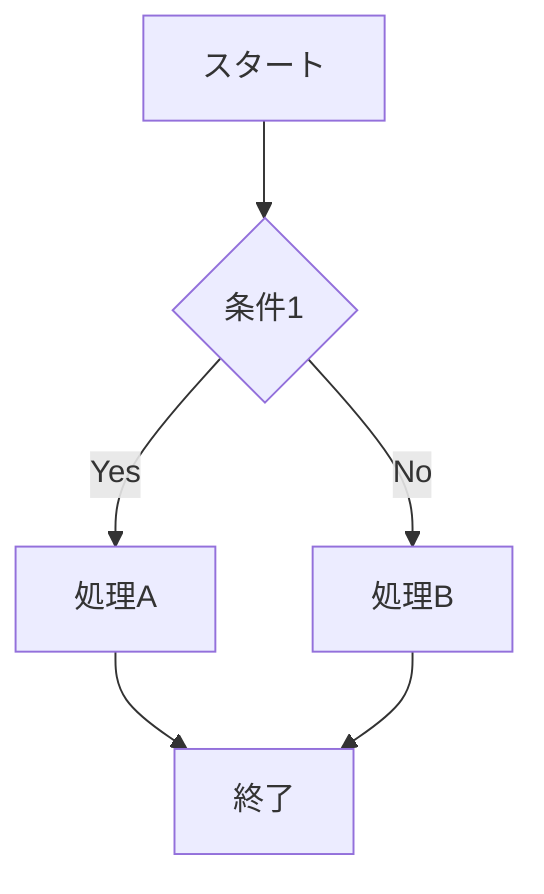
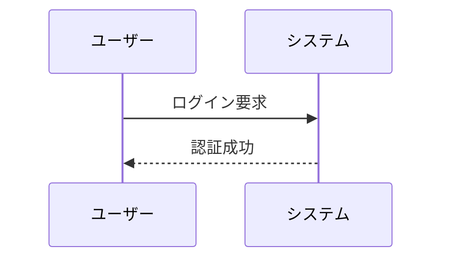

<head>
  <script type="module">
    import mermaid from 'https://cdn.jsdelivr.net/npm/mermaid@10/dist/mermaid.esm.min.mjs';
    mermaid.initialize({ startOnLoad: true });
  </script>
</head>

Mermaidは、テキストベースでフローチャート、シーケンス図、ガントチャートなどの図を作成できるJavaScriptライブラリです。Markdownのようにテキストで記述でき、コード内で視覚的な図表を簡単に生成できます。

### 基本的な構文

Mermaidの図は、以下のように開始部分を `mermaid` キーワードで宣言し、その後に続く構文で図を定義します。

<div class="mermaid">

graph TD
    A[開始] --> B[処理1]
    B --> C{条件分岐}
    C -->|Yes| D[処理2]
    C -->|No| E[処理3]

</div>


#### メイン要素

1. **`graph` キーワード**  
   `graph` の後に、図の方向を指定します:
   - `TD` (Top to Down): 上から下
   - `LR` (Left to Right): 左から右
   - `BT` (Bottom to Top): 下から上
   - `RL` (Right to Left): 右から左

2. **ノードの記述方法**  
   ノードは次のように定義されます:
   - `A[テキスト]`: 四角形ノード
   - `B((テキスト))`: 丸型ノード
   - `C>{テキスト}`: ダイヤモンド型ノード（条件分岐）
   - `D([テキスト])`: 円形のノード

3. **矢印の種類**  
   - `-->` : 単純な矢印
   - `-->|Yes|` : 条件付き矢印（Yes/Noや他の条件を書くことができます）

### Mermaidの代表的な図の種類

1. **フローチャート (`graph`)**
   プロセスの流れやワークフローを表現する図です。
   
   ```mermaid
   graph LR
       A[開始] --> B{条件}
       B -->|Yes| C[処理1]
       B -->|No| D[処理2]
       C --> E[終了]
       D --> E
   ```

2. **シーケンス図 (`sequenceDiagram`)**
   オブジェクト間のやりとりを時系列で示します。

   ```mermaid
   sequenceDiagram
       participant Alice
       participant Bob
       Alice->>Bob: メッセージ送信
       Bob-->>Alice: メッセージ受信
       Bob->>Charlie: 他のユーザーにメッセージ
   ```

3. **ガントチャート (`gantt`)**
   プロジェクトのタスクスケジュールを示す図です。

   ```mermaid
   gantt
       title プロジェクトスケジュール
       dateFormat YYYY-MM-DD
       section 準備
       タスクA :a1, 2024-01-01, 7d
       タスクB :after a1, 3d
       section 実行
       タスクC :2024-01-10, 10d
       タスクD :2024-01-15, 7d
   ```

4. **クラス図 (`classDiagram`)**
   オブジェクト指向設計で用いるクラスの構造や関係を示します。

   ```mermaid
   classDiagram
       class Animal {
           +String name
           +int age
           +makeSound()
       }
       class Dog {
           +String breed
           +bark()
       }
       Animal <|-- Dog
   ```

5. **状態遷移図 (`stateDiagram-v2`)**
   状態遷移やイベントに基づいた動作を表現します。

   ```mermaid
   stateDiagram-v2
       [*] --> 状態1
       状態1 --> 状態2 : イベント
       状態2 --> [*]
   ```

### Mermaidの使用例

#### 1. 簡単なフローチャート例



#### 2. シーケンス図の例



### Mermaidのメリット
- **簡単に作成**: テキストベースなので修正や管理がしやすい。
- **視覚化**: Markdownの中に埋め込めるため、ドキュメントと一体化。
- **多機能**: フローチャート以外に、シーケンス図やガントチャートなど幅広い図表が作成可能。

Mermaidを利用すると、手軽に見やすい図表を作成でき、特にワークフローやシステムの設計を視覚的に整理する際に役立ちます。