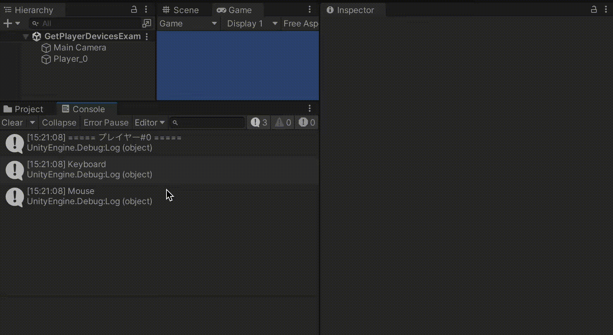

# 接続中のデバイスの取得

システム全体で接続されているデバイス一覧を取得する他、各々のプレイヤーにペアリングされているデバイスのみを取得することも可能です。

これ以外にも、各プレイヤーがキーボード・マウス操作なのか、ゲームパッド操作なのかといった判断が可能になります。

<br>

# Input System全体で接続されているデバイス一覧を取得する
InputSystem.devicesプロパティから取得できます。
```
public static ReadOnlyArray<InputDevice> devices { get; }
```
現在接続されているデバイス一覧をInputDevice型のコレクションとして返します。

以下、接続されているデバイス一覧をログ出力するサンプルスクリプトです。
```cs:GetDevicesExample.cs
using UnityEngine;
using UnityEngine.InputSystem;

public class GetDevicesExample : MonoBehaviour
{
    private void Start()
    {
        // デバイス一覧を取得
        foreach (var device in InputSystem.devices)
        {
            // デバイス名をログ出力
            Debug.Log(device.name);
        }
    }
}
```
上記をGetDevicesExample.csという名前でUnityプロジェクトに保存し、適当なゲームオブジェクトにアタッチすると機能するようになります。

ゲームを実行すると、Input System全体で認識されている接続デバイス一覧がコンソールログに出力されます。


<br>

## スクリプトについて
次のコードでデバイス一覧を列挙し、デバイス名をログ出力しています。
```cs:
// デバイス一覧を取得
foreach (var device in InputSystem.devices)
{
    // デバイス名をログ出力
    Debug.Log(device.name);
}
```
InputSystem.devicesプロパティが返すReadOnlyArray<T>型は、IReadOnlyList<T>型を継承したコレクションのため、foreachやforループが使えます。

<br>

# プレイヤーにペアリングされているデバイス一覧を取得する
前述の方法は、デバイス全体を対象としていました。

現在操作しているプレイヤーにペアリングされているデバイスに限定して一覧を取得するには、PlayerInput.devicesプロパティを使います。
```cs:
public ReadOnlyArray<InputDevice> devices { get; }
```

指定されたプレイヤーにペアリングされているデバイス一覧を取得する例です。
```cs:GetPlayerDevicesExample.cs
using UnityEngine;
using UnityEngine.InputSystem;

public class GetPlayerDevicesExample : MonoBehaviour
{
    [SerializeField] private PlayerInput _playerInput;

    private void Start()
    {
        if (_playerInput == null)
            return;

        // プレイヤーはアクティブかどうかチェック
        if (!_playerInput.user.valid)
        {
            Debug.Log("アクティブなプレイヤーではありません");
            return;
        }

        // プレイヤー番号をログ出力
        Debug.Log($"===== プレイヤー#{_playerInput.user.index} =====");

        // デバイス一覧を取得
        foreach (var device in _playerInput.devices)
        {
            // デバイス名をログ出力
            Debug.Log(device.name);
        }
    }
}
```
上記をGetPlayerDevicesExample.csという名前でUnityプロジェクトに保存し、適当なゲームオブジェクトにアタッチし、インスペクターよりプレイヤーのPlayer Inputコンポーネントを指定します。


<br>

Player Inputコンポーネントには、予めActions項目にInput Action Assetを指定してください。

プレイヤー（Player Inputコンポーネントがアタッチされているオブジェクト）をシーンに追加していくと、各プレイヤー毎にペアリングされたデバイス一覧がログ出力されます



<br>

コントローラー不足などでデバイスが割り当てられなかったプレイヤーは、非アクティブなプレイヤーとみなして取得を行いません。

<br>

## スクリプトについて
追加されたプレイヤーがアクティブかどうかをチェックし、アクティブなら以降の処理に進むようにしています。
```cs:
// プレイヤーがアクティブかどうかチェック
if (!_playerInput.user.valid)
{
    Debug.Log("アクティブなプレイヤーではありません");
    return;
}
```

PlayerInput.userプロパティは、そのプレイヤーのユーザー情報をInputUser構造体として取得するプロパティです。  
InputUser.validプロパティでアクティブかどうかを判断しています。

非アクティブになる条件は、例えば接続されているコントローラーが足りないなどでペアリングされたデバイスが存在しない場合などです。

アクティブであるかどうかを確認出来たら、プレイヤーのインデックスを取得してログ出力しています。
```cs:
// プレイヤー番号をログ出力
Debug.Log($"===== プレイヤー#{_playerInput.user.index} =====");
```
インデックスは0始まりで、プレイヤーが増えるごと1つずつ増えていきます。  
シングルプレイヤーの場合は常に0が返されることになります。

そして、以下処理でPlayerInputインスタンスのdevicesプロパティ経由で、ペアリングされたデバイス一覧を取得し、ログ出力しています。
```cs:
// デバイス一覧を取得
foreach (var device in _playerInput.devices)
{
    // デバイス名をログ出力
    Debug.Log(device.name);
}
```
PlayerInput.devicesプロパティは、内部的にはPlayerInput.user.pairedDevicesの結果を返します。（ただし、非アクティブなプレイヤーだった場合は空の結果を返す挙動になっています。）

<br>

# プレイヤーのControl Schemeを取得する
もし接続されたデバイス一覧ではなく、キーボード＆マウス、ゲームパッドなどのControl Schemeを取得したい場合、PlayerInput.currentControlSchemeプロパティを使います。

サンプルスクリプト
```cs:GetPlayerSchemeExample.cs
using UnityEngine;
using UnityEngine.InputSystem;

public class GetPlayerSchemeExample : MonoBehaviour
{
    [SerializeField] private PlayerInput _playerInput;

    private void Start()
    {
        if (_playerInput == null) return;

        // プレイヤーはアクティブかどうかチェック
        if (!_playerInput.user.valid)
        {
            Debug.Log("アクティブなプレイヤーではありません");
            return;
        }

        // プレイヤー番号をログ出力
        Debug.Log($"===== プレイヤー#{_playerInput.user.index} =====");

        // 現在のControl Schemeをログ出力
        Debug.Log($"Control Scheme: {_playerInput.currentControlScheme}");
    }
}
```
上記をGetPlayerSchemeExample.csという名前でUnityプロジェクトに保存し、適当なゲームオブジェクトにアタッチし、インスペクターよりPlayerInputインスタンスを指定します。

プレイヤー毎のControl Scheme名がログ出力されます。


<br>

得られるControl Scheme名は、Input Action Assetで設定されている名前です。


<br>


<br>

## スクリプトについて
現在のControl Schemeをログ出力する部分は以下です。
```
// 現在のControl Schemeをログ出力
Debug.Log($"Control Scheme: {_playerInput.currentControlScheme}");
```
デバイス一覧とは異なり、Control Schemeはただ一つです。

例えば、Keyboard&Mouseはキーボードとマウスの2つのデバイスを使いますが、Control Schemeはまとめて一つとして扱うことが可能です。


