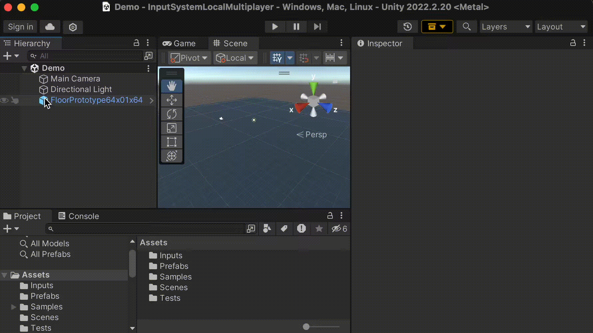
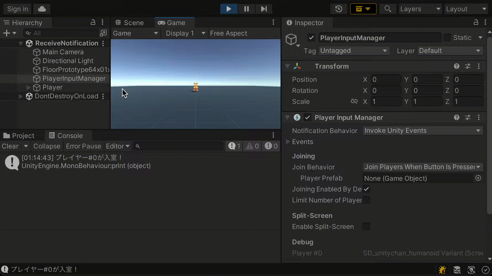
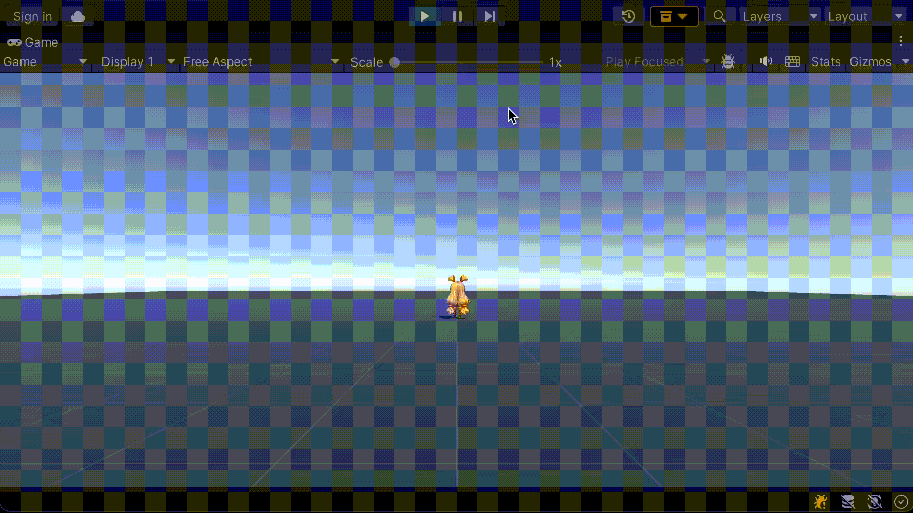

# 複数プレイヤーへの対応(ローカルマルチを実装する)

2023年6月3日
2023年6月2日

https://nekojara.city/unity-input-system-local-multiplayer

PCなどに複数のゲームパッドを繋ぎ、ゲームをプレイするローカルマルチプレイヤーに対応していきます。  
Player InputおよびPlayer Input Managerコンポーネントを用いていきます。

### Player Input Managerでできること
+ 個別のコントローラーにプレイヤーを割り当てて操作可能にする
+ 何かキーが押されたら参加する
+ プレイヤーの入室・退室を検知する
+ プレイヤー毎のカメラを画面分割表示する

<br>

# プレイヤー側の準備
プレイヤーオブジェクトにPlayer Inputコンポーネントがアタッチされており、Player Inputから入力を取得して操作できるようなPrefabをセットアップしておきます。


<br>

# 複数プレイヤーを管理する仕組み
Player Input Managerコンポーネントによって複数プレイヤーのオブジェクトやコントローラーを管理できます。

Player Input Managerは個々のプレイヤーをPlayer Inputコンポーネントとして管理します。


<br>

Player Inputがアタッチされたゲームオブジェクトがシーン上に配置されると、自動的にプレイヤーインデックスが割り振られ、入室扱いとなります。
オブジェクトが無効化されたり破棄されると、そのプレイヤーは退室扱いとなります。この時、インデックスは全体的に詰められます。(一意にIDも存在) 


<br>

各プレイヤーに割り当てるコントローラーのスキームは同一でも異なっていても構いません。

例えば、キーボード&マウス、ゲームパッド1、ゲームパッド2にそれぞれプレイヤーを割り当てることも可能です。


<br>

# Player Input Managerのセットアップ
まず、Player Input Managerコンポーネントを適当なゲームオブジェクトに追加します。



<br>


<br>


## 実行
Player Input Managerコンポーネントがシーンに存在している状態で、Player Inputコンポーネントがアタッチされているオブジェクト（プレイヤーなど）がシーンに配置されると、Player Inputにはユーザーインデックスが割り当てられます。


<br>

インデックスは、Player InputコンポーネントのインスペクターのDebug > Userから確認できます。


<br>

# Player Input Managerの各種設定
## ・　入退室通知の設定
プレイヤーオブジェクトが（追加されるなどで）有効化されると「入室（参加）」イベントが通知されます。

プレイヤーオブジェクトが無効化されると「退室」イベントが通知されます。

通知方法はNotification Behaviour項目から以下4種類を選択できます。

+ Send Messages  
	SendMessage経由で通知する。  
    「入室」はOnPlayerJoined、  
    「退室」はOnPlayerLeftイベントとして通知される。  
    Player Inputコンポーネントがアタッチされているオブジェクトに受信用のスクリプトがアタッチされている必要がある。

+ Broadcast Messages  
BoardcastMessage経由で通知する。  
Player Inputコンポーネントがアタッチされているオブジェクトまたは子オブジェクトに受信用のスクリプトがアタッチされている必要がある。

+ Invoke Unity Event  
UnityEvent経由で通知する。  
「入室」はPlayerInputManager.playerJoinedEventプロパティ、  
「退室」はPlayerInputManager.playerLeftEventプロパティ。

+ Invoke C Shard Events  
C#標準のデリゲート経由で通知する。  
「入室」はPlayerInputManager.onPlayerJoinedプロパティ、  
「退室」はPlayerInputManager.onPlayerLeftプロパティ。


<br>


### サンプルスクリプト
UnityEvent経由で通知を受け取るスクリプトの例。
```cs:
using UnityEngine;
using UnityEngine.InputSystem;

public class ReceiveNotificationExample : MonoBehaviour
{
    // プレイヤー入室時に受け取る通知
    public void OnPlayerJoined(PlayerInput playerInput)
    {
        print($"プレイヤー#{playerInput.user.index}が入室！");
    }

    // プレイヤー退室時に受け取る通知
    public void OnPlayerLeft(PlayerInput playerInput)
    {
        print($"プレイヤー#{playerInput.user.index}が退室！");
    }
}
```

上記をReceiveNotificationExample.csという名前で保存し、適当なゲームオブジェクトにアタッチします。

そして、Player Input ManagerのNotification BehaviourをUnity Eventに設定し、Events配下のそれぞれにメソッドを指定してください。


<br>

### 実行
プレイヤーが追加されると、「入室」通知のログが出力されます。  
プレイヤーを削除すると、「退室」通知のログが出力されます。  



<br>

### スクリプトについて
各プレイヤーオブジェクトのユーザー情報は、PlayerInput.userプロパティから取得できます。
```cs:
print($"プレイヤー#{playerInput.user.index}が入室！");
```
これは、InputUser型の構造体で、インデックス以外にもユニークIDやデバイス情報なども格納しています。

### プレイヤー入室方法の設定
Player Input Managerには、特定の条件を満たしたタイミングでプレイヤーを追加する機能を有しています。これは、プレイヤーのPrefabをInstantiateすることで実現します。

入室に関する設定は、Joining以下の項目から行います。


<br>

Join Behaviour項目には、プレイヤー（Prefab）を追加させる条件を指定します。

次の3種類の設定が可能です。

+ Join Players When Button Is Pressed  
プレイヤーが割り当てられていないコントローラーのボタンが押された時に入室する。
+ Join Players When Join Action Is Triggered  
指定されたActionの入力があった時に入室する。
+ Join Players Manually  
スクリプトから手動で入室させる設定。


Player Prefab項目には、追加するプレイヤーのPrefabを指定します。Player Input Manager側から新しいプレイヤーを入室させる際には、このPrefabがシーン上にInstantiateされます。

Joining Enabled By Default項目には、初期状態でプレイヤーの入室を有効化するかを設定します。チェックが入っていると有効になります。(この項目が無効になっていると、Join Behaviourで指定された入室条件を満たしていてもPrefabが追加されません)


Limit Number of Players項目にチェックを入れると、入室可能なプレイヤー数の上限を設定できるようになります。


<br>

入室の条件を満たすと、プレイヤーがシーンに配置されます

条件例  
(Join BehaviourにJoin Players When Button Is Pressedを指定し、未割り当ての任意ボタンが押されたら入室)


<br>

プレイヤー毎に異なるコントローラーから排他的に操作できるようになっていれば成功です。



<br>

各プレイヤーのPlayer Inputをインスペクターから見ると、別々のコントローラーが割り当てられていることが確認できます。


<br>

もし、複数のコントローラーから、1プレイヤーの制御が可能になっている場合、Input Action AssetのControl Schemeの設定に問題がある可能性があります。  
例えば、該当するActionのControl Schemeに複数のLayoutが設定されている場合などに起きます。


<br>

この場合、SchemeをGamepadのみなど単一のLayoutにしてみてください


<br>


