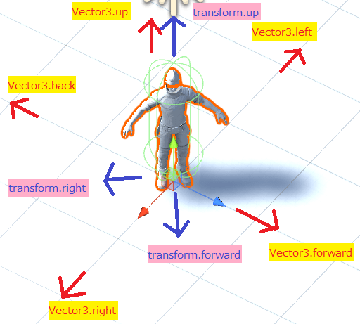

`Input.GetAxis`以外の方法として、  
- `Input.GetKey` 
- `Input.GetButton`  
- `Input.GetKeyDown`
- `Input.GetKeyUp`  
などを使用して、ユーザーの入力を処理できます。


# Unityにおける各入力メソッドの役割についての説明。

## 1. `Input.GetKey`

- **説明**: 特定のキーが押されている間、`true`を返します。
- **使用例**: プレイヤーの移動やアクションを、キーが押されている間持続させる場合に使います。
- **戻り値**: キーが押されている場合は`true`、そうでなければ`false`。

```csharp
if (Input.GetKey(KeyCode.W))
{
    // Wキーが押されている間の処理
}
```

<br>

## 2. `Input.GetButton`

- **説明**: Input Managerで設定されたボタンが押されている間、`true`を返します。
- **使用例**: ジャンプや攻撃など、アクションボタンの持続的な入力を検出する場合に使います。
- **戻り値**: ボタンが押されている場合は`true`、そうでなければ`false`。

```csharp
if (Input.GetButton("Jump"))
{
    // "Jump"ボタンが押されている間の処理
}
```

## 3. `Input.GetKeyDown`

- **説明**: 特定のキーが押された瞬間（フレーム）に`true`を返します。
- **使用例**: 一度だけ実行されるアクション（例: アイテムを拾う、スキルを発動する）に使用します。
- **戻り値**: キーがこのフレームで押された場合は`true`、そうでなければ`false`。

```csharp
if (Input.GetKeyDown(KeyCode.Space))
{
    // スペースキーが押された瞬間の処理
}
```

<br>

## 4. `Input.GetKeyUp`

- **説明**: 特定のキーが離された瞬間（フレーム）に`true`を返します。
- **使用例**: ボタンを離した時の処理（例: ジャンプの終わり、攻撃の終了）に使用します。
- **戻り値**: キーがこのフレームで離された場合は`true`、そうでなければ`false`。

```csharp
if (Input.GetKeyUp(KeyCode.Space))
{
    // スペースキーが離された瞬間の処理
}
```

<br>

## まとめ

- `Input.GetKey`: キーが押されている間ずっと`true`を返す。
- `Input.GetButton`: Input Managerで設定されたボタンが押されている間ずっと`true`を返す。
- `Input.GetKeyDown`: キーが押された瞬間のみ`true`を返す。
- `Input.GetKeyUp`: キーが離された瞬間のみ`true`を返す。


<br>

<br>

## サンプルプログラム（Input.GetKeyを使用）

この例では、`Input.GetKey`を使って、WASDキーや矢印キーでキャラクターを移動させる方法を示します。

```csharp
using UnityEngine;

public class PlayerMovement : MonoBehaviour
{
    public float speed = 5f; // プレイヤーの移動速度

    void Update()
    {
        // プレイヤーの移動ベクトルを初期化
        Vector3 movement = Vector3.zero;

        // Wキーまたは上矢印キーが押されたら前に移動
        if (Input.GetKey(KeyCode.W) || Input.GetKey(KeyCode.UpArrow))
        {
            movement += Vector3.forward;
        }
        // Sキーまたは下矢印キーが押されたら後ろに移動
        if (Input.GetKey(KeyCode.S) || Input.GetKey(KeyCode.DownArrow))
        {
            movement += Vector3.back;
        }
        // Aキーまたは左矢印キーが押されたら左に移動
        if (Input.GetKey(KeyCode.A) || Input.GetKey(KeyCode.LeftArrow))
        {
            movement += Vector3.left;
        }
        // Dキーまたは右矢印キーが押されたら右に移動
        if (Input.GetKey(KeyCode.D) || Input.GetKey(KeyCode.RightArrow))
        {
            movement += Vector3.right;
        }

        // プレイヤーを移動させる
        transform.Translate(movement * speed * Time.deltaTime);
    }
}
```

<br>

## 解説

- **Input.GetKey**:
  - `Input.GetKey(KeyCode.W)`はWキーが押されている間、`true`を返します。このように、他のキーに対しても同様にチェックすることで、プレイヤーの移動を制御します。
  
- **Vector3**:
  - `Vector3.forward`, `Vector3.back`, `Vector3.left`, `Vector3.right`を使って、各方向への移動ベクトルを簡潔に作成しています。

<br>




<br>
