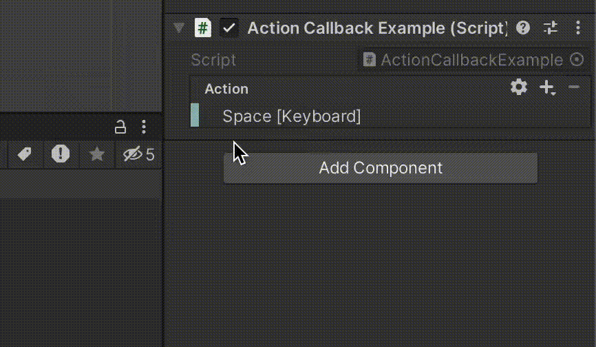

**InputSystem 1**

## ボタンが「押された瞬間」「押され続けた時」などの入力を、コールバックを利用し受け取る

適当なゲームオブジェクトにアタッチ

ActionCallback.cs
```cs
using UnityEngine;
using UnityEngine.InputSystem;

public class ActionCallbackExample : MonoBehaviour
{
    [SerializeField] private InputAction _action;

    private void OnEnable()
    {
        // Actionのコールバックを登録
        _action.performed += OnPerformed;
        _action?.Enable();
    }

    private void OnDisable()
    {
        // Actionのコールバックを解除
        _action.performed -= OnPerformed;

        // 自身が無効化されるタイミングなどでActionを無効化
        _action?.Disable();
    }

    //破壊された時など
    private void OnDestroy()
    {
        _action?.Dispose();// 破壊された時などに、Actionを無効化
    }

    // コールバックを受け取ったときの処理
    private void OnPerformed(InputAction.CallbackContext context)
    {    
        var value = context.ReadValue<float>();// Actionの入力値を読み込む       
        Debug.Log($"Actionの入力値 : {value}"); // 入力値をログ出力
    }
}

```

Actionをインスペクターから設定した後、Action右の歯車アイコンをクリック


Action TypeをButtonに設定

* Value – スティックなど値が入力したときにコールバックを受け取る設定
* Button – ボタンが押された瞬間のコールバックを受け取る設定



実行確認するとキーが押されるたびにログ出力されるようになります

---

###　スクリプト解説

メソッドを用意。
戻り値や引数は必ずこの形式にする必要があります。  
入力値の受取りは、引数contextに対してReadValueメソッドを呼び出すことで行います。
```cs 
// コールバックを受け取ったときの処理
private void OnPerformed(InputAction.CallbackContext context)
{
    // Actionの入力値を読み込む
    var value = context.ReadValue<float>();

    // 入力値をログ出力
    Debug.Log($"Actionの入力値 : {value}");
}

```
以下処理でコールバックを登録しています。   
<a href="https://wa3.i-3-i.info/word110176.html" target="_blank">コールバックとは</a>   
<a href="https://wa3.i-3-i.info/word12295.html" target="_blank">コールバック関数とは</a> 


```cs
// Actionのコールバックを登録
_action.performed += OnPerformed;
```
Actionにはstarted、performed、canceledの3種類のコールバックがあります。 
例では、performedコールバックに登録してログ出力しています。

## 2.呼び出されるタイミング３種(started・performed・canceled)

ValueとButtonそれぞれによって若干呼び出しタイミングの意味合いが違います。

+ Value – スティックなど値が入力されたときにコールバックを受け取る設定
    - started – 入力が0から0以外に変化したとき
    - performed – 入力が0以外に変化したとき
    - canceled – 入力が0以外から0に変化したとき


<br>
<br>

+ Button – ボタンが押された瞬間にコールバックを受け取る設定
    - started – 入力が0から0以外に変化したとき
    - performed – 入力の大きさが閾値Press以上に変化したとき
    - canceled – 入力が0以外から0に変化したとき、またはperformedが呼ばれた後に入力の大きさが閾値Release以下に変化したとき

        *閾値の設定は、トップメニューのEdit > Project Settings > Input System Packageの以下項目から変更できます
        
        

        閾値Pressの値は「Default Press Button Point」  
        閾値Releaseの値は「Press × Button Release Threshold」となり、Pressと掛け算した値になります。


<br>
<br>

+ Pass Through - デバイス入力がある間にperformedが呼ばれ続けます
    - performed - 入力があったとき
    - canceled - 例えば、デバイスが切り替わった場合、切り替わり前のデバイスが無効（Disabled）となり、canceledコールバックが呼び出されます。


<br>
<br>

