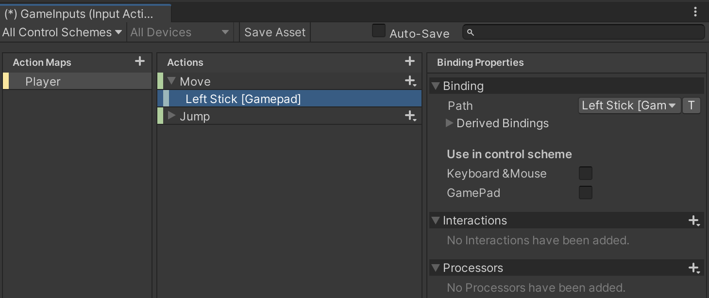
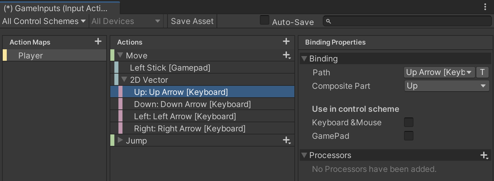

##  1.「Action」をMapというアセットとして管理する

「Action」たちを管理しやすいようにMapという形をとります。


<br>

「PlayerMap(Player階層)のMoveというActionを使って!」などとスクリプトに指示を出す形です。


<br>

Actionの中には、どの入力デバイスを参照するかといったキーバインド情報（Binding）が格納されており、マウスやキーボードやGamepadなどをスクリプトで判別しなくても、Actionに設定されたデバイスからの入力を受け取ることができます。


<br>

---
## 2.Input Actionsアセットを作成し、使ってみよう
メニューからAssets > Create > Input Actionsの順に選択


<br>

`GameInputs`など、適当な名前をつけてInput Actionsアセットを作成します


<br>

作成したInput Actionsアセットをダブルクリックし、Input Actionsの編集ウィンドウを開きます


<br>

左上のActions Maps右の＋ボタンをクリックし、Action Map名(例として「Player」)を入力。


<br>

例として、移動の「Action」として「Move」と、ジャンプの「Action」として「Jump」を設定してみます。


<br>

新しいActionの追加は、Actions右上の＋ボタンから行います。「Jump」を追加して下さい


<br>

次は、作成したそれぞれの「Action」の挙動の設定です  
例えば、
+ 「移動操作」なら「2軸の入力値」
+ 「ジャンプ操作」なら「ボタンの押下状態」  
を知る必要があります


<br>

+ Action 
  - Actionの基本的な振る舞いを設定します。入力値の種類やスクリプトから扱う型などの設定があります。
+ Interactions 
  - 長押しやダブルクリックなどの通知を設定します。
+ Processors 
  - デッドゾーンや値の正規化、反転などの演算処理を設定します。

<br>

・移動操作「Move」の設定例  
Action > Action Type項目を「Value」  
Action > Control Type項目を「Vector2」に設定  


<br>

・ジャンプ操作「Jump」の設定例  
Action > Action Type項目は「Button」


<br>

作成した「Action」にキーバインド情報を設定していきます


<br>

BindingはActionの右にある＋アイコンから複数追加できます


<br>

・移動操作の設定例  
例として、ゲームパッドの左スティック入力は、  
Binding Properties > Binding > Path項目に、Gamepad > LeftStickで設定  
もしくは、  
Path選択リストの左のListenボタンをクリックしてから、実際にコントローラーを触って入力すると、該当するパスが即座に一覧出てくるので、それを選択してください



<br>

さらにキーボード入力も追加してみましょう  
Action右の＋アイコンからAdd Up\Down\Left\Right Compositeを選択


<br>

４方向それぞれに対して、パスを設定してください



<br>

・ジャンプ操作の設定例  
ジャンプに関しても同じ要領です


<br>

※忘れずにSave Assetボタンをクリックして設定を保存(Auto-Saveにチェックでも可)  


<br>

---
## 3.Input Actionsアセットの使用

それでは実際に使用してみましょう。  
試しに、シーン上に配置されたボールを操作できるようにしていきます


<br>

Input Actionのソースコードを生成していきます。  
作成したInput Actionsアセットを選択し、Generate C# Classにチェックを入れます。  
すると、
+ 保存するスクリプトファイル名（C# Class File）
+ クラス名（C# Class Name）
+ 名前空間（C# Class Namespace）  
の設定項目が出現するため、必要に応じて設定し、Applyボタンをクリック。  


<br>

保存に成功すると、指定したパスにスクリプトが追加されます。


<br>

先述のInput Actionクラスから入力を取得し、ボールを操作するスクリプトを実装します。  
PlayerMover.csなどとスクリプトを作成し、ボールを動かしてみて下さい。

PlayerMover.cs
```cs
    using System;
    using UnityEngine;
    using UnityEngine.InputSystem;

    [RequireComponent(typeof(Rigidbody))]
    public class PlayerMover : MonoBehaviour
    {
        [SerializeField] private float _moveForce = 5;
        [SerializeField] private float _jumpForce = 5;

        private Rigidbody _rigidbody;
        private GameInputs _gameInputs;
        private Vector2 _moveInputValue;

        private void Awake()
        {
            _rigidbody = GetComponent<Rigidbody>();
     
            _gameInputs = new GameInputs();// Actionスクリプトのインスタンス生成

            // Actionイベント登録
            _gameInputs.Player.Move.started   += OnMove;
            _gameInputs.Player.Move.performed += OnMove;
            _gameInputs.Player.Move.canceled  += OnMove;
            _gameInputs.Player.Jump.performed += OnJump;

            // Input Actionを機能させるために、有効化
            _gameInputs.Enable();
        }

        private void OnDestroy()
        {
            // 自身でインスタンス化したActionクラスはIDisposableを実装しているので、
            // 必ずDisposeする必要がある
            _gameInputs?.Dispose();
        }

        private void OnMove(InputAction.CallbackContext context)
        {
            // Moveアクションの入力取得
            _moveInputValue = context.ReadValue<Vector2>();
        }

        private void OnJump(InputAction.CallbackContext context)
        {
            // ジャンプする力を与える
            _rigidbody.AddForce(Vector3.up * _jumpForce, ForceMode.Impulse);
        }

        private void FixedUpdate()
        {
            // 移動方向の力を与える
            _rigidbody.AddForce(new Vector3(
                _moveInputValue.x,
                0,
                _moveInputValue.y
            ) * _moveForce);
        }
    }
```


### スクリプトについて
Input Actionの機能を参照するために、次の名前空間をusingします

```cs
using UnityEngine.InputSystem;

```

そして、Input Actionの初期化を行います。  
インスタンスを生成してから、各種Actionにイベントを登録しています。設定が終わったら、Enable()メソッドでInput Actionを動作させる必要があります。(Enable()メソッド呼び出しを忘れると、Input Actionが機能せず入力値が取得できなくなるため注意。)

```cs
// Input Actionインスタンス生成
_gameInputs = new GameInputs();

// Actionイベント登録
_gameInputs.Player.Move.started += OnMove;
_gameInputs.Player.Move.performed += OnMove;
_gameInputs.Player.Move.canceled += OnMove;
_gameInputs.Player.Jump.performed += OnJump;

// Input Actionを機能させるためには、
// 有効化する必要がある
_gameInputs.Enable();
```


各種Actionのコールバックは次のような形式になります。  
引数contextのReadValue()メソッドから入力情報を取得できます。２つ目のジャンプイベントのほうは、ボタンが押された瞬間のみ呼び出されるため、力を与える処理のみ記述しています。    
Input Systemは設定次第でUpdateやFixedUpdate、その他任意のタイミングで呼び出される可能性があります。そのため、OnMoveコールバック内では入力値の保存のみ行い、別途FixedUpdateイベントで参照する形をとっています。

```cs
private void OnMove(InputAction.CallbackContext context)
{
    // Moveアクションの入力取得
    _moveInputValue = context.ReadValue<Vector2>();
}

private void OnJump(InputAction.CallbackContext context)
{
    // ジャンプする力を与える
    _rigidbody.AddForce(Vector3.up * _jumpForce, ForceMode.Impulse);
}
```
