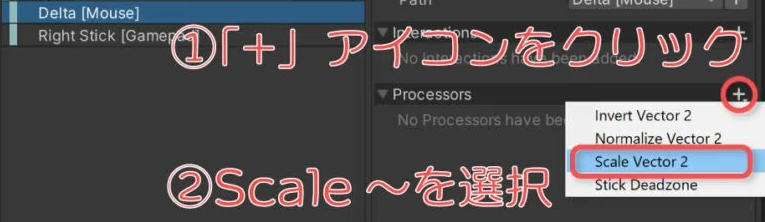
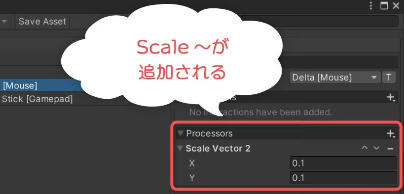

**InputSystem 2**

# Input Systemの入力感度を設定する

Input Systemでジョイスティックやマウス移動量など、一部の入力値に対して感度を設定する方法を見ていきます。

画像では、右スティックの値は大きさが０～１なのに対し、マウス移動量は１０以上の大きな値が返されています。この場合、マウス移動量を小さくして補正することで解消できます。

 

 

### ・設定例

Actionsのアクション名を適当なものにし、Properties > Action項目を設定します。  
２軸操作となるため、Action TypeにはValue、Control TypeにはVector 2を指定すればOKです。

  

マウス移動を設定する場合は、Mouse > Deltaを選択します。

  
Scaleを設定したいBindingを選択。  
右側に表示されるBinding Properties > Processors右の＋アイコンから、Scale～を選択。

マウス移動量の場合、入力値の型（Control Type）はVector2となるため、Scale Vector 2項目がリストに表示されます。

Processorを追加すると、Processors一覧にScale～が追加されますので、入力値の各要素（X、Y、Z等）に掛けたい係数を指定します。

例では0.1倍することとしました。

設定が終わったら、Save Assetボタンをクリックして設定内容を保存します。

例として、CinemachineのFreeLook Cameraによる視線操作に対して適用させます。  
（Cinemachineをインストールしてない場合は、インストール）

ヒエラルキーにて右クリック。Cinemachine > FreeLook Cameraを選択、作成されたGameObjectにCinemachineInputProviderコンポーネントをアタッチ。  
(なお、アタッチする場所は、バーチャルカメラオブジェクトおよびその子（孫含む）オブジェクトのどちらでも構いません。)

無事に追加出来たら、次の項目を設定します。

+ Player Index – プレイヤーのインデックス。シングルプレイヤーなら-1を設定します。
+ XY Axis – XY方向のカメラ操作に割り当てるInput Actionを指定します。使用しない場合はnullを設定できます。
+ Z Axis – Z方向のカメラ操作に割り当てるInput Actionを指定します。使用しない場合はnullを設定できます。  

Cinemachine Free Look Cameraなどのバーチャルカメラでは、基本的にXY Axisしか使わないため、Z Axisはnullでも問題ありません。
