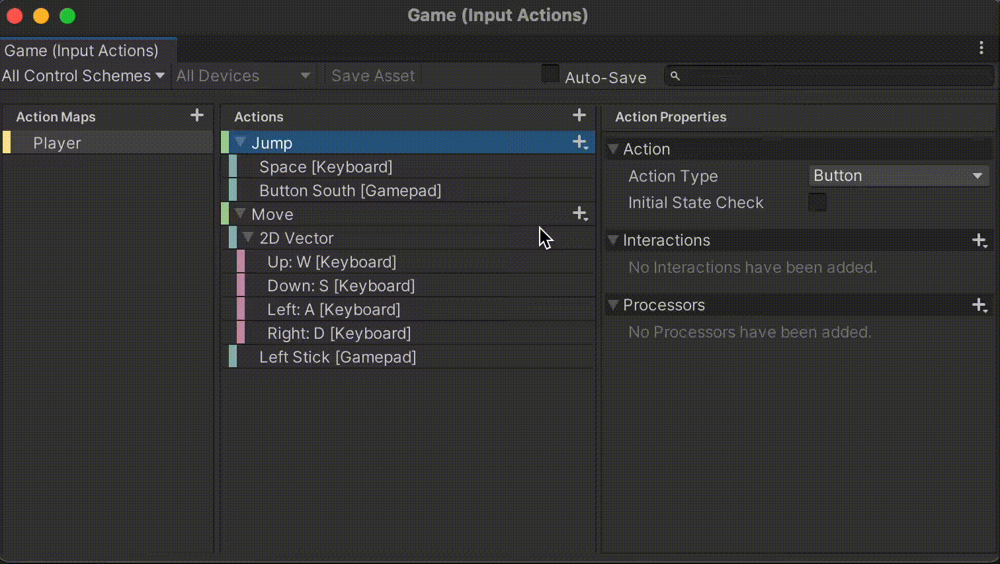
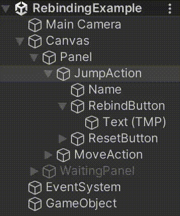
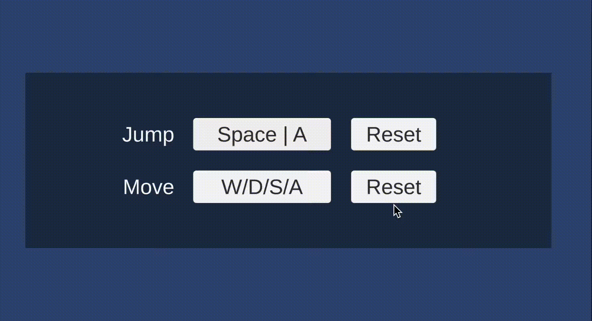

# Input Systemでキーコンフィグを実装する①

Input Systemでは、キーコンフィグを実装するための機能が提供されています。

[参考：Input Bindings | Input System | 1.5.1](https://docs.unity3d.com/Packages/com.unity.inputsystem@1.5/manual/ActionBindings.html#interactive-rebinding)

これを用いると、キー入力を受け付け、操作を割り当てるといった画面や機能を実装できます。


<br>

リバインド機能として提供され、特定の操作（Action）に対してキー設定を「上書き（Override）」する事で実現します。

上記動画のような入力されたキーで割り当てるといった一連のインタラクション（Interactive Rebinding）は、専用メソッドを通じて行えます。

キーコンフィグの実装の流れは次のようになります。

<br>

## 実装の流れ

> 1. 設定用のUIの配置
> 2. リバインドを実施するスクリプトの実装
> 3. UIにスクリプトを適用

<br>

<br>

スクリプトで実装するリバインド（Interactive Rebinding）の処理の流れは次のようになります。

## スクリプト実装の流れ

> 1. リバインド対象のActionを無効化する
> 2. どのBindingをリバインドするかを決定する
> 3. Actionに対してリバインドの動作設定を行う
> 4. リバインドを開始する
> 5. リバインドが完了または中断した時、Actionを有効化する

<br>

また、リバインドにより上書きされた設定は、ストレージなどに対してセーブ・ロードしたりできます。

このようなキーコンフィグの実装方法について順を追って解説していきます。

<br>

<br>

# 下準備

## ①Input Action Assetの準備

例では次のようなInput Action Assetが予め作成されているものとします。



<br>

KeyboardとGamepadというスキームが定義され、JumpとMoveというActionの各Bindingに設定しています。

(解説するキーコンフィグの実装方法は、Input Systemパッケージの公式サンプルの一つである「Rebinding UI」を参考にしています。)

<br>

<br>

## ②UIの準備
本記事では、次のようにジャンプと移動操作に対してキー割当てを変更するものとして解説を進めます。


<br>


また、リバインド中に全画面表示するためのパネルを前面に配置するものとします。


このパネルは普段は非表示ですが、リバインド中のみ表示されて他のUIを押せなくする役割を持ちます。

<br>

構成例



<br>

<br>

# リバインド（Interactive Rebinding）を行うスクリプトの実装
リバインド関連の処理は、Input Actionに対してキー割当て設定の「上書き」を行うことで実現します。

例えば、ジャンプ操作に元々割り当てられていた「スペースキー」を「Aキー」に上書きしたりできます。  
上書きした情報は、Actionの本来の情報とは別で管理されます。


<br>

このように「上書き」でキー割当てを変更することで、例えば後からデフォルト設定に戻すと言った操作（リセット）が簡単になります。これは、「上書き」情報を削除するだけで済み、初期設定を別で保持する必要がなくなるためです。


<br>


(ここまで説明した「上書き」関連の機能は、InputActionRebindingExtensions拡張クラスとして提供されています。)

[参考：Input Bindings | Input System](https://docs.unity3d.com/Packages/com.unity.inputsystem@1.5/manual/ActionBindings.html#interactive-rebinding)

<br>

(何かキー入力があったらそのキーで割り当てるといったインタラクティブなリバインドは、PerformInteractiveRebinding拡張メソッドを通じて実装できます。)

[参考：Class InputActionRebindingExtensions| Input System](https://docs.unity3d.com/Packages/com.unity.inputsystem@1.5/api/UnityEngine.InputSystem.InputActionRebindingExtensions.html#UnityEngine_InputSystem_InputActionRebindingExtensions_PerformInteractiveRebinding_UnityEngine_InputSystem_InputAction_System_Int32_)

次から、このようなインタラクティブなリバインドの実装の流れを見ていきましょう。

> 流れ
> 1. リバインド対象のActionを無効化
> 2. どのBindingをリバインドするかを決定
> 3. Actionに対してリバインドの動作設定を行う
> 4. リバインドを開始
> 5. リバインドが完了または中断した時、Actionを有効化

<br>

<br>

# ①対象Actionを無効化する
インタラクティブなリバインドを実施する直前に、対象となるActionを無効化しておく必要があります。

```cs
InputAction action;

・・・（中略）・・・

// リバインド前にActionを無効化する必要がある
action.Disable();
```

#### ・注意
無効化せずにリバインドを実施してしまった場合、次のようなエラー（例外）が出てしまいます。

```cs
InvalidOperationException: Cannot rebind action 'Player/Jump[/Keyboard/a,/XInputControllerWindows/buttonSouth]' while it is enabled
```
[Class_InputActionRebindingExtensions.RebindingOperation| Input System](https://docs.unity3d.com/Packages/com.unity.inputsystem@1.5/api/UnityEngine.InputSystem.InputActionRebindingExtensions.RebindingOperation.html#UnityEngine_InputSystem_InputActionRebindingExtensions_RebindingOperation_WithAction_UnityEngine_InputSystem_InputAction_)


<br>

## ②どのBindingをリバインドするかを決定
一つのActionには複数のBindingが存在している可能性があります。

例えば、ジャンプ操作のActionにキーボードのスペースキーとゲームパッドのSouthキーが割り当てられている場合などが該当します。

そのため、複数あるBindingのうち、どのインデックスのBindingにするかを決める必要が出てくる可能性があります。


<br>

Bindingの決定方法は一通りではなく、例えば次のように条件を設けたり、IDなどで検索したりして決定します。

## Binding決定の例
> + スキーム（Keyboard、Gamepadなど）で決定する
> + BindingのユニークID（GUID）で決定する
> + その他のBinding内の内容に基づいて決定する
> + 直接インデックス指定で決定する

開発でのメンテナンス性を考えると、2つ目までの方法で決定するのが無難でしょう。     
ここではスキームに基づいて決定することを例にとって解説します。

以下、特定スキームのBindingを決定する処理の例です。

```cs
InputAction action;
string scheme = "Keyboard";

・・・（中略）・・・

// リバインド対象のBindingIndexを取得
int bindingIndex = action.GetBindingIndex(
    InputBinding.MaskByGroup(scheme)
);
```
スキームから最終的なBindingのインデックスを決定しています。

<br>

(指定された条件のBindingインデックスを取得するには、GetBindingIndex拡張メソッドを使います。)

[参考：Class InputActionRebindingExtensions| Input System](https://docs.unity3d.com/Packages/com.unity.inputsystem@1.5/api/UnityEngine.InputSystem.InputActionRebindingExtensions.html#UnityEngine_InputSystem_InputActionRebindingExtensions_GetBindingIndex_UnityEngine_InputSystem_InputAction_UnityEngine_InputSystem_InputBinding_)

<br>

引数には、マスクする条件を示す情報をInputBinding構造体で指定します。

<br>

(スキームでマスクする場合は、InputBinding.MaskByGroupメソッドを使うのが手軽です。)

[参考：Struct InputBinding| Input System](https://docs.unity3d.com/Packages/com.unity.inputsystem@1.5/api/UnityEngine.InputSystem.InputBinding.html#UnityEngine_InputSystem_InputBinding_MaskByGroup_System_String_)

<br>

> ・注意  
> Bindingのインデックスは省略することも可能ですが、その場合すべてのBindingに対してリバインドが行われてしまうのでご注意ください。

<br>

# ③リバインドの設定
PerformInteractiveRebinding拡張メソッドにより、リバインド用の非同期オペレーションを作成します。

```cs
// リバインド対象のAction
InputAction action;
// 決定されたBindingのインデックス
int bindingIndex;
// リバインドの非同期オペレーション
InputActionRebindingExtensions.RebindingOperation rebindOperation;

・・・（中略）・・・

// オペレーションの作成
rebindOperation = action.PerformInteractiveRebinding(bindingIndex);
```

[参考：Class InputActionRebindingExtensions| Input System](https://docs.unity3d.com/Packages/com.unity.inputsystem@1.5/api/UnityEngine.InputSystem.InputActionRebindingExtensions.html#UnityEngine_InputSystem_InputActionRebindingExtensions_PerformInteractiveRebinding_UnityEngine_InputSystem_InputAction_System_Int32_)

オペレーションを作成するときは、次のようにメソッドチェインで設定できます。

```cs
InputAction action;
int bindingIndex;
InputActionRebindingExtensions.RebindingOperation rebindOperation;

・・・（中略）・・・

// オペレーション作成
// メソッドチェインでコールバックを登録
rebindOperation = action
    .PerformInteractiveRebinding(bindingIndex)
    .OnComplete(_ =>
    {
        // リバインドが完了した時の処理
    })
    .OnCancel(_ =>
    {
        // リバインドがキャンセルされた時の処理
    });
```

リバインドが完了したときにUIの表示を更新したい場合などは、コールバックを使います。

OnCompleteは操作入力の割り当てが完了したときに呼ばれるコールバックです。

[参考：Class InputActionRebindingExtensions.RebindingOperation| Input System](https://docs.unity3d.com/Packages/com.unity.inputsystem@1.5/api/UnityEngine.InputSystem.InputActionRebindingExtensions.RebindingOperation.html#UnityEngine_InputSystem_InputActionRebindingExtensions_RebindingOperation_OnComplete_System_Action_UnityEngine_InputSystem_InputActionRebindingExtensions_RebindingOperation__)

<br>

OnCancelは操作入力の割り当てが中断されたときに呼ばれるコールバックです。

[参考：Class InputActionRebindingExtensions.RebindingOperation| Input System](https://docs.unity3d.com/Packages/com.unity.inputsystem@1.5/api/UnityEngine.InputSystem.InputActionRebindingExtensions.RebindingOperation.html#UnityEngine_InputSystem_InputActionRebindingExtensions_RebindingOperation_OnCancel_System_Action_UnityEngine_InputSystem_InputActionRebindingExtensions_RebindingOperation__)

<br>

上記で作成した非同期オペレーションは、最後に必ずDisposeメソッドで破棄する必要があります。
(作成されるオペレーションのインスタンス全てに対してDisposeメソッドを呼ばなければなりません。)


```cs
// オペレーションの破棄
rebindOperation?.Dispose();
rebindOperation = null;
```
<br>

> **・注意**  
> Disposeメソッドによる破棄を忘れると、メモリリークが発生してしまいます。これは、内部的にアンマネージドメモリのアロケーションが行われているためです。

[参考：Class InputActionRebindingExtensions.RebindingOperation| Input System](https://docs.unity3d.com/Packages/com.unity.inputsystem@1.5/api/UnityEngine.InputSystem.InputActionRebindingExtensions.RebindingOperation.html#UnityEngine_InputSystem_InputActionRebindingExtensions_RebindingOperation_Dispose)

<br>

# ④リバインドの開始
リバインド用の非同期オペレーションを作成し、一通り設定できたら、オペレーションに対してStartメソッドを実行してリバインドを開始します。

```cs
// インタラクティブなリバインドを開始する
rebindOperation.Start();
```

リバインドが完了または中断されると、前述のコールバックが呼び出されます。

[参考：Class InputActionRebindingExtensions.RebindingOperation| Input System](https://docs.unity3d.com/Packages/com.unity.inputsystem@1.5/api/UnityEngine.InputSystem.InputActionRebindingExtensions.RebindingOperation.html#UnityEngine_InputSystem_InputActionRebindingExtensions_RebindingOperation_Start)

<br>

開始までの処理は、次のようにメソッドチェインでまとめて書けます。

```cs
// オペレーション作成から開始まで
// メソッドチェインで記述できる
rebindOperation = action
    .PerformInteractiveRebinding(bindingIndex)
    .OnComplete(_ =>
    {
        // リバインドが完了した時の処理
    })
    .OnCancel(_ =>
    {
        // リバインドがキャンセルされた時の処理
    })
    .Start();
```

<br>

## サンプルスクリプト
リバインドの要求があったらインタラクティブなリバインドを実施するスクリプトの例です。

RebindUI.cs
```cs
using TMPro;
using UnityEngine;
using UnityEngine.InputSystem;

public class RebindUI : MonoBehaviour
{
    // リバインド対象のAction
    [SerializeField] private InputActionReference _actionRef;

    // リバインド対象のScheme
    [SerializeField] private string _scheme = "Keyboard";

    // 現在のBindingのパスを表示するテキスト
    [SerializeField] private TMP_Text _pathText;

    // リバインド中のマスク用オブジェクト
    [SerializeField] private GameObject _mask;

    private InputAction _action;
    private InputActionRebindingExtensions.RebindingOperation _rebindOperation;

    // 初期化
    private void Awake()
    {
        if (_actionRef == null) return;

        // InputActionインスタンスを保持しておく
        _action = _actionRef.action;

        // キーバインドの表示を反映する
        RefreshDisplay();
    }

    // 後処理
    private void OnDestroy()
    {
        // オペレーションは必ず破棄する必要がある
        CleanUpOperation();
    }

    // リバインドを開始する
    public void StartRebinding()
    {
        // もしActionが設定されていなければ、何もしない
        if (_action == null) return;

        // もしリバインド中なら、強制的にキャンセル
        // Cancelメソッドを実行すると、OnCancelイベントが発火する
        _rebindOperation?.Cancel();

        // リバインド前にActionを無効化する必要がある
        _action.Disable();

        // リバインド対象のBindingIndexを取得
        var bindingIndex = _action.GetBindingIndex(
            InputBinding.MaskByGroup(_scheme)
        );

        // ブロッキング用マスクを表示
        if (_mask != null)
            _mask.SetActive(true);

        // リバインドが終了した時の処理を行うローカル関数
        void OnFinished()
        {
            // オペレーションの後処理
            CleanUpOperation();

            // 一時的に無効化したActionを有効化する
            _action.Enable();

            // ブロッキング用マスクを非表示
            if (_mask != null)
                _mask.SetActive(false);
        }

        // リバインドのオペレーションを作成し、
        // 各種コールバックの設定を実施し、
        // 開始する
        _rebindOperation = _action
            .PerformInteractiveRebinding(bindingIndex)
            .OnComplete(_ =>
            {
                // リバインドが完了した時の処理
                RefreshDisplay();
                OnFinished();
            })
            .OnCancel(_ =>
            {
                // リバインドがキャンセルされた時の処理
                OnFinished();
            })
            .Start(); // ここでリバインドを開始する
    }

    // 現在のキーバインド表示を更新
    public void RefreshDisplay()
    {
        if (_action == null || _pathText == null) return;

        _pathText.text = _action.GetBindingDisplayString();
    }

    // リバインドオペレーションを破棄する
    private void CleanUpOperation()
    {
        // オペレーションを作成したら、Disposeしないとメモリリークする
        _rebindOperation?.Dispose();
        _rebindOperation = null;
    }
}
```

上記をRebindUI.csという名前で保存し、（ボタンなどの）ゲームオブジェクトに割り当て、インスペクターから各種設定を行います。


<br>

そして、ボタンが押されたときなどに上記スクリプトのStartRebindingメソッドを呼び出すようにします。

例では、リバインドボタンのOnClickイベントにStartRebindingメソッドを登録することで呼び出すこととします。


<br>

<br>

# 入力確認用スクリプト
以下、正しくリバインドされているかどうかを確認するスクリプトです。

ReadJumpExample.cs
```cs
using UnityEngine;
using UnityEngine.InputSystem;

public class ReadJumpExample : MonoBehaviour
{
    [SerializeField] private InputActionReference _actionRef;

    private void Awake()
    {
        if (_actionRef == null) return;

        _actionRef.action.performed += OnJump;

        _actionRef.action.Enable();
    }

    private void OnDestroy()
    {
        if (_actionRef == null) return;

        _actionRef.action.performed -= OnJump;
        _actionRef.action.Dispose();
    }

    private void OnJump(InputAction.CallbackContext obj)
    {
        print("Jump");
    }
}
```
上記は確認用スクリプトです。キーバインドがうまくいったかを確認するためのサンプルプログラムです。

`ReadJumpExample.cs`という名前でUnityプロジェクトに保存し、適当なゲームオブジェクトにアタッチし、Action Refにリバインドされる対象のActionを指定すると機能するようになります。

キー入力があるたびに（performedコールバックが発火するたびに）「Jump」という文字列をログ出力します。

<br>

### ・実行結果
リバインドボタンを押すと入力待ちの画面に切り替わり、キーボードから何かキーを入力すると入力したキーが割り当てられるようになりました。



<br>

マウスやゲームパッドの入力は受け付けず、キーボードのみ操作を受け付けるようになっています。

<br>

# スクリプトの説明
インタラクティブなリバインドを実施するために、Input Actionとオペレーションのフィールドを定義しています。

```cs
private InputAction _action;
private InputActionRebindingExtensions.RebindingOperation _rebindOperation;
```

オペレーションをフィールドとして定義する理由は、ゲームオブジェクトが破棄された際に確実に後処理できるようにするためです。

```cs
// 後処理
private void OnDestroy()
{
    // オペレーションは必ず破棄する必要がある
    CleanUpOperation();
}

・・・（中略）・・・

// リバインドオペレーションを破棄する
private void CleanUpOperation()
{
    // オペレーションを作成したら、Disposeしないとメモリリークする
    _rebindOperation?.Dispose();
    _rebindOperation = null;
}
```

<br>

ボタンが押されたらインタラクティブなリバインドを開始する動作は、以下のpublicメソッドを公開して外部から呼び出してもらうことで実現しています。

```cs
// リバインドを開始する
public void StartRebinding()
{
    // もしActionが設定されていなければ、何もしない
    if (_action == null) return;
```
インタラクティブなリバインドを開始する前に、安全のため前回の非同期オペレーションが実行されていないかチェックしています。

<br>

```cs
// もしリバインド中なら、強制的にキャンセル
// Cancelメソッドを実行すると、OnCancelイベントが発火する
_rebindOperation?.Cancel();
```

Cancelメソッドを実行することで、リバインドを中断することができます。これにより、OnCancelコールバックが呼び出され、オペレーションの破棄など必要な後処理を行うことができるようになります。

[参考：Class InputActionRebindingExtensions.RebindingOperation| Input System](https://docs.unity3d.com/Packages/com.unity.inputsystem@1.5/api/UnityEngine.InputSystem.InputActionRebindingExtensions.RebindingOperation.html#UnityEngine_InputSystem_InputActionRebindingExtensions_RebindingOperation_Cancel)

<br>

これでようやくインタラクティブなリバインドの開始処理に移ることができます。

Actionの無効化とBindingのインデックス決定までの処理は以下部分です。

```cs
// リバインド前にActionを無効化する必要がある
_action.Disable();

// リバインド対象のBindingIndexを取得
var bindingIndex = _action.GetBindingIndex(
    InputBinding.MaskByGroup(_scheme)
);
```
<br>

そして、入力待ちを示すための全画面表示を行います。

```cs
// ブロッキング用マスクを表示
if (_mask != null)
    _mask.SetActive(true);
```

<br>

インタラクティブなリバインドのオペレーション作成・コールバック登録・開始までの処理は以下部分です。

```cs
// リバインドのオペレーションを作成し、
// 各種コールバックの設定を実施し、
// 開始する
_rebindOperation = _action
    .PerformInteractiveRebinding(bindingIndex)
    .OnComplete(_ =>
    {
        // リバインドが完了した時の処理
        RefreshDisplay();
        OnFinished();
    })
    .OnCancel(_ =>
    {
        // リバインドがキャンセルされた時の処理
        OnFinished();
    })
    .Start(); // ここでリバインドを開始する
```
<br>

リバインドが完了またはキャンセルされたときには、以下ローカル関数が呼ばれるようにして非同期オペレーションの破棄をしたり、Actionを再び有効化したり、入力待ちパネルを消したりしています。

```cs
// リバインドが終了した時の処理を行うローカル関数
void OnFinished()
{
    // オペレーションの後処理
    CleanUpOperation();

    // 一時的に無効化したActionを有効化する
    _action.Enable();

    // ブロッキング用マスクを非表示
    if (_mask != null)
        _mask.SetActive(false);
}
```
<br>

リバインドが完了したときは、どのキーが割り当てられているかを確認できるようにUIに反映するようにしています。これは、以下メソッド内で行っています。
```cs
// 現在のキーバインド表示を更新
public void RefreshDisplay()
{
    if (_action == null || _pathText == null) return;

    _pathText.text = _action.GetBindingDisplayString();
}
```
GetBindingDisplayStringメソッドはInputActionRebindingExtensionsクラスの拡張メソッドで、表示用のキーバインドの文字列を返します。

例ではすべてのBindingを表示対象としていますが、一部のスキームのみ表示するといったことも可能です。詳細はリファレンスをご確認ください。

[参考：Class InputActionRebindingExtensions| Input System](https://docs.unity3d.com/Packages/com.unity.inputsystem@1.5/api/UnityEngine.InputSystem.InputActionRebindingExtensions.html#UnityEngine_InputSystem_InputActionRebindingExtensions_GetBindingDisplayString_UnityEngine_InputSystem_InputAction_System_Int32_UnityEngine_InputSystem_InputBinding_DisplayStringOptions_)
