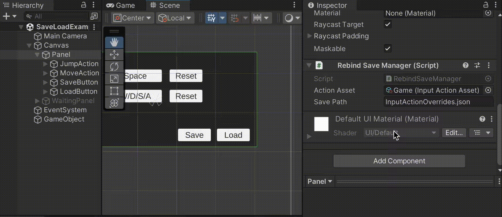
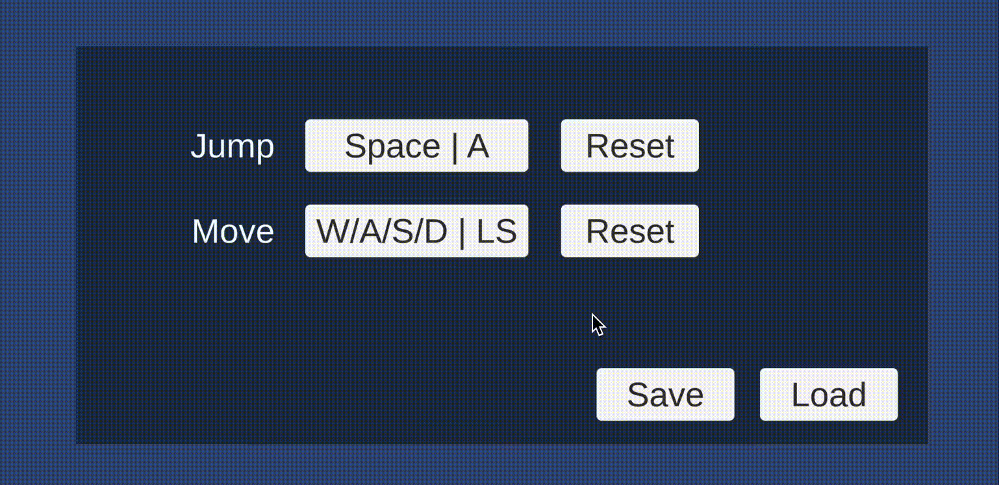

# Input Systemでキーコンフィグを実装する④

<br>

## キャンセルキーを設ける
ここまで解説した方法では、特定スキームの入力をすべて受け付けるようにしていました。

しかしながら、特定キー（例えばエスケープキー）をキャンセル操作に割り当てたいケースがあるかもしれません。

このようなキャンセル操作は、WithCancelingThroughメソッドにより指定が可能です。

```cs
rebindOperation = action
    .PerformInteractiveRebinding(bindingIndex)
    .OnComplete(_ =>
    {
        // リバインドが完了した時の処理
    })
    .OnCancel(_ =>
    {
        // リバインドがキャンセルされた時の処理
    })
    // キャンセルキーを設定する
    .WithCancelingThrough("<Keyboard>/escape")
    .Start(); // ここでリバインドを開始する
```

<br>

インタラクティブなリバインドの最中にキャンセル入力があればキャンセル扱いとなり、キーの上書きが反映されません。

また、OnCancelコールバックが発火し、OnCompoleteコールバックは発火しません。

[参考：Class InputActionRebindingExtensions.RebindingOperation| Input System | 1.5.1](https://docs.unity3d.com/Packages/com.unity.inputsystem@1.5/api/UnityEngine.InputSystem.InputActionRebindingExtensions.RebindingOperation.html#UnityEngine_InputSystem_InputActionRebindingExtensions_RebindingOperation_WithCancelingThrough_System_String_)

<br>

<br>

## 設定情報をセーブ・ロードする
リバインドによって上書きされる情報は、JSONとして読み書きできます。

キーコンフィグの情報をストレージなどに保存しておきたい場合に便利です。


<br>

保存用のJSONデータの取得にはSaveBindingOverridesAsJson拡張メソッドを使います。

[参考：Class InputActionRebindingExtensions| Input System | 1.5.1](https://docs.unity3d.com/Packages/com.unity.inputsystem@1.5/api/UnityEngine.InputSystem.InputActionRebindingExtensions.html#UnityEngine_InputSystem_InputActionRebindingExtensions_SaveBindingOverridesAsJson_UnityEngine_InputSystem_IInputActionCollection2_)

<br>

逆にロードしたJSONデータを反映するにはLoadBindingOverridesFromJson拡張メソッドを使います。

[参考：Class InputActionRebindingExtensions| Input System | 1.5.1](https://docs.unity3d.com/Packages/com.unity.inputsystem@1.5/api/UnityEngine.InputSystem.InputActionRebindingExtensions.html#UnityEngine_InputSystem_InputActionRebindingExtensions_SaveBindingOverridesAsJson_UnityEngine_InputSystem_IInputActionCollection2_)

<br>

やり取りする対象のJSONデータは、Input Action Asset単位またはAction単位で可能です。

> **・注意**
> データの保存方法はゲームやアプリ毎に異なります。状況に合わせて適切に設計する必要があることにご注意ください。


## ・サンプルスクリプト
以下、Input Action Assetの上書き情報を読み書きする例です。

RebindSaveManager.cs
```cs
using System.IO;
using UnityEngine;
using UnityEngine.InputSystem;

public class RebindSaveManager : MonoBehaviour
{
    // 対象となるInputActionAsset
    [SerializeField] private InputActionAsset _actionAsset;

    // 上書き情報の保存先
    [SerializeField] private string _savePath = "InputActionOverrides.json";

    // 上書き情報の保存
    public void Save()
    {
        if (_actionAsset == null) return;

        // InputActionAssetの上書き情報の保存
        var json = _actionAsset.SaveBindingOverridesAsJson();

        // ファイルに保存
        var path = Path.Combine(Application.persistentDataPath, _savePath);
        File.WriteAllText(path, json);
    }

    // 上書き情報の読み込み
    public void Load()
    {
        if (_actionAsset == null) return;

        // ファイルから読み込み
        var path = Path.Combine(Application.persistentDataPath, _savePath);
        if (!File.Exists(path)) return;

        var json = File.ReadAllText(path);

        // InputActionAssetの上書き情報を設定
        _actionAsset.LoadBindingOverridesFromJson(json);
    }
}
```
上記をRebindSaveManager.csという名前でUnityプロジェクトに保存し、適当なゲームオブジェクトにアタッチすると使用可能になります。

上書き情報をJSONファイルとして保存するにはSaveメソッド、JSONファイルからロードして上書き情報を適用するにはLoadメソッドを外部から呼び出します。

例では、Save、Loadボタンが押されたときにそれぞれSave、Loadメソッドが呼ばれるようにしました。



ロードされたときは画面の表示も一緒に更新するため、前述のサンプルスクリプトで登場したRefreshDisplayメソッドも呼ぶようにしています。

保存先は、Application.persistentDataPathプロパティが示すディレクトリ直下に保存するようにしました。

実際のパスはプラットフォーム毎に異なります。詳細は以下リファレンスをご確認ください。

[参考：Application-persistentDataPath – Unity スクリプトリファレンス](https://docs.unity3d.com/ja/current/ScriptReference/Application-persistentDataPath.html)

<br>

## 実行結果
リバインドを実施した後にSaveボタンを押すとディスクに上書きデータが保存されます。

Loadボタンを押すと上書きデータがロードされて適用されます。この時、Saveしたときのデータになっていることが確認できます。



<br>

保存されたJSONファイルを開くと、次のように最小化されたJSON形式で上書きデータが保存されていることが確認できます。


<br>


## スクリプトの説明
Input Action Assetから上書き情報を取得してJSONファイルとして保存する処理は以下の通りです。
```cs
// 上書き情報の保存
public void Save()
{
    if (_actionAsset == null) return;

    // InputActionAssetの上書き情報の保存
    var json = _actionAsset.SaveBindingOverridesAsJson();

    // ファイルに保存
    var path = Path.Combine(Application.persistentDataPath, _savePath);
    File.WriteAllText(path, json);
}
```
Application.persistentDataPathプロパティが示すディレクトリ直下にSaveBindingOverridesAsJsonメソッドの結果をそのままテキストファイルとして保存しています。


[Path.Combine メソッド (System.IO)
複数の文字列を 1 つのパスに結合します。](https://learn.microsoft.com/ja-jp/dotnet/api/system.io.path.combine?view=net-7.0)


[File.WriteAllText メソッド (System.IO)  
新しいファイルを作成し、内容をそのファイルに書き込んだ後、ファイルを閉じます。  
ターゲット ファイルが既に存在する場合は、切り捨てられ、上書きされます。](https://learn.microsoft.com/ja-jp/dotnet/api/system.io.file.writealltext?view=net-8.0)

<br>

逆にロードして上書き情報を反映する処理は以下の通りです。

```cs
// 上書き情報の読み込み
public void Load()
{
    if (_actionAsset == null) return;

    // ファイルから読み込み
    var path = Path.Combine(Application.persistentDataPath, _savePath);
    if (!File.Exists(path)) return;

    var json = File.ReadAllText(path);

    // InputActionAssetの上書き情報を設定
    _actionAsset.LoadBindingOverridesFromJson(json);
}
```

ファイルが存在しない場合も考えられるため、File.Existsメソッドで存在チェックしています。

[File.Exists(String) メソッド (System.IO)  
指定したファイルが存在するかどうかを確認します。](https://learn.microsoft.com/ja-jp/dotnet/api/system.io.file.exists?view=net-7.0)


[File.ReadAllText メソッド (System.IO)
テキスト ファイルを開き、そのファイル内のすべてのテキストを文字列に読み取った後、ファイルを閉じます。](https://learn.microsoft.com/ja-jp/dotnet/api/system.io.file.readalltext?view=net-8.0)

