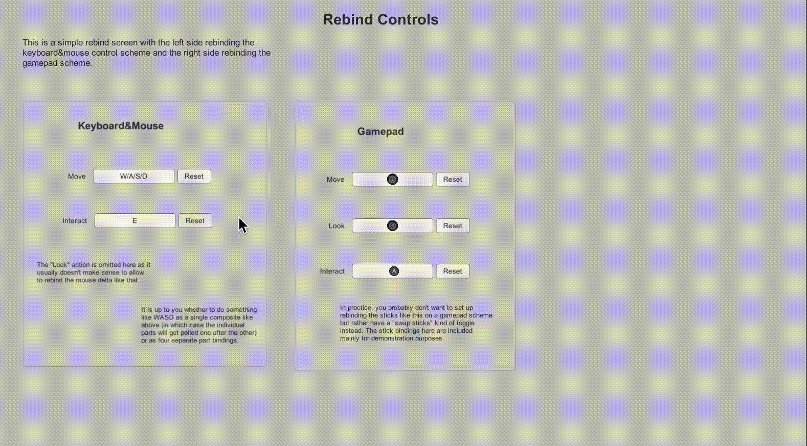

# Input Systemでキーコンフィグを実装する⑤


# PlayerInput経由で使用する場合
ここまで解説したリバインドは、PlayerInputを使用している環境下でも使える方法です。

例えば以下のようにUnity Event経由でPlayerInputからコールバックを呼び出すコードでも機能します。

PlayerInputReceiveExample.cs
```cs
using UnityEngine;
using UnityEngine.InputSystem;

public class PlayerInputReceiveExample : MonoBehaviour
{
    public void OnJump(InputAction.CallbackContext context)
    {
        print("Jump");
    }
}
```

<br>

# 公式のサンプルシーン
Input Systemパッケージ側でもキーコンフィグを実装した公式サンプルが提供されています。

Package Manager画面からInput Systemパッケージを選択し、「Rebinding UI」に対して「Import」ボタンでインポートすると閲覧できます。


<br>

実行すると、本記事で解説したような挙動のインタラクティブなリバインドを行う動作が確認できます。



<br>

# まとめ
Input Systemでキーコンフィグを実装するためには、

> ① 対象Actionを無効化する
> ② 対象となるBindingのインデックスをスキームなどから決定する
> ③ インタラクティブなリバインドを実施する
> ④対象Actionを有効化する

といった手続きを踏む必要があります。

ただ、インタラクティブなリバインドや上書き情報をリセット・セーブ・ロードするといった処理は専用メソッドとして提供されているので、上手く活用できれば実装は楽になるでしょう。

上書き機能を活用すると、リバインド以外にもマウスの入力感度やスティックのデッドゾーン調整といった設定機能の実装も実現できます。


