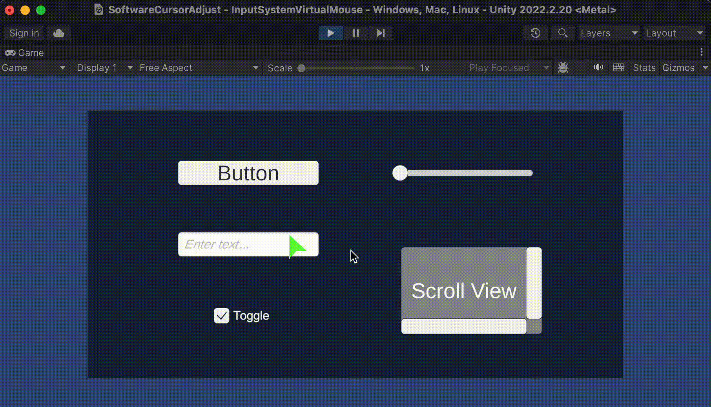
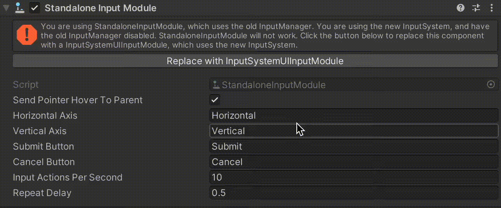
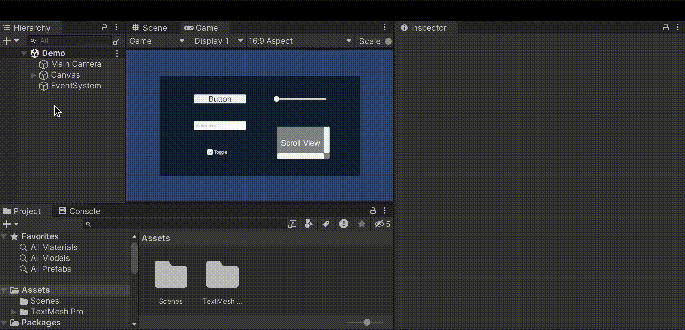
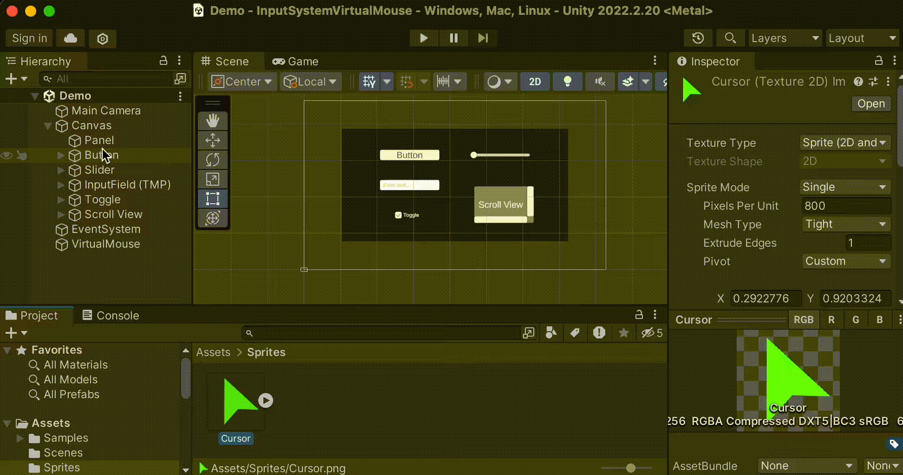
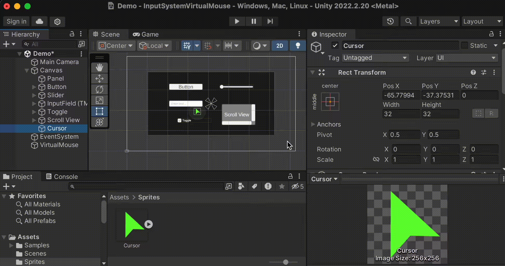
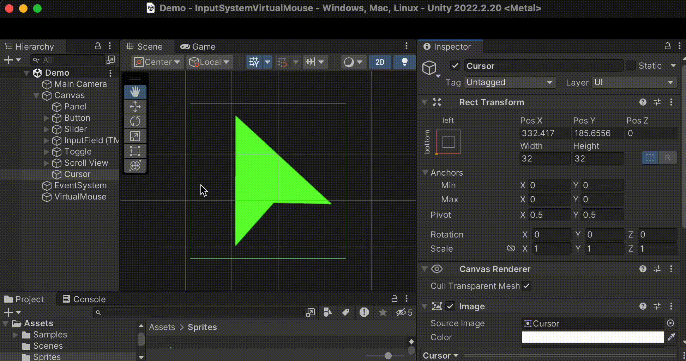
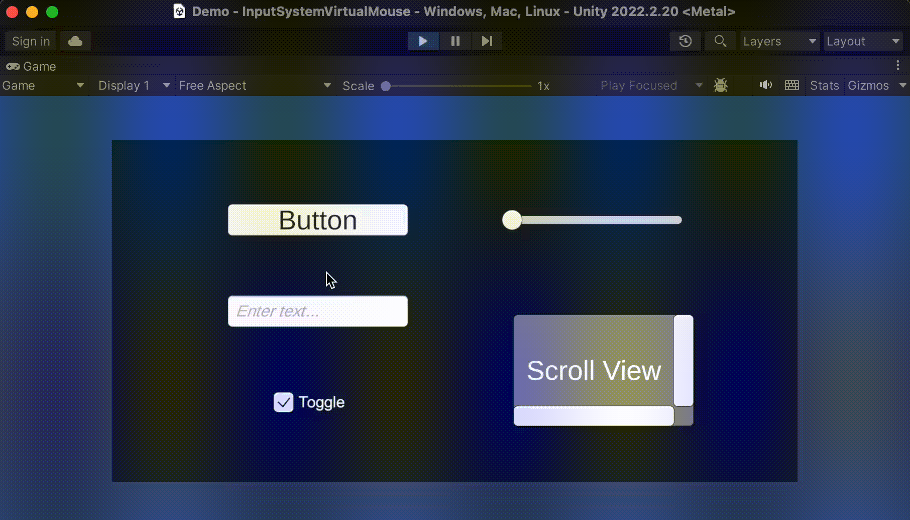
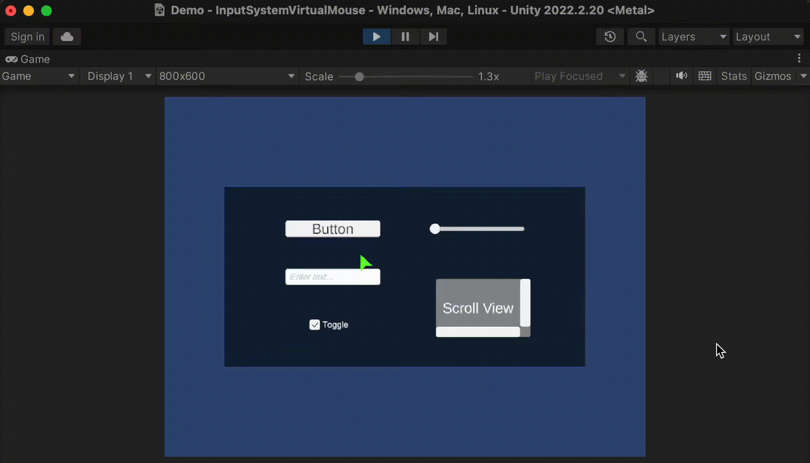
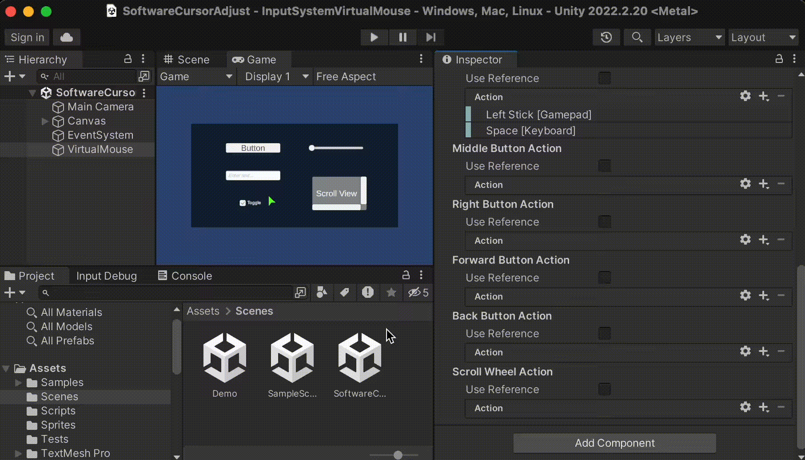

# Input Systemからマウスカーソルを操作する

https://nekojara.city/unity-input-system-virtual-mouse


Input Systemでは、マウスカーソルをゲームパッドなどから操作可能にするVirtual Mouseコンポーネントが提供されています。


これを用いると、ゲームパッドのスティックなどでカーソル移動やクリックができるようになります。





このようにカーソルをマウス以外から操作する方法には、次の2通りがあります。
・OSのカーソルを直接動かす
・UI要素をカーソルと見立てて動かす

<br>

# 下準備

次のように予め配置されたUIに対してカーソル操作出来るようにすることを目標とします。

UIの配置をする際のCanvasの設定は`Constant Pixel`でお願いします。


Unity UI（uGUI）をInput Systemの環境下で扱う際は、`EventSystem`のUIモジュールをInput System用のものに置き換えます。(`Input System UI Input Module`コンポーネントを設定)





<br>

# Virtual Mouseとは
仮想的なマウスデバイスを扱えるようにするコンポーネントです。  
Unityエディタ上ではVirtual Mouseコンポーネントとして振る舞います。

仮想デバイスの動作モードには、OSのカーソルを直接操作するモード、OSカーソルを使用せず代わりにUI要素をカーソルとして操作するモードの2種類が存在します。

<br>

# Virtual Mouseコンポーネントの配置
適当なゲームオブジェクトに`Virtual Mouse`という名前のコンポーネントを追加します。



<br>

すると、次のような項目のVirtual Mouseコンポーネントが追加されます。


Cursor下の項目では、カーソルの動作モードや画像などの基本設定を行います。

Motion以下の項目では、カーソルの移動速度やスクロール速度を設定します。

Stick Action以降の項目では、カーソル操作の入力とするActionを設定します。マウス移動や各種ボタンのクリックなどの操作を割り当てることができます。

<br>

# カーソルの設定
Input SystemのVirtual Mouse側からカーソルを動かすためには、Virtual Mouseコンポーネントの設定を行う必要があります。

## 設定手順

## ・モードの設定
動作モードには2種類存在し、次のいずれかをVirtual MouseコンポーネントのCursor > Cursor Modeに指定します。

+ `Hardware Cursor If Available`  
	マウスが使用可能ならOSのカーソルを直接動かす設定です。マウスが使用可ならOSのカーソル（Hardware Cursor）とします。使用不可なら、後述するソフトウェアカーソル（Software Cursor）の設定にフォールバックされます。
+ `Software Cursor`  
	UI要素をカーソルとして操作します。当モードで動作する場合は、後述するCursor GraphicとCursor Transformの設定が必要です。


<br>

## ・カーソルUIの配置
カーソルの動作モードがSoftware Cursorとなる場合（フォールバック含む）、カーソル用のUIが必要になります。

まず、カーソルとするUI要素をCanvas上に配置します。



カーソル位置はCanvasを基準としたスクリーン座標とするため、必ず左下原点にする必要があります。

そのため、左下原点（0, 0）となるようにアンカーを設定してください。



Virtual MouseからUIカーソルを操作する場合、そのUIのアンカー位置を操作する形で制御します。  
また、カーソル位置はCanvasを基準としたスクリーン座標とするため、左下原点にする必要があります。    
この状態になっていないと、カーソル位置がずれてしまうといった不具合が発生します。

<br>

カーソルのクリック判定位置は、アンカー位置となります。そのため、必要に応じてピボットを調整します。

矢印の先端がクリック判定になるようにピボットを設定することとします。




<br>

また、カーソル自体の画像がクリック判定の邪魔にならないようにRaycast Targetのチェックを忘れずに外しておきます。


<br>

## ・ソフトウェアカーソルの設定
カーソルをCanvasに配置したら、Virtual Mouseコンポーネントの以下項目を設定します。

+ Cursor Graphic :  
  カーソルのImage。Software Cursorモード時だけ表示される。
+ Cursor Transform :  
	Software Cursorモード時に動かすカーソルのTransform。

通常は両者に同じカーソルオブジェクトを指定すれば良いです。

<br>


## カーソルの速さの設定
Motion以下の次の項目でカーソルとスクロールの速さを設定できます。

+ Cursor Speed :  
	カーソルの移動の速さ。単位はピクセル毎秒。
+ Scroll Speed :  
	スクロールの速さ。スクロールの移動量を何倍するかを表す係数。


<br>

## Actionの設定
カーソルの移動やホイールによるスクロール、各種ボタンのクリックなどの操作に割り当てたいActionを指定します。

割り当て内容は以下の通りです。

|||
|---|---|
|Stick Action|	カーソルの移動量入力（2軸入力）|
|Left Button Action|	左ボタン入力|
|Middle Button Action|	中央ボタン入力|
|Right Button Action|	右ボタン入力|
|Forward Button Action|	進むボタン入力|
|Back Button Action|	戻るボタン入力|
|Scroll Wheel Action|	マウスホイール入力（2軸入力）|

<br>

Actionの指定は、
+ Input Actionの直接指定
+ Input Action AssetのAction（参照）指定

どちらでも可能です。

<br>

Use Referenceのチェックを外した状態では、次のようにインスペクター上からActionに割り当てるBindingを設定できます。

Use Referenceにチェックを入れると、次のようにInput Action AssetのActionをアタッチできるようになります。


今回は、  
Stick ActionにUI/Move（DefaultInputActions）  
Left Button ActionにSouthボタンとSpaceキー  
を割り当てています。


<br> 

# 実行
Hardware Cursorモードで動作する場合、OSのカーソルが強制的にVirtual Mouse側から制御されます。  
このとき、Cursor Graphicに指定されたオブジェクトは非表示になります。



<br>

Software Cursorモードで動作する場合、UIで設定したカーソルが制御されます。




<br>

<br>

# Software Cursorモード時の問題
Canvas ScalerのUI Scale ModeにConstant Pixel以外が設定されている場合などは、カーソルのアンカー位置とスクリーン座標が異なるため、クリック位置がずれてしまう問題が生じます。


ハック的な手法になりますが、回避策は存在します。

<br>

## Constant Pixel以外でも正常に機能させる
前述の座標系問題は、カーソルのアンカー位置をスクリーン座標と一致させられれば解決できます。

Canvasのスケール値に基づいてProcessorで座標値を加工する方法を紹介します。  
作業の流れは次のようになります。

<br>

>> ## 作業の流れ
>・Virtual Mouseの座標に対してのみスケールを適用するProcessorを実装する    
>・Canvasのサイズが変わった時、上記カスタムProcessorをポイント座標に適用するスクリプトの実装  
>・スクリプトを適当なゲームオブジェクトにアタッチして設定  
 
>>注意  
>この手順を正確に実施しないと位置ずれが解消されない可能性が高くなります。  
>また、UI要素に対して幅と高さではなくスケールを変更している場合なども解消されない可能性があります。


順番に見ていきます。

<br>

## カスタムProcessorの実装
入力がVirtual Mouseの時だけ指定されたスケールを掛けるProcessorを実装します。

`VirtualMouseScaler.cs`
```cs
using UnityEngine;
using UnityEngine.InputSystem;

#if UNITY_EDITOR
using UnityEditor;

[InitializeOnLoad]
#endif
public class VirtualMouseScaler : InputProcessor<Vector2>
{
    public float scale = 1;

    private const string ProcessorName = nameof(VirtualMouseScaler);

#if UNITY_EDITOR
    static VirtualMouseScaler() => Initialize();
#endif

    // Processorの登録処理
    [RuntimeInitializeOnLoadMethod(RuntimeInitializeLoadType.BeforeSceneLoad)]
    static void Initialize()
    {
        // 重複登録すると、Input ActionのProcessor一覧に正しく表示されない事があるため、
        // 重複チェックを行う
        if (InputSystem.TryGetProcessor(ProcessorName) == null)
            InputSystem.RegisterProcessor<VirtualMouseScaler>(ProcessorName);
    }

    // 独自のProcessorの処理定義
    public override Vector2 Process(Vector2 value, InputControl control)
    {
        // VirtualMouseから始まるデバイス名ののみ、座標系問題が発生するためProcessorを適用する
        if (control.device.name.StartsWith("VirtualMouse"))
            value *= scale;

        return value;
    }
}
```

上記をVirtualMouseScaler.csという名前でUnityプロジェクトに保存すると、カスタムProcessorが使用可能になります。

<br>

## Canvasサイズに基づいてProcessorを適用するスクリプトの実装
Canvasのスケールが変わった時、前述のカスタムProcessorを適用するスクリプトを実装します。

以下、その実装例です。

`SoftwareCursorPositionAdjuster.cs`
```cs
using System;
using UnityEngine;
using UnityEngine.InputSystem;
using UnityEngine.InputSystem.UI;

public class SoftwareCursorPositionAdjuster : MonoBehaviour
{
    [SerializeField] private VirtualMouseInput _virtualMouse;
    [SerializeField] private InputSystemUIInputModule _inputSystemUIInputModule;
    [SerializeField] private Canvas _canvas;

    private float _lastScaleFactor = 1;

    // 現在のCanvasスケール
    private float CurrentScale =>
        _virtualMouse.cursorMode == VirtualMouseInput.CursorMode.HardwareCursorIfAvailable
            ? 1
            : _canvas.scaleFactor;

    // Canvasのスケールを監視して、VirtualMouseの座標を補正する
    private void Update()
    {
        // Canvasのスケール取得
        var scale = CurrentScale;

        // スケールが変化した時のみ、以降の処理を実行
        if (Math.Abs(scale - _lastScaleFactor) == 0) return;

        // VirtualMouseInputのカーソルのスケールを変更するProcessorを適用
        _inputSystemUIInputModule.point.action.ApplyBindingOverride(new InputBinding
        {
            overrideProcessors = $"VirtualMouseScaler(scale={scale})"
        });

        _lastScaleFactor = scale;
    }
}
```

上記をSoftwareCursorPositionAdjuster.csという名前でUnityプロジェクトに保存します。

<br>

## スクリプトの適用
前述のスクリプトSoftwareCursorPositionAdjusterを適当なゲームオブジェクトにアタッチします。



そして、インスペクターより各種項目を設定してください。

+ Virtual Mouse	Virtual :  
    Mouseコンポーネント
+ Input System UI Input Module :  
	EventSystemにアタッチされているInput Module
+ Canvas :  
	カーソルUIがあるCanvas


<br>

## 実行結果
正しい位置でクリック反応するようになりました。

OSのカーソルも正常位置で反応します。

<br>

## スクリプトの説明
カスタムProcessorの以下部分で、Virtual Mouseの時だけスケールを掛ける補正処理を行っています。

```cs
// 独自のProcessorの処理定義
public override Vector2 Process(Vector2 value, InputControl control)
{
    // VirtualMouseから始まるデバイス名ののみ、座標系問題が発生するためProcessorを適用する
    if (control.device.name.StartsWith("VirtualMouse"))
        value *= scale;

    return value;
}
```

これは、マウスカーソル座標にまで適用してしまうと、OS側のカーソル位置がずれる問題が生じるためです。

Canvasのスケールは、以下処理で取得しています。
```cs
// 現在のCanvasスケール
private float CurrentScale =>
    _virtualMouse.cursorMode == VirtualMouseInput.CursorMode.HardwareCursorIfAvailable ? 1 : _canvas.scaleFactor;
```

Hardware Cursorの時に補正を掛けると位置がずれてしまうため、補正をかけない（スケールを1とする）ようにしています。


スケール変更の監視は、Updateイベントでチェックするようにしています。
```cs
// Canvasのスケールを監視して、VirtualMouseの座標を補正する
private void Update()
{
    // Canvasのスケール取得
    var scale = CurrentScale;

    // スケールが変化した時のみ、以降の処理を実行
    if (Math.Abs(scale - _lastScaleFactor) == 0) return;
```

そして、Canvasのスケールが変化した時、次のコードでInput ModuleのPoint Actionに対してカスタムProcessorを適用しています。

```cs
// VirtualMouseInputのカーソルのスケールを変更するProcessorを適用
_inputSystemUIInputModule.point.action.ApplyBindingOverride(new InputBinding
{
    overrideProcessors = $"VirtualMouseScaler(scale={scale})"
});
```

<br>


Virtual Mouseコンポーネントを使用すると、Input System側からカーソルを操作したり、仮装カーソルを実装したりと言ったことが簡単に実現できます。

Canvasのスケールやカーソルのアンカーなどいくつか運用上での制約事項もあり注意が必要です。

既存のVirtual Mouseの挙動で満足できない場合、VirtualMouseInputクラスをコピー・改変して使うと言った運用も考えられるかもしれません。