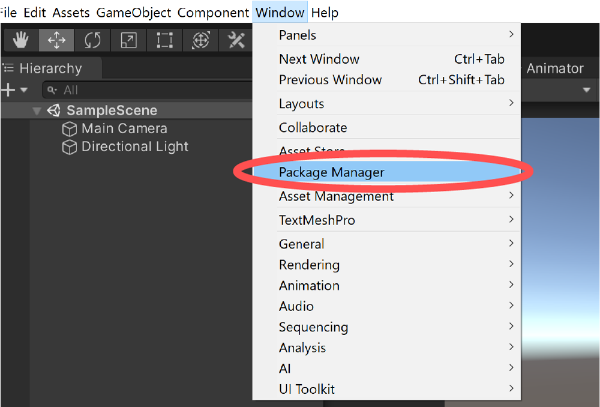
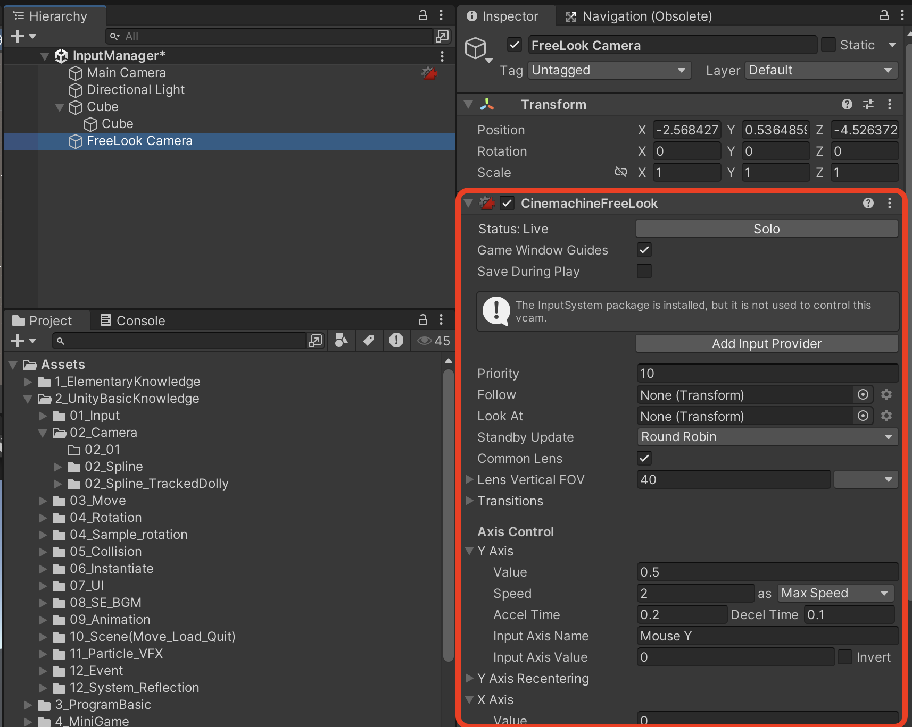
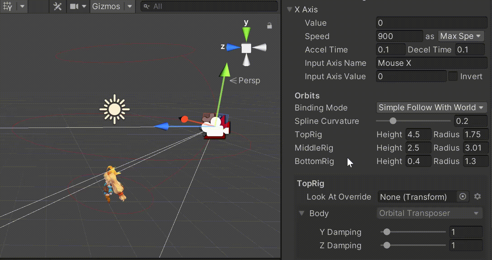

# 三人称視点のカメラワークを簡単に実装する方法

CinemachineのFreeLook Cameraを使うと、TPSのような三人称視点のカメラワークを簡単に素早く実装できます。

 

 

# Cinemachineのインストール
UnityエディタのメニューのWindows > Package Managerの順に選択します。

 

すると、Package Managerウィンドウが開きます。  
左上のPackages～ボタンをクリックし、Unity Registryを選択します。

 

左のパッケージ一覧からCinemachineを選択し、右下のInstallボタンをクリックします。

 

Cinemachineパッケージに緑のチェックマークが付き、InstallボタンがRemoveボタンに変わればインストール完了です。

 

 

# FreeLook Cameraの適用
シーンに三人称視点のカメラワークを適用していきます。  
追従させたい対象はGameObjectであれば何でも良いので、白い箱で構いません。

### ・FreeLook Cameraの配置

UnityエディタのGameObjectメニュー配下からCinemachine > Create FreeLook Cameraを選択します。

 

GameObjectメニューはヒエラルキーウィンドウの＋ボタンから開くことも可能です。

 

すると、ヒエラルキーにFreeLookCameraという名前のVirtual Cameraが追加されます。

また、Main CameraにはCinemachineBrainというコンポーネントが自動的にアタッチされます。Cinemachineのカメラ制御を司るコンポーネントです。

 

# 追従対象の指定
FreeLook Cameraが配置されただけでは、カメラワークが機能しません。追従させたいオブジェクトを指定する必要があります。

ヒエラルキーのFreeLookCameraオブジェクトを選択し、インスペクターにCinemachineFreeLookを表示します。

 

CinemachineFreeLookのFollowにカメラの追従対象を指定します。

 

次に、Look Atに注視点となるオブジェクトを指定します。カメラの中央に表示させたいオブジェクトです。

例えば、3Dモデルの頭を注視するようには、子階層にLookPosという足元より高い位置にある空オブジェクトを置いて、これをLook Atに指定したりします。

## 実行結果
ここまでの手順を実施し、ゲームを実行するとカメラワークが機能するようになります。

[FollowとLookAtについて](Cinemachine_Follow_LookAt.md)

 

 

# カメラワークの調整
三人称視点のカメラワークが最低限動くようになりました。
ここからは、カメラワークを調整していきます。

### ・カメラ回転の速さ・反転設定
デフォルト設定だと、カメラの動きが鈍く感じるかもしれません。
このような場合、`Axis Control`の`Speed`を大きくすると改善します。

また、カメラの回転が期待した向きと逆になっているかもしれません。
この場合は、`Axis Control`の`Invert`にチェックをして、反転することで解決します。

 

### ・追従対象とカメラとの距離調整
デフォルト設定だと、対象とカメラとの距離が近すぎると感じるかもしれません。
このような場合、`Orbits`の`Radius`を調整します。

`TopRig`、`MiddleRig`、`BottomRig`の３種類のRadiusが存在しますが、これはカメラの高さによってカメラの距離を変える表現を実現するためのものです。

これによって、カメラを低くすると、カメラをキャラに寄せるようなカメラワークが実現できます。

キャラを囲むようにするには、Radiusを`TopRig`は少し小さめ、`MiddleRig`は大きめ、`BottomRig`は小さめに設定すると、良い感じになります。

Rigの高さを調整したい場合は、Heightを調整してください。  
Spline Curvatureでは高中低の半径の補完曲線の調整ができます。

 

### エイムの滑らかさ調整
デフォルト設定では、カメラの注視点にピッタリ対象物が収まる動きになっています。

この場合、キャラが激しく動いたり震えたりすると、カメラがブレてしまう可能性があります。

これを緩和するために、AimのDamping値を調整します。

TopRig、MiddleRig、BottomRigそれぞれに設定項目があることに注意してください。
`Horizontal Damping`、`Vertical Damping`がそれぞれ横、縦方向の緩やかさとなります。

Damping値が大きくなるほど、注視点に遅れてカメラが向くようになります。

## 実行結果
ここまで調整を行った状態で実行してみましょう。

カメラワークの調整が反映されているか確認してください。

 

 

# 対象物がカクカクして見える場合の対処法
ここまでの調整を行っても、キャラがブレて見えてしまうことがあります。

考えられる要因としては、CinemachineカメラのTransform更新と、対象物のTransform更新のタイミングが異なっているかもしれません。

例えば、カメラの更新タイミングはUpdateイベントであるのに対し、キャラの移動はFixedUpdateイベントになっている場合です。タイミングがずれている場合は、1フレーム以上前の座標を参照する時があり、結果として対象物とカメラのTransformが一瞬ずれているように見えてしまいます。

<a href="https://docs.unity3d.com/ja/current/Manual/ExecutionOrder.html" target="_blank">参考：イベント関数の実行順序 – Unity マニュアル</a>

このような場合、Cinemachineと対象物の更新タイミングを合わせると解決する場合があります。

Cinemachineがカメラの位置や向きをどのように更新するかを制御するオプションがあり、デフォルトでは対象物の動きに応じて自動的にカメラが更新される設定になっています。（Update MethodがSmart Updateに選択されています）

しかしながら、状況によっては更新タイミングがずれて対象物がカクカク動いているように見えることがあるようです。

例では、FixedUpdateで動かしているので、Main CameraにアタッチされているCinemachineBrainのUpdate MethodをFixed Updateにすればカクカクする問題は解決します。

逆に、ユニティちゃんがUpdateのタイミングで動いている場合は、Late Updateに設定すれば良いでしょう。

> Cinemachineに限らず、カメラワークを実装する場合は更新タイミングに要注意。

 

ここまで紹介したカメラのマウス操作は、Input Managerを用いて行っています。

新しいInput Systemを使用したUnityプロジェクトなど、カメラ操作もInput Systemで操作するようにしたい場合、バーチャルカメラオブジェクトにCinemachineInputProviderコンポーネントをアタッチし、Input Systemのアクションを設定することで解決可能です。

この辺の手順は以下記事にまとめましたので、必要な方はご覧ください。

