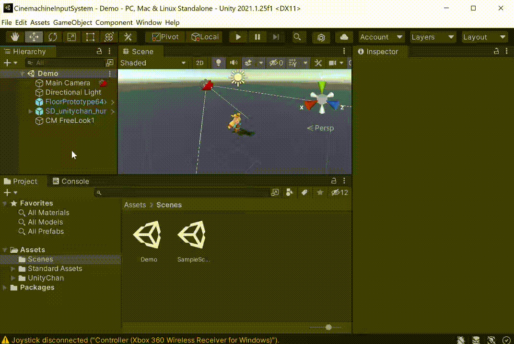
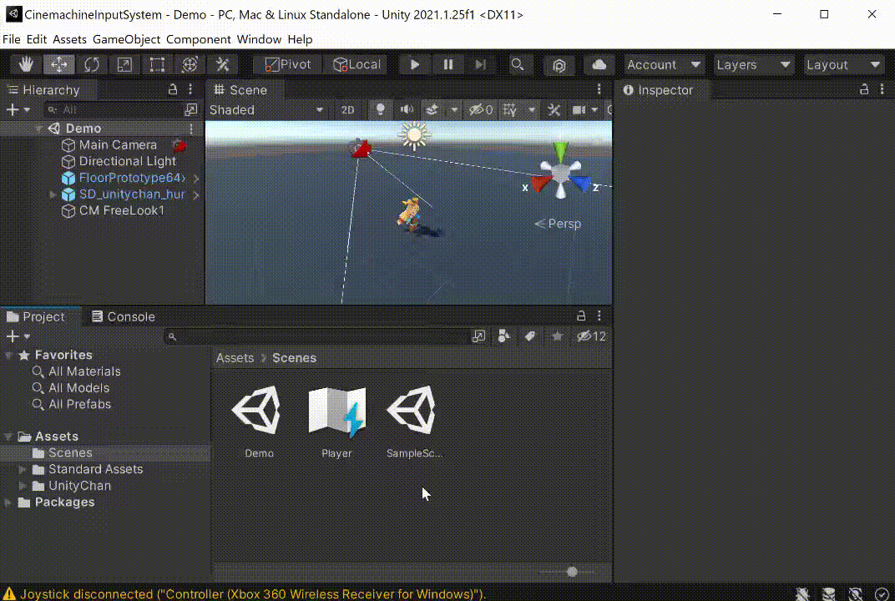
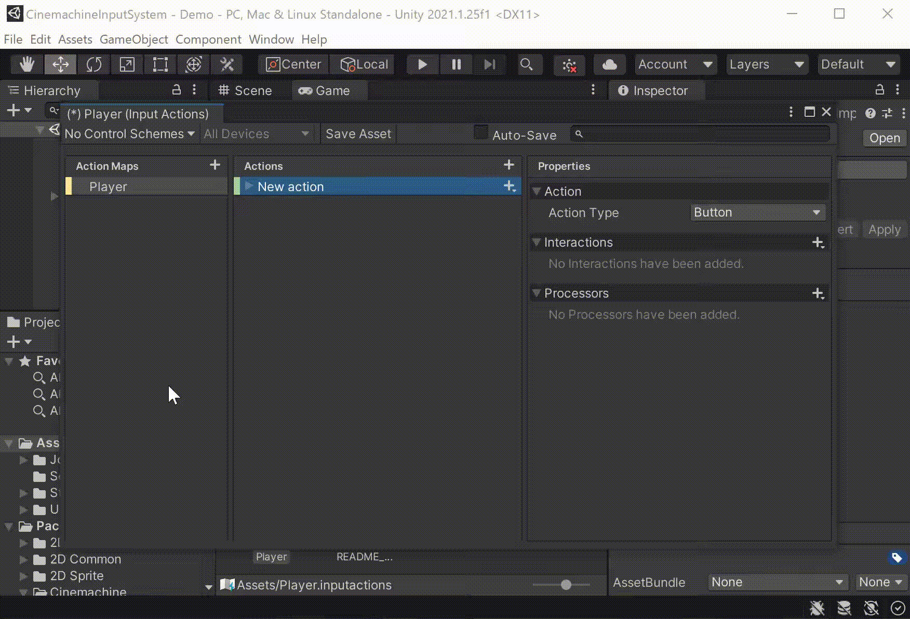
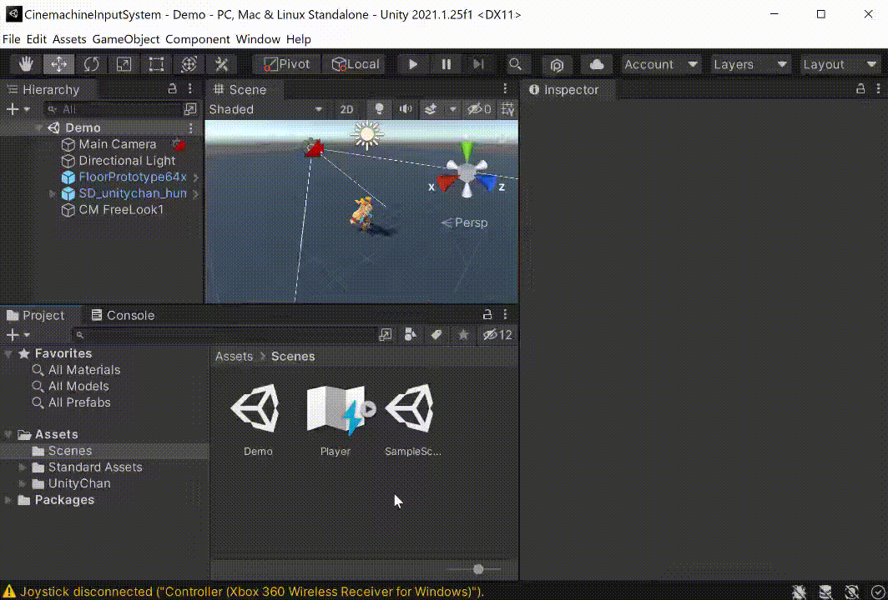
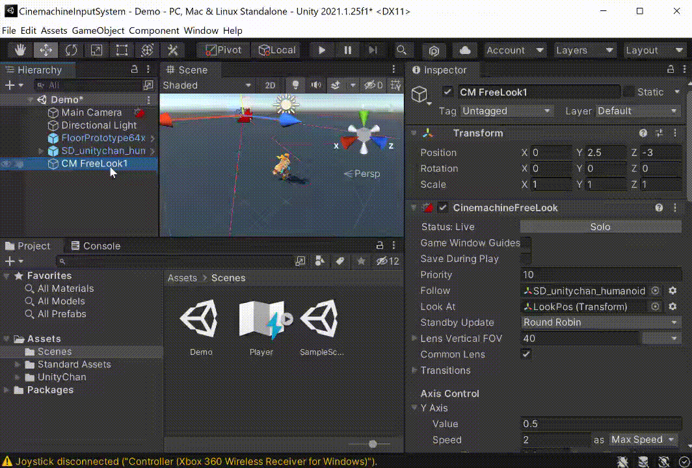

# Input Systemでカメラ操作をしたい場合

# Input Actionsの設定
本記事では、カメラ制御専用のキーバインドを作成して使うことを前提に解説していきます。すでにキーバインドを設定している場合は、読み飛ばして問題ありません。

 

### Input Actions定義ファイルの作成
トップメニューよりAssets > Create > Input Actionsの順に選択し、Input Actionsの定義ファイルを作成します。

どんな名前でも構いません。

### キーバインドの定義
カメラ操作に使うキーバインド情報を作成していきます。必要な操作は、カメラ回転に使う２軸操作です。

先ほど作成したInput Actionsファイルをダブルクリックで開き、Action Mapsの右の＋ボタンから新しいマップを作成します。

Actionsのアクション名（New actionの部分）を適当なものに変更し、Properties > Action項目を設定します。

２軸操作となるため、Action TypeにはValue、Control TypeにはVector 2を指定すればOKです。

アクションの三角マークをクリックし、<No Binding>をクリックし、Properties > Binding > Pathより２軸入力を設定します。

マウス移動を設定する場合は、Mouse > Deltaを選択します。

ここまでの設定が完了したら、Save AssetボタンをクリックしてInput Actionsの設定を保存してください。

これでInput Actionsの設定は完了です。

 

 

# CinemachineInputProviderの追加
Input Systemでカメラ操作させたいバーチャルカメラオブジェクトにCinemachineInputProviderコンポーネントをアタッチします。

例では、TPSカメラ制御するCinemachine Free Look Cameraオブジェクトにアタッチすることとします。

なお、アタッチする場所は、バーチャルカメラオブジェクトおよびその子（孫含む）オブジェクトのどちらでも構いません。 

無事に追加出来たら、次の項目を設定します。

+ Player Index   
  - プレイヤーのインデックス。シングルプレイヤーなら-1を設定します。
+ XY Axis  
  - XY方向のカメラ操作に割り当てるInput Actionを指定します。使用しない場合はnullを設定できます。
+ Z Axis  
  - Z方向のカメラ操作に割り当てるInput Actionを指定します。使用しない場合はnullを設定できます。  
  Cinemachine Free Look Cameraなどのバーチャルカメラでは、基本的にXY Axisしか使わないため、Z Axisはnullでも問題ありません。

 

 

 # 感度調整について
Cinemachine FreeLook Cameraなどをマウスやスティックで動かしたい場合は、Axis Controlの速度や感度調整が必要になる場合があります。

また、マウスとスティック入力を同時に扱う場合、両者の入力値の大きさが全く異なり、入力値の大きさが同じになるような調整が必要になる場合があります。

マウスとスティック入力それぞれで感度を調整したい場合、Input ActionのProcessorの一つであるScaleが使えます。Scale Processorの使い方については、[こちらの「8 Processor」の感度まわりを参照](../../2_1_InputSystem/2_1_2_InputSystem/InputSystem0.md)

