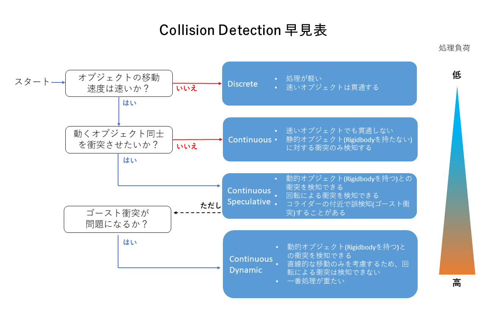

### 2. **Rigidbodyによる移動**
`Rigidbody`はUnityの物理エンジンを利用したオブジェクトの移動です。力を加えたり、速度を直接操作することで、物理挙動に基づいた移動が可能です。

#### 基本サンプルコード：
```csharp
using UnityEngine;

public class RigidbodyMove : MonoBehaviour
{
    public float speed = 5f;
    private Rigidbody rb;

    void Start()
    {
        rb = GetComponent<Rigidbody>();
    }

    void Update()
    {
        // 水平移動
        float moveInput = Input.GetAxis("Horizontal");
        rb.velocity = new Vector3(moveInput * speed, rb.velocity.y, rb.velocity.z);
    }
}
```

#### 特徴：
- **長所**: 物理挙動を簡単に扱える。衝突や重力も考慮。
- **短所**: 衝突や摩擦の影響を受けるため、意図しない挙動が起きやすい。


物理挙動を考慮した移動で、重力や衝突の影響を受ける。


<br>

<a href="https://blog.virtualcast.jp/blog/2020/05/collisiondetectionchart/" target="_blank">Collision Detection の設定について</a>

