# WheelCollider

Unityには車輪の再現に適したWheelColliderというコンポーネントが用意されています。
今回はこれを使って車の動きを再現してみます。

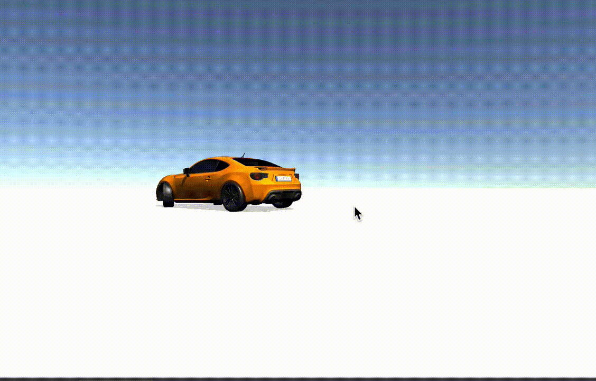

<br>

# 作成
1. 新規3DプロジェクトからCarを作成

### 地面
1. 新規3DオブジェクトからCubeを作成。Floorにリネーム後Scaleを以下のように調節する。

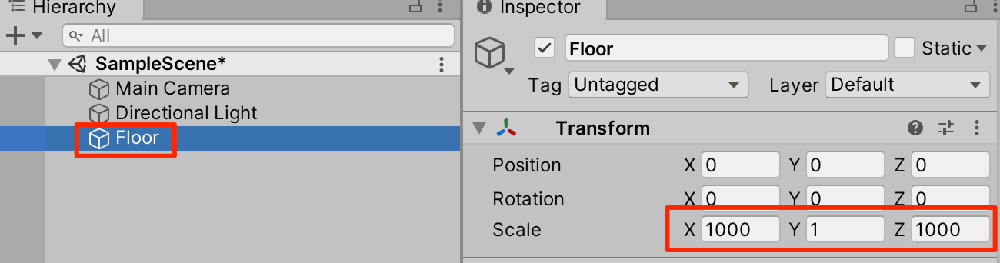


### 車
1. 新規CreateEmptyをしてCarにリネーム後Transformを以下のように調整する。

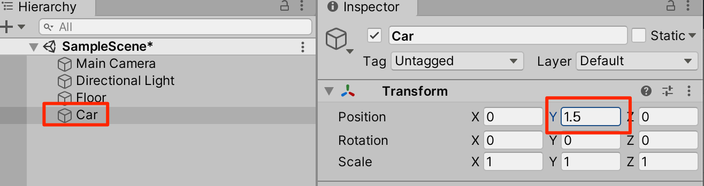

<br>

2. CarにAddComponentからrigidbodyを追加する。Massを1500(1.5トン)に調節する。

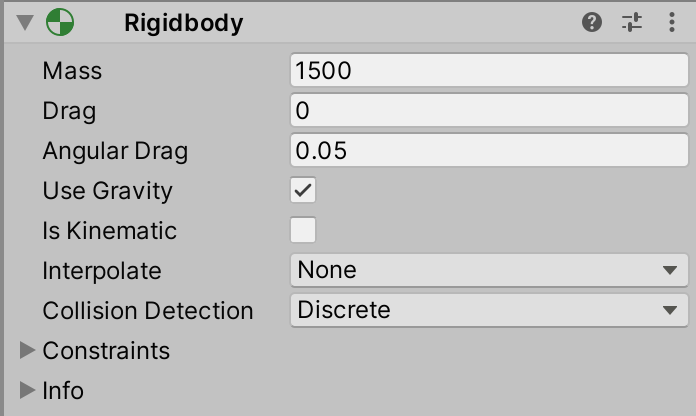

3. Carの子要素としてCubeを作成し、Bodyとリネームする。Transformは以下

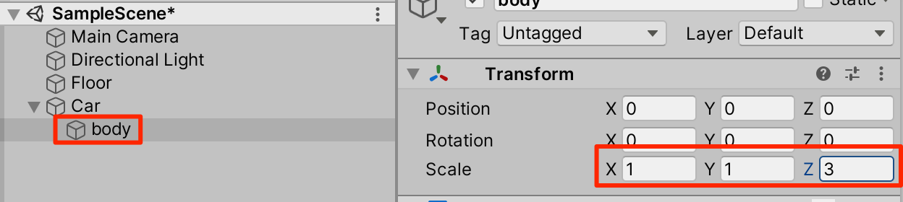

<br>

4. Carを右クリックしてCreateEmptyして、wheelsとリネーム。transformがリセットされていることを確認する。

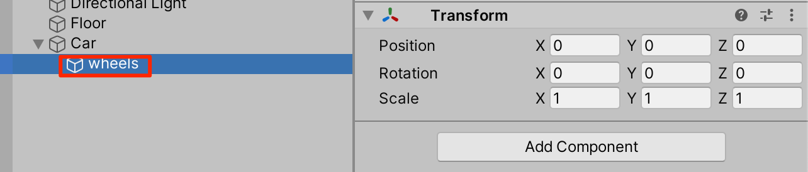

<br>

5. Wheelsを右クリック->CreateEmptyしてFrontRを作成。Transformを調整し、WheelColliderをAdd Componentする。(パラメータはいじらなくてよい)

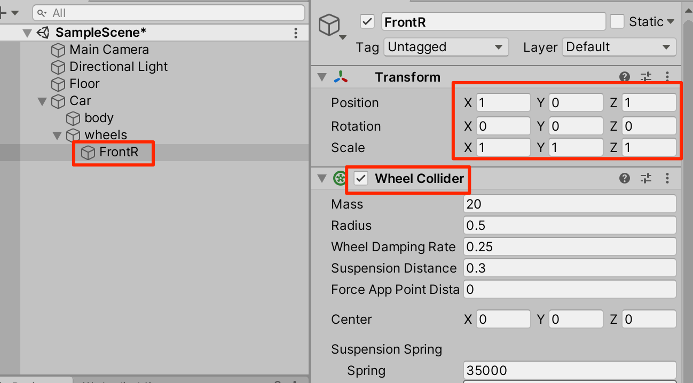

<br>

6. FrontRを複製して、FrontLにリネーム。Position.xを-1に変更する。

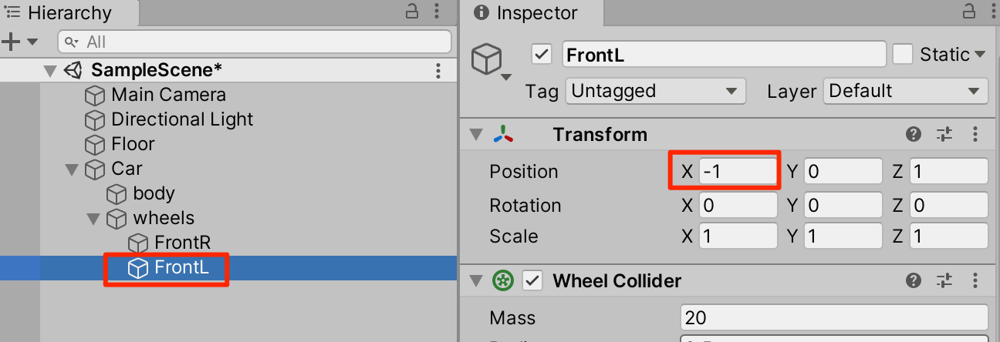

<br>

7. FrontRとFrontLを選択した状態で複製して、それぞれのposition.zを-1にする。

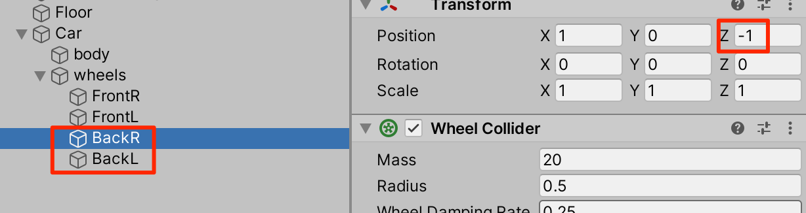

<br>

8. 確認。4つのwheelcolliderを選択して以下のような感じに配置されてればOKだ。

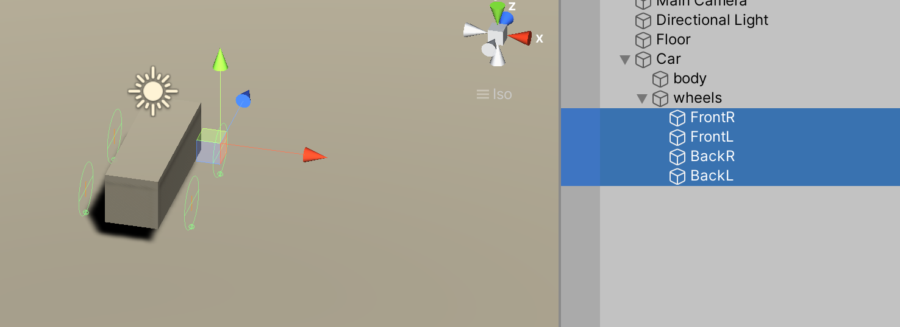

<br>

### Carスクリプトの作成

1. 新規C#スクリプトからCar.csを以下のように作成する。

```cs
using System.Collections;
using System.Collections.Generic;
using UnityEngine;

public class Car : MonoBehaviour {
    public List<AxleInfo> axleInfos;
    public float maxMotorTorque;
    public float maxSteeringAngle;

    float motor;
    float steering;

    void Update()
    {
        motor = maxMotorTorque * Input.GetAxis("Vertical");
        steering = maxSteeringAngle * Input.GetAxis("Horizontal");
    }


    public void FixedUpdate() {

        foreach (AxleInfo axleInfo in axleInfos) {
            if (axleInfo.steering) {
                axleInfo.leftWheel.steerAngle = steering;
                axleInfo.rightWheel.steerAngle = steering;
            }
            if (axleInfo.motor) {
                axleInfo.leftWheel.motorTorque = motor;
                axleInfo.rightWheel.motorTorque = motor;
            }
        }
    }
}
[System.Serializable]
public class AxleInfo {
    public WheelCollider leftWheel;
    public WheelCollider rightWheel;
    public bool motor; //駆動輪か?
    public bool steering; //ハンドル操作をしたときに角度が変わるか？
}
```
2. 作成が終わったらCarにアタッチ。インスペクターを以下のように調整する。今回は後輪にmotor設定をして後輪駆動車にしてみた。

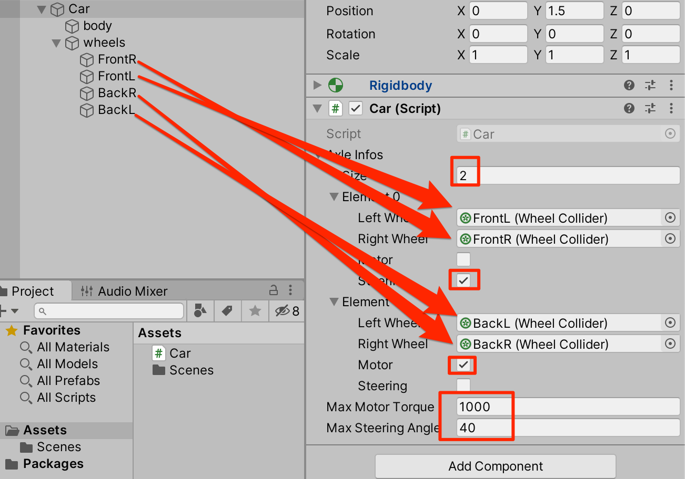

<br>       

3. 実行してみよう。上下矢印でアクセル、左右矢印でハンドルだ。車輪の見た目はまだ作っていないがWheelColliderによって車としての挙動をすることがわかる。

<br>

### 車輪の見た目
車輪の見た目がないのも奇妙なものだ。見た目を作っていこう。

1. FrontRを右クリックして子要素としてSphereを作成する。transformを調整し、SphereColliderはリムーブするか無効にする。

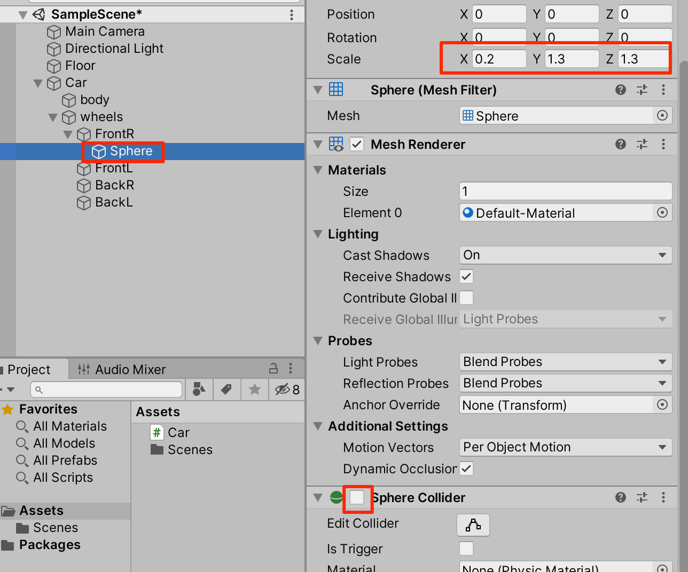

<br>   

2. 残りの車輪についても同じ処理を行い実行してみよう。車輪の見た目が加わったことにより良い感じになった。

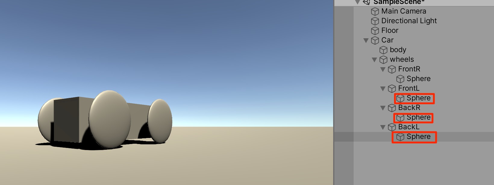

<br>   

### 車輪に動きを加える
これだけでも十分楽しめるが、車輪の見た目を動きに連動させていこう。Car.csを以下のように変更する。

```cs
using System.Collections;
using System.Collections.Generic;
using UnityEngine;

public class Car : MonoBehaviour {
    public List<AxleInfo> axleInfos;
    public float maxMotorTorque;
    public float maxSteeringAngle;

    float motor;
    float steering;

    void Update()
    {
        motor = maxMotorTorque * Input.GetAxis("Vertical");
        steering = maxSteeringAngle * Input.GetAxis("Horizontal");
    }


    public void FixedUpdate() {

        foreach (AxleInfo axleInfo in axleInfos) {
            if (axleInfo.steering) {
                axleInfo.leftWheel.steerAngle = steering;
                axleInfo.rightWheel.steerAngle = steering;
            }
            if (axleInfo.motor) {
                axleInfo.leftWheel.motorTorque = motor;
                axleInfo.rightWheel.motorTorque = motor;
            }
            ApplyLocalPositionToVisuals(axleInfo.rightWheel);
            ApplyLocalPositionToVisuals(axleInfo.leftWheel);
        }
    }


    public void ApplyLocalPositionToVisuals(WheelCollider collider) {
        Transform visualWheel = collider.transform.GetChild(0);
        Vector3 position;
        Quaternion rotation;
        collider.GetWorldPose(out position, out rotation);
        visualWheel.transform.position = position;
        visualWheel.transform.rotation = rotation;
    }
}
[System.Serializable]
public class AxleInfo {
    public WheelCollider leftWheel;
    public WheelCollider rightWheel;
    public bool motor; //駆動輪か?
    public bool steering; //ハンドル操作をしたときに角度が変わるか？
}
```

(解説)
現在のホイールコライダーの向きと角度を計算して、それを子要素のtransformに反映させる処理だ。

実行してみよう。車輪が回転し、操舵角も反映されている。（テクスチャーを設定してないので車輪の回転は分かりづらいが。。。)

車輪の見た目の大きさの調整
おや、サスペンションの沈み込んだ位置で車輪の描画が行われているため、タイヤが地面にめり込み過ぎている。


これを修正しよう。４個の車輪を選択してScaleのYとZを１にする。


実行してみよう。車輪のめり込みがなくなったのがわかる。


<br>

## テールハッピー
今回の後輪駆動車をいわゆるテールハッピーにしてしまおう。テールハッピーというのは後輪のグリップ力が少なくてすぐに後輪がスリップする状態だ。後輪の２つのWheelColliderを選択して、Stiffnessを0.3に設定する。


Stiffnessがグリップ力を決める。横方向の設定を0.3にすれば後輪はスリップしまくりとなる。

車好きでなくともこの挙動は楽しめる。車好きなら一晩中遊べるのではなかろうか。設定を色々変えてお好みのセッティングを見つけよう。

アセットストアから車体のモデルをダウンロードし、上のソースと組み合わせた。


<br>

[その他のプロパティについて](2_WheelCollider_Property.md)

<br>

# ブレーキ


```cs
using System.Collections;
using System.Collections.Generic;
using UnityEngine;

public class Car : MonoBehaviour {
    public List<AxleInfo> axleInfos;
    public float maxMotorTorque;       // 最大駆動力
    public float maxSteeringAngle;     // 最大ステアリング角

    
    <span style="color:red;">public float brakeTorque = 3000f;</span>  // ブレーキ力
    public float decelerationSpeed = 500f;  // アクセルを離した時の減速力
    public float stopThreshold = 0.1f; // 停止判定のしきい値
    
    float motor;
    float steering;
    float currentSpeed;

    void Update()
    {
        motor = maxMotorTorque * Input.GetAxis("Vertical");
        steering = maxSteeringAngle * Input.GetAxis("Horizontal");
    }

    public void FixedUpdate() {
        foreach (AxleInfo axleInfo in axleInfos) {
            if (axleInfo.steering) {
                axleInfo.leftWheel.steerAngle = steering;
                axleInfo.rightWheel.steerAngle = steering;
            }
            if (axleInfo.motor) {
                // 車速を取得
                currentSpeed = axleInfo.leftWheel.rpm * axleInfo.leftWheel.radius * Mathf.PI / 30.0f;

                // ブレーキの処理
                if (Input.GetKey(KeyCode.Space)) {
                    // ブレーキボタンを押した時に強めのブレーキをかける
                    ApplyBrake(axleInfo, brakeTorque);
                } else if (motor == 0 && Mathf.Abs(currentSpeed) > stopThreshold) {
                    // アクセルを離した時、自然な減速を行う
                    ApplyBrake(axleInfo, decelerationSpeed);
                } else if (motor < 0 && currentSpeed > 0 || motor > 0 && currentSpeed < 0) {
                    // 逆方向に入力があった場合、強めのブレーキをかける
                    ApplyBrake(axleInfo, brakeTorque);
                } else {
                    // ブレーキが不要な場合は解除
                    ReleaseBrake(axleInfo);
                    // 駆動力をホイールに適用
                    axleInfo.leftWheel.motorTorque = motor;
                    axleInfo.rightWheel.motorTorque = motor;
                }
            }
            ApplyLocalPositionToVisuals(axleInfo.rightWheel);
            ApplyLocalPositionToVisuals(axleInfo.leftWheel);
        }
    }

    // ブレーキを適用するメソッド
    private void ApplyBrake(AxleInfo axleInfo, float brakeForce) {
        axleInfo.leftWheel.brakeTorque = brakeForce;
        axleInfo.rightWheel.brakeTorque = brakeForce;
        axleInfo.leftWheel.motorTorque = 0;
        axleInfo.rightWheel.motorTorque = 0;
    }

    // ブレーキを解除するメソッド
    private void ReleaseBrake(AxleInfo axleInfo) {
        axleInfo.leftWheel.brakeTorque = 0;
        axleInfo.rightWheel.brakeTorque = 0;
    }

    // ホイールのビジュアル位置を更新するメソッド
    public void ApplyLocalPositionToVisuals(WheelCollider collider) {
        Transform visualWheel = collider.transform.GetChild(0);
        Vector3 position;
        Quaternion rotation;
        collider.GetWorldPose(out position, out rotation);
        visualWheel.transform.position = position;
        visualWheel.transform.rotation = rotation;
    }
}

[System.Serializable]
public class AxleInfo {
    public WheelCollider leftWheel;
    public WheelCollider rightWheel;
    public bool motor; // 駆動輪か?
    public bool steering; // ハンドル操作をしたときに角度が変わるか？
}

```