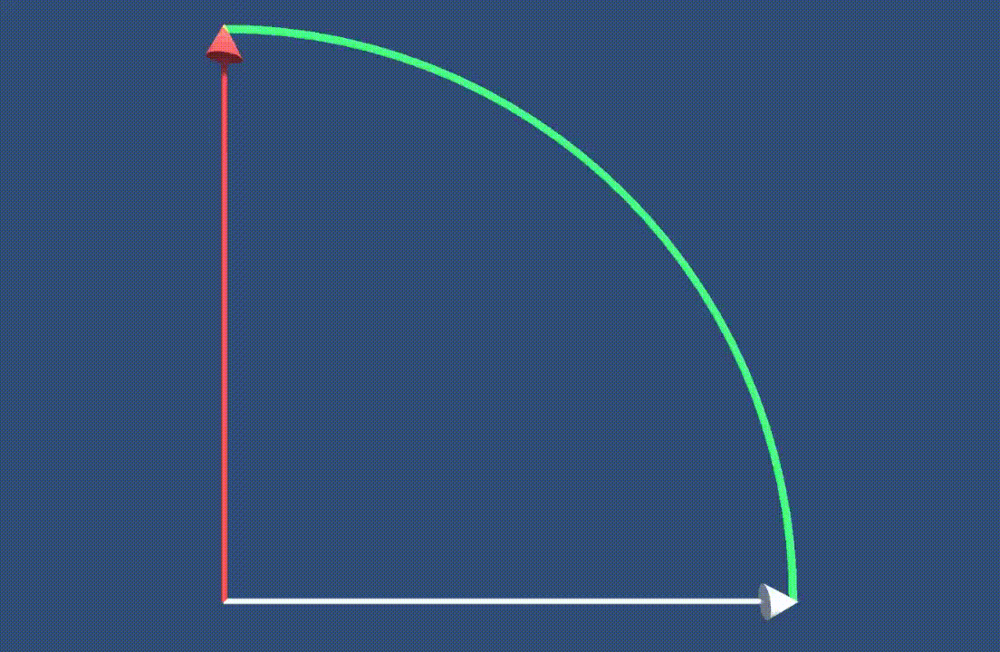
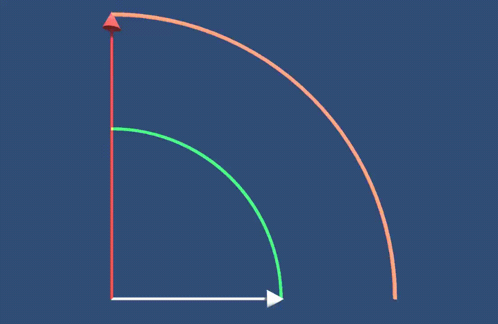
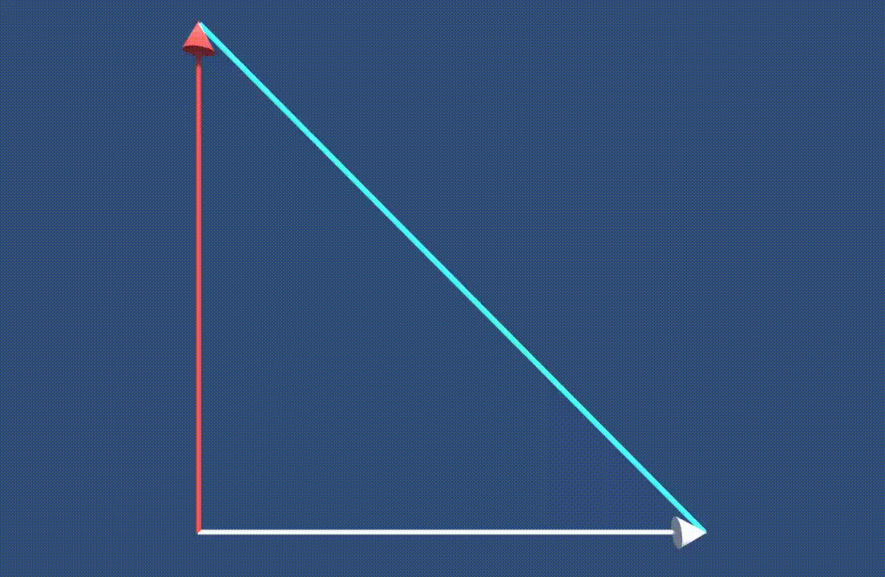

# いろんな回転方法

## 1. `Rigidbody` を使った回転

`Rigidbody` を使用することで、物理エンジンを介した回転を制御することができます。この方法は、物理的な力を使って回転させたいときに適しています。

### サンプルコード
```csharp
public class RotateWithRigidbody : MonoBehaviour {
    public float rotationSpeed = 100f;
    private Rigidbody rb;

    void Start() {
        rb = GetComponent<Rigidbody>();
    }

    void FixedUpdate() {
        float inputX = Input.GetAxis("Horizontal");
        rb.MoveRotation(rb.rotation * Quaternion.Euler(0, inputX * rotationSpeed * Time.fixedDeltaTime, 0));
    }
}
```

### 特徴
- `Rigidbody`の`MoveRotation`は、物理エンジンによって制御され、コリジョンや物理的な力（トルク）との相互作用を考慮します。
- **衝突判定を伴う物理シミュレーション**や、**力を加えて回転させたい**場合に有効です。

### 注意点
- 物理シミュレーションの精度や挙動に依存するため、意図した通りの回転をさせるためには**力（トルク）**の調整が必要です。

<br>

[AddTorqueについて](AddTorque.md)

---

<br>

## 2. `Quaternion.Slerp`（球面線形補間）





`Quaternion.Slerp`は、2つの回転の間をスムーズに補間（徐々に変化）させる手法です。滑らかな回転を実現したいときに使います。

ターゲットと同じ方向を向くサンプルコードです

### サンプルコード
```csharp
public class SmoothRotation : MonoBehaviour {
    public Transform target;
    public float rotationSpeed = 1.0f;

    void Update() {
        // 現在の回転とターゲットの回転の間を補間する
        transform.rotation = Quaternion.Slerp(transform.rotation, target.rotation, rotationSpeed * Time.deltaTime);
    }
}
```

### 特徴
- `Slerp`は**線形補間**と違い、**球面上での回転の補間**を行うため、角度が大きく異なる場合でも滑らかに補間が可能です。
- オブジェクトが**指定された方向に徐々に向くように回転させたい**場合に有効です（例：ターゲット追跡やカメラのスムーズな移動）。

### 使用例
- プレイヤーがキャラクターを操作したときに、**方向を急激に変えずにスムーズに向かせる**演出などに使用されます。

<br>


---


<br>

## 3. `Lerp`による回転



`Lerp`（線形補間）は、2つの値の間を徐々に変化させる手法で、回転にも応用できます。厳密には`Quaternion.Slerp`の方が回転には適していますが、軽い処理には`Lerp`も使われます。

### サンプルコード
```csharp
public class LerpRotation : MonoBehaviour {
    public Transform target;
    public float lerpSpeed = 1.0f;

    void Update() {
        // 現在の回転とターゲットの回転の間を線形補間する
        transform.rotation = Quaternion.Lerp(transform.rotation, target.rotation, lerpSpeed * Time.deltaTime);
    }
}
```

### 特徴
- `Lerp`は2つの値の間を**直線的に補間**するため、回転角度が小さい場合には滑らかな動作が期待できます。
- `Slerp`よりも計算コストが少ないため、処理の軽量化が求められる場面では使用できますが、回転の大きな変化には不向きです。


<br>

[補間の計算処理](補間の計算処理.md)

<br>

---


<br>

## 4. `Quaternion.RotateTowards`

`RotateTowards`は、現在の回転から目標の回転へと一定速度で回転させる手法です。`Slerp`と似ていますが、回転速度を一定にしたいときに使います。

ターゲットと同じ方向を向くように動くサンプルコードです

### サンプルコード
```csharp
public class RotateTowardsTarget : MonoBehaviour {
    public Transform target;
    public float rotationSpeed = 1.0f;

    void Update() {
        // ターゲットに向けて一定速度で回転
        transform.rotation = Quaternion.RotateTowards(transform.rotation, target.rotation, rotationSpeed * Time.deltaTime);
    }
}
```

### 特徴
- `RotateTowards`は、**一定の速度**でターゲット方向に向けて回転させるため、**時間に依存しない安定した回転**が可能です。
- ターゲットオブジェクトに向けて、**徐々に方向を変更したい場合**に有効です。

<br>

---

<br>

## 5. `LookAt` メソッドによる回転

`LookAt`を使用すると、オブジェクトが常に特定のターゲットを向くように回転します。ターゲット追跡やカメラ制御によく使用されます。

### サンプルコード
```csharp
public class LookAtTarget : MonoBehaviour {
    public Transform target;

    void Update() {
        transform.LookAt(target);
    }
}
```

### 特徴
- オブジェクトが常にターゲットを**自動的に向く**ように回転します。
- ターゲットの**位置に依存して回転**を行うため、ターゲットの移動に伴って動的に方向を変更します。

### 使用例
- カメラがキャラクターを常に追跡する場合や、敵がプレイヤーに常に向かっているような演出に使われます。

### 注意点
- ターゲットとオブジェクトの位置が**同じ座標**になった場合、回転が不安定になることがあります。

<br>

---

<br>

## 6. `Euler`を使わずに`Quaternion`で直接回転

オブジェクトを回転させる際、オイラー角を使わずにクォータニオン演算を直接行う方法もあります。これは、オイラー角の変換を避けてクォータニオンで直接回転を扱うため、より精密な回転が可能です。

### サンプルコード
```csharp
public class QuaternionDirectRotation : MonoBehaviour {
    public float rotationSpeed = 100f;

    void Update() {
        float inputX = Input.GetAxis("Horizontal");
        // 直接クォータニオンで回転
        Quaternion deltaRotation = Quaternion.AngleAxis(inputX * rotationSpeed * Time.deltaTime, Vector3.up);
        transform.rotation = transform.rotation * deltaRotation;
    }
}
```

### 特徴
- `Quaternion.AngleAxis`は、指定した軸 (`Vector3`) に対して角度で回転させます。この方法は、複雑な回転や連続的な回転に強いです。
- **オイラー角を介さずに直接回転**を制御するため、ジンバルロックの問題がなく、より効率的です。

---
---

## ダメな回転の例と改善方法

### 1. 回転が不安定なコード（`Time.deltaTime`を誤用した場合）
```csharp
// ダメな例: Time.deltaTimeを回転量に直接適用する
yRot += new Vector3(0, inputX, 0);
transform.rotation = Quaternion.Euler(yRot * Time.deltaTime * rotationSpeed);
```

#### 問題点
- `Time.deltaTime`を回転角度に直接掛け算することで、フレーム間の差異により不安定な挙動を引き起こす可能性があります。フレームレートが変動すると、回転の速さが不規則になります。

#### 改善方法
`Time.deltaTime`は**速度にのみ適用**し、回転角度には直接適用しないように修正します。
```csharp
yRot += new Vector3(0, inputX * rotationSpeed * Time.deltaTime, 0);
transform.rotation = Quaternion.Euler(yRot);
```

<br>

---
---

<br>

## まとめ

1. **物理シミュレーション**が必要な場合などは`Rigidbody`を使った回転。
2. **滑らかな回転**が必要なら`Quaternion.Slerp`や`RotateTowards`を活用できる。
3. ターゲットを常に**追跡させる場合**は`LookAt`が使える。
4. クォータニオンを直接操作したい場合は`Quaternion.AngleAxis`やクォータニオン演算を使用。

<br>

---

<br>

[ルーレット](roulette.md)