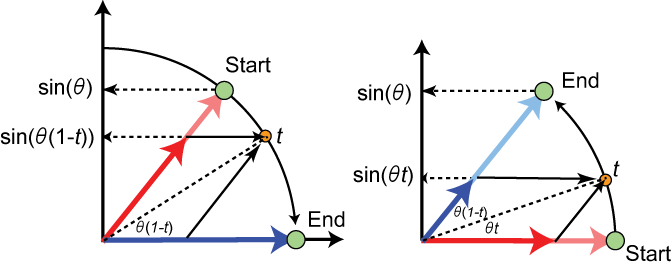

# 線形補間（Linear Interpolation）と球面線形補間（Spherical Linear Interpolation, Slerp）

 

## 線形補間 (Linear Interpolation)

線形補間は、2つの点の間を直線的に補間する方法です。補間のパラメータ $ t $ を使って、2つの値の間の値を計算します。

### 計算式

線形補間は次のように定義されます。

$ L(p) = (1 - p) \cdot A + p \cdot B $

- $ L(p) $: 補間結果のベクトル
- $ A $: 始点
- $ B $: 終点
- $ p $: 補間パラメータ $(0 \leq p \leq 1)$

### 例

- $ A = 0 $, $ B = 10 $, $ p = 0.5 $ の場合:

$
L(0.5) = (1 - 0.5) \cdot 0 + 0.5 \cdot 10 = 5
$

この結果から、$ p = 0.5 $ のとき、$ A $ から $ B $ の間の中間点（5）が得られます。

 

---

 

## 球面線形補間 (Spherical Linear Interpolation, Slerp)

球面線形補間は、2つのクォータニオンやベクトルの間を球面上で補間する方法です。通常、回転を補間するために使われます。

### 計算式

球面線形補間は次のように定義されます。

$
\text{Slerp}(A, B, t) = \frac{\sin((1 - t) \theta)}{\sin(\theta)} A + \frac{\sin(t \theta)}{\sin(\theta)} B
$

- $ \text{Slerp}(A, B, t) $: 補間結果のベクトル
- $ A $: 始点のクォータニオンまたはベクトル
- $ B $: 終点のクォータニオンまたはベクトル
- $ t $: 補間パラメータ \((0 \leq t \leq 1)\)
- $ \theta $: $ A $ と $ B $ の間の角度（コサイン類似度に基づく）

### 角度の計算

角度 $ \theta $ は次のように計算されます。

$
\theta = \cos^{-1}(A \cdot B)
$

### 例

- 2つのクォータニオン \( A \) と \( B \) がある場合、\( t = 0.5 \) のときの球面線形補間を計算します。

1. $  \theta  $ を計算します。
2. 上記のSlerpの式に代入します。

この結果として、\( A \) から \( B \) までの球面上の補間点が得られます。
