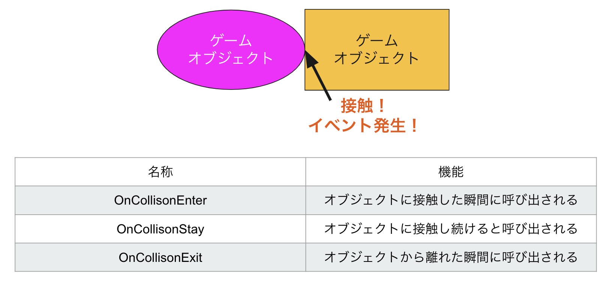
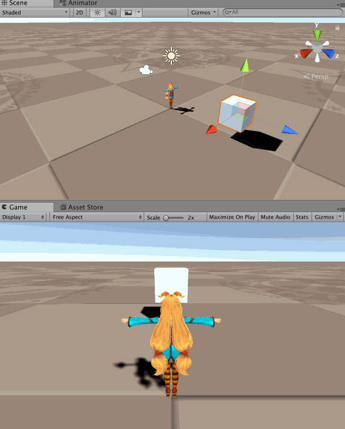
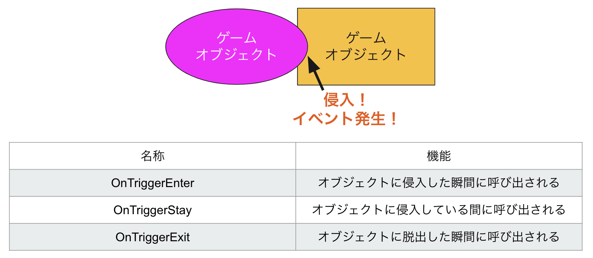

#  **OnCollision～ と OnTrigger～ **

**OnCollision**と**OnTrigger**は、Unityにおける二つの異なる当たり判定システムです。主な違いは以下の通りです。


- **OnCollision～**:  
オブジェクトが物理的に衝突した際に呼ばれるメソッド。剛体（`Rigidbody`）or`CharacterController`が必要で、物理挙動の影響を受けます。

- **OnTrigger～**:  
オブジェクトが「衝突した」としても物理的な反応（反発、停止）はなく、単に当たり判定が検知されたことを知らせるためのメソッド。通常、`Collider`の「Is Trigger」オプションを有効にして使用します。

<br>

<br>

# **OnCollision～ メソッド（物理的な衝突）**




オブジェクト同士が物理的に衝突したときに呼ばれるメソッドです。主な使用メソッドは以下です。

- **OnCollisionEnter**: 衝突が始まった瞬間に呼ばれる。
- **OnCollisionStay**: 衝突が続いている間、毎フレーム呼ばれる。
- **OnCollisionExit**: 衝突が終了したときに呼ばれる。

これらは、`Collision`クラスを通じて衝突の詳細情報を取得します。

```csharp
void OnCollisionEnter(Collision collision)
{
    // 衝突したオブジェクトの名前を出力
    Debug.Log("Collided with: " + collision.gameObject.name);
    
    // 衝突の位置や法線ベクトル
    foreach (ContactPoint contact in collision.contacts)
    {
        Debug.Log("Contact point: " + contact.point);
        Debug.Log("Contact normal: " + contact.normal);
    }
}
```

**`Collision`クラス**には以下のプロパティがあります。

- `collision.gameObject`: 衝突した相手のゲームオブジェクト。
- `collision.contacts`: 衝突点情報の配列（`ContactPoint[]`）。衝突の位置や面の法線ベクトルを取得。
- `collision.relativeVelocity`: 衝突した際の速度差を示すベクトル。


<br>

<br>

# **OnTrigger～ メソッド（トリガー検知）**



`OnTrigger～`メソッドは、衝突ではなく、当たり判定の領域に入ったか出たかを検知するためのものです。通常、`Collider`の「Is Trigger」オプションを有効にして使用します。



- **OnTriggerEnter**: トリガー領域に入った時に呼ばれる。
- **OnTriggerStay**: トリガー領域にいる間、毎フレーム呼ばれる。
- **OnTriggerExit**: トリガー領域から出た時に呼ばれる。

```csharp
void OnTriggerEnter(Collider other)
{
    // トリガーに入ったオブジェクトの名前を出力
    Debug.Log("Triggered by: " + other.gameObject.name);
}
```

**`Collider`クラス**には以下のプロパティがあります。

- `other.gameObject`: トリガー領域に入ったオブジェクト。
- `other.transform`: トリガー領域に入ったオブジェクトのトランスフォーム情報。


<br>

---

<br>

 詳しくは

[https://docs.unity3d.com/ja/2023.2/ScriptReference/GameObject.html](https://docs.unity3d.com/ja/2023.2/ScriptReference/GameObject.html)

などの公式リファレンスを参照して欲しいですが、ここでもプロパティについて触れておきます。


`GameObject` と `Transform` は Unity の基本的なクラスで、それぞれのプロパティを使うことで、オブジェクトの位置や階層構造を操作したり、オブジェクトの有効/無効状態などを制御したりすることができます。  

以下に `GameObject` と `Transform` の主要プロパティを表にまとめ、その使い方の例を示します。

<br>

---

<br>

# `GameObject` プロパティ一覧

| プロパティ名      | 型               | 説明                                                                                 | 使用例                                                 |
| ----------------- | ---------------- | ----------------------------------------------------------------------------------- | ------------------------------------------------------ |
| `name`            | `string`         | ゲームオブジェクトの名前を取得または設定                                             | `gameObject.name = "Player";`                          |
| `tag`             | `string`         | ゲームオブジェクトのタグを取得または設定                                             | `gameObject.tag = "Enemy";`                            |
| `layer`           | `int`            | ゲームオブジェクトのレイヤーを取得または設定                                         | `gameObject.layer = 8;`                                |
| `activeSelf`      | `bool`           | ゲームオブジェクトが自身で有効かどうかを取得                                         | `bool isActive = gameObject.activeSelf;`               |
| `activeInHierarchy` | `bool`         | ヒエラルキー全体で有効かどうかを取得                                                 | `bool isInHierarchy = gameObject.activeInHierarchy;`   |
| `transform`       | `Transform`      | ゲームオブジェクトの位置や回転、スケールの管理をする `Transform` コンポーネントを取得 | `gameObject.transform.position = Vector3.zero;`        |

<br>

---

<br>

### `Transform` プロパティ一覧

| プロパティ名      | 型               | 説明                                                                                 | 使用例                                                 |
| ----------------- | ---------------- | ----------------------------------------------------------------------------------- | ------------------------------------------------------ |
| `position`        | `Vector3`        | ワールド座標での位置を取得または設定                                                | `transform.position = new Vector3(0, 1, 0);`          |
| `localPosition`   | `Vector3`        | ローカル座標での位置を取得または設定                                                | `transform.localPosition = new Vector3(0, 1, 0);`     |
| `rotation`        | `Quaternion`     | ワールド座標での回転を取得または設定                                                | `transform.rotation = Quaternion.Euler(0, 90, 0);`    |
| `localRotation`   | `Quaternion`     | ローカル座標での回転を取得または設定                                                | `transform.localRotation = Quaternion.Euler(0, 90, 0);` |
| `localScale`      | `Vector3`        | ローカル座標でのスケールを取得または設定                                            | `transform.localScale = new Vector3(1, 2, 1);`        |
| `parent`          | `Transform`      | 親オブジェクトの `Transform` を取得または設定                                      | `transform.parent = otherTransform;`                  |
| `childCount`      | `int`            | 子オブジェクトの数を取得                                                            | `int count = transform.childCount;`                   |
| `up`, `right`, `forward` | `Vector3` | ワールド空間での上方向、右方向、前方向ベクトルを取得                                | `Vector3 forward = transform.forward;`               |

<br>

---

<br>

# 使用例

以下に、これらのプロパティを使ったスクリプト例。

```csharp
using UnityEngine;

public class GameObjectTransformExample : MonoBehaviour
{
    public GameObject otherObject;

    void Start()
    {
        // GameObject のプロパティの使用例
        gameObject.name = "Player";                        // 名前を設定
        gameObject.tag = "Player";                         // タグを設定
        gameObject.layer = 3;                              // レイヤーを設定
        bool isActiveSelf = gameObject.activeSelf;         // 自身の有効状態を確認
        bool isActiveInHierarchy = gameObject.activeInHierarchy; // ヒエラルキーでの有効状態を確認

        // Transform のプロパティの使用例
        transform.position = new Vector3(0, 1, 0);         // ワールド座標で位置を設定
        transform.localPosition = new Vector3(0, 1, 0);    // ローカル座標で位置を設定
        transform.rotation = Quaternion.Euler(0, 90, 0);   // ワールド座標で回転を設定
        transform.localRotation = Quaternion.Euler(0, 90, 0); // ローカル座標で回転を設定
        transform.localScale = new Vector3(1, 2, 1);       // ローカルスケールを設定

        // 親子関係の設定
        if (otherObject != null)
        {
            transform.parent = otherObject.transform;      // 他のオブジェクトを親に設定
        }

        // 子オブジェクトの数を取得
        int childCount = transform.childCount;

        // オブジェクトの方向ベクトルを取得
        Vector3 forwardDirection = transform.forward;      // 前方向ベクトル
        Vector3 upDirection = transform.up;                // 上方向ベクトル
        Vector3 rightDirection = transform.right;          // 右方向ベクトル

        Debug.Log($"GameObject Name: {gameObject.name}");
        Debug.Log($"Is Active Self: {isActiveSelf}");
        Debug.Log($"Is Active In Hierarchy: {isActiveInHierarchy}");
        Debug.Log($"Child Count: {childCount}");
        Debug.Log($"Forward Direction: {forwardDirection}");
    }
}
```

---

`GameObjectTransformExample.cs` としてUnity のオブジェクトにアタッチすることで、`GameObject` と `Transform` のプロパティを使った基本的な操作が確認できます。

このスクリプトは以下の操作を行っています。

1. `gameObject` の名前、タグ、レイヤーを設定し、有効状態を確認。
2. `transform` の位置、回転、スケール、親子関係の設定。
3. `transform` の方向ベクトルを使ってオブジェクトの向きを取得。


<br>

<br>

[`gameObject.activeInHierarchy` と `gameObject.activeSelf`の違いについて] (activeInHierarchy.md)


<br>

<br>

---

<br>

<br>