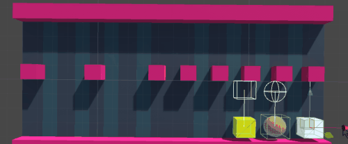
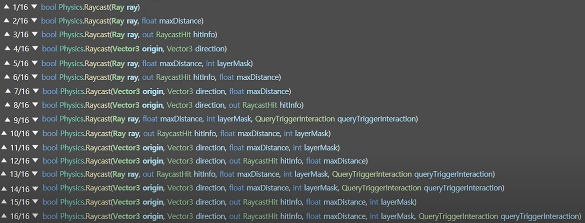

# **Physics APIを利用した当たり判定**

**Physics API**を用いて、物理エンジンに基づく詳細な当たり判定を実装することができます。Unityの`Physics`クラスには、物理エンジン関連の機能が多く提供されています。

<br>



<br>

## **Physics.Raycast**
`Raycast`は、特定の方向に向かってRay（直線）を飛ばし、その線上でオブジェクトに当たったかどうかを判定します。非常に便利で、多くのシーンで使われます（射撃、視界判定、レーザー、クリック判定など）。

基本的な`Raycast`のシグネチャは以下です。

```csharp
bool hit = Physics.Raycast(Vector3 origin, Vector3 direction, out RaycastHit hitInfo, float maxDistance);
```

- **origin**: Rayの発射地点（`Vector3`）。
- **direction**: Rayが進む方向（`Vector3`）。
- **hitInfo**: 衝突情報を格納するための`RaycastHit`構造体。
- **maxDistance**: Rayが飛ぶ最大距離（省略可能）。

<br>



<br>

## **Raycastの例**
カメラからRayを飛ばして、オブジェクトに当たったかどうかを判定するコードは以下です。

```csharp
void Update() 
{
    Ray ray = Camera.main.ScreenPointToRay(Input.mousePosition); // カメラからRayを発射
    RaycastHit hit;

    if (Physics.Raycast(ray, out hit, 100f)) // 100ユニット先までRayを飛ばす
    {
        Debug.Log("Hit object: " + hit.collider.gameObject.name); // 衝突したオブジェクト名
        Debug.Log("Hit point: " + hit.point); // 衝突位置
        Debug.Log("Hit normal: " + hit.normal); // 衝突面の法線
    }
}
```

`Physics.Raycast`は、単一のオブジェクトとの衝突を判定する場合に使いますが、**複数のオブジェクトとの衝突**を取得するには、`Physics.RaycastAll`を使います。

```csharp
RaycastHit[] hits = Physics.RaycastAll(ray, 100f);
foreach (RaycastHit hit in hits) 
{
    Debug.Log("Hit object: " + hit.collider.gameObject.name);
}
```

<br>

## **他のRaycast関連メソッド**
- **Physics.BoxCast**: 直線の代わりに、ある範囲（ボックス）を指定して当たり判定を行う。
- **Physics.SphereCast**: 球状の範囲でRaycastを行う。範囲の広い当たり判定に利用できる。

```csharp
// 球の範囲でのRaycast
if (Physics.SphereCast(transform.position, radius, transform.forward, out hit, maxDistance)) 
{
    Debug.Log("Hit object with SphereCast: " + hit.collider.gameObject.name);
}
```

#### **取得できる情報: RaycastHit 構造体**
`RaycastHit`構造体を使用することで、Rayが当たったオブジェクトの詳細情報を取得できます。

- **collider**: 衝突した`Collider`。
- **point**: Rayが衝突した位置（`Vector3`）。
- **normal**: 衝突面の法線ベクトル（`Vector3`）。
- **distance**: Rayの始点から衝突点までの距離（`float`型）。

<br>

---

<br>

# 3. **Rayの形状と取得できる情報**

**Ray**は通常、直線を使いますが、Unityでは異なる形状のRaycastも提供されています。

- **BoxCast**: ボックスの形をしたRayで、オブジェクトが衝突したかどうかを判定します。
  
  ```csharp
  if (Physics.BoxCast(transform.position, boxSize, transform.forward, out hit, transform.rotation, maxDistance))
  {
      Debug.Log("Hit object with BoxCast: " + hit.collider.gameObject.name);
  }
  ```

- **SphereCast**: 球の形をしたRayで、広範囲に対する判定が可能です。小さなオブジェクトや遠くの物体に対する判定に有効です。

  ```csharp
  if (Physics.SphereCast(transform.position, radius, transform.forward, out hit, maxDistance))
  {
      Debug.Log("Hit object with SphereCast: " + hit.collider.gameObject.name);
  }
  ```

- **CapsuleCast**: カプセル形のRayで、衝突判定を行います。キャラクターの体当たりやぶつかり具合のシミュレーションなどに適しています。

  ```csharp
  if (Physics.CapsuleCast(point1, point2, radius, transform.forward, out hit, maxDistance))
  {
      Debug.Log("Hit object with CapsuleCast: " + hit.collider.gameObject.name);
  }
  ```

