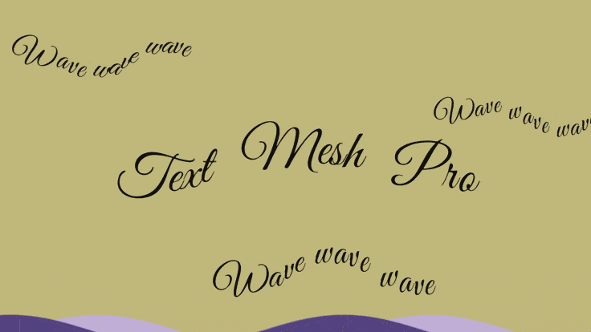
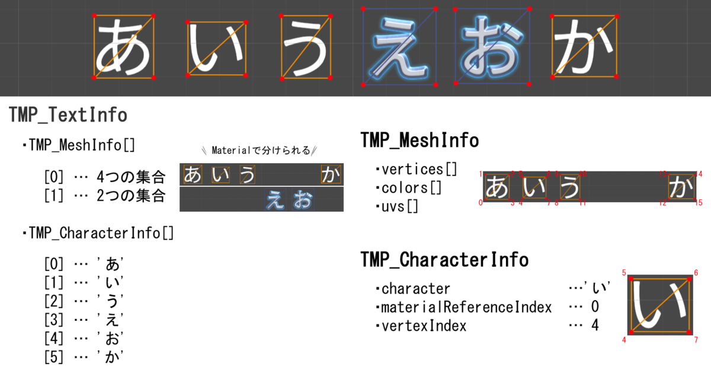
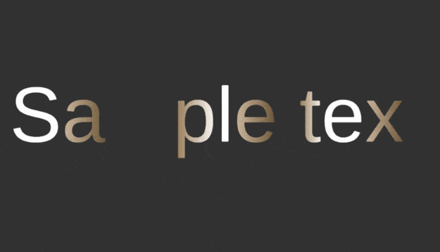
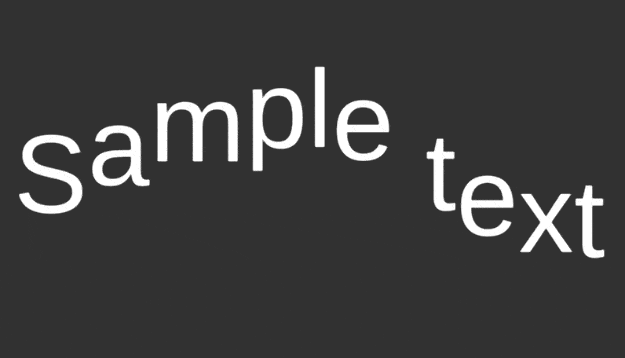

# 複雑なアニメーション

一つ一つのテキストを動かすアニメーションを作成してみましょう。
TextMesh Pro では Transformの座標を中心に四角い平面のメッシュが並んでいます。
このメッシュの4頂点の情報を書き換えることで、1文字1文字に動きを付けることが出来ます。




## ジオメトリ情報を取得する

[ジオメトリについて](TMP_1_2_ジオメトリについて.md)

TMP_Text クラス（TextMeshPro や TextMeshProUGUI クラスの継承元）には、
単語や行などのテキストに関する TMP_TextInfo を保持しており、その中に TMP_MeshInfo というメッシュの情報を持っています。
TMP_MeshInfo は頂点情報を持っており、この情報を元にメッシュを生成することができます。




## ジオメトリを変更する（頂点カラー）

色の変更例

```cs

using UnityEngine;
using TMPro;

public class TextMeshProAnimator : MonoBehaviour
{
    [SerializeField] private Gradient gradientColor;
    private TMP_Text textComponent;

    private void Update()
    {
        if (this.textComponent == null)
            this.textComponent = GetComponent<TMP_Text>();

        UpdateAnimation();
    }

    private void UpdateAnimation()
    {
        // ① メッシュを再生成する（リセット）
        this.textComponent.ForceMeshUpdate(true);
        this.textInfo = textComponent.textInfo;

        // ②頂点データを編集した配列の作成
        var count = Mathf.Min(this.textInfo.characterCount, this.textInfo.characterInfo.Length);
        for (int i = 0; i < count; i++)
        {
            var charInfo = this.textInfo.characterInfo[i];
            if (!charInfo.isVisible)
                continue;

            int materialIndex = charInfo.materialReferenceIndex;
            int vertexIndex = charInfo.vertexIndex;

            // Gradient
            Color32[] colors = textInfo.meshInfo[materialIndex].colors32;

            float timeOffset = -0.5f * i;
            float time1 = Mathf.PingPong(timeOffset + Time.realtimeSinceStartup, 1.0f);
            float time2 = Mathf.PingPong(timeOffset + Time.realtimeSinceStartup - 0.1f, 1.0f);
            colors[vertexIndex + 0] = gradientColor.Evaluate(time1); // 左下
            colors[vertexIndex + 1] = gradientColor.Evaluate(time1); // 左上
            colors[vertexIndex + 2] = gradientColor.Evaluate(time2); // 右上
            colors[vertexIndex + 3] = gradientColor.Evaluate(time2); // 右下
        }

        // ③ メッシュを更新
        for (int i = 0; i < this.textInfo.materialCount; i++)
        {
            if (this.textInfo.meshInfo[i].mesh == null) { continue; }

            this.textInfo.meshInfo[i].mesh.colors32 = this.textInfo.meshInfo[i].colors32;
            textComponent.UpdateGeometry(this.textInfo.meshInfo[i].mesh, i);
        }
    }
}

```


実行すると下記のようになります





> 1.TMP_Text.ForceMeshUpdate() でテキストからメッシュ再生成（元の状態にリセット）
> 2.TMP_MeshInfo.vertices などの情報を更新
> 3.TMP_Text.UpdateGeometry() でメッシュを更新

meshInfo.color32 の配列の中身を直接書き換えて、UpdateGeometry() で渡してメッシュを再生成しています。  
meshInfo.color32 を使うことは強引なやりかたで、ForceMeshUpdate() でメッシュを再生成しないとマズかったりします

>　・Gradient および gradientColorについて
> [SerializeField] は Unity のエディタ上でインスペクターでパラメータを調整できるようにする属性です。
> Gradient は グラデーションカラーを設定できるクラスで、Evaluate(0.0f ~ 1.0)から滑らかな色を取得できます。

<br>

<br>

---

<br>

<br>

## ジオメトリを変更する（頂点座標）


```cs

using UnityEngine;
using TMPro;

public class TextMeshProAnimator : MonoBehaviour
{
    private TMP_Text textComponent;
    private TMP_TextInfo textInfo;

    private void Update()
    {
        if (this.textComponent == null)
            this.textComponent = GetComponent<TMP_Text>();

        UpdateAnimation();
    }

    private void UpdateAnimation()
    {
        // ① メッシュを再生成する(現在のテキスト状態を取得し、メッシュをリセット)
        this.textComponent.ForceMeshUpdate(true);//true を渡すことで、すべてのメッシュデータが更新されます。
        this.textInfo = textComponent.textInfo;//テキストメッシュの詳細情報を保持する`TMP_TextInfo`を取得します。(各文字の位置や頂点データが含まれています。)


        // ②頂点データを編集した配列の作成(テキスト内の各文字について、頂点データを直接操作し、アニメーション（波状の動き）にする)
        var count = Mathf.Min(this.textInfo.characterCount, this.textInfo.characterInfo.Length);
        for (int i = 0; i < count; i++)
        {
            var charInfo = this.textInfo.characterInfo[i];//各文字の詳細情報（頂点のインデックスや位置など）を取得します。
            if (!charInfo.isVisible)//非表示の文字は処理をスキップします。
                continue;


             //頂点データの取得:
            int materialIndex = charInfo.materialReferenceIndex;//使用しているマテリアルのインデックス。
            int vertexIndex = charInfo.vertexIndex;//文字に関連付けられた頂点データの開始インデックス

            // Wave
            Vector3[] verts = textInfo.meshInfo[materialIndex].vertices;//現在の頂点データを取得。

            float sinWaveOffset = 0.5f * i;//各文字ごとに異なる位相を持たせるためのオフセット
            float sinWave = Mathf.Sin(sinWaveOffset + Time.realtimeSinceStartup * Mathf.PI);//現在の時間 (Time.realtimeSinceStartup) を使用して波状の動きを計算。

            //各頂点 (verts[vertexIndex + 0] 〜 verts[vertexIndex + 3]) に対して y 座標を変更し、波状に上下する動きを適用。
            verts[vertexIndex + 0].y += sinWave;
            verts[vertexIndex + 1].y += sinWave;
            verts[vertexIndex + 2].y += sinWave;
            verts[vertexIndex + 3].y += sinWave;

        }

        // ③ メッシュを更新(操作した頂点データを元にメッシュを更新し、画面上のテキストに反映します。)
        for (int i = 0; i < this.textInfo.materialCount; i++)
        {
            if (this.textInfo.meshInfo[i].mesh == null) { continue; }

            //変更した頂点データを現在のメッシュデータに反映。
            textInfo.meshInfo[i].mesh.vertices = textInfo.meshInfo[i].vertices; 

            //実際の描画に変更を適用。
            textComponent.UpdateGeometry(this.textInfo.meshInfo[i].mesh, i);
        }
    }
}

```


---

### **全体的な動作**
1. **頂点操作**:
   - `TMP_TextInfo` に含まれる頂点データは、各文字の4つの頂点 (四角形) を直接操作可能です。
   - アニメーションは頂点の `y` 座標を周期的に変化させることで表現。

2. **リアルタイム更新**:
   - `Update()` メソッドを使用して毎フレームアニメーションを更新。

3. **波状の動き**:
   - `Mathf.Sin` を利用して自然な波の動きを再現。
   - 位相オフセット (`0.5f * i`) により、文字ごとに波の位置をずらしています。

4. **メッシュに適用**:
   - 最後にメッシュとして表示。

---

### **応用例**
この仕組みを利用して、以下のようなアニメーションも実現可能です。
- **色の変化**: `meshInfo.colors32` を変更。
- **スケールの変化**: 各頂点の位置を拡大・縮小。
- **ランダムな動き**: `Random` を使用してノイズを追加。

実行すると下記のようになります




```cs

//#define TMPA_OUTPUT_LOG

using UnityEngine;
using TMPro;


/// <summary>
/// TextMeshPro ジオメトリアニメーション
/// <note>テキスト内容をランタイムで変更し続けるとGCを多く発生しますので、ご留意ください</note>
/// </summary>
public class TextMeshProGeometryAnimator : MonoBehaviour
{
	/// <summary>
	/// アニメーションプログレス(エディタ確認用)
	/// </summary>
	[SerializeField, Range(0.0f, 1.0f)]
	private float progress = 0.0f;

	/// <summary>
	/// Enable時に再生するかどうか
	/// </summary>
	[SerializeField]
	private bool playOnEnable = false;

	/// <summary>
	/// progressで再生するかどうか
	/// </summary>
	[SerializeField]
	private bool playByProgress = false;

	/// <summary>
	/// ループするかどうか
	/// </summary>
	[SerializeField]
	private bool isLoop = false;

	/// <summary>
	/// アニメーション中かどうか
	/// </summary>
	public bool isAnimating { get; private set; } = false;

	/// <summary>
	/// 文字送りアニメーションデータ
	/// </summary>
	[SerializeField]
	public TextMeshProGeometryAnimation animationData;


	/// <summary>TextMeshPro Textコンポーネント</summary>
	private TMP_Text textComponent = default;
	/// <summary>textComponent.textInfoのキャッシュ</summary>
	private TMP_TextInfo textInfo = default;
	/// <summary>アニメーション時間</summary>
	private float time = 0f;
	/// <summary>アニメーション最大時間</summary>
	private float maxTime = 0f;

	/// <summary>頂点座標のキャッシュ</summary>
	private Vector3[][] baseVertices = default;
	/// <summary>頂点カラーのキャッシュ</summary>
	private Color32[][] baseColors = default;
	/// <summary>頂点座標のアニメーション後</summary>
	private Vector3[][] animatedVertices = default;
	/// <summary>頂点カラーのアニメーション後</summary>
	private Color32[][] animatedColors = default;
	/// <summary>表示している文字数(のキャッシュ)</summary>
	private int characterCount = 0;


	#region Unity Events

#if UNITY_EDITOR

	private void OnValidate()
	{
		if (Application.isPlaying)
			return;

		if (this.textComponent == null)
			this.textComponent = GetComponent<TMP_Text>();

		if (this.textComponent == null)
			return;

		if (this.gameObject.activeSelf)
			OnValidateChild();
	}

	/// <summary>OnValidateの再帰メソッド</summary>
	private void OnValidateChild()
	{
		if (Application.isPlaying)
			return;

		// シーンロード後およびコンパイル直後はTextInfoが準備できていないので強制更新する
		this.textComponent.ForceMeshUpdate(true);

		if (!Refresh(true))
		{
			// ゲームプレイ終了時はTextInfoが異常値な為,遅らせて処理する
			UnityEditor.EditorApplication.delayCall += () =>
			{
				// ゲームプレイ終了時にDestroyされているケースを回避
				if (this.textComponent == null)
					return;

				OnValidateChild();
			};
		}
	}
#endif

	private void Awake()
	{
		this.textComponent = GetComponent<TMP_Text>();
		OnChangedText(textComponent);
	}

	private void OnEnable()
	{
		TMPro_EventManager.TEXT_CHANGED_EVENT.Add(OnChangedText);

		// シーンロード時はTextInfoが異常値な為,強制更新する
		this.textComponent?.ForceMeshUpdate(true);

		if (this.playOnEnable)
			Play();
		else
			Refresh(true);
	}

	private void OnDisable()
	{
		TMPro_EventManager.TEXT_CHANGED_EVENT.Remove(OnChangedText);
	}

	private void Update()
	{
		if (this.textComponent == null) { return; }
		if (!this.textComponent.isActiveAndEnabled) { return; }
		if (null == animationData) { return; }
		if (null == textInfo) { return; }

		if (this.isAnimating || this.playByProgress)
		{
			UpdateTime(this.playByProgress, Time.deltaTime);
			UpdateAnimation();

			if (this.isAnimating)
			{
				if ((this.animationData.speed > 0 && this.time >= this.maxTime) ||
					(this.animationData.speed < 0 && this.time <= 0f))
				{
					this.isAnimating = false;
					Log($"TMPA Stop: {this.textComponent.name}");
				}
			}
		}
	}

	/// <summary>
	/// TextMesh Proのtext変更時に呼び出されるメソッドです
	/// OnEnableとOnDisableにてTMPro_EventManagerに登録しています
	/// </summary>
	private void OnChangedText(Object obj)
	{
		if (obj == this.textComponent)
		{
			Log($"TMPA OnChangedText: {this.textComponent.name}");
			Refresh(this.playByProgress);
		}
	}
	#endregion


	#region For User
	/// <summary>アニメーションデータの上書き設定</summary>
	public void SetAnimation(TextMeshProGeometryAnimation animation)
	{
		this.animationData = animation;
	}

	/// <summary>再生</summary>
	public void Play()
	{
		Log($"TMPA Play: {this.textComponent.name}");
		this.isAnimating = true;
		Refresh(true);
	}

	/// <summary>強制終了</summary>
	public void Finish(float normalizedTime = 0f)
	{
		Log($"TMPA Finish: {this.textComponent.name}");
		this.isAnimating = false;
		this.time = this.maxTime * normalizedTime;
		Refresh(false);
	}
	#endregion


	#region Private Methods
	private bool Refresh(bool useProgress)
	{
		UpdateText();

		if (VerifyTextInfo())
		{
			UpdateTime(useProgress, 0f);

			// MaxVisibleCharactersに変動があった場合はForceMeshUpdateでメッシュを更新する必要がある
			if (UpdateMaxVisibleCharacters())
			{
				this.textComponent?.ForceMeshUpdate(true);
				UpdateCachedVertex(true);
			}

			UpdateAnimation();

			return true;
		}

		return false;
	}

	/// <summary>時間の更新</summary>
	private void UpdateTime(bool useProgress, float elapsedTime)
	{
		if (useProgress)
		{
			this.time = this.maxTime * this.progress;
		}
		else if (0f < this.maxTime)
		{
			if (!this.isAnimating) { return; }

			this.time += elapsedTime * this.animationData.speed;

			if (this.isLoop)
			{
				this.time += (this.time < 0f ? this.maxTime : 0f);
				this.time %= this.maxTime;
			}
			else
			{
				this.time = Mathf.Clamp(this.time, 0f, this.maxTime);
			}
		}
	}

	/// <summary> TMPro Textの情報が有効かどうか(主に開始時に異常値が発生する)</summary>
	private bool VerifyTextInfo()
	{
		if (this.textComponent == null)
			return false;

		if (!this.textComponent.isActiveAndEnabled)
			return false;

		if (this.textInfo == null)
				return false;

		if (this.textInfo.characterCount <= 0)
			return false;

		for (int i = 0; i < this.textInfo.materialCount; i++)
		{
			if (this.textInfo.meshInfo[i].vertices == null ||
				this.textInfo.meshInfo[i].colors32 == null)
				return false;
		}

		return true;
	}

	/// <summary> TMPro Textの情報更新</summary>
	private void UpdateText()
	{
		this.textInfo = this.textComponent.textInfo;

		if (this.textInfo == null)
			return;

		// 各アニメーション要素で、一番時間がかかるものを最大時間として計算
		this.maxTime = Mathf.Max(
			CalcAnimationTotalTime(this.textInfo.characterCount, this.animationData.position),
			CalcAnimationTotalTime(this.textInfo.characterCount, this.animationData.rotation),
			CalcAnimationTotalTime(this.textInfo.characterCount, this.animationData.scale),
			CalcAnimationTotalTime(this.textInfo.characterCount, this.animationData.alpha),
			CalcAnimationTotalTime(this.textInfo.characterCount, this.animationData.color),
			CalcAnimationTotalTime(this.textInfo.characterCount, this.animationData.positionNoise),
			CalcAnimationTotalTime(this.textInfo.characterCount, this.animationData.rotationNoise),
			CalcAnimationTotalTime(this.textInfo.characterCount, this.animationData.scaleNoise),
			CalcAnimationTotalTime(this.textInfo.characterCount, this.animationData.alphaNoise),
			CalcAnimationTotalTime(this.textInfo.characterCount, this.animationData.colorNoise)
		);
	}

	/// <summary>頂点データのキャッシュ </summary>
	/// <returns>成功判定(失敗時は異常なTextInfoである, 主に開始時に発生)</returns>
	private bool UpdateCachedVertex(bool forceCopy)
	{
		if (this.textInfo == null)
			return false;

		// 頂点キャッシュの確保
		if (this.baseVertices == null)
			this.baseVertices = new Vector3[this.textInfo.materialCount][];

		if (this.baseColors == null)
			this.baseColors = new Color32[this.textInfo.materialCount][];

		if (this.animatedVertices == null)
			this.animatedVertices = new Vector3[this.textInfo.materialCount][];

		if (this.animatedColors == null)
			this.animatedColors = new Color32[this.textInfo.materialCount][];

		// 頂点キャッシュの内容更新
		for (int i = 0; i < this.textInfo.materialCount; i++)
		{
			TMP_MeshInfo meshInfo = this.textInfo.meshInfo[i];

			if (meshInfo.vertices == null || meshInfo.colors32 == null)
				return false;

			// 要素数に変更があった場合は配列再確保
			if (this.animatedVertices[i] == null || this.animatedVertices[i].Length != meshInfo.vertices.Length)
				this.animatedVertices[i] = new Vector3[meshInfo.vertices.Length];

			if (this.animatedColors[i] == null || this.animatedColors[i].Length != meshInfo.colors32.Length)
				this.animatedColors[i] = new Color32[meshInfo.colors32.Length];

			// MeshInfo 内の配列がごっそり変わった場合は参照切り替え & コピー
			if (forceCopy || this.baseVertices[i] != meshInfo.vertices || this.characterCount != this.textInfo.characterCount)
			{
				this.baseVertices[i] = meshInfo.vertices;
				System.Array.Copy(meshInfo.vertices, this.animatedVertices[i], meshInfo.vertices.Length);
			}

			if (forceCopy || this.baseColors[i] != meshInfo.colors32 || this.characterCount != this.textInfo.characterCount)
			{
				this.baseColors[i] = meshInfo.colors32;
				System.Array.Copy(meshInfo.colors32, this.animatedColors[i], meshInfo.colors32.Length);
			}
		}

		return true;
	}

	/// <summary> MaxVisibleCharactersの更新</summary>
	/// <returns></returns>
	private bool UpdateMaxVisibleCharacters()
	{
		// マーカーや下線等の追加描画物はどうしても描画されてしまうので、
		// 表示最大数も合わせてアニメーションすることで対応しています。
		if (this.animationData.useMaxVisibleCharacter)
		{
			var visibleCharacters = CalcAnimationCharacterCount(time, this.animationData.alpha);
			if (this.textComponent.maxVisibleCharacters != visibleCharacters)
			{
				this.textComponent.maxVisibleCharacters = visibleCharacters;
				return true;
			}
		}

		return false;
	}

	/// <summary>TMPro Textの頂点情報の編集 </summary>
	private void UpdateAnimation()
	{
		// Wave位置(テキストの動き出し)に合わせて,MaxVisibleCharactersの最大値を更新する
		bool forceCacheCopy = UpdateMaxVisibleCharacters();

		// アニメーション用の頂点キャッシュ更新
		if (!UpdateCachedVertex(forceCacheCopy))
			return;

		// 文字数の保存
		this.characterCount = this.textInfo.characterCount;

		// 開始時等MeshInfoの生成が遅れるケースがあったため小さい数値をforに使用
		var count = Mathf.Min(this.textInfo.characterCount, this.textInfo.characterInfo.Length);
		for (int i = 0; i < count; i++)
		{
			var charInfo = this.textInfo.characterInfo[i];
			if (!charInfo.isVisible)
				continue;

			int materialIndex = this.textInfo.characterInfo[i].materialReferenceIndex;
			int vertexIndex = this.textInfo.characterInfo[i].vertexIndex;

			// 姿勢アニメーション
			if (animationData.position.use || animationData.rotation.use || animationData.scale.use ||
				animationData.positionNoise.use || animationData.rotationNoise.use || animationData.scaleNoise.use)
			{
				Vector3[] verts = this.baseVertices[materialIndex];
				var vertex0 = verts[vertexIndex];
				var vertex1 = verts[vertexIndex + 1];
				var vertex2 = verts[vertexIndex + 2];
				var vertex3 = verts[vertexIndex + 3];

				if (animationData.position.use)
				{
					float ratio = animationData.position.curve.Evaluate(CalcAnimationTime(time, i, animationData.position));
					var delta = Vector3.LerpUnclamped(animationData.position.from, animationData.position.to, ratio);
					vertex0 += delta;
					vertex1 += delta;
					vertex2 += delta;
					vertex3 += delta;
				}

				if (animationData.rotation.use)
				{
					float ratio = animationData.rotation.curve.Evaluate(CalcAnimationTime(time, i, animationData.rotation));
					var delta = Vector3.LerpUnclamped(animationData.rotation.from, animationData.rotation.to, ratio);
					var center = Vector3.Scale(vertex2 - vertex0, animationData.pivot) + vertex0;
					var matrix = Matrix4x4.Rotate(Quaternion.Euler(delta));
					vertex0 = matrix.MultiplyPoint(vertex0 - center) + center;
					vertex1 = matrix.MultiplyPoint(vertex1 - center) + center;
					vertex2 = matrix.MultiplyPoint(vertex2 - center) + center;
					vertex3 = matrix.MultiplyPoint(vertex3 - center) + center;
				}

				if (animationData.scale.use)
				{
					float ratio = animationData.scale.curve.Evaluate(CalcAnimationTime(time, i, animationData.scale));
					var delta = Vector3.LerpUnclamped(animationData.scale.from, animationData.scale.to, ratio);
					var center = Vector3.Scale(vertex2 - vertex0, animationData.pivot) + vertex0;
					vertex0 = Vector3.Scale(vertex0 - center, delta) + center;
					vertex1 = Vector3.Scale(vertex1 - center, delta) + center;
					vertex2 = Vector3.Scale(vertex2 - center, delta) + center;
					vertex3 = Vector3.Scale(vertex3 - center, delta) + center;
				}

				if (animationData.positionNoise.use)
				{
					var tex = animationData.positionNoise.noiseTexture;
					var uv = new Vector2(i / (float)count, 0.0f) * animationData.positionNoise.tiling + animationData.positionNoise.offset;
					uv = uv + animationData.positionNoise.speed * Time.timeSinceLevelLoad;
					var noise = tex.GetPixel(Mathf.FloorToInt(uv.x % 1.0f * tex.width), Mathf.FloorToInt(uv.y % 1.0f * tex.height));

					float ratio = animationData.positionNoise.curve.Evaluate(CalcAnimationTime(time, i, animationData.positionNoise));
					var delta = new Vector3(noise.r, noise.g, noise.b) * 2.0f - Vector3.one;
					delta = delta * ratio;
					vertex0 += delta;
					vertex1 += delta;
					vertex2 += delta;
					vertex3 += delta;
				}

				if (animationData.rotationNoise.use)
				{
					var tex = animationData.rotationNoise.noiseTexture;
					var uv = new Vector2(i / (float)count, 0.0f) * animationData.rotationNoise.tiling + animationData.rotationNoise.offset;
					uv = uv + animationData.rotationNoise.speed * Time.timeSinceLevelLoad;
					var noise = tex.GetPixel(Mathf.FloorToInt(uv.x % 1.0f * tex.width), Mathf.FloorToInt(uv.y % 1.0f * tex.height));

					float ratio = animationData.rotationNoise.curve.Evaluate(CalcAnimationTime(time, i, animationData.rotationNoise));
					var delta = new Vector3(noise.r, noise.g, noise.b) * 2.0f - Vector3.one;
					var center = Vector3.Scale(vertex2 - vertex0, animationData.pivot) + vertex0;
					var matrix = Matrix4x4.Rotate(Quaternion.Euler(delta * ratio));
					vertex0 = matrix.MultiplyPoint(vertex0 - center) + center;
					vertex1 = matrix.MultiplyPoint(vertex1 - center) + center;
					vertex2 = matrix.MultiplyPoint(vertex2 - center) + center;
					vertex3 = matrix.MultiplyPoint(vertex3 - center) + center;
				}

				if (animationData.scaleNoise.use)
				{
					var tex = animationData.scaleNoise.noiseTexture;
					var uv = new Vector2(i / (float)count, 0.0f) * animationData.scaleNoise.tiling + animationData.scaleNoise.offset;
					uv = uv + animationData.scaleNoise.speed * Time.timeSinceLevelLoad;
					var noise = tex.GetPixel(Mathf.FloorToInt(uv.x % 1.0f * tex.width), Mathf.FloorToInt(uv.y % 1.0f * tex.height));

					float ratio = animationData.scaleNoise.curve.Evaluate(CalcAnimationTime(time, i, animationData.scaleNoise));
					var delta = Vector3.one + (new Vector3(noise.r, noise.g, noise.b) * 2.0f - Vector3.one) * ratio;
					var center = Vector3.Scale(vertex2 - vertex0, animationData.pivot) + vertex0;
					vertex0 = Vector3.Scale(vertex0 - center, delta) + center;
					vertex1 = Vector3.Scale(vertex1 - center, delta) + center;
					vertex2 = Vector3.Scale(vertex2 - center, delta) + center;
					vertex3 = Vector3.Scale(vertex3 - center, delta) + center;
				}

				Vector3[] animatedVerts = this.animatedVertices[materialIndex];
				animatedVerts[vertexIndex] = vertex0;
				animatedVerts[vertexIndex + 1] = vertex1;
				animatedVerts[vertexIndex + 2] = vertex2;
				animatedVerts[vertexIndex + 3] = vertex3;
			}

			// 色アニメーション
			if (animationData.color.use || animationData.alpha.use || animationData.colorNoise.use || animationData.alphaNoise.use)
			{
				Color32[] colors = this.baseColors[materialIndex];
				var color0 = colors[vertexIndex];
				var color1 = colors[vertexIndex + 1];
				var color2 = colors[vertexIndex + 2];
				var color3 = colors[vertexIndex + 3];

				if (animationData.color.use)
				{
					float ratio = animationData.color.curve.Evaluate(CalcAnimationTime(time, i, animationData.color));
					color0 = animationData.color.gradient.Evaluate(ratio);
					color1 = color2 = color3 = color0;
				}

				if (animationData.colorNoise.use)
				{
					var tex = animationData.colorNoise.noiseTexture;
					var uv = new Vector2(i / (float)count, 0.0f) * animationData.colorNoise.tiling + animationData.colorNoise.offset;
					uv = uv + animationData.colorNoise.speed * Time.timeSinceLevelLoad;
					var noise = tex.GetPixel(Mathf.FloorToInt(uv.x % 1.0f * tex.width), Mathf.FloorToInt(uv.y % 1.0f * tex.height));

					float ratio = animationData.colorNoise.curve.Evaluate(CalcAnimationTime(time, i, animationData.colorNoise));
					color0 = color0 + (noise * 2.0f - Color.white) * ratio;
					color1 = color2 = color3 = color0;
				}

				if (animationData.alpha.use)
				{
					float ratio = animationData.alpha.curve.Evaluate(CalcAnimationTime(time, i, animationData.alpha));
					float alpha = Mathf.Lerp(animationData.alpha.from, animationData.alpha.to, ratio);
					color0.a = (byte)(color0.a * Mathf.Clamp01(alpha));
					color1.a = color2.a = color3.a = color0.a;
				}

				if (animationData.alphaNoise.use)
				{
					var tex = animationData.alphaNoise.noiseTexture;
					var uv = new Vector2(i / (float)count, 0.0f) * animationData.alphaNoise.tiling + animationData.alphaNoise.offset;
					uv = uv + animationData.alphaNoise.speed * Time.timeSinceLevelLoad;
					var noise = tex.GetPixel(Mathf.FloorToInt(uv.x % 1.0f * tex.width), Mathf.FloorToInt(uv.y % 1.0f * tex.height));

					float ratio = animationData.alphaNoise.curve.Evaluate(CalcAnimationTime(time, i, animationData.alphaNoise));
					color0.a = (byte)(color0.a - byte.MaxValue * noise.r * ratio);
					color1.a = color2.a = color3.a = color0.a;
				}

				Color32[] animatedColors = this.animatedColors[materialIndex];
				animatedColors[vertexIndex] = color0;
				animatedColors[vertexIndex + 1] = color1;
				animatedColors[vertexIndex + 2] = color2;
				animatedColors[vertexIndex + 3] = color3;
			}
		}

		// 表示しているマテリアルの数だけ頂点を更新します
		// <Material>や<Font>でロードした情報はmeshInfoにキャッシュされていることに注意が必要です
		for (int i = 0; i < textInfo.materialCount; i++)
		{
#if UNITY_EDITOR
			// OnValidateにてMeshの生成が遅れるケースがあったためNullチェック
			if (textInfo.meshInfo[i].mesh == null) { continue; }
#endif
			textInfo.meshInfo[i].mesh.vertices = this.animatedVertices[i];
			textInfo.meshInfo[i].mesh.colors32 = this.animatedColors[i];
			textComponent.UpdateGeometry(textInfo.meshInfo[i].mesh, i);
		}
	}

	/// <summary>文字送りアニメーションデータの要素の最大時間を算出</summary>
	static private float CalcAnimationTotalTime(int characterCount, TextMeshProGeometryAnimation.ItemBase item)
	{
		if (characterCount <= 0) { return 0.0f; }
		if (item == null) { return 0.0f; }
		if (!item.use) { return 0.0f; }
		return item.delay + (characterCount - 1) * item.wave + item.time;
	}

	/// <summary> 文字送りアニメーションデータの要素の特定文字の相対時間を算出</summary>
	static private float CalcAnimationTime(float time, int characterIndex, TextMeshProGeometryAnimation.ItemBase item)
	{
		if (time < item.delay) { return 0.0f; }
		if (item.time <= 0.0f) { return 1.0f; }
		return Mathf.Clamp01(((time - item.delay) - (characterIndex * item.wave)) / item.time);
	}

	/// <summary>文字送りアニメーションデータの要素と絶対時間から何文字目までWaveしているか算出</summary>
	static private int CalcAnimationCharacterCount(float time, TextMeshProGeometryAnimation.ItemBase item)
	{
		if (item.wave <= 0.0f) { return int.MaxValue; }
		return (int)((time - item.delay) / item.wave) + 1;
	}

	[System.Diagnostics.Conditional("TMPA_OUTPUT_LOG")]
	static private void Log(string str)
	{
#if TMPA_OUTPUT_LOG
		Debug.Log(str);
#endif
	}
	#endregion
}

```


 **TextMeshPro** を使用してテキストにジオメトリベースのアニメーション効果を適用するためのクラスです。
---

### **全体の概要**
- **目的**:   
`TextMeshPro` コンポーネントを利用して、文字ごとの移動、回転、スケール、透明度などのアニメーションを提供します。

- **仕組み**: 
  - TextMeshProのメッシュデータ（頂点、色など）を操作し、テキストのジオメトリを変化させます。
  - アニメーションデータ (`TextMeshProGeometryAnimation`) に基づいて動作します。

---

### **主なプロパティ**
- **`progress`**:   
アニメーション進行度を [0.0, 1.0] の範囲で管理します。エディタ上で進行度を確認・変更できます。

- **`playOnEnable`**:   
ゲームオブジェクトが有効化された際にアニメーションを再生するかどうか。

- **`playByProgress`**:   
`progress` プロパティでアニメーションを制御するかどうか。

- **`isLoop`**:   
アニメーションをループ再生するか。

- **`animationData`**:   
アニメーションの設定データ（例えば、移動量、速度、透明度の変化）を保持します。

---

### **Unityイベントの実装**
#### 1. **`Awake`**
- TextMeshProのコンポーネントを取得し、初期化を行います。

#### 2. **`OnEnable`**
- TextMeshProのイベントに登録し、必要であればアニメーションを再生します。
- TextMeshProのメッシュデータを強制的に更新します（表示の異常を防ぐ）。

#### 3. **`OnDisable`**
- 登録していたTextMeshProのイベントを解除します。

#### 4. **`Update`**
- 毎フレーム、アニメーションの進行を更新します。
  - アニメーションが有効 (`isAnimating`) の場合、`time` を進めてメッシュの頂点や色を更新。
  - ループ設定や終了条件もここで管理。

---

### **アニメーション制御**
#### 1. **再生 (`Play`)**
- アニメーションを開始し、メッシュを更新。

#### 2. **終了 (`Finish`)**
- アニメーションを強制的に終了し、指定の状態に進行度を設定。

#### 3. **時間更新 (`UpdateTime`)**
- アニメーションの進行時間 (`time`) を進める。ループ設定が有効な場合は時間をループさせます。

#### 4. **ジオメトリ更新 (`UpdateCachedVertex`)**
- メッシュデータ（頂点座標、頂点カラー）をキャッシュし、アニメーション後のデータを準備します。

#### 5. **表示文字数の更新 (`UpdateMaxVisibleCharacters`)**
- アニメーション中に表示する文字数を管理し、必要に応じてメッシュを再描画。

---

### **TextMeshProイベントの対応**
#### 1. **`OnChangedText`**
- TextMeshProのテキストが変更された際に呼び出されます。
- 変更内容を元にメッシュデータを再計算します。

---

### **注意点**
- **GC発生の警告**:
  - ランタイムで頻繁にテキスト内容を変更すると、Garbage Collectionが多く発生します。
  - パフォーマンスへの影響を考慮する必要があります。
- **エディタでの動作確認 (`OnValidate`)**:
  - テキストが無効な状態や初期化されていない状態を考慮し、エディタ操作時の動作を補強しています。
