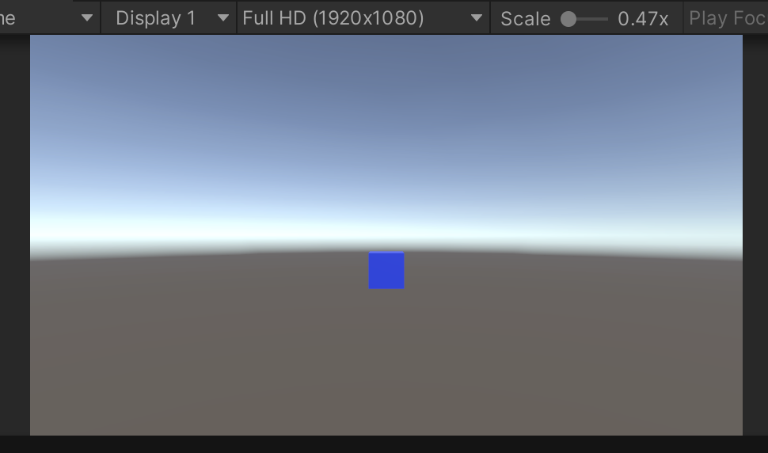
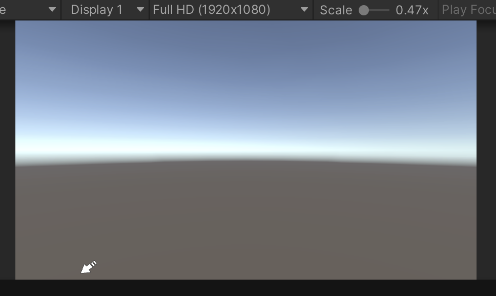

#  画面外インジケーター

ターゲット（たとえばキャラクターやオブジェクト）の位置をスクリーン上でUI（インジケーター）として表示するためのものです。

例えば画面内に配置してあるOjectを画面外に配置して場所を表示する際に使用する






このスクリプトは、ターゲットがカメラの前にあるか後ろにあるか、または画面外に出ているかを判断し、その位置に合わせてインジケーター（UI）が適切に表示されるようにします。
特に、ターゲットがカメラの後ろにある場合、インジケーターを反転させて表示し、画面外に出ないようにスケーリングして調整する処理を組み込んでいます。


<br>

# 例１　文字の表示など（回転なし）

## 1. 変数と初期化

```csharp
[SerializeField] private Transform target = default;
[SerializeField] private RectTransform textObj = default;

private Camera mainCamera;
private RectTransform rectTransform;
```

- `target`：  
インジケーターが追いかける対象（ターゲット）を設定します。  
このターゲットの位置を使ってインジケーターの位置を決定します。

- `textObj`：  
UIのインジケーター（テキストや画像など）の`RectTransform`。  
ターゲットの位置に応じてこのUIの位置が動きます。

- `mainCamera`：  
カメラを参照するための変数です。ターゲットのワールド座標をスクリーン座標に変換する際に必要です。

- `rectTransform`：  
`TargetIndicator`がアタッチされている`RectTransform`を取得します。UIの位置を制御するために使います。

`Start`メソッドで`mainCamera`にメインカメラを設定し、`rectTransform`に自分の`RectTransform`を設定しています。

<br>

## 2. `LateUpdate` メソッド

`LateUpdate`内でUIの位置を毎フレーム更新しています。このメソッドが選ばれている理由は、`LateUpdate`は`Update`が終了した後に呼ばれるため、他のオブジェクトが動いてからインジケーターを更新することができるからです。

### 2.1 キャンバススケールの取得とスクリーン座標の計算

```csharp
float canvasScale = transform.root.localScale.z;
var center = 0.5f * new Vector3(Screen.width, Screen.height,0f);

var pos = mainCamera.WorldToScreenPoint(target.position) - center;
```


- `canvasScale`：  

[キャンバスのスケール](キャンバススケール.md)を取得します。  
`transform.root.localScale.z`により親オブジェクトのスケールを取得し、スケーリングを適用します。  

- `center`：  
画面の中心座標です。  
`Screen.width`と`Screen.height`を使用してスクリーンの幅と高さを取得し、それらを半分にして中央の位置を計算します。
のちに、画面中央から見た時の端の座標として使ってる

- `pos`：  
ターゲットのワールド座標をスクリーン座標に変換し、画面の中心からの相対位置に変更します。  
これで、ターゲットの位置が画面中央を基準に調整されます。
画面中心を基準とした相対座標に変換されます。

<br>

### 2.2 ターゲットがカメラの後ろにある場合

```csharp
if (pos.z < 0f) {
    pos.x = -pos.x;
    pos.y = -pos.y;

    if (Mathf.Approximately(pos.y, 0f)) {
        pos.y = -center.y;
    }
}
```

- `pos.z < 0f`：  
ターゲットがカメラの後ろにある場合、`pos.z`は負の値になります。  
この場合、ターゲットの位置を反転させる処理が行われます。

- `pos.x`と`pos.y`を反転させることで、ターゲットがカメラの後ろにいる場合にインジケーターが画面の反対側に表示されます。

- `Mathf.Approximately(pos.y, 0f)`：  
ターゲットのy座標が0に非常に近い場合（画面中央）に、`pos.y`を強制的に反転して中央に配置します。

[Mathf.Approximatelyについて](Mathf_Approximately.md)

<br>

### 2.3 ターゲットが画面外にある場合のスケーリング

```csharp
var halfSize = 0.5f * canvasScale * rectTransform.sizeDelta;
float d = Mathf.Max(
    Mathf.Abs(pos.x / (center.x - halfSize.x)),
    Mathf.Abs(pos.y / (center.y - halfSize.y))
);
```

<details><summary><font color = blue>詳細</font></summary>
この部分は、UI要素（インジケータ）が画面内でどれくらい大きな比率で外側に近づいているかを計算する処理です。

---


1. **`canvasScale`**
   - UI要素のスケールを計算するために必要な値です。
   - キャンバス全体のスケール値で、UI座標とスクリーン座標の換算に利用されます。

2. **`rectTransform.sizeDelta`**
   - UI要素（インジケータ）の幅と高さを表します（ローカル座標系でのサイズ）。

3. **`center`**
   - スクリーンの中心座標（`Screen.width / 2, Screen.height / 2`）をベースにした値です。

4. **`Mathf.Max`**
   - 引数の中で最も大きい値を返します。  
     この場合、画面の幅方向か高さ方向で、インジケータがどれくらい外側にあるかを計算しています。

---

### **コードの詳細**

#### **1. `halfSize` の計算**

```csharp
var halfSize = 0.5f * canvasScale * rectTransform.sizeDelta;
```

- `rectTransform.sizeDelta` は UI要素のサイズ（幅と高さ）をピクセル単位で表した `Vector2`。
- `canvasScale` を掛けることで、現在のスケールに基づいたサイズに変換します。
- 最後に `0.5f` を掛けることで、UI要素の幅と高さの **半分のサイズ** を計算しています。
  - これは **UI要素の中心から端までの距離** を求めるためです。

---

#### **2. `d` の計算**

```csharp
float d = Mathf.Max(
    Mathf.Abs(pos.x / (center.x - halfSize.x)),
    Mathf.Abs(pos.y / (center.y - halfSize.y))
);
```

- これは、インジケータの現在位置が画面の端にどれくらい近いかを計算する処理です。

##### **(a) `Mathf.Abs(pos.x / (center.x - halfSize.x))`**
- `pos.x` は、スクリーン中心を基準としたインジケータの横方向の位置。
- `(center.x - halfSize.x)` は、インジケータが画面内に完全に収まるための横方向の最大距離（中央から右端までの距離からインジケータの半分の幅を引いたもの）。
- この比率を計算することで、「インジケータが横方向で画面端にどれくらい近いか」がわかります。

##### **(b) `Mathf.Abs(pos.y / (center.y - halfSize.y))`**
- 縦方向について同様の計算を行います。
- `pos.y` はスクリーン中心を基準としたインジケータの縦方向の位置。
- `(center.y - halfSize.y)` は縦方向でインジケータが完全に収まるための最大距離。

##### **(c) `Mathf.Max(...)`**
- 横方向と縦方向のどちらか **最も大きい比率（インジケータが外側に寄っている方向）** を `d` に代入します。
  - これは、画面の端に近い方向を優先的に評価するためです。

---

### **目的**

この計算の目的は、インジケータが **画面外に出るかどうか** を判断し、場合によっては位置を調整するためです。

---

### **ポイント**

- `d` が `1` を超えると、インジケータが画面内に収まらず、**画面外に出た可能性がある**ことを示します。
- `d <= 1` の場合、インジケータはまだ画面内に収まっています。

---

### **次の処理に関係**

以下のコードで、インジケータが画面外に出た場合の位置調整をしています：

```csharp
if (isOffscreen) {
    pos.x /= d;
    pos.y /= d;
}
```

- **`pos.x` や `pos.y` を `d` で割る**ことで、インジケータを画面内に収めています。

</details>

- `halfSize`：  
インジケーターのサイズを取得し、その半分の大きさを計算します。  
このサイズを使って、インジケーターが画面外に出ないように調整します。

- `d`：  
ターゲットのスクリーン位置（`pos`）が画面の中心からどれくらい離れているかを計算します。  
これによって、ターゲットが画面外にある場合に、インジケーターの位置が端に寄るようにスケールされます。

<br>

### 2.4 画面外に出る場合の処理

```csharp
bool isOffscreen = (pos.z < 0f || d > 1f);
if (isOffscreen) {
    pos.x /= d;
    pos.y /= d;
}
```

- `isOffscreen`：ターゲットがカメラの後ろにあるか、スクリーン外に出ているかを判定します。
- 画面外に出ている場合、`pos.x`と`pos.y`を`d`で割ることで、インジケーターが画面端にぴったりくるように調整します。


<details><summary><font color = blue>`pos.x /= d;` および `pos.y /= d;`について</font></summary>
`pos.x /= d;` および `pos.y /= d;` の処理は、**インジケータ（UI要素）の位置を画面内に収めるための調整**です。

---

### **背景：`d` の役割**
- `d` は、インジケータが画面の端からどれだけ外側にあるかを示すスケール値です。
  - 例えば：
    - **`d = 1`** の場合、インジケータはちょうど画面内の端にあります。
    - **`d > 1`** の場合、インジケータは画面外にあります。
  - `d` は、横方向 (`x`) と縦方向 (`y`) のどちらかで画面端に最も近い値を基準にして計算されています。

---

### **`pos.x` と `pos.y` の役割**
- `pos` は、画面中心を基準としたスクリーン座標系でのインジケータの位置です。
  - **`pos.x`**：インジケータの横方向の位置
  - **`pos.y`**：インジケータの縦方向の位置

---

### **`pos.x /= d;` の意味**
#### **例を考えてみましょう**
1. **インジケータが画面内にある場合**
   - 例えば、`d = 1` のとき：
     ```csharp
     pos.x /= d; // pos.x はそのまま
     pos.y /= d; // pos.y はそのまま
     ```
     - 画面内に収まっているので、位置の変更は不要です。

2. **インジケータが画面外にある場合**
   - 例えば、`d = 2` のとき（インジケータが画面端からさらに2倍外に出ている）：
     ```csharp
     pos.x /= 2; // pos.x を半分にする
     pos.y /= 2; // pos.y を半分にする
     ```
     - この処理により、`pos` の位置が画面内に収まるようになります。

---

### **視覚的な例**
- **画面サイズ**：横1000px、高さ600px
- **インジケータのサイズ**：50px四方
- インジケータが画面外（`pos.x = 1200`, `pos.y = 700`）に出ている場合：
  - `d` を計算した結果が、例えば `d = 2.4`だとする。
  - `pos.x /= 2.4` → `pos.x = 500`（画面右端に収まる）。
  - `pos.y /= 2.4` → `pos.y = 291.67`（画面下端に収まる）。

この処理は、**画面外に出そうなインジケータを画面内に収めるためにスケールダウンしている**という意味を持ちます。  
結果として、インジケータは常に画面の端に固定され、プレイヤーに「目標の方向」を示し続けることができます。
</details>


<br>

### 2.5 UIの位置設定と表示

```csharp
rectTransform.anchoredPosition = pos / canvasScale;
textObj.gameObject.SetActive(true);
```

- `rectTransform.anchoredPosition`：インジケーターの位置を最終的に設定します。`pos / canvasScale`で、インジケーターの位置をキャンバスのスケールに合わせて調整します。
- `textObj.gameObject.SetActive(true)`：ターゲットが表示されている限り、インジケーターを表示するようにします。

<details><summary>rectTransform.anchoredPosition = pos / canvasScale について</font></summary>

この行のコードは、**UI要素（`RectTransform`）の位置を計算して画面上の正しい位置に配置する**ための処理です。
---

### **背景**

1. **`rectTransform.anchoredPosition`**
   - `RectTransform` のローカル座標系での位置を設定するプロパティ。
   - 親オブジェクトの中心を基準に、`(x, y)` の相対的な位置を指定します。

2. **`pos`**
   - これまでの計算によって得られた、インジケータの位置を表す座標。
   - 画面中心を基準としたスクリーン座標（ピクセル単位）で表されています。

3. **`canvasScale`**
   - キャンバスのスケール値。`transform.root.localScale.z` で取得されています。
   - UI要素のピクセル単位の座標をスケールに応じたローカル座標に変換するために使用されます。

---

### **意味と目的**

```csharp
rectTransform.anchoredPosition = pos / canvasScale;
```

- **`pos / canvasScale`**
  - スクリーン座標（ピクセル単位）を、UIキャンバスのスケール値に合わせたローカル座標に変換しています。
  - これは、キャンバスが拡大・縮小されている場合でも、UI要素が正しい位置に表示されるようにするためです。

- **`rectTransform.anchoredPosition` に代入**
  - 計算されたローカル座標を、インジケータの最終的な配置位置として適用します。
  - これにより、インジケータはスクリーン座標に基づき、正しい場所に表示されます。

---

### **具体例**

#### **前提**
- 画面サイズ：1920×1080
- キャンバスのスケール：`canvasScale = 2.0`
- 計算された `pos`：`(960, 540)`（スクリーン中心）

#### **計算の流れ**
1. `pos / canvasScale` を計算：
   - `(960 / 2.0, 540 / 2.0) = (480, 270)`

2. `rectTransform.anchoredPosition` に `(480, 270)` を設定：
   - キャンバスのスケールを考慮したローカル座標で、インジケータが表示されます。

---

### **ポイント**
- スクリーン座標（ピクセル単位）はキャンバスのスケールに依存しない絶対的な値です。
- 一方、`anchoredPosition` はキャンバス内での相対的な位置を表すので、スケールを考慮して変換する必要があります。
- **`pos / canvasScale` によってスケール変換を行い、最適なローカル座標に変換している**のが、このコードの意図です。

---

### **まとめ**
このコードの目的は、スクリーン座標（ピクセル単位）を **キャンバススケールに応じたローカル座標に変換**し、インジケータが正確な位置に表示されるようにすることです。この操作を行わないと、UIのスケール設定によって表示位置がずれてしまいます。

[ScaleWithScreenSizeについて](ScaleWithScreenSize.md)

</details>


<br>

---


<br>

---

<br>

# プログラム全体

<br>

---

<br>

```cs
using UnityEngine;
using UnityEngine.UI;

[RequireComponent(typeof(RectTransform))]
public class TargetIndicator : MonoBehaviour
{
    [SerializeField] private Transform target = default;
    [SerializeField] private RectTransform textObj = default;

    private Camera mainCamera;
    private RectTransform rectTransform;

    private void Start() {
        mainCamera    = Camera.main;
        rectTransform = GetComponent<RectTransform>();
    }

    private void LateUpdate() {
        float canvasScale = transform.root.localScale.z;
        var center = 0.5f * new Vector3(Screen.width, Screen.height);

        var pos = mainCamera.WorldToScreenPoint(target.position) - center;
        if (pos.z < 0f) {
            pos.x = -pos.x;
            pos.y = -pos.y;


            if (Mathf.Approximately(pos.y, 0f)) {
                pos.y = -center.y;
            }
        }

        var halfSize = 0.5f * canvasScale * rectTransform.sizeDelta;
        float d = Mathf.Max(
            Mathf.Abs(pos.x / (center.x - halfSize.x)),
            Mathf.Abs(pos.y / (center.y - halfSize.y))
        );

        bool isOffscreen = (pos.z < 0f || d > 1f);
        if (isOffscreen) {
            pos.x /= d;
            pos.y /= d;
        }
        rectTransform.anchoredPosition = pos / canvasScale;
        textObj.gameObject.SetActive(true);
    }
}
```


<br>

---

<br>

#例２ 　矢印の表示など（回転あり）


<br>

---

<br>

```cs
using UnityEngine;
using UnityEngine.UI;

[RequireComponent(typeof(RectTransform))]
public class TargetIndicator : MonoBehaviour
{
    [SerializeField] private Transform target = default;
    [SerializeField] private Image arrow = default;

    private Camera mainCamera;
    private RectTransform rectTransform;

    private void Start() {
        mainCamera = Camera.main;
        rectTransform = GetComponent<RectTransform>();
    }

    private void LateUpdate() {
        float canvasScale = transform.root.localScale.z;
        var center = 0.5f * new Vector3(Screen.width, Screen.height);

        var pos = mainCamera.WorldToScreenPoint(target.position) - center;
        if (pos.z < 0f) {
            pos.x = -pos.x;
            pos.y = -pos.y;


            if (Mathf.Approximately(pos.y, 0f)) {
                pos.y = -center.y;
            }
        }

        var halfSize = 0.5f * canvasScale * rectTransform.sizeDelta;
        float d = Mathf.Max(
            Mathf.Abs(pos.x / (center.x - halfSize.x)),
            Mathf.Abs(pos.y / (center.y - halfSize.y))
        );

        bool isOffscreen = (pos.z < 0f || d > 1f);
        if (isOffscreen) {
            pos.x /= d;
            pos.y /= d;
        }
        rectTransform.anchoredPosition = pos / canvasScale;

        arrow.enabled = isOffscreen;
        if (isOffscreen) {
             arrow.rectTransform.eulerAngles = new Vector3(
                 0f, 0f,
                 Mathf.Atan2(pos.y, pos.x) * Mathf.Rad2Deg
             );
         }
    }
}
```


