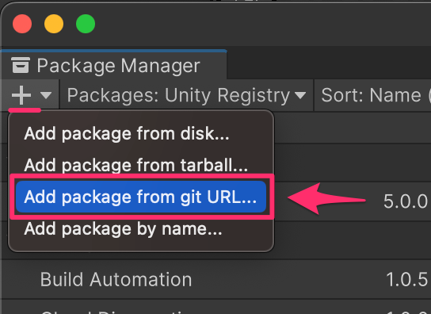
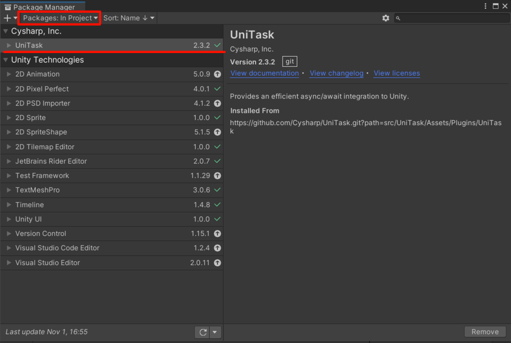

# UniTask導入

1. Window > Package Manager からPackage Managerウィンドウを開きます。


<br>


2. Package Managerウィンドウの左上の「+」ボタンをクリックして、 Add package from git URL を選択します。



<br>

3. 入力フォームが表示されるので、次のURLを入力します。

```
https://github.com/Cysharp/UniTask.git?path=src/UniTask/Assets/Plugins/UniTask
```


<br>

4. 入力が終わったら 「Add」ボタンをクリック。するとUniTaskはインストールされます。



<br>