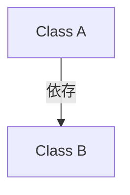
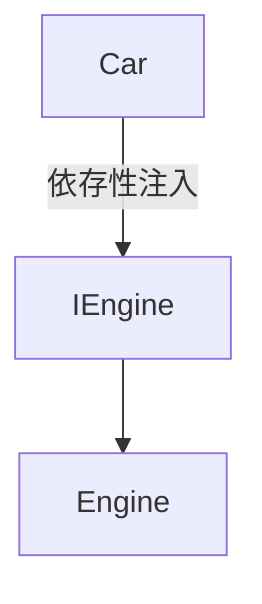

# 依存について

**依存（Dependency）**とは、あるクラスやモジュールが他のクラスやモジュールに対して依存している状態を指します。  
依存関係があると、あるコンポーネントが機能するためには他のコンポーネントが必要であることを意味します。

<br>

例えば、クラスAがクラスBのインスタンスを使って処理を行う場合、クラスAはクラスBに依存していると言います。これにより、クラスAの機能がクラスBの実装に依存することになります。

## 依存の概念の図



ここで、**Class A** が **Class B** に依存していることを示しています。つまり、**Class A** の動作が **Class B** によって支えられているということです。

<br>

## 依存関係の例

#### 依存あり

```cs
public class Engine {
    public void Start() {
        // エンジンのスタート処理
    }
}

public class Car {
    private Engine engine;

    public Car() {
        engine = new Engine(); // 依存を直接インスタンス化
    }

    public void Drive() {
        engine.Start(); // エンジンを使う
    }
}
```

この例では、`Car` クラスが `Engine` クラスに依存しています。  
`Car` のコンストラクターで `Engine` のインスタンスが直接作成され、`Drive` メソッドで `Engine` の `Start` メソッドが呼ばれています。

<br>

## 依存の問題

- **テストの困難さ**:   
依存関係が強いと、ユニットテストが難しくなります。  
たとえば、`Car` クラスのテストを行う際、`Engine` クラスの実装に依存してしまうため、テストが複雑になりえます。
- **柔軟性の欠如**:  
 直接依存すると、`Car` クラスの変更が `Engine` クラスに影響を与える可能性があります。クラス間の結合度が高くなります。

<br>

## 依存性の注入（DI）とは

**依存性の注入（Dependency Injection, DI）**は、コンポーネントの依存関係を外部から注入することで、依存関係を解決する方法です。    
DIにより、依存関係を直接コード内で作成するのではなく、外部のコンテナやファクトリーを使用して注入します。  
これにより、依存関係の管理が簡単になり、テストや保守がしやすくなります。

### DIコンテナを使用する例

```cs
public class Engine {
    public void Start() {
        // エンジンのスタート処理
    }
}

public interface IEngine {
    void Start();
}

public class Car {
    private readonly IEngine engine;

    // コンストラクターで依存性を注入
    public Car(IEngine engine) {
        this.engine = engine;
    }

    public void Drive() {
        engine.Start(); // 注入されたエンジンを使用
    }
}
```

上記の例では、`Car` クラスは `IEngine` インターフェースに依存しており、`Engine` クラスの実装は外部から注入されます。これにより、`Car` クラスの依存関係が緩くなり、テストや拡張が容易になります。

### 依存性の注入の図示



- **Car** が **IEngine** に依存し、**IEngine** を通じて **Engine** の実装が提供されます。
- **Car** は **IEngine** インターフェースに依存しており、具体的な実装（**Engine**）は外部から注入されます。

### まとめ

依存関係は、クラスやモジュール間の関係を示し、DIはこれらの依存関係を管理する方法です。DIコンテナを使用することで、依存関係の管理が効率的になり、コードのテスト、保守性、拡張性が向上します。


<br>


<br>


<br>


**DI（Dependency Injection）コンテナ**を利用する方法は、MVPやMVCなどのパターンにおいても非常に有効です。DIコンテナを使うことで、依存性の管理が容易になり、コードの再利用性やテストのしやすさが向上します。

## DI（Dependency Injection）の概要

**依存性注入（DI: Dependency Injection）**は、クラスが必要とする他のクラス（依存するクラス）を外部から注入する設計パターンです。DIを使うことで、オブジェクトの依存関係を明確にし、柔軟なコードの設計が可能になります。

**DIコンテナ**は、依存性を自動的に管理・解決してくれるフレームワークです。Unityや他のフレームワークで使われる一般的なDIコンテナとしては、ZenjectやAutofacなどがあります。

## UnityにおけるDIコンテナの活用方法

UnityのプロジェクトでMVPやMVCを設計する際、DIコンテナを使用することで以下のメリットがあります。

1. **依存関係の明確化**: オブジェクトの依存関係がコード内で明確になる。
2. **疎結合な設計**: クラス間の結びつきを緩くし、異なる実装を容易に切り替えられる。
3. **テストのしやすさ**: モックやスタブを使ったユニットテストが簡単になる。

## DIコンテナを利用したMVPの例

以下は、UnityでZenjectを使ってMVPパターンを実装する例です。

### 1. **インターフェースと実装の定義**

```cs
public interface IGameModel {
    int Score { get; set; }
    void IncreaseScore();
}

public class GameModel : IGameModel {
    public int Score { get; set; } = 0;

    public void IncreaseScore() {
        Score++;
    }
}
```

### 2. **Viewの定義**

```cs
public interface IGameView {
    void UpdateScore(int score);
}

public class GameView : MonoBehaviour, IGameView {
    public Text scoreText;

    public void UpdateScore(int score) {
        scoreText.text = "Score: " + score.ToString();
    }
}
```

### 3. **Presenterの定義**

```cs
public class GamePresenter {
    private readonly IGameModel model;
    private readonly IGameView view;

    public GamePresenter(IGameModel model, IGameView view) {
        this.model = model;
        this.view = view;
    }

    public void OnScoreButtonPressed() {
        model.IncreaseScore();
        view.UpdateScore(model.Score);
    }
}
```

### 4. **Zenjectを使った依存性の注入**

Zenjectを使って、`GameModel` と `GamePresenter` を `GameView` に注入します。

```cs
using Zenject;

public class GameInstaller : MonoInstaller {
    public override void InstallBindings() {
        Container.Bind<IGameModel>().To<GameModel>().AsSingle();
        Container.Bind<GamePresenter>().AsTransient();
    }
}
```

### 5. **GameViewでPresenterの利用**

`GameView` でPresenterを利用します。

```cs
using Zenject;

public class GameView : MonoBehaviour, IGameView {
    public Text scoreText;
    private GamePresenter presenter;

    [Inject]
    public void Construct(GamePresenter presenter) {
        this.presenter = presenter;
    }

    public void OnScoreButtonClicked() {
        presenter.OnScoreButtonPressed();
    }

    public void UpdateScore(int score) {
        scoreText.text = "Score: " + score.ToString();
    }
}
```

### 利点

- **依存関係の自動管理**: `GameModel` や `GamePresenter` を手動で生成することなく、DIコンテナがそれらを自動的にインジェクトするため、コードの可読性が向上し、バグが減ります。
- **テストの容易さ**: 例えば、`GameModel` のモックを作成して `GamePresenter` に注入し、ユニットテストを容易に行うことができます。
- **柔軟性の向上**: 依存するクラスを簡単に切り替えることができ、異なる実装に差し替えやすい設計が可能です。

### 欠点

- **学習コスト**: DIコンテナや依存性注入の概念に慣れていないと、最初は難しいと感じるかもしれません。
- **過剰設計のリスク**: 小規模なプロジェクトではDIコンテナを導入することで、かえって複雑化することもあります。

### 結論

MVPやMVCといった設計パターンにDIコンテナを組み合わせることで、依存関係の管理がシンプルになり、コードのメンテナンスや拡張が容易になります。特に、テストや変更に強い設計をしたい場合には、DIコンテナの導入が非常に有効です。
