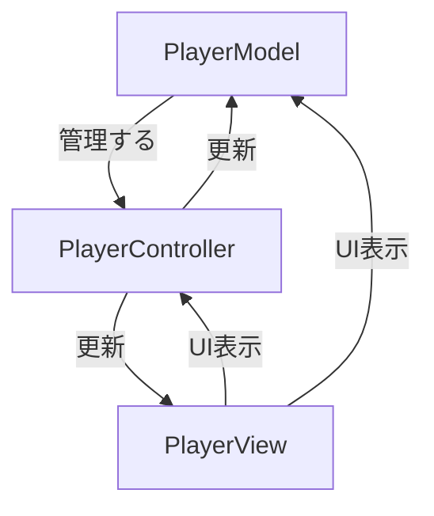

### MVCパターンとは？

**MVC (Model-View-Controller)** は、アプリケーションの構造を3つの主要なコンポーネントに分割する設計パターンで、特にWeb開発やデスクトップアプリケーションなどでよく使われます。このパターンを使うことで、アプリケーションのコードが整理され、保守性や再利用性が向上します。

### MVCの3つの主要なコンポーネント

1. **Model（モデル）**  
   - **役割**: データやビジネスロジックを扱う部分。データベースとの通信や、アプリケーション内でのデータの保存や処理を行う。
   - **例**: ユーザー情報の保存や取得、データの整形や計算。
   
2. **View（ビュー）**  
   - **役割**: ユーザーに表示するUI部分。Modelから受け取ったデータを元に、画面に情報を描画するが、ビジネスロジックやデータ処理には関与しない。
   - **例**: HTMLやテンプレートエンジンを使用したユーザーインターフェースの描画、ボタンやテキストボックスなどのUI要素。

3. **Controller（コントローラー）**  
   - **役割**: ModelとViewを結びつけ、アプリケーションの動作を制御する。ユーザーからの入力（クリックやキー入力）を受け取り、Modelに指示を与えたり、Viewを更新する役割を担う。
   - **例**: ユーザーがフォームを送信したときにデータをModelに渡し、その結果に応じて画面を更新。

### MVCのフロー

1. **ユーザーのアクション**（例えば、ボタンをクリック） → **Controller** に通知。
2. **Controller** が **Model** を使ってデータを処理（データの取得、計算など）。
3. **Model** から処理結果を受け取った **Controller** は **View** を更新。
4. **View** がユーザーに更新された情報を表示。

### MVCの利点

- **コードの分離**: ビジネスロジック（Model）、ユーザーインターフェース（View）、制御ロジック（Controller）が明確に分かれているため、各コンポーネントを独立して変更やテストがしやすい。
- **再利用性**: ViewはUIの部分に専念し、Modelはデータやビジネスロジックに集中するため、コードの再利用がしやすい。
- **保守性向上**: 各コンポーネントが独立しているため、アプリケーションが大規模になっても保守が容易。

### MVCの使用例（Unityの場合）

Unityでも、MVCの考え方を使ってコードを整理することができます。

#### 例：簡単なキャラクターのHP管理

**Model（データの管理）**
```cs
public class PlayerModel {
    public int Health { get; set; }

    public PlayerModel() {
        Health = 100; // 初期HPを100に設定
    }

    public void TakeDamage(int damage) {
        Health -= damage;
        if (Health < 0) Health = 0;
    }
}
```

**View（UIの表示）**
```cs
public class PlayerView : MonoBehaviour {
    public Text healthText;

    public void UpdateHealth(int health) {
        healthText.text = "Health: " + health.ToString();
    }
}
```

**Controller（動作の制御）**
```cs
public class PlayerController : MonoBehaviour {
    private PlayerModel playerModel;
    private PlayerView playerView;

    void Start() {
        playerModel = new PlayerModel();
        playerView = FindObjectOfType<PlayerView>();
        UpdateView();
    }

    void UpdateView() {
        playerView.UpdateHealth(playerModel.Health);
    }

    public void TakeDamage(int damage) {
        playerModel.TakeDamage(damage);
        UpdateView();
    }
}
```

### MVCの利点と欠点

#### **利点**:
- **責任分担が明確**: 各コンポーネントが特定の役割に専念するため、変更やテストがしやすくなります。
- **再利用性が高い**: ViewやModelは独立しているため、別のアプリケーションでも再利用可能です。

#### **欠点**:
- **複雑な構造**: 小さなアプリケーションでは、コンポーネントを分けることで、かえってコードが複雑化する可能性があります。
- **Controllerの肥大化**: 多くのロジックがControllerに集中しすぎると、Controllerが肥大化しやすいという問題があります。

### まとめ

MVCは、アプリケーションをしっかりと整理し、保守性とテスト性を高めるための設計パターンです。ViewとModelの間のロジックをControllerが担当することで、UIとビジネスロジックを分離し、変更が容易になります。


<br>


<br>

以下は、MVCパターンを用いたUnityプロジェクトの`Model`、`View`、`Controller`の関係を示した図です。これにより、それぞれのコンポーネントがどのように相互作用するかが視覚的に理解しやすくなります。

### MVCパターンの図示



### 説明

1. **Model**:
   - **PlayerModel**: プレイヤーのデータ（HPなど）を管理します。
   - メソッドとして`TakeDamage`を持ち、ダメージを受けた際にHPを減少させます。

2. **View**:
   - **PlayerView**: UIの表示を担当します。プレイヤーのHPを`Text`コンポーネントに表示します。
   - メソッドとして`UpdateHealth`を持ち、HPの表示を更新します。

3. **Controller**:
   - **PlayerController**: モデルとビューの間のやり取りを制御します。`Start`メソッドで`PlayerModel`と`PlayerView`を初期化し、`UpdateView`メソッドでビューを更新します。
   - メソッドとして`TakeDamage`を持ち、プレイヤーがダメージを受けた際にモデルを更新し、その結果をビューに反映させます。

### 詳細

- **PlayerModel**はデータの管理を行い、`Health`プロパティを持ちます。HPの初期値は100で、`TakeDamage`メソッドでHPが減少します。
- **PlayerView**はUIを表示する役割を担い、`healthText`にプレイヤーのHPを表示します。`UpdateHealth`メソッドでHPの表示を更新します。
- **PlayerController**は`PlayerModel`と`PlayerView`を結びつける役割を果たします。`Start`メソッドで初期化を行い、`UpdateView`メソッドでビューを更新します。`TakeDamage`メソッドでモデルを更新し、その結果をビューに反映させます。

この図と説明を参考に、MVPパターンの基本的な構造とそれぞれのコンポーネントの役割を理解するのに役立ててください。