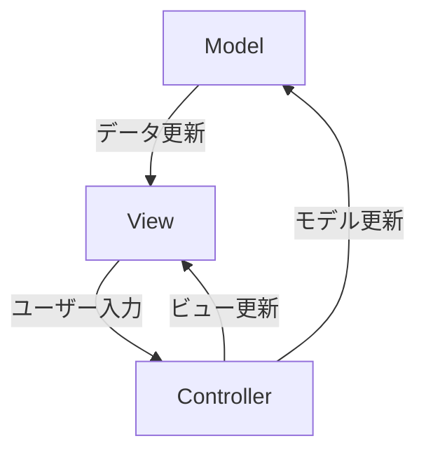
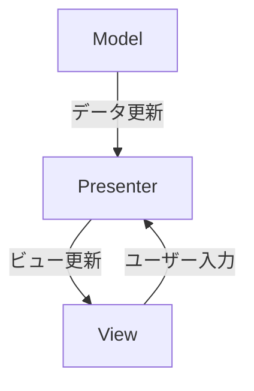

MVP（Model-View-Presenter）とMVC（Model-View-Controller）は似た設計パターンですが、いくつか重要な違いがあります。どちらもアプリケーションの構造を整理し、保守性や再利用性を高めるための設計パターンですが、**主にViewとPresenter/Controller間のやり取り**に違いがあります。

<br>

<br>

# MVPとMVCの違い


<br>

<br>


#### **MVC (Model-View-Controller)**
- **Model**: アプリケーションのデータやビジネスロジックを担当。
- **View**: ユーザーインターフェースの表示部分。Modelのデータを描画する役割を持つが、直接Modelにアクセスすることもある。
- **Controller**: ユーザー入力を受け取り、ModelやViewを更新する役割を持つ。

MVCでは、**ViewがControllerにユーザーアクションを通知**し、ControllerがModelを操作し、**ViewがModelの状態を監視して自動的に更新**されます。このため、ViewがModelに直接アクセスする場合もあり、Controllerはユーザー入力の管理やデータ処理の仲介役として機能します。


<br>

<br>


#### **MVP (Model-View-Presenter)**
- **Model**: アプリケーションのデータやビジネスロジックを担当（MVCと同様）。
- **View**: ユーザーインターフェースの表示部分。基本的に**プレゼンター（Presenter）を介してModelのデータを更新**し、表示も行います。Viewはデータの処理ロジックを持たない。
- **Presenter**: Viewからのイベント（ユーザー入力など）を受け取り、Modelを操作し、その結果をViewに反映する。

MVPでは、**ViewがPresenterにのみ依存**し、PresenterがModelとViewのやり取りをすべて制御します。ViewはPresenterの指示に従ってUIを更新し、Modelのデータを直接扱わず、Presenterがその橋渡しを行います。


<br>

<br>


### 主な違い

1. **ViewとModelの直接的なやり取り**:
   - **MVC**: ViewがModelを直接参照して更新することがある。
   - **MVP**: ViewはPresenterを通じてModelにアクセスし、直接操作はしない。

2. **ControllerとPresenterの役割**:
   - **MVCのController**: ユーザー入力を受け、ModelやViewを更新するが、Modelの状態変化によってViewが自動的に反応することもある。
   - **MVPのPresenter**: ViewとModelのやり取りをすべて制御し、ViewがPresenterの指示を受けて動作する。

3. **テストのしやすさ**:
   - **MVC**: ViewとControllerが密に結びついているため、テストが難しいことがある。
   - **MVP**: ViewとPresenterが分離されているため、Presenterのテストが比較的容易。

### 使用例（簡単な例）

#### **MVCの例**
```cs
public class GameController : MonoBehaviour {
    public GameModel model;
    public GameView view;

    void Start() {
        model = new GameModel();
        view = FindObjectOfType<GameView>();
    }

    void Update() {
        if (Input.GetKeyDown(KeyCode.Space)) {
            model.IncreaseScore();
            view.UpdateScore(model.Score);
        }
    }
}
```
- **Model**: ゲームのスコアなどのデータを保持。
- **View**: スコアの表示部分。
- **Controller**: ユーザーの入力を処理し、ModelとViewの更新を管理。


<br>

<br>


#### **MVPの例**
```cs
public class GamePresenter {
    private GameModel model;
    private IGameView view;

    public GamePresenter(IGameView view) {
        this.view = view;
        model = new GameModel();
    }

    public void OnScoreButtonPressed() {
        model.IncreaseScore();
        view.UpdateScore(model.Score);
    }
}
```
- **Model**: ゲームのスコアなどのデータを保持（MVCと同様）。
- **View**: IGameViewインターフェースに従い、Presenterからの指示でUIを更新。
- **Presenter**: ユーザーの入力を処理し、ModelとViewの更新を管理。


<br>

<br>


### 結論
- **MVC**: ViewがModelと直接やり取りできる柔軟な設計。大規模アプリケーションでは、複雑化する可能性がある。
- **MVP**: ViewとModelが完全に分離されており、Presenterがすべてのやり取りを管理するため、テストや拡張がしやすい。

どちらもアプリケーションの整理に役立ちますが、使う場面や規模によって選択が異なることが多いです。


<br>


<br>


<br>


MVP（Model-View-Presenter）とMVC（Model-View-Controller）は、ソフトウェアの設計パターンであり、UIの構造と動作を整理するための異なるアプローチを提供します。以下に、それぞれのパターンの違いを図で示し、説明します。


<br>

<br>


### MVC（Model-View-Controller）

**MVC** は、以下の3つのコンポーネントで構成されます：

1. **Model**: アプリケーションのデータとビジネスロジックを管理します。データの状態を保持し、更新します。
2. **View**: ユーザーインターフェースを表示します。モデルのデータをユーザーに表示し、ユーザーの入力を受け取ります。
3. **Controller**: ユーザーの入力を処理し、モデルとビューを調整します。ユーザーアクションに応じてモデルを更新し、その変更をビューに反映させます。



**説明**:
- **Model** はデータとビジネスロジックを管理し、**View** はそのデータを表示します。
- **Controller** はユーザーのアクションに応じて **Model** を更新し、**View** にその変更を反映させます。

<br>

<br>

### MVP（Model-View-Presenter）

**MVP** は、以下の3つのコンポーネントで構成されます：

1. **Model**: アプリケーションのデータとビジネスロジックを管理します。MVCのModelと同様です。
2. **View**: ユーザーインターフェースを表示しますが、プレゼンターからの指示に基づいています。ユーザーの入力を直接プレゼンターに通知します。
3. **Presenter**: ビジネスロジックとビューの間の仲介役です。ユーザーの入力を処理し、モデルを更新し、ビューに表示させる指示を出します。



**説明**:
- **Model** はデータとビジネスロジックを管理します。
- **View** はユーザーインターフェースを表示し、ユーザーの入力を **Presenter** に通知します。
- **Presenter** は **Model** と **View** の間で調整を行い、ビューの更新とユーザーの入力処理を担当します。


<br>

<br>


### 主な違い

- **MVC**: **Controller** はユーザーの入力を処理し、**Model** と **View** を直接操作します。**View** から **Controller** へ直接入力が伝わり、**Controller** が **Model** を更新し、結果を **View** に反映させます。
- **MVP**: **Presenter** が **View** と **Model** の仲介役を果たし、**View** からのユーザー入力を受け取り、**Model** を操作し、**View** の更新を指示します。**View** は **Presenter** を通じてのみ **Model** と通信します。

このように、**MVC** と **MVP** の違いは、ユーザーインターフェースとビジネスロジックの間でどのコンポーネントが調整役を果たすかにあります。MVC では **Controller** が直接モデルとビューを操作するのに対し、MVP では **Presenter** がその役割を担います。