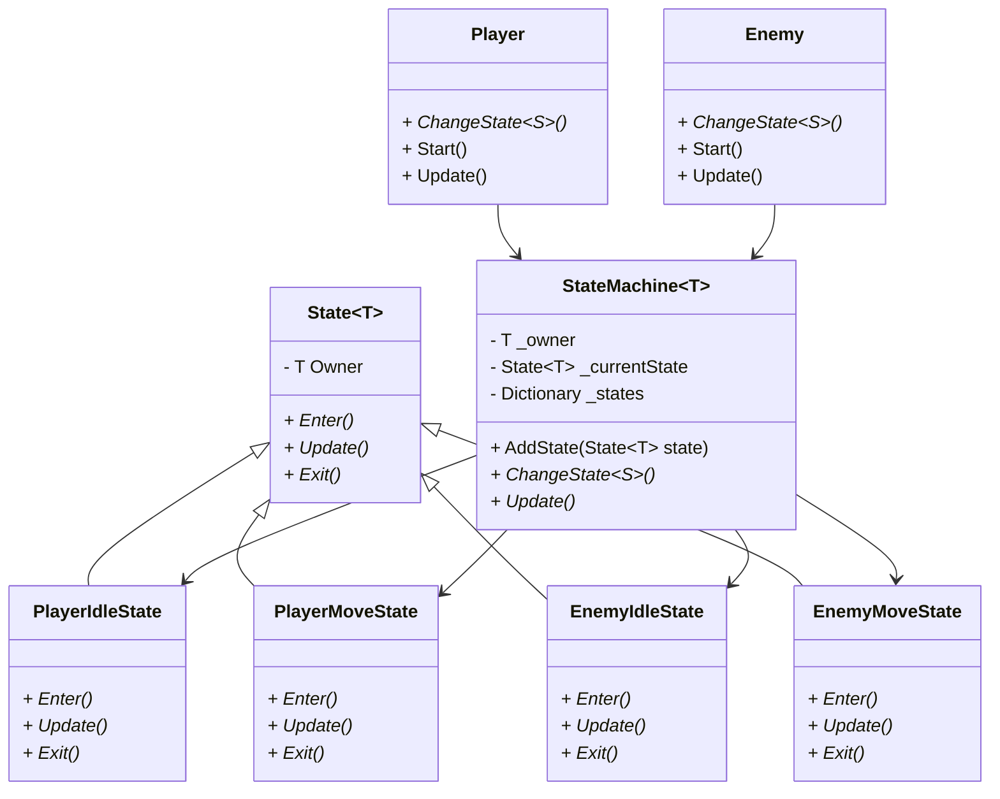
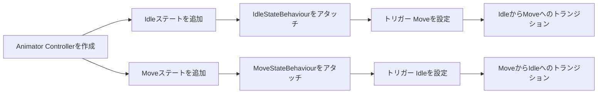
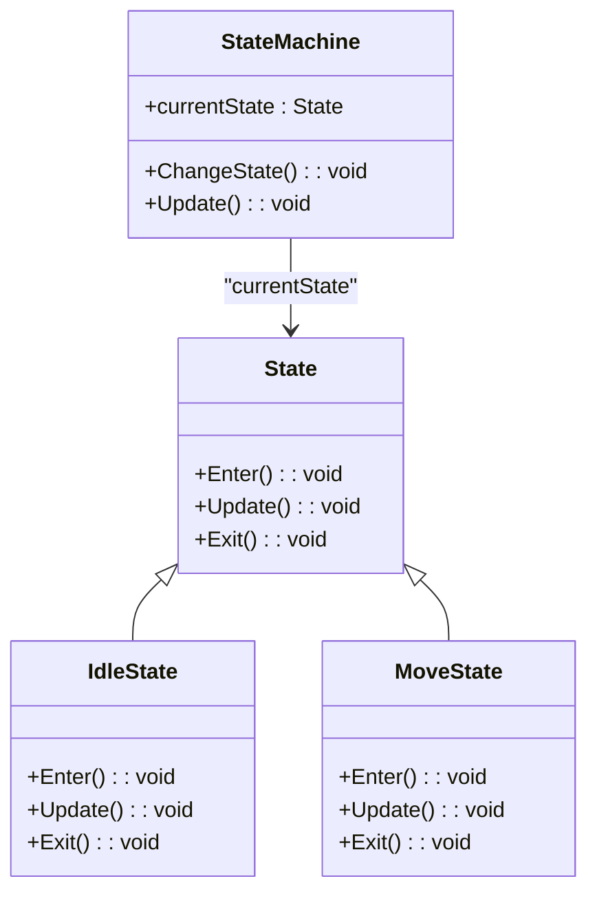

<script src="https://unpkg.com/mermaid@8.0.0/dist/mermaid.min.js"></script>
<script>
const mermaiding = function() {
    const elements = document.querySelectorAll("pre>code.language-mermaid");
    for (let i = 0; i < elements.length; i++) {
        const e = elements[i];
        const pre = e.parentElement;
        const replace = function(graph) {
            const elem = document.createElement('div');
            elem.innerHTML = graph;
            elem.className = 'mermaid';
            elem.setAttribute('data-processed', 'true');
            pre.parentElement.replaceChild(elem, pre);
        }
        mermaid.mermaidAPI.render('id' + i, e.textContent, replace);
    }
}

if (document.readyState == 'interactive' || document.readyState == 'complete') {
    mermaiding();
}else{
    document.addEventListener("DOMContentLoaded", mermaiding);
}
</script>


ステートパターンをUnityで使用する方法として以下２つを取り上げます
+ ジェネリックを使用する方法
+ Animation ControllerでStateMachineBehaviourを使用する方法


ステートパターンは、オブジェクトがその内部状態に応じて異なる動作をするためのデザインパターンです。


# ジェネリックを使用したステートパターン


<br>

State.cs
```cs

namespace StatePattern_Generic
{
    public abstract class State<T>
    {
        protected T Owner;

        public State(T owner)
        {
            Owner = owner;
        }

        public abstract void Enter();
        public abstract void Update();
        public abstract void Exit();
    }
}


```
<br>

StateMachine.cs
```cs

using System.Collections.Generic;

namespace StatePattern_Generic
{
    public class StateMachine<T>
    {
        private T _owner;
        private State<T> _currentState;
        private Dictionary<System.Type, State<T>> _states = new Dictionary<System.Type, State<T>>();

        public StateMachine(T owner)
        {
            _owner = owner;
        }

        public void AddState(State<T> state)
        {
            var type = state.GetType();
            if (!_states.ContainsKey(type))
            {
                _states[type] = state;
            }
        }

        public void ChangeState<S>() where S : State<T>
        {
            if (_currentState != null)
            {
                _currentState.Exit();
            }

            var type = typeof(S);
            if (_states.ContainsKey(type))
            {
                _currentState = _states[type];
                _currentState.Enter();
            }
        }

        public void Update()
        {
            if (_currentState != null)
            {
                _currentState.Update();
            }
        }
    }
}


```

<br>

Player.cs
```cs

using UnityEngine;

namespace StatePattern_Generic
{
    public class Player : MonoBehaviour
    {
        private StateMachine<Player> _stateMachine;

        void Start()
        {
            _stateMachine = new StateMachine<Player>(this);
            _stateMachine.AddState(new PlayerIdleState(this));
            _stateMachine.AddState(new PlayerMoveState(this));

            _stateMachine.ChangeState<PlayerIdleState>();
        }

        void Update()
        {
            _stateMachine.Update();
        }

        public void ChangeState<S>() where S : State<Player>
        {
            _stateMachine.ChangeState<S>();
        }
    }
}


```
<br>

PlayerIdleState.cs

```cs
using UnityEngine;

namespace StatePattern_Generic
{
    public class PlayerIdleState : State<Player>
    {
        public PlayerIdleState(Player owner) : base(owner) { }

        public override void Enter()
        {
            Debug.Log("Player Entering Idle State");
        }

        public override void Update()
        {
            if (Input.GetKeyDown(KeyCode.Space))
            {
                Owner.GetComponent<Player>().ChangeState<PlayerMoveState>();
            }
        }

        public override void Exit()
        {
            Debug.Log("Player Exiting Idle State");
        }
    }
}


```


<br>

PlayerMoveState.cs
```cs
using UnityEngine;

namespace StatePattern_Generic
{
    public class PlayerMoveState : State<Player>
    {
        public PlayerMoveState(Player owner) : base(owner) { }

        public override void Enter()
        {
            Debug.Log("Player Entering Move State");
        }

        public override void Update()
        {
            Owner.transform.Translate(Vector3.forward * Time.deltaTime);

            if (Input.GetKeyUp(KeyCode.Space))
            {
                Owner.GetComponent<Player>().ChangeState<PlayerIdleState>();
            }
        }

        public override void Exit()
        {
            Debug.Log("Player Exiting Move State");
        }
    }
}


```
<br>

Enemy.cs

```cs


using UnityEngine;

namespace StatePattern_Generic
{
    public class Enemy : MonoBehaviour
    {
        private StateMachine<Enemy> _stateMachine;

        void Start()
        {
            _stateMachine = new StateMachine<Enemy>(this);
            _stateMachine.AddState(new EnemyIdleState(this));
            _stateMachine.AddState(new EnemyMoveState(this));

            _stateMachine.ChangeState<EnemyIdleState>();
        }

        void Update()
        {
            _stateMachine.Update();
        }

        public void ChangeState<S>() where S : State<Enemy>
        {
            _stateMachine.ChangeState<S>();
        }
    }
}


```

<br>

EnemyIdleState.cs
```cs

namespace StatePattern_Generic
{
    public class EnemyIdleState : State<Enemy>
    {
        public EnemyIdleState(Enemy owner) : base(owner) { }

        public override void Enter()
        {
            Debug.Log("Enemy Entering Idle State");
        }

        public override void Update()
        {
            // 敵のIdleロジック
            if (Random.Range(0, 100) < 5)
            {
                Owner.GetComponent<Enemy>().ChangeState<EnemyMoveState>();
            }
        }

        public override void Exit()
        {
            Debug.Log("Enemy Exiting Idle State");
        }
    }
}


```
<br>

EnemyMoveState.cs
```cs

namespace StatePattern_Generic
{
    public class EnemyMoveState : State<Enemy>
    {
        public EnemyMoveState(Enemy owner) : base(owner) { }

        public override void Enter()
        {
            Debug.Log("Enemy Entering Move State");
        }

        public override void Update()
        {
            Owner.transform.Translate(Vector3.forward * Time.deltaTime);

            // 偶然の確率でIdle状態に戻る
            if (Random.Range(0, 100) < 5)
            {
                Owner.GetComponent<Enemy>().ChangeState<EnemyIdleState>();
            }
        }

        public override void Exit()
        {
            Debug.Log("Enemy Exiting Move State");
        }
    }
}

```


<br>

<br>



<br>

<br>

# ジェネリックを使用したステートパターンについて

この設計は、ジェネリック型を活用して「ステートパターン」を実装したものです。  
`Player` や `Enemy` が「状態」を持ち、特定の条件に応じて「状態」が変化する仕組みです。  
状態遷移の制御は `StateMachine` クラスが行い、具体的な状態（例: `Idle` 状態、`Move` 状態）は `State` クラスから派生した `PlayerIdleState` や `EnemyMoveState` として実装されます。

## クラス図の説明
1. **State<T> クラス**
   - ジェネリック型 `T` を使って、プレイヤーや敵などのオーナー (`Owner`) を一般化しています。
   - 抽象メソッド `Enter()`, `Update()`, `Exit()` を持ち、各ステートでオーバーライドされることを前提としています。
   - `Player` や `Enemy` など、具体的なオーナーをステートに関連付けるための基底クラスです。

2. **StateMachine<T> クラス**
   - ジェネリック型 `T` を使用して、オーナーに対して状態遷移を管理するクラスです。
   - `_owner`: ステートマシンのオーナー（`Player` や `Enemy` など）を保持します。
   - `_currentState`: 現在のステートを保持します。
   - `_states`: ステートを `Type` によって管理するための辞書です。
   - `AddState(State<T> state)`: ステートを追加します。
   - `ChangeState<S>()`: 現在のステートを終了し、新しいステートに遷移します。
   - `Update()`: 現在のステートの `Update()` メソッドを呼び出して、毎フレーム更新処理を行います。

3. **Player クラス**
   - プレイヤーキャラクターを表すクラスです。`StateMachine<Player>` を持ち、プレイヤーの状態管理を行います。
   - 初期状態として `PlayerIdleState` を設定し、`Update()` メソッドでステートマシンの更新を呼び出します。
   - `ChangeState<S>()` メソッドでステートを変更することができます。

4. **PlayerIdleState クラス**
   - プレイヤーの「Idle（待機）」状態を表すステートクラスです。
   - `Enter()`: Idle状態に入った際に実行されます（ログ出力）。
   - `Update()`: `Space` キーが押されたら、`PlayerMoveState` に遷移します。
   - `Exit()`: Idle状態から出る際に実行されます（ログ出力）。

5. **PlayerMoveState クラス**
   - プレイヤーの「Move（移動）」状態を表すステートクラスです。
   - `Enter()`: Move状態に入った際に実行されます（ログ出力）。
   - `Update()`: プレイヤーを前進させ、`Space` キーが離されたら `PlayerIdleState` に戻ります。
   - `Exit()`: Move状態から出る際に実行されます（ログ出力）。

6. **Enemy クラス**
   - 敵キャラクターを表すクラスで、`StateMachine<Enemy>` を持ち、敵の状態管理を行います。
   - 初期状態として `EnemyIdleState` を設定し、`Update()` メソッドでステートマシンの更新を呼び出します。
   - `ChangeState<S>()` メソッドでステートを変更することができます。

7. **EnemyIdleState クラス**
   - 敵の「Idle（待機）」状態を表すステートクラスです。
   - 一定確率で `EnemyMoveState` に遷移します。

8. **EnemyMoveState クラス**
   - 敵の「Move（移動）」状態を表すステートクラスです。
   - 移動しながら、一定確率で `EnemyIdleState` に遷移します。

<br>

## ジェネリックの利点
- **再利用性**: `State<T>` クラスや `StateMachine<T>` クラスはジェネリック型を使っているため、`Player` でも `Enemy` でも同じロジックを使い回すことができます。これにより、状態管理のロジックがコードの重複を避けつつシンプルに保たれます。
- **柔軟性**: プレイヤーや敵以外のキャラクターに対しても簡単に状態遷移のロジックを適用できます。

<br>

## クラス間の関係
- `Player` クラスと `Enemy` クラスはそれぞれ `StateMachine<Player>` と `StateMachine<Enemy>` を持っています。
- `StateMachine<Player>` は `PlayerIdleState` と `PlayerMoveState` の2つの状態を管理し、 `StateMachine<Enemy>` は `EnemyIdleState` と `EnemyMoveState` の状態を管理します。
- 各状態（`PlayerIdleState`, `PlayerMoveState`, `EnemyIdleState`, `EnemyMoveState`）は `State<T>` を継承しており、それぞれのオブジェクトの状態遷移を個別に定義しています。

<br>

## 動作の流れ
1. **初期状態の設定**: `Player` や `Enemy` はそれぞれ最初に `IdleState` に設定されます。
2. **状態遷移**: プレイヤーは `Space` キーを押すと移動状態（`MoveState`）に遷移し、キーを離すと再び `IdleState` に戻ります。敵は一定確率で移動状態に遷移し、また一定確率で待機状態に戻ります。
3. **状態管理**: `StateMachine<T>` クラスが現在の状態を管理し、遷移のタイミングで `Enter()`, `Update()`, `Exit()` メソッドを呼び出します。

このように、ジェネリック型を用いたステートパターンにより、キャラクターの状態管理をシンプルかつ効率的に行うことができます。


<br>

<br>

## ・ChangeStateメソッドの呼び出しについて

「Player.cs」「各Stateクラス」どちらにChangeStateメソッドの呼び出しを書くかは、設計の好みや具体的なシナリオに依存しますが、一般的なアプローチは次の通りです。

* Player.csに書く場合:

Playerクラスがキー入力を監視し、状態遷移を直接制御します。
簡潔でシンプルな場合に適しています。

* 各Stateクラスに書く場合:

ステートが自分自身で次の状態を決定し、Playerクラスがそれを意識しないようにします。  
よりモジュール化されていて、ステートの切り替えロジックが各ステートに閉じ込められます。  
より複雑な状態遷移ロジックに適しています。

<br>

<br>
<br>

<br>

# Animation ControllerでStateMachineBehaviourを使用した例

・作業例



<br>

#### 1. **UnityエディタでAnimator Controllerの作成**
- Animator Controllerを作成し、`Idle` と `Move` の2つのステートを追加します。

#### 2. **StateMachineBehaviourのアタッチ**
- `Idle` ステートに `IdleStateBehaviour.cs` をアタッチします。
- `Move` ステートに `MoveStateBehaviour.cs` をアタッチします。

#### 3. **トランジションの設定**
- `Idle` ステートから `Move` ステートへのトランジションを作成し、トリガー `Move` を設定します。
- `Move` ステートから `Idle` ステートへのトランジションを作成し、トリガー `Idle` を設定します。


<br>

IdleStateBehaviour.cs

```cs

using UnityEngine;

namespace StatePattern_AnimationController
{
    public class IdleStateBehaviour : StateMachineBehaviour
    {
        override public void OnStateEnter(Animator animator, AnimatorStateInfo stateInfo, int layerIndex)
        {
            Debug.Log("Entering Idle State");
        }

        override public void OnStateUpdate(Animator animator, AnimatorStateInfo stateInfo, int layerIndex)
        {
            // Idle state logic
        }

        override public void OnStateExit(Animator animator, AnimatorStateInfo stateInfo, int layerIndex)
        {
            Debug.Log("Exiting Idle State");
        }
    }
}


```


<br>

MoveStateBehaviour.cs

```cs

using UnityEngine;

namespace StatePattern_AnimationController
{
    public class MoveStateBehaviour : StateMachineBehaviour
    {
        override public void OnStateEnter(Animator animator, AnimatorStateInfo stateInfo, int layerIndex)
        {
            Debug.Log("Entering Move State");
        }

        override public void OnStateUpdate(Animator animator, AnimatorStateInfo stateInfo, int layerIndex)
        {
            // Move state logic
            var player = animator.GetComponent<PlayerAnimatorController>();
            if (player != null)
            {
                player.transform.Translate(Vector3.forward * Time.deltaTime);
            }
        }

        override public void OnStateExit(Animator animator, AnimatorStateInfo stateInfo, int layerIndex)
        {
            Debug.Log("Exiting Move State");
        }
    }
}


```

<br>

PlayerAnimatorController.cs

```cs

using UnityEngine;

namespace StatePattern_AnimationController
{
    public class PlayerAnimatorController : MonoBehaviour
    {
        private Animator _animator;

        void Start()
        {
            _animator = GetComponent<Animator>();
        }

        void Update()
        {
            if (Input.GetKeyDown(KeyCode.Space))
            {
                _animator.SetTrigger("Move");
            }

            if (Input.GetKeyUp(KeyCode.Space))
            {
                _animator.SetTrigger("Idle");
            }
        }
    }
}


```

<br>

・状態遷移に関する基本的な関係性



### 説明
- `StateMachine` は `currentState` というフィールドを持ち、現在アクティブな状態を保持しています。
- `StateMachine` は `ChangeState()` メソッドを持ち、異なる状態に切り替える役割を持っています。また、`Update()` メソッドを呼び出して現在の状態の更新を行います。
- `State` クラスは基本的な状態のメソッド (`Enter()`、`Update()`、`Exit()`) を定義しており、これを基底クラスとして、具体的な状態 (`IdleState` や `MoveState`) が派生しています。
- `IdleState` と `MoveState` は `State` を継承しており、それぞれの状態に応じた挙動を定義しています。


---

### 各スクリプトの役割

#### 1. **IdleStateBehaviour.cs**
- `Idle` ステートに入った時 (`OnStateEnter`)、ログに「Entering Idle State」と出力します。
- `Idle` ステートにいる間、`OnStateUpdate` で特定のロジックを実行できます（ここでは何も記述されていません）。
- `Idle` ステートを出る時 (`OnStateExit`)、ログに「Exiting Idle State」と出力します。

#### 2. **MoveStateBehaviour.cs**
- `Move` ステートに入った時 (`OnStateEnter`)、ログに「Entering Move State」と出力します。
- `Move` ステートにいる間 (`OnStateUpdate`)、`PlayerAnimatorController` コンポーネントを取得し、プレイヤーを前進させるロジックを実行します。
- `Move` ステートを出る時 (`OnStateExit`)、ログに「Exiting Move State」と出力します。

#### 3. **PlayerAnimatorController.cs**
- キーボードのスペースキーを押す (`Input.GetKeyDown`) と、`Animator` に `Move` トリガーを設定します。
- スペースキーを離す (`Input.GetKeyUp`) と、`Animator` に `Idle` トリガーを設定します。

これにより、スペースキーを押すとプレイヤーが前進し、離すと待機状態に戻るというアニメーションの切り替えが行われます。