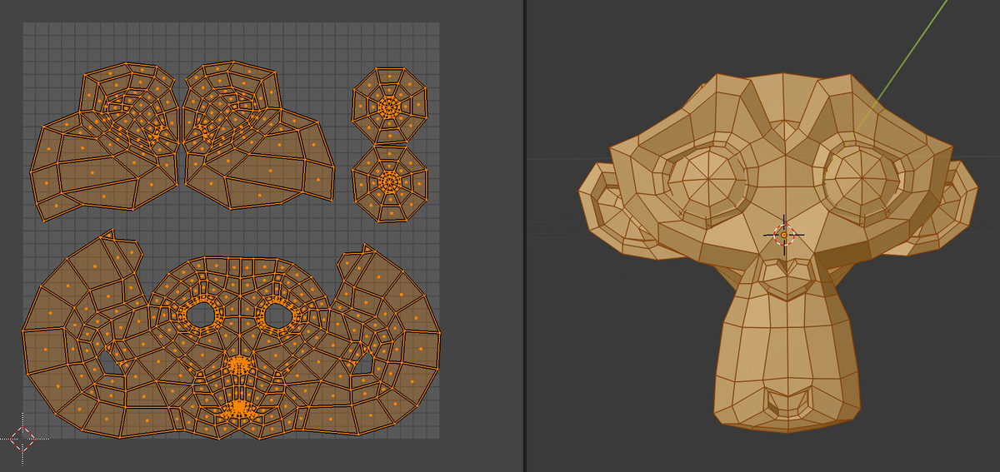

# **2. PaintManager.cs**
- **役割**:
  - ペイント処理全体を統括する管理クラス。
  - ペイント操作を`MousePainter.cs`から受け取り、実際のペイント処理を適用。

- **主な機能**:
  - ペイントする対象 (`Paintable`) とそのペイントデータ（位置、色、強さなど）を管理。
  - `Graphics.Blit` などを使用して、ペイントを `RenderTexture` に書き込む。

- **依存関係**:
  - `Paintable.cs` を操作して、指定されたペイントマスクに基づきペイントを実行。





# サンプルコード2

```cs


using UnityEngine;
using UnityEngine.Rendering;
using UnityEngine.Rendering.Universal;


//`PaintManager` は、Unityの **シングルトンクラス** として設計されており、シーン全体で1つだけ存在する管理クラス
public class PaintManager : Singleton<PaintManager>
{
    public Shader texturePaint;
    public Shader extendIslands;

    //使用するシェーダーのプロパティについて
    //シェーダーのプロパティを文字列ではなくIDで管理。パフォーマンスを向上させます。
    int prepareUVID = Shader.PropertyToID("_PrepareUV");      //UV座標の準備フラグ
    int positionID  = Shader.PropertyToID("_PainterPosition");//ペイントの中心座標
    int hardnessID  = Shader.PropertyToID("_Hardness");       //ペイントの硬さ、ペイントブラシの境界部分がどれだけぼやける
    int strengthID  = Shader.PropertyToID("_Strength");       //強さ。境界部分をどれだけぼかすか
    int radiusID    = Shader.PropertyToID("_Radius");         //半径。
    int colorID     = Shader.PropertyToID("_PainterColor");   //ペイント色。
    int textureID   = Shader.PropertyToID("_MainTex");        //ベースカラーやディフューズマップのような、基本テクスチャ。両シェーダーで _MainTex にアクセスするために必要。
    int uvOffsetID  = Shader.PropertyToID("_OffsetUV");       //テクスチャのUVオフセットを変更して色を拡張する際に利用
    int uvIslandsID = Shader.PropertyToID("_UVIslands");      //特定のUV範囲（アイランド）を識別するために使われます。3Dモデルのテクスチャマッピングにおいて、モデルの表面（メッシュ）を2Dのテクスチャに展開したときにできる、独立したUVマッピング領域のことをUVアイランド


    Material paintMaterial;
    Material extendMaterial;

    CommandBuffer command;


    public override void Awake(){
        base.Awake();
        
        //ペイントおよびUVアイランド拡張用のシェーダーを操作するための `Material` インスタンスを生成。
        paintMaterial  = new Material(texturePaint); //シェーダーを適応したマテリアル生成
        extendMaterial = new Material(extendIslands);//シェーダーを適応したマテリアル生成
        command        = new CommandBuffer();        //コマンドバッファ(まとめて描画処理)を使用するためインスタンス化
        command.name   = "CommmandBuffer - " + gameObject.name;
    }

    public void initTextures(Paintable paintable){
        //Paintableクラス(Objectに関する描画情報クラス)　の各アドレスから　情報取得　
        RenderTexture mask      = paintable.getMask();     //
        RenderTexture uvIslands = paintable.getUVIslands();//
        RenderTexture extend    = paintable.getExtend();
        RenderTexture support   = paintable.getSupport();
        Renderer rend           = paintable.getRenderer();

        //
        command.SetRenderTarget(mask);
        command.SetRenderTarget(extend);
        command.SetRenderTarget(support);

        paintMaterial.SetFloat(prepareUVID, 1);
        command.SetRenderTarget(uvIslands);
        command.DrawRenderer(rend, paintMaterial, 0);

        Graphics.ExecuteCommandBuffer(command);//実行
        command.Clear();
    }

    //ここを呼び出してペイントを行う
    public void paint(Paintable paintable, Vector3 pos, float radius = 1f, float hardness = .5f, float strength = .5f, Color? color = null){
        RenderTexture mask      = paintable.getMask();     //ペイントマスク用テクスチャ
        RenderTexture uvIslands = paintable.getUVIslands();//UVアイランド用テクスチャ。オブジェクトのUVマッピングを元にした処理のために使用。
        RenderTexture extend    = paintable.getExtend();   // UVアイランドの拡張処理用テクスチャ。UVアイランドに関連する特殊な描画や加工を扱うためのもの。
        RenderTexture support   = paintable.getSupport();  //補助テクスチャ。他の計算や特殊効果を補助する目的で使用。
        Renderer rend           = paintable.getRenderer(); //ObjectのRenderコンポーネントのアドレス

        //texturePaint シェーダーに値を渡す
        paintMaterial.SetFloat(prepareUVID, 0);
        paintMaterial.SetVector(positionID, pos);          //どこを中心にお絵描きするか
        paintMaterial.SetFloat(hardnessID, hardness);
        paintMaterial.SetFloat(strengthID, strength);
        paintMaterial.SetFloat(radiusID, radius);
        paintMaterial.SetTexture(textureID, support);       //texturePaint に　 サポートテクスチャ(今描いたやつ)を渡す　　今描いたやつと今まで描いたやつを合成する
        paintMaterial.SetColor(colorID, color ?? Color.red);//

        //extendMaterial　シェーダーに値を渡す
        extendMaterial.SetFloat(uvOffsetID, paintable.extendsIslandOffset);//
        extendMaterial.SetTexture(uvIslandsID, uvIslands);                 //

        //CommandBuffer　レンダリングパイプラインの特定の段階でカスタムのグラフィックス命令を発行できます
        command.SetRenderTarget(mask);               //描画対象のレンダーターゲットを設定 
        command.DrawRenderer(rend, paintMaterial, 0);//CommandBufferによってレンダラーを描画します。特定のレンダラーを描画するために使用され、オブジェクトのレンダリング命令を発行　　　//RenderコンポーネントにpaintMaterialを　　

        command.SetRenderTarget(support);//描画対象のレンダーターゲットを設定 　　　サポートテクスチャ
        command.Blit(mask, support);     //maskで描いた内容を　supportに保持

        command.SetRenderTarget(extend);//描画対象のレンダーターゲットを設定
        command.Blit(mask, extend, extendMaterial);//CommandBuffer.Blit(元の画像,書き出し画像,適用シェーダー)// //マスク を　extendMaterialextend　に合成

        Graphics.ExecuteCommandBuffer(command);//CommandBuffer内の命令を実行します。このメソッドは通常、カメラがレンダリングする際に呼び出されます。
        command.Clear();
    }

}
```

[Graphics_ExecuteCommandBufferについて](Graphics_ExecuteCommandBuffer.md)


---

### **概要**

1. **ペイント用のシェーダーとマテリアルを管理**  
   ペイント用およびUVアイランド拡張用のシェーダーを操作するための `Material` インスタンスを生成・利用します。
   
2. **`CommandBuffer` を使用した描画命令の発行**  
   カスタムの描画命令を発行することで、ペイントやテクスチャ操作を効率的に実現します。

3. **`Paintable` オブジェクトの初期化**  
   渡された `Paintable` オブジェクトのテクスチャやシェーダー設定を初期化します。

4. **ペイント操作を実行**  
   ペイント操作を行い、結果を `RenderTexture` に反映します。

---

### **主要プロパティ**
- **`texturePaint` / `extendIslands`**  
  ペイント用およびUVアイランド拡張用のシェーダーを格納します。

- **`paintMaterial` / `extendMaterial`**  
  シェーダーを適用したマテリアルオブジェクト。これを利用してペイント処理やUV操作を行います。

- **`command`**  
  `CommandBuffer` インスタンス。ペイントやテクスチャ処理の描画命令をバッチ処理するために使用します。

- **シェーダー用プロパティID**  
  `_PainterPosition`, `_Hardness`, `_Strength` など、シェーダーで利用するパラメータのIDをキャッシュして効率化しています。

---

### **主要メソッド**
#### 1. **`Awake`**
- シングルトンクラスの初期化。
- ペイントとUV拡張用のマテリアルを生成。
- `CommandBuffer` を作成し、名前を付与。

#### 2. **`initTextures(Paintable paintable)`**
- 渡された `Paintable` オブジェクトのテクスチャを初期化。
- UVアイランド用の `RenderTexture` にシェーダーを適用して描画。
- 初期化後、`CommandBuffer` をクリア。

#### 3. **`paint(Paintable paintable, Vector3 pos, ...)`**
- ペイント処理の中核。
1. **シェーダーのパラメータ設定**  
   ペイントの位置、半径、硬さ、強度、色などを設定。
2. **`CommandBuffer` を利用した描画命令発行**  
   - マスクテクスチャをペイント。
   - マスクの内容をサポートテクスチャにコピー。
   - 拡張されたUVアイランド情報を生成。

3. **命令の実行**  
   最後に `Graphics.ExecuteCommandBuffer` を呼び出して描画命令を実行。

---

### **`Paintable` との関係性**
- **テクスチャ共有**  
  `Paintable` が持つ `RenderTexture` インスタンス（`maskRenderTexture`、`uvIslandsRenderTexture` など）を使用してペイント操作を実行します。

- **シェーダーの初期設定**  
  `PaintManager` の `initTextures` を通じて、`Paintable` オブジェクトのUVアイランド情報を初期化します。

- **ペイント操作**  
  `Paintable` の `getMask` などのプロパティを参照して、シェーダーに適切なテクスチャを設定します。

---

### **フローの全体像**
1. **`Paintable` の初期化**  
   各 `Paintable` オブジェクトは `PaintManager.instance.initTextures(this)` を通じて初期化されます。

2. **ペイント操作**  
   `PaintManager.paint()` を呼び出し、対象の `Paintable` にペイントを適用します。この際、ペイント位置やテクスチャがシェーダーに渡され、描画命令が実行されます。

---

### **次のステップ**
渡された2つのスクリプトから、ペイントシステムの全体像が見えてきました。  
もし、関連するシェーダー（`texturePaint` や `extendIslands`）のコードや、それを適用する具体的な手順があれば、さらに深く分析できます。関連するコードや情報があれば、ぜひ共有してください！


この `PaintManager` クラスを見ると、確かに

 `maskRenderTexture`、
 `uvIslandsRenderTexture`、
 `supportTexture`、
 `extendIslandsRenderTexture` 
 が適切に初期化され、使用される準備が整っていることがわかります。
 
 それぞれのテクスチャは `Paintable` クラスから取得され、以下のように処理されます。

### 1. **`initTextures` メソッド**
このメソッドでは、`Paintable` クラスから各テクスチャ（`mask`、`uvIslands`、`extend`、`support`）を取得しています。これらは次の処理で使われます。

```csharp
command.SetRenderTarget(mask);
command.SetRenderTarget(extend);
command.SetRenderTarget(support);
```

ここで、`mask`、`extend`、`support` の各テクスチャがレンダリングターゲットとして設定されます。これらのテクスチャは `PaintManager` で使用されるグラフィック命令のターゲットとして指定され、実際に描画される内容を格納するための場所です。

その後、`paintMaterial` を使用して、`uvIslands` の描画が行われます。

```csharp
paintMaterial.SetFloat(prepareUVID, 1);
command.SetRenderTarget(uvIslands);
command.DrawRenderer(rend, paintMaterial, 0);
```

`uvIslands` に対して描画が行われ、`command.DrawRenderer()` を使って `paintMaterial` が描画されます。

### 2. **`paint` メソッド**
`paint` メソッドでは、実際に描画の処理が行われます。ここでも、先程のテクスチャ（`mask`、`uvIslands`、`extend`、`support`）が使われています。

```csharp
paintMaterial.SetTexture(textureID, support); // サポートテクスチャを設定
```

`paintMaterial` には、描画位置、ハードネス、強度、半径、カラー、そして「サポートテクスチャ」が設定されます。これによって、現在描画した内容と既に描画されている内容が合成されます。

その後、`extendMaterial` も同様に設定され、`uvIslands` が設定されます。

```csharp
extendMaterial.SetTexture(uvIslandsID, uvIslands); // UVアイランドを設定
```

`command.SetRenderTarget()` を使って、描画ターゲットを設定し、実際にレンダリング命令が実行されます。

### 3. **レンダリングの流れ**
- **`mask`**: 描画対象として設定され、マスク処理が行われます。
- **`support`**: マスクで描画された内容を保持するために使用され、`supportTexture` としてサポートテクスチャに保持されます。
- **`extend`**: マスクで描画された内容を拡張して合成するために使用されます。

### 結論
`PaintManager` クラス内で、`maskRenderTexture`、`uvIslandsRenderTexture`、`supportTexture`、`extendIslandsRenderTexture` はすべて **適切に初期化され、使用される準備が整っている** ことが確認できます。これらのテクスチャがシェーダーでどのように利用されるかも明確に記述されています。

つまり、`Paintable` クラスから取得したテクスチャは、`initTextures` メソッドで最初に準備され、その後 `paint` メソッドで実際にペイント処理として使用される形になります。


`initTextures` メソッドは、`PaintManager` クラスの中で以下のように呼ばれています。

```csharp
public void initTextures(Paintable paintable){
    //Paintableクラス　の各アドレスから　情報取得
    RenderTexture mask      = paintable.getMask();
    RenderTexture uvIslands = paintable.getUVIslands();
    RenderTexture extend    = paintable.getExtend();
    RenderTexture support   = paintable.getSupport();
    Renderer rend           = paintable.getRenderer();

    //
    command.SetRenderTarget(mask);
    command.SetRenderTarget(extend);
    command.SetRenderTarget(support);

    paintMaterial.SetFloat(prepareUVID, 1);
    command.SetRenderTarget(uvIslands);
    command.DrawRenderer(rend, paintMaterial, 0);

    Graphics.ExecuteCommandBuffer(command);//実行
    command.Clear();
}
```

`initTextures` メソッドが呼ばれる場所は、`PaintManager` クラスの中の `Paintable` クラスのインスタンスを受け取り、`Paintable` が保持しているテクスチャ（`maskRenderTexture`、`uvIslandsRenderTexture`、`supportTexture`、`extendIslandsRenderTexture`）を初期化する役割を担っています。

そして、実際に `initTextures` メソッドが呼ばれているのは以下の部分です：

```csharp
public void paint(Paintable paintable, Vector3 pos, float radius = 1f, float hardness = .5f, float strength = .5f, Color? color = null){
    RenderTexture mask      = paintable.getMask();
    RenderTexture uvIslands = paintable.getUVIslands();
    RenderTexture extend    = paintable.getExtend();
    RenderTexture support   = paintable.getSupport();
    Renderer rend           = paintable.getRenderer();

    //...省略...

    // initTextures を呼び出す
    PaintManager.instance.initTextures(paintable);

    //続き...
}
```

`initTextures` メソッドは `paint` メソッド内で呼ばれています。つまり、`paint` メソッドが呼ばれた際に、まずテクスチャの初期化（`initTextures`）が行われ、その後ペイントの処理が進行します。

そのため、`paint` メソッドが呼ばれる際に、`initTextures` が間接的に呼ばれているという形になります。


`initTextures` メソッドで行われる処理は、`Paintable.cs` で行っていた準備を補完する形になっています。

具体的には、`Paintable.cs` 内で `RenderTexture` のインスタンスが生成され、初期化されますが、これらのテクスチャ（`maskRenderTexture`、`uvIslandsRenderTexture`、`extendIslandsRenderTexture`、`supportTexture`）が実際に使われる準備として、`PaintManager` 内で以下のように `initTextures` が呼ばれることで、テクスチャに対する描画命令が発行され、実際にテクスチャが更新される準備が整います。

### `initTextures` の流れ

1. **テクスチャの取得**：
   `Paintable` クラスから、マスクやアイランド、サポート用のテクスチャを取得します。これらは `Paintable.cs` で生成され、`getMask()` や `getExtend()` などのプロパティを通じてアクセス可能になります。

2. **コマンドバッファの設定**：
   `command.SetRenderTarget()` で描画先のターゲットを設定します。ここでは、`maskRenderTexture`、`extendIslandsRenderTexture`、`supportTexture` に対して描画を行います。

3. **シェーダーパラメータの設定**：
   `paintMaterial` や `extendMaterial` で使用されるシェーダーに、テクスチャやパラメータ（例えば、`prepareUVID` や `uvOffsetID`）を設定します。

4. **描画命令の実行**：
   最後に、`Graphics.ExecuteCommandBuffer(command)` を呼び出して、コマンドバッファ内の命令を実行します。これにより、`maskRenderTexture` や `uvIslandsRenderTexture` などに対する描画が行われ、これらのテクスチャが更新されます。

### `Paintable.cs` での準備と `PaintManager.cs` の役割

- **`Paintable.cs` での準備**：
  `Paintable.cs` は、基本的にテクスチャの初期化と管理を行っています。`maskRenderTexture`、`uvIslandsRenderTexture`、`extendIslandsRenderTexture` などのテクスチャが `Start()` メソッド内で生成され、`Renderer` コンポーネントに適用されます。

- **`PaintManager.cs` の役割**：
  `PaintManager.cs` は、実際にペイントや描画を行う処理を担当します。`initTextures` メソッドは、`Paintable` で準備されたテクスチャを使用して、シェーダーに描画命令を出し、描画処理を実行します。このとき、`command` を使って、特定の順番でレンダリング命令を発行し、最終的に描画されたテクスチャが反映されます。

### 結論

- `Paintable.cs` で準備されたテクスチャは、`PaintManager.cs` の `initTextures` で実際に描画を行う準備が整えられます。
- `initTextures` は、テクスチャの更新やシェーダーの適用を行い、ペイント操作ができる状態にします。

そのため、`Paintable.cs` のテクスチャ準備だけでは描画は行われませんが、`initTextures` を呼び出すことで、これらのテクスチャがシェーダーと結びつき、ペイント可能な状態が整うという流れです。


