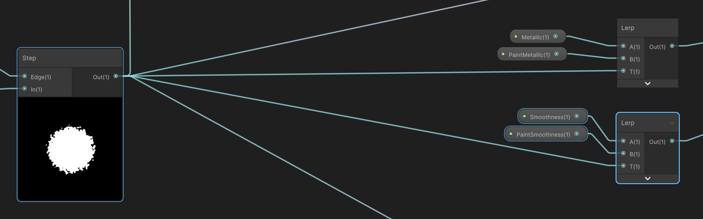

#### **6. Paintable.shadergraph**
- **役割**:
  - ペイント結果を表示するためのシェーダー（Shader Graphで作成）。
  - ペイントマスク、ペイント結果、グリッターやノイズの効果を合成。

- **主な機能**:
  - 視覚的なペイントエフェクト（色、金属感、滑らかさ、エミッション）を表現。
  - 最終的な描画結果として、ゲームオブジェクトの見た目を更新。

- **依存関係**:
  - `Paintable.cs` で割り当てられた `RenderTexture` を元に描画。

# サンプルコード6

Shadergraph

 
 

インク部分

 
 

最終出力先

 
 

キラキラ

 
 

inkの形をglitterに

 
 

変数

 
 

基本設定

 
 

Paintable_Ink_Normal

 
 

Paintable_Ink_BaseColor.

 
 

Paintable_Ink_Metallic

 
 

Paintable_Ink_Smoothness

 
 

Paintable_Emmision_Glitter1

 
 

Paintable_Emmision_Glitter2

