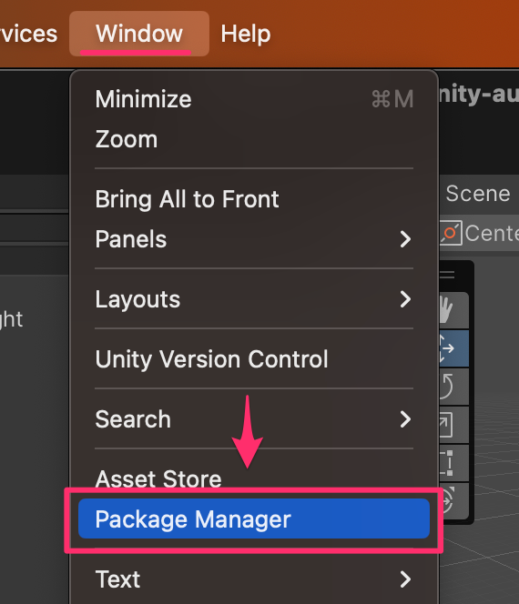

# UniTask導入

1.Window > Package Manager からPackage Managerウィンドウを開きます。



<br>


2.Package Managerウィンドウの左上の「+」ボタンをクリックして、 Add package from git URL を選択します。


<br>

3.入力フォームが表示されるので、次のURLを入力します。

```
https://github.com/Cysharp/UniTask.git?path=src/UniTask/Assets/Plugins/UniTask
```


<a href="https://www.hanachiru-blog.com/entry/2021/05/24/120000" target="_blank">Gitのエラーが出る場合参照ページ</a>


<br>

4.入力が終わったら 「Add」ボタンをクリック。するとUniTaskはインストールされます。


<br>