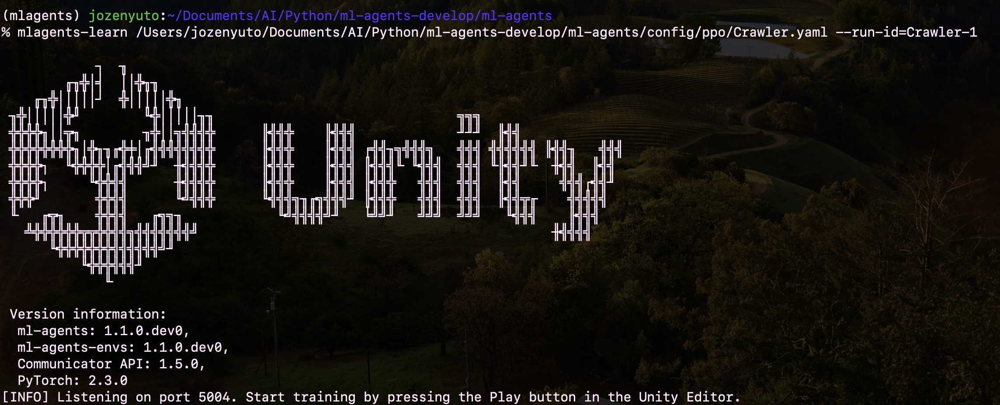
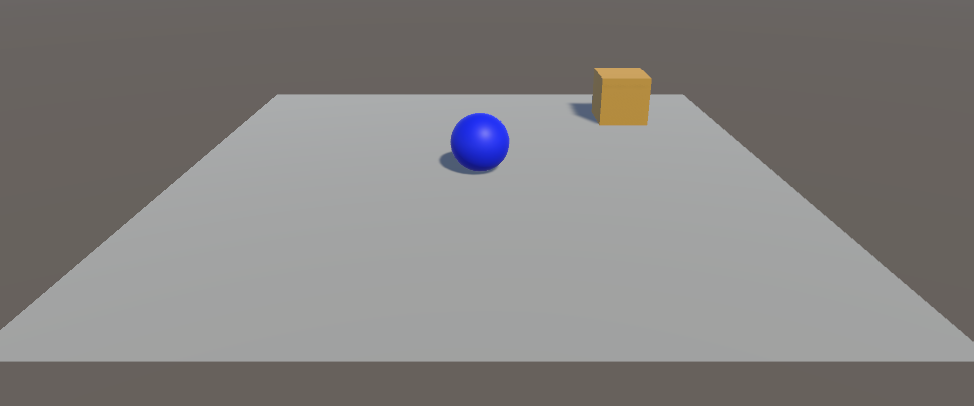

# 学習と推論

## 学習手順

## 1. 学習設定ファイルの設定

「学習設定ファイル」は学習に利用する「ハイパーパラメータ」を設定するファイルです。  
「ハイパーパラメータ」とは学習アルゴリズムの持つパラメータの中で人が調整しないといけないパラメータのことです。
WindowsではYAMLに日本語コメントが含まれていると読み込みに失敗するかと思います。日本語コメントは消してください。


```yaml
behaviors:
  RollerBall:
    #トレーナー種別
    trainer_type: ppo

    #基本
    max_steps: 500000
    time_horizon: 64
    summary_freq: 1000
    keep_checkpoints: 5

    #学習アルゴリズム
    hyperparameters:
      #PPOとSAC　共通
      batch_size: 10
      buffer_size: 100
      learning_rate: 0.0003
      learning_rate_schedule: linear

      #PPO用
      beta: 0.005
      epsilon: 0.2
      lambd: 0.95
      num_epoch: 3
    
    # ニューラルネットワーク
    network_settings:
      normalize: true
      hidden_units: 128
      num_layers: 2

    # 報酬
    reward_signals:
      # 環境報酬
      extrinsic:
        gamma: 0.99
        strength: 1.0

```


## 2. mlagents-learnの実行
```
mlagents-learn .\config\sample\RollerBall.yaml --run-id=RollerBall-1
```
「.\config\sample\RollerBall.yaml」は学習設定ファイルのパス。  
「RollerBaall-1」は「実行ID」。  
「実行ID」は学習結果として出力するモデルや統計情報のフォルダ名に使われます。新規学習を開始するたびに、別の「実行ID」（RollerBaall-2）を指定してください。  

以下のようなログが出力されます。  
画面下部に「Start training by pressing the Play button in the Unity Editor」(UnityエディタのPlayボタンを押して学習を開始してください)と表示されたら準備完了です。




## 3. UnityエディタのPlayボタンを押下
「mlagents-learn」の実行中に「Unityエディタ」のPlayボタンを押すことで、学習が開始されます。  
最初のうちはボールがすぐに落ちていきますが、徐々に立方体の方向に転がるようになります。



ログには「Mean Reawrd」(平均報酬)と「Std of Reward」(標準偏差)が出力されます。  
「平均報酬」はエピソード報酬の平均で上手く、学習できていると上昇します。「標準偏差」はデータの散らばり具合を表す数値で、小さい値の方が信用できる値となります。

デフォルト設定では、学習を最大500000ステップ(max_steps:500000)実行します。ログを見て十分学習出来ているようであれば、「Control + C」で学習を完了させることもできます。今回の学習では「MeanReward」が「1.000」になったら完了してください
「result」フォルダに「モデルファイル」と「統計情報」が出力されます

```
「results」
　　「RollerBall-1」
      ・configuration.yaml：学習設定ファイル
      ・「RollerBall」：統計情報と学習再開用のチェックポイント
      ・RollerBall.onnx：モデル
      ・「run_logs」：ログ
```

<br>

## 学習再開と再学習

既存モデルの実行IDを使って学習を再開するには、「--resume」を使います
```
mlagents-learn .\config\sample\RollerBall.yaml --run-id=RollerBall-1 --resume
```

<br>

既存モデルの実行IDを使って最初から再学習するには、「--force」を使います。既存モデルは、強制的に上書きされます。
```
mlagents-learn .\config\sample\RollerBall.yaml --run-id=RollerBall-1 --force
```
既存モデルを削除したい場合は、「results」内の該当フォルダを削除してください

## 推論の手順

「Unity ML-Agents」で学習済みのモデルを使って推論を使う手順は次の通りです。

### ①モデルファイルをUnityプロジェクトのAssetsに追加
「ml-agents フォルダ」直下のモデルファイル「./results/RollerBall-1/RollerBall.onnx」をUnityプロジェクトの「Assets」にコピー

### ②「BehaviorParameters」の「Model」にモデルファイルをドラッグ＆ドロップ
「BehaviorType」を「Default」または「Inference Only」にしてください

### ③UnityエディタのPlayボタンの押下
「Unityエディタ」のPlayボタンを押すことで、推論が開始されます。
先ほどの学習により、地面から落ちることなく、立方体まで移動できるようになりました。


#### InferenceDevice

「InferenceDevice」において、「ComputeShader」「Burst」「PixelShader」といったオプションは、推論を実行する際に利用される異なる技術やプラットフォームを指定するものです。これらは、CPUやGPU以外の選択肢として、特定の状況で推論の効率を最適化するために使用されます。

#### 1. ComputeShader  
##### 概要:
ComputeShaderは、GPU上で実行される計算シェーダーで、並列処理が可能な大量のデータを効率的に処理するために使用されます。特に、ニューラルネットワークのような大規模なデータセットの計算には適しています。

##### 利点:

並列計算により、大規模な行列演算などが高速に処理されます。
GPUの計算能力を最大限に活用できます。

##### 使用シナリオ:
高スループットが求められる状況や、複雑な計算を効率的に行いたい場合に適しています。

<br>

#### 2. Burst  
##### 概要:
UnityのBurstコンパイラは、高性能なネイティブコードを生成するためのコンパイラで、C#コードを高速化します。特に、エンティティコンポーネントシステム（ECS）と組み合わせることで、CPUでの並列処理を効果的に行います。

##### 利点:

CPU上で実行されるC#コードをネイティブコードに変換し、パフォーマンスを大幅に向上させます。
マルチスレッド環境での並列処理が効果的に行えます。

##### 使用シナリオ:
CPUでの処理を高速化したい場合や、GPUが利用できない環境での推論に適しています。

<br>

#### 3. PixelShader  
##### 概要:
PixelShaderは、通常、画面上のピクセルごとの処理に使用されますが、これを利用して計算処理を行うことも可能です。特に、グラフィックスレンダリングに密接に関わる処理に適しています。

##### 利点:

グラフィック処理と同時に計算処理を行う場合に有利です。
GPUのピクセルシェーダーユニットを使用して高速に処理を行えます。

##### 使用シナリオ:
グラフィックスレンダリングとニューラルネットワーク推論を同時に行うようなシナリオで有効です。


単純な推論の場合は「CPU」の方が高速になります(オーバーヘッドが存在するため)  
「GPU」を使うべきかの判断基準例
①VisualObservation  
②大きなVectorObservation（エージェント数*Observationサイズ ＞ 1024）  
③大きな隠れ層（エージェント数＊隠れ層の数 ＞ 1024）  
