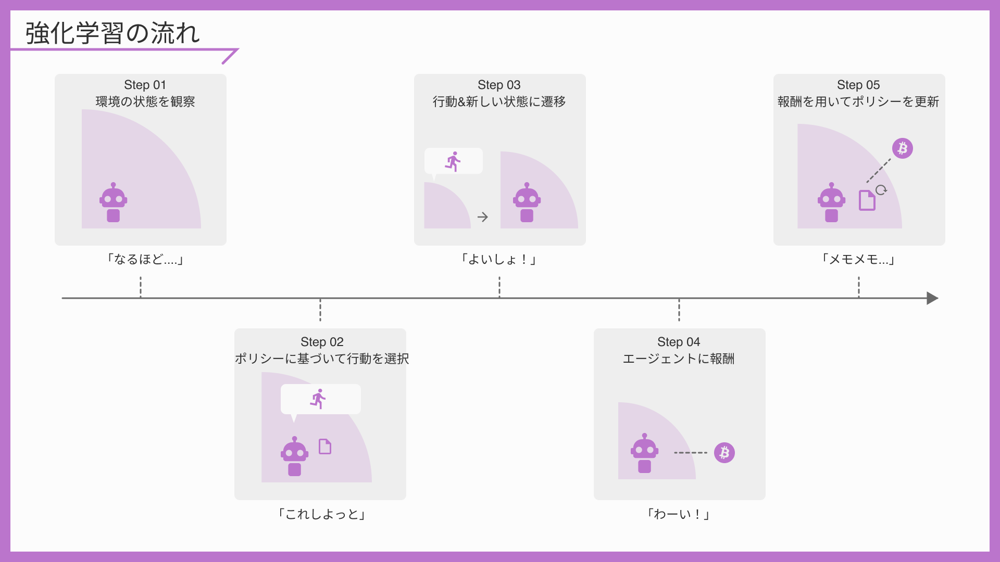
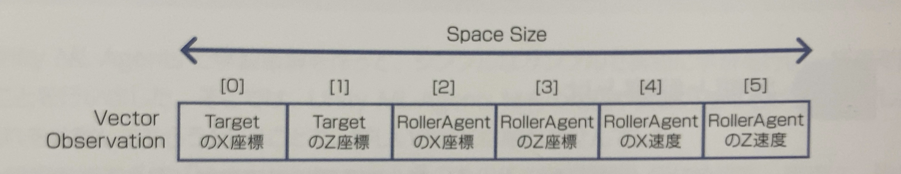
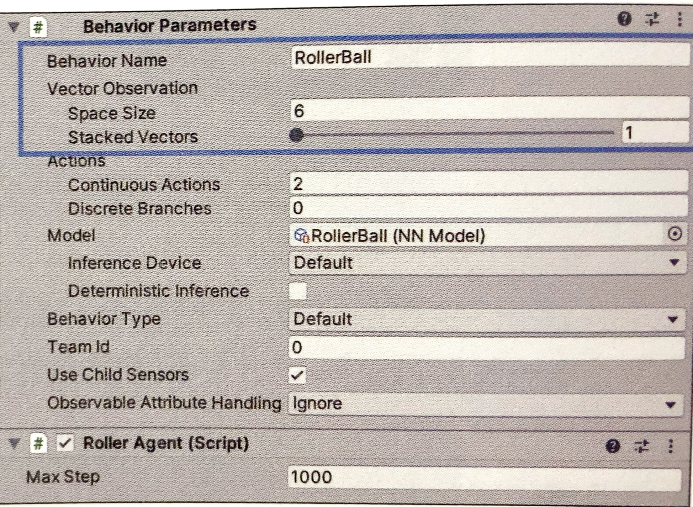

# 状態と観察

# 状態と観察とは

エージェントの行動によって、変化する環境の要素を「状態」と呼びます。  
「強化学習」では、エージェントは環境を観察して「状態」を取得し、その「状態」に応じて「ポリシー」が「行動」を決定します。



「状態」と似たものを表す用語として「観察」があります。

「状態」が「環境の持つ情報」なのに対し、  
特有のエージェントが利用できる「部分情報」を「観察」と呼びます。  

「完全観察環境」ではエージェントは環境のすべての情報「状態」を取得でき、  
「部分観察環境」ではエージェントは環境の部分的な情報「観察」のみを取得できます。

```
・部分観察環境：観察　⊂　状態
・完全観察環境：観察　＝　状態
```

「Unity ML-Agents」の基本データ型(浮動小数配列)の「観察」は、「Behavior Parameters」の「Vector Observation」で設定します。
それ以外にも各種センサーを使って、画像やレイキャストなど別形式の情報を「観察」として使用できます。  

下記各種センサーにかんして説明します

```
+ Vector Observations
+ Camera Sensor
+ Render Texture Sensor
+ Ray Perception Sensor
+ Buffer Sensor
+ Grid Sensor
+ Rigidbody Sensor
+ Match3 Sensor
```

<br>

## ・Vector Observation

「Vector Observation」では、問題解決に必要な情報（位置や速度）を格納した配列を「観察」として利用します。




・実装手順
### ①.Behavior Parametersの設定

```
BehaviorName:  
Vector Observation → SpaceSize:
Vector Observation → Stacked Vector:
```




過去の観察を決定の判断基準に利用する場合は、「Stacked Vector」の値を増やします。スタック数が２の場合は、現フレームの観察だけでなく、１フレーム前の観察も「決定」の判断材料として使うことになります。  
（過去の経験を使う/使わない。使うとしたらいくつ使うかの判断は、環境に応じて人間が決定します。）


### ②.CoollectObservations()の実装

CoollectObservations()をオーバーライドし、引数として渡される「VectorSensor」のAddObservation()で観察値を追加します。
AddObservation()は以下のようにデータ型別に用意されています

```
・ void AddObservation(float observation):float値の観察（サイズ１）
・ void AddObservation(int observation) 値の観察（サイズ１）
・ void AddObservation(bool observation)値の観察（サイズ１）
・ void AddObservation(Vector3 observation)値の観察（サイズ3）
・ void AddObservation(Vector2 observation)値の観察（サイズ2）
・ void AddObservation(Quarternion observation)値の観察（サイズ4）
・ void AddObservation(int observation,int range):one-hot表現の観察（離散値数）
```


```
    // 観測を収集するために呼び出されます
    public override void CollectObservations(VectorSensor sensor)
    {
        // エージェントとターゲットの相対位置を観測
        sensor.AddObservation(targetTransform.localPosition - transform.localPosition);
    }
```

<br>


## ・観察を設定する際のポイント

「観察」を設定する際、気を付けるポイントをいくつか紹介します。

#### ①観察には行動決定に必要な情報をすべて含める  
　ただし、観察サイズが大きくなると学習時間も長くなるので、必要最低限の情報を含めるようにします

#### ②離散値(数や量で測れない変数)を観察する場合は、「one-hot 表現」を使う
　たとえば、次のような変数（weapon）があり、AddObservation()で観察する場合を想像してください。
これで学習させると、weaponの値は、剣が有効だと判断したら「1」、斧が有効と判断したら「2」、弓が有効と判断したら「3」に近づきます。しかし、剣と弓が同じくらい有効な場合は、斧が有効かどうかに関係なく「2」に近づきます。  
そのため、学習後に「2」であったとしても斧が有効であるとは限りません。
```cs
const int SWORD = 1;//剣
const int AXE = 2;  //斧
const int BOW = 3;//弓

int weapon = SWORD;//装備武器

AddObservation(weapon)
```


「one-hot 表現」とは、ある要素のみが「１」でそのほかの要素が「０」である表現方法です。これで学習させると、「sword」「axe」「bow」は、その武器が有効と判断したら「１」、無効と判断したら「０」に近づきます。  
そのため、学習後に大きな値のものが装備すべき武器であることがわかります。


```
剣：1 → [1,0,0]
斧：2 → [0,1,0]
弓：3 → [0,0,1]
```

```cs
int sword = (weapon == SWORD ? 1 :0)
int axe = (weapon == AXE ? 1 :0)
int bow = (weapon == BOW ? 1 :0)

AddObservation(sword)
AddObservation(axe)
AddObservation(bow)
```

#### ③連続値(数や量を表現する変数)を観察する場合は正規化
正規化とは、値を「-1.0~1.0」の範囲に収めることです。
正規化したほうが学習効率が良くなります。
後ほど説明する「学習設定ファイル」のパラメータの「normalize」で自動的に正規化することもできます。

