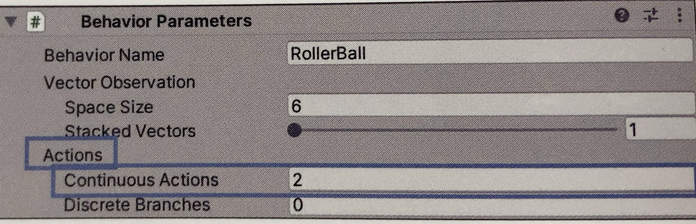
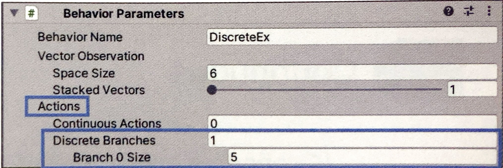

# 行動

## 行動とは

「行動」はエージェントが実行するポリシーからの指示です。  
「強化学習サイクル」では、エージェントの「ポリシー」が「状態」に応じて「行動」を決定し、その「行動」をエージェントは実行する。

↓でいう２番目と３番目。取得した環境に応じてエージェントが行動を行う過程になる


「Unity　ML-Agents」の「行動」には、次の２つのデータ型が存在します。

```
・Continuous:連続値（-１.０～１.０）
・Discrete:離散値（０，１，２・・・）
```

<br>

### Continuous
「Continuous」では、連続値の要素を持つ浮動小数配列を、「行動」として利用します。
「連続値」は「-1.0 ~ 1.0」のような連続した値を意味します。
「Continuous」な「行動」を利用するには、「Actions　→ Continuous Actions」に、Continuousな行動のサイズ（使用する連続値の個数）を指定します。




|設定項目|説明|
| ---- | ---- |
|Actions > ContinuousActions|Continuousな行動のサイズ|


次の「行動」を利用する際の「Behavior Parameters」の設定は、次のとおりです。

```
「行動」
・Continuous
  0:RollerAgentのx方向に加える力
  1:RollerAgentのz方向に加える力 
```
↓
```
Actions > Continuous Actions:2
```
この時、OnActionReceived()に渡される「行動」は、サイズ2の浮動小数配列になります
```
・actionBuffers.ContinuousActions[0]: -1.0 ~ 1.0
・actionBuffers.ContinuousActions[1]: -1.0 ~ 1.0
```
<br>

### Discrete

「Discrete」では、離散値の要素を持つ整数配列を行動として利用します。  
「離散値」は「0,1,2」のような離散した値になります。
「Discrete」な「行動」を利用するには、「Behavior Parameters」の「Actions → Discrete Branches」に、Discreteな行動のサイズ（使用する離散値の個数）、その下の「Branch X Size」にX番目の離散値の範囲（0 ~ 設定値未満）を指定します。


|設定項目|説明|
| ---- | ---- |
|Actions → DiscreteBranches|Discreteな行動のサイズ|
|Actions → DiscreteBranches → Branch X Size|X番目の行動の値の範囲(0 ~ 設定値範囲)|




次の「行動」を利用する際の「Behavior Parameters」の設定は、次のとおりです。

```
「行動」
・Discrete（サイズ１）
  0:移動
  (0:,1:,2:,3:,4:)
```
↓
```
Actions > Discrete Branches:1
Actions > Discrete Branches > Branch 0 Size :5
```

この時、OnActionReceived()に渡される行動は、サイズ１の整数配列になります。

```
・actionBuffers.DiscreteActions[0]:0,1,2,3,4のいずれか
```

<br>

### 行動を設定する際のポイント

「行動」を決定する際に気を付けるべきポイントをいくつか紹介します。

#### ・行動には必要なものを全て含める
ただし、行動サイズが大きくなると学習時間も長くなるので、必要最低限のものを含めるようにします

#### ・Continuousな行動の場合、行動値は -1.0 ~ 1.0 になる
行動値を元に、オブジェクトに「-10 ~ 10」の力を加えたい場合は、10をかける必要があります。
```
//RollerAgentに力を加える
Vector3 controlSignal = Vector3.zero;
controlSignal.x = actionBuffers.ContinuousActions[0];// -1.0 ~ 1.0
controlSignal.z = actionBuffers.ContinuousActions[1];// -1.0 ~ 1.0
rBody.AddForce(controlSignal * 10);// -10 ~ 10
```


#### ・Discreteな行動の場合、状態に応じて選択できない行動をマスクする
選択できない行動を指定することで、学習効率が上がります。
```cs
public override void WtiteDiscreteActionMask(IDiscreteActionMask actionMask){

  //行動マスクの設定
  // actionMask.SetActionEnabled(int 行動をマスクするブランチ , int 行動をマスクするインデックス , bool 行動が許可されているかどうか);

  if(transform.localposition.x == 0){
    actionMask.SetActionEnabled(0,key_left,false);
  }
  if(transform.localposition.x == 100){
    actionMask.SetActionEnabled(0,key_right,false);
  }

}
```
