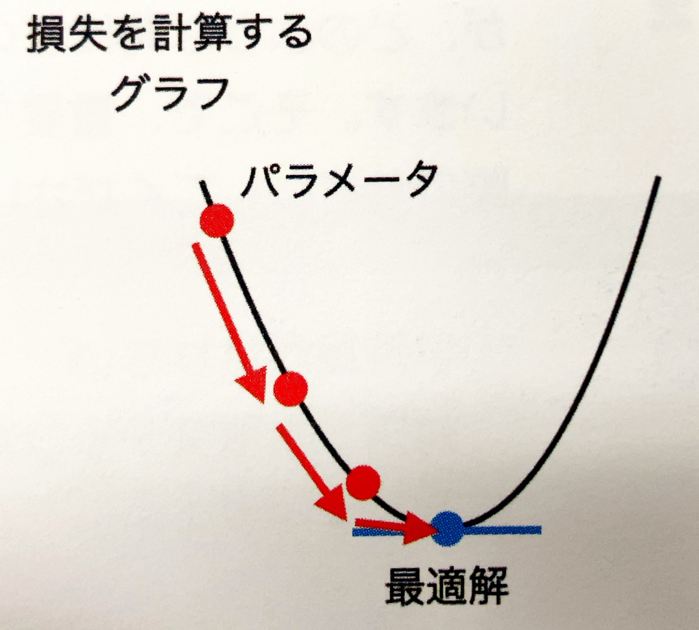
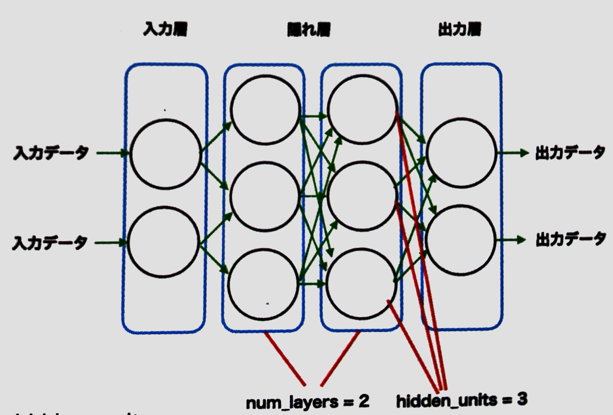
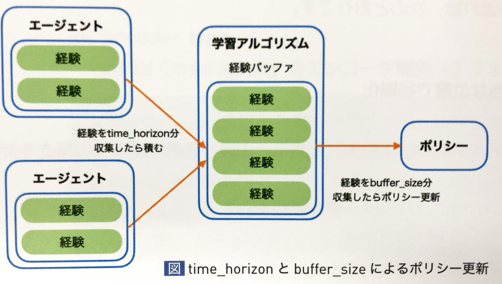

# 3-5 学習設定ファイル

2の「学習と推論」での設定について

ここで紹介するもの以外に「セルフプレイ」「Curiosity」「模倣学習」「LSTM」専用のパラメータも存在しますがそちらは別で言及します

<br>

## 学習設定ファイルとは

「学習設定ファイル」(*.yaml)は、学習に利用するハイパーパラメータを設定するファイルです。  
機械学習のパラメータの中で、人間が調整する必要があるパラメータのことを「ハイパーパラメータ」と呼びます。  
学習設定ファイルは１環境につき１つ用意する必要があります。

### PPOとSAC

「Unity ML-Agents」で標準で使える強化学習アルゴリズムは「PPO」と「SAC」になります。
ハイパーパラメーターの設定項目は、「PPO」と「SAC」どちらのアルゴリズムを使うかで異なります。
慣れないうちはPPOを使うことで問題ありません。

PPOとSACの違いは[別の章](../4/4_1.md)で解説します

```
・PPO（Proximal Policy Optimization）
・SAC（Soft Actor-Critic）
```


<br>

## PPOの学習設定ファイルの例

「PPO」の学習設定ファイルの例は、次の通りです。  
最上位セクション「behaviors:」の下にセクション「<Behavior Name>:」を配置し、さらにその下に各種ハイパーパラメーターを設定します。「Behavior Name」は、「Behavior Parameters」で設定するポリシー毎の識別子になります。

```yaml
behaviors:
  RollerBall:
    #トレーナー識別
    trainer_type: ppo 
    
    #基本
    max_steps: 500000
    time_horizon: 64
    summary_freq: 1000
    keep_checkpoints: 5

    #学習アルゴリズム
    hyperparameters:
      #PPOとSAC共通
      batch_size: 10
      buffer_size: 100
      learning_rate: 0.0003
      learning_rate_schedule: linear

      #PPO用
      beta: 0.005
      epsilon: 0.2
      lambd: 0.95
      num_epoch: 3
    
    #ニューラルネットワーク
    network_settings:
      normalize: true
      hidden_units: 128
      num_layers: 2

    #報酬
    reward_signals:
      extrinsic:
        gamma: 0.99
        strength: 1.0

```


<br>

## SACの学習設定ファイルの例
「SAC」の学習設定ファイルの例は、次のとおりです。「トレーナー種別」と「ハイパーパラメーター SAC用」以外の設定は、「PPO」と同じ設定項目になります。

```yaml
behaviors:
  #トレーナー識別  
  RollerBall:
    trainer_type: sac

    max_steps: 500000
    time_horizon: 64
    summary_freq: 1000
    keep_checkpoints: 5

    hyperparameters:
      batch_size: 64
      buffer_size: 12000
      learning_rate: 0.0003
      learning_rate_schedule: constant

      #SAC専用
      buffer_init_steps: 0
      tau: 0.005
      steps_per_update: 10.0
      save_replay_buffer: false
      init_entcoef: 0.01
      reward_signal_steps_per_update: 10.0

    network_settings:
      normalize: true
      hidden_units: 128
      num_layers: 2

    reward_signals:
      extrinsic:
        gamma: 0.99
        strength: 1.0


```


<br>

## `behaviors` セクション
- `RollerBall`: これはエージェントのビヘイビア名です。ML-Agentsでエージェントに割り当てる名前で、スクリプトと一致する必要があります。

<br>

## トレーナーの種別
#### `trainer_type`
学習アルゴリズム（デフォルト：ppo）

<br>

## 基本のハイパーパラメーター

基本のパラメーターは次の通りです。
#### `max_steps`
- エージェントが学習を終了するまでの最大ステップ数。(デフォルト:500000)  
複雑な問題の場合、この値を増やす必要があります。  
例えば `5e6` は500万ステップを意味します。  

#### [`time_horizon`](3_5_2.md)
- 経験バッファに追加する前に、エージェント毎に収集する経験の数(デフォルト：64)。

PPOでは、エピソード内で頻繁に報酬が与えられる場合は小さな値。そうでない場合は大きい値が良いです。エージェントの行動シーケンス内の重要な動作をキャプチャするのに十分な大きさでなければなりません。      
SACでは、このパラメータはさほど重要ではなく、通常はおおよそのエピソード長を設定すれば問題ありません。
  
(エージェントが経験を蓄積するためにどのくらいの時間を考慮するか。これを小さくすると短期的な動作に対する反応が強化され、大きくすると長期的な報酬に対する考慮が強化されます。)

<br>

#### `summary_freq`
- 統計情報を何ステップ毎に保存するか。学習の進行状況が出力される頻度（デフォルト：5000ステップ）。このステップ数ごとに進行状況が記録されます。TensorBordで表示するグラフの粒度も変わります。

<br>

#### `checkpoint_interval`
- チェックポイントを何経験(何ステップ)ごとに保存するか（デフォルト：500000）。トレーニング中にモデルの状態を保存する頻度を指定するパラメータです。トレーニングが進行中でも、途中の状態を保存しておくことで、後からその状態に戻ってトレーニングを再開したり、異なるモデルバージョンを評価したりすることができます

<br>

#### `keep_checkpoints`
- 保存するチェックポイントの最大数（デフォルト：５）。最大数に達すると、古いチェックポイントから削除されます。

<br>

#### `threaded`
- 並列実行を有効にするかどうか。複数のスレッドでトレーニングを行う場合に`true`にします。（デフォルト：false）。ただ、trueにすると、環境ステップ実行中にポリシーの更新が行われる可能性があります。これは、学習の高速化と引き換えに、PPOのポリシー上の想定に少し違反します。

<br>

#### [`init_path`](3_5_3.md)
- 既存モデルで初期化して新規学習を開始するためのパス（デフォルト：None）。  


<br>

## 学習アルゴリズム

「hyperparameters」下に、学習アルゴリズムのパラメータを設定します。  
学習アルゴリズムのパラメータは「PPOとSAC共通」「PPO用」「SAC用」の３種類に分けられます。

## PPOとSAC共通

- **`batch_size`**:   
勾配降下１回に使用する経験数。バッチごとの学習サンプルの数。大きいほど安定するが、学習に時間がかかる可能性があります。

典型的な範囲  
+ Continuous+PPO: 512 ~ 5120     
+ Continuous+SAC: 128 ~ 1024  
+ Discrete: 32 ~ 512

<br>

- **`buffer_size`**:  
  一度にバッファに蓄積される経験の総数。ポリシー更新前に収集する経験数。(デフォルトでは、PPO：10240 / SAC：5000)。バッチを作成するために使用されます。典型的な範囲、以下の通りです。これは「batch_size」の倍数である必要があります。

+ PPO：2048 ~ 409600
+ SAC：5000 ~ 1000000

通常、大きいほどより安定した学習に繋がりますが、ポリシー更新サイクルは遅くなります。SACではエピソード長の数千倍、「batch_size」よりもはるかに大きな値にする必要があります。これにより、SACは古い経験からも新しい経験からも学習できるようになります。

<br>

- [**`learning_rate`**](3_5_4.md):   
学習率(デフォルト：3e-4)。大きいほど速く学習するが、不安定になる可能性があり、小さすぎると収束が遅くなります。典型的な範囲は、以下の通りです。

+ PRO / SAC : 1e-5 ~ 1e-3

学習率の確率で「探索」、「1 - 学習率」の確立で「活用」を行います。報酬が継続的に増加しない場合は、通常この値を減らす必要があります。

<br>

- **`learning_rate_schedule`**:  
学習率の減少方法（デフォルトは、PPO：linear / SAC：constant）。学習率が時間とともにどのように変わるかを設定。ここでは線形的に減少する設定です。
```
・linear：線形減衰させ、max_stepsで0
・constant：一定に保つ
```
PPOでは、学習が安定して収束するように「linear」をお勧めします。SACでは「constant」を指定し、自然に収束するまで学習し続けることをお勧めします。

<br>

## PPO用

- **`beta`**:   
[エントロピー](3_5_5.md)のランダムさ（デフォルト：5.0e-3）。エントロピー正則化係数。エージェントの行動のランダム性を維持するためのもの。小さくすると決定的な行動を取るようになります。

・典型的な範囲：1e-4 ~ 1e-2

報酬の増加とともに、少しずつ減少するように調整する必要があります。エントロピーが急激に減少する場合は「beta」を増やし、エントロピーの低下が遅すぎる場合は「beta」を減らす必要があります。

<br>

- **`epsilon`**:   
旧ポリシーと新ポリシーの更新比率（デフォルト：0.2）  
PPO特有のクリップ範囲。大きいほど、更新が行動ポリシーから外れることを許可しますが、不安定になる可能性があります。

・典型的な範囲：0.1 ~ 0.3

この値を小さく設定すると、学習がより安定しますが、学習速度が遅くなります。

<br>


- **`lambd`**:   
GAE（Generalized Advantage Estimation）に使われる正則化パラメータ(デフォルト：0.95)。将来の報酬予測に関与します。

・典型的な範囲：0.9 ~ 0.95

<br>

- [**`num_epoch`**](3_5_6.md):  
学習する際のバッファからバッチをどれだけ繰り返して使用するかの回数。ポリシー更新時の学習データの学習回数(デフォルト：3)

・典型的な範囲：3 ~ 10

「batch_size」が大きいほど、これを大きくすることができます。これを増やすとより安定した学習になりますが、学習速度が遅くなります。

<br>

<br>

## SAC用

####  `buffer_init_steps`
学習開始前に何ステップのランダム行動を経験バッファに埋めるか（デフォルト：0）。エージェントが最初に十分な経験を積む前に、学習を開始しないようにします。学習の初期段階での安定性を改善したい場合に変更します。

・典型的な範囲：1000 ~ 10000

学習されていないポリシーはランダムであるため、ランダムな行動でバッファを事前に埋めておくことは探索に役立ちます。

<br>

#### [`tau`](3_5_7.md)
モデル更新中のターゲットの更新の大きさ(デフォルト：0.005)

・典型的な範囲：0.005 ~ 0.01

通常この値は0.005のままにしてください。単純な問題の場合、tauを0.001に増やすと安定性を犠牲にして学習速度を上げることができます

<br>

###  `steps_per_update`
- **説明**: ポリシーやネットワークの更新が行われるまでの環境ステップの数を指定します。これは、何ステップ進むごとに学習（パラメータの更新）が行われるかを決定します。
- **役割**: エージェントが環境からデータを集める頻度と、そのデータを使って学習する頻度をバランスさせます。値を大きく設定すると、より多くのデータを収集してから更新が行われますが、更新のタイミングが遅れます。逆に値が小さいと、頻繁に更新が行われますが、学習の進行が早すぎて不安定になる可能性があります。
- **使用頻度**: 調整することはありますが、一般的には標準値で使用されます。

<br>

###  `save_replay_bufferf`

リプレイバッファの保存(デフォルト：false)
学習を再開する時に、経験リプレイバッファとモデルを保存、およびロードできます。  
これは、収集された経験が消去されないため、再開をよりスムーズにします。ただし、再生バッファは非常に大きくなる可能性があり、かなりのディスク容量を占有することに注意してください。

<br>

#### `init_entcoef`
学習開始時にエージェントがどの程度探索するか（デフォルトは、Continuois：0.5 ~ 1.0 / Discrete：0.05 ~ o.5）。  
init_entcoefを増やすと、学習開始時により多くを探索し、減らすとより早く学習が収束します。報酬を見つけても、なかなかそれに収束しない場合は、減らすとよいです。

<br>

###  `reward_signal_steps_per_update`
ポリシー更新に対する報酬シグナルのステップ数の平均比率（デフォルト：steps_per_update）

[報酬信号](3_5_1.md)に関連するネットワーク（クリティックなど）の更新頻度を指定します。何ステップごとに報酬信号が更新されるかを決めます。

報酬設計が複雑な場合や報酬に関連する学習の微調整が必要な場合に調整されますが、一般的な環境では標準設定で十分な場合が多いです。

<br>

<br>

## ニューラルネットワーク
`network_settings`（ネットワーク設定）下に、ニューラルネットワークのパラメータを設定します。

- **`normalize`**:   
観察データを正規化するかどうか（デフォルト：false）。  
「Vector Observation」の入力を「正規化」（-1~1の範囲に補正）することで、学習効率をあげます。複雑な「Continuous」の問題では特に効果を発揮しますが、単純な「Discrete」の問題では逆効果になる場合もあります。

学習を安定させるために`true`にするのが一般的です。

<br>

- **`hidden_units`**:   
隠れ層のニューロン数(デフォルト：128)。各レイヤーの隠れユニット数。値が大きいほど複雑なパターンを学習できるが、学習時間が増えます。

・典型的な範囲：32 ~ 512  

単純な問題の場合、小さいほうがより高速に学習できます。複雑な問題の場合、より多くする必要があります。

<br>

- **`num_layers`**:   
隠れ層の数（デフォルト：2）。ニューラルネットワークのレイヤー数。  
・典型的な範囲：1 ~ 3
単純な問題の場合、小さいほうがより高速に学習できます。複雑な問題の場合、より多くの層が必要になります。

<br>


- **`vis_encode_type`**:   
「Visual Observation」のエンコーダー種別（デフォルト：simple）。
```
・simple：2つの畳み込み層で構成されるシンプルなエンコーダ    
・nature_cnn：3つの畳み込み層で構成されるCNN 
・resnet：2つの残差ブロックを持つ3つスタックレイヤーで構成されるIMPALA Resnet  
・match3：ボードゲーム用に最適化された小さなCNN
・full_connected：畳み込み層のないエンコーダ 
```

<br>

- **`conditioning_type`**: 
ポリシーの条件付け種別(デフォルト：hyper)
 ```
 ・none:目標の観測を通常の観測として扱う
 ・hyper:入力として目標観測値を持つHyperNetworkを使用する
 ```

<br>

<br>

## 環境報酬
[`reward_signals`（報酬信号）](3_5_1.md)下の `extrinsic`(外的報酬。環境から与えられる報酬の設定)下に、環境報酬のパラメータを設定します。

+ 環境報酬（Extrinsic Reward）: 環境から外部的に与えられる報酬(ゴール到達・障害物回避・作業成功など)。   
+ 内部報酬（Intrinsic Reward）: 探索や好奇心など、エージェントの内部動機に基づく報酬。

<br>

  - **`strength`**:   
  報酬信号の強さを設定。環境報酬を乗算して、他の報酬(Curiosityなど)とのバランスを調整（デフォルト：1.0）
  ・典型的な範囲：0.001 ~ 0.1

<br>

  - **`gamma`**:   
  割引率。将来の報酬の重要度をどれだけ考慮するか。
  (デフォルト：0.99)  
  ・典型的な範囲：0.8 ~ 0.995


<br>

---
---

<br>

# 勾配降下

「勾配降下」は損失（最適解との差）を最小にするパラメータ（重みやバイアス）を見つけるためのアルゴリズムです。このアルゴリズムを使って、より多くの報酬がもらえる行動をとるように、ポリシーの更新を行います。  
「勾配降下」の処理の流れは次のとおりです。

①　パラメータを適当な位置で初期化

②　与えられたパラメータにおける損失（最適解との差）を表すグラフの傾きを計算

③　最も傾きの大きい方向に、パラメータを少しずらす

④　②と③を繰り返す

これによって、ボールが勾配（斜面）を転がっていくようにパラメータを最適解に近づけていきます。以下は、縦軸が損失、横軸がパラメータの値を示すグラフになります。

「勾配降下」に関するハイパーパラメータは、  
「batch_size」  
「num_epoch」(PPO)  
「epsilon」(PPO)    
の３つがあります。  
「batch_size」は１回の勾配降下で利用する学習データ（経験）の数、  
「num_epoch」(PPO)は１回のポリシー更新時で行う勾配降下の回数、   
「epsilon」(PPO) は旧ポリシーと新ポリシーの更新比率に対する許容限界を指定します。



<br>

---
---

<br>


# num_layers と　hidden_units
「num_layers」はニューラルネットワークの隠れ層の数、「hidden_units」は隠れ層のニューロン(ユニット)の数です



<br>

---
---

<br>

# time_horizon　と　buffer_size

「time_horizon」と「buffer_size」はエージェントの経験（観察、行動、報酬）の収集に関するハイパーパラメータです。  
各エージェントは、経験を「time_horizon」分収集したら学習アルゴリズムの経験バッファに積み、経験バッファは経験を「buffer_size」分収集したら「ポリシー更新」を行います。




<br>

---
---

<br>


# ・ハイパーパラメーターの用途別まとめ

「学習設定ファイル」のたくさんのハイパーパラメータを紹介しましたが、


① **学習量が足りない**  
対処：学習ステップ数を増やす  
パラメータ：max_steps

② **統計情報の保存頻度を更新したい**  
対処：統計情報の保存頻度の設定  
パラメータ：summary_freq

③ **行動種別(ContinuousとDiscrete)に応じて調整する**   
対処：バッチサイズの調整  
パラメータ：batch_size、buffer_size、time_horizon  
対処：正規化の調整  
パラメータ：normalize


④ **エージェントが問題を理解できていない**  
対処：ニューラルネットワークのサイズの調整  
パラメータ：num_layers、hidden_units、vis_encode_type(Visual Observation)

⑤ **エージェントが探索しすぎ、しなさすぎ**  
対処：エントロピー（行動のランダムさ）の調整  
パラメータ：beta(PPO)、init_entcoef(SAC)  
対処：学習率(探索と活用の割合)の調整   
パラメータ：learning_rate、learning_rate_schedule  

<br>


<br>

これらの設定を調整することで、エージェントの学習速度やパフォーマンスをコントロールできます。


