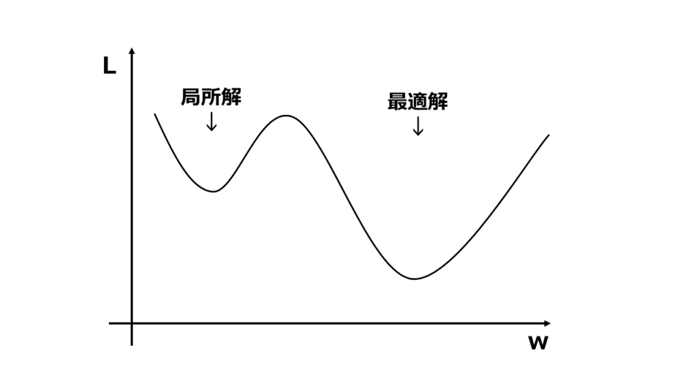

ML-Agentsでの学習プロセスにおける**誤差伝搬**や**勾配降下**の概念は、ニューラルネットワークのパラメータを最適化するための重要な仕組みです。これをML-Agentsの流れに関連付けて説明します。

 

 

# 1. 強化学習と誤差伝搬・勾配降下の流れ

ML-Agentsでは、エージェントが環境から観察データを受け取り、その観察をもとに行動（アクション）を選びます。これによりエージェントは**報酬**を得たり失ったりしますが、その過程でエージェントの行動を決定するニューラルネットワークを改善していきます。この学習過程で登場するのが**誤差伝搬**と**勾配降下**です。

## a. **観察と行動の決定**
エージェントが環境から観察データを収集し、ニューラルネットワークに入力します。このネットワークは、観察データに基づいて次に取るべき行動を決定します。例えば、観察データには位置や速度などが含まれ、行動は左右への移動や前進、回避などが含まれます。

## b. **報酬の取得**
エージェントは行動を行い、環境から報酬を得ます。例えば、ターゲットに近づけば報酬が増え、遠ざかれば減るといった仕組みです。この報酬が、エージェントの行動を改善するためのフィードバックとなります。

## c. **誤差の計算**
エージェントの行動の評価として、得られた報酬と理想的な報酬との**誤差**を計算します。これが、ニューラルネットワークの最適化における重要な指標です。誤差は、エージェントが期待通りの行動をしているかどうかを測るための尺度です。

 

 

# 2. 誤差伝搬と勾配降下
エージェントが得た報酬と予測された報酬との誤差を基に、**勾配降下法（Gradient Descent）**を用いてニューラルネットワークのパラメータ（重み）を調整します。この調整プロセスにおいて、**誤差伝搬（Backpropagation）**が用いられます。

## a. **勾配降下法（Gradient Descent）**
勾配降下法は、ニューラルネットワークのパラメータを微調整する方法です。パラメータをどの方向に調整すれば誤差が減少するかを計算し、その方向に重みを更新していきます。これをステップごとに繰り返して、エージェントの行動が改善されるようにします。

- **学習率（Learning Rate）**は、この勾配降下の「ステップの大きさ」を決定するパラメータです。学習率が大きすぎると学習が不安定になり、小さすぎると学習が遅くなります。

 

 

## b. **誤差伝搬（Backpropagation）**
誤差伝搬は、ニューラルネットワークの出力層から入力層に向かって誤差を伝播させ、それに応じて各層の重みを調整する方法です。これにより、各ニューロンの重みがどれだけ誤差に影響しているかを評価し、適切に調整されます。

 

 

# 3. ML-Agentsにおける具体的な流れ

ML-Agentsでは、エージェントが行動し、報酬を得て、その報酬に基づいてニューラルネットワークの重みが調整されるというサイクルが**エピソード**ごとに繰り返されます。このサイクルの中で、勾配降下法と誤差伝搬がニューラルネットワークのパラメータを改善し、エージェントがより良い行動を選べるように学習が進みます。

- **時間軸で見ると**: エージェントが行動を取るたびに、得られた報酬がその行動が良かったかどうかのフィードバックになります。これに基づいて、次に同じ状況に遭遇した時にはより良い行動を選べるように、勾配降下法でネットワークが改善されていきます。

 

 

# 4. まとめ
- **誤差伝搬**は、エージェントの行動評価に基づいてニューラルネットワークのパラメータを修正する手法。
- **勾配降下**は、その誤差を最小化するためにパラメータを調整する最適化アルゴリズム。
- **ML-Agents**では、このプロセスを通じてエージェントが環境内でより効率的に行動するための学習が行われます。

これにより、最終的にエージェントが**最適な行動**を学習し、タスクを完了できるようになります。