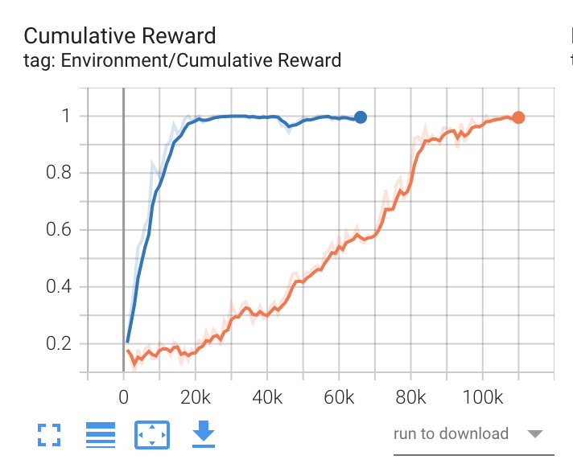
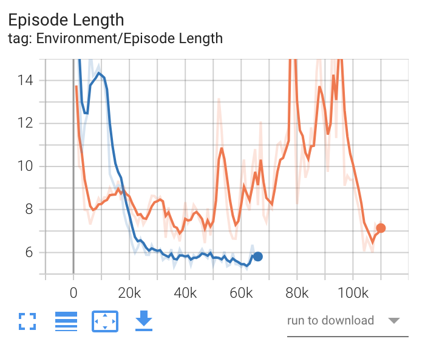
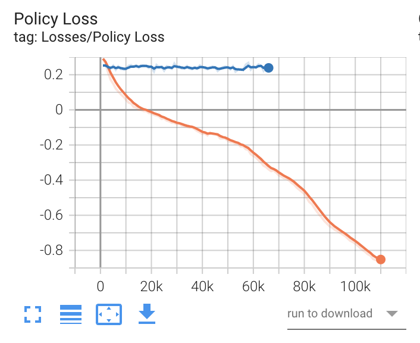
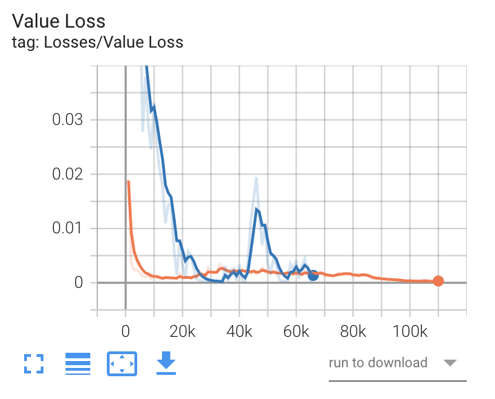
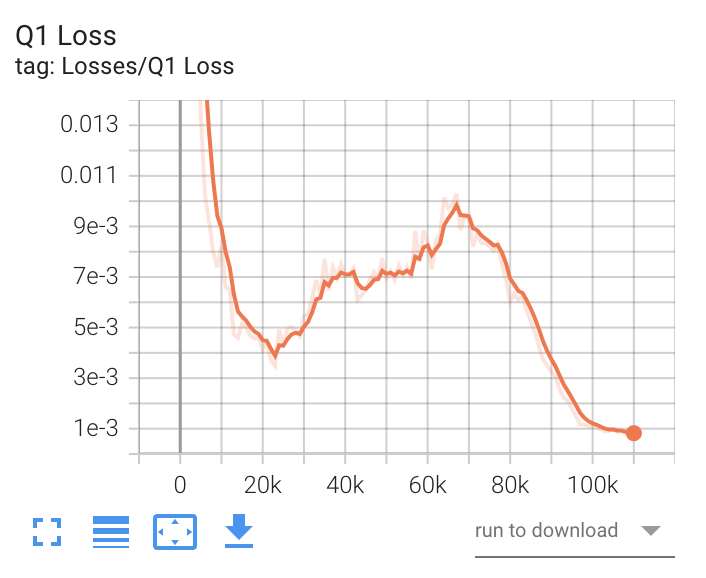
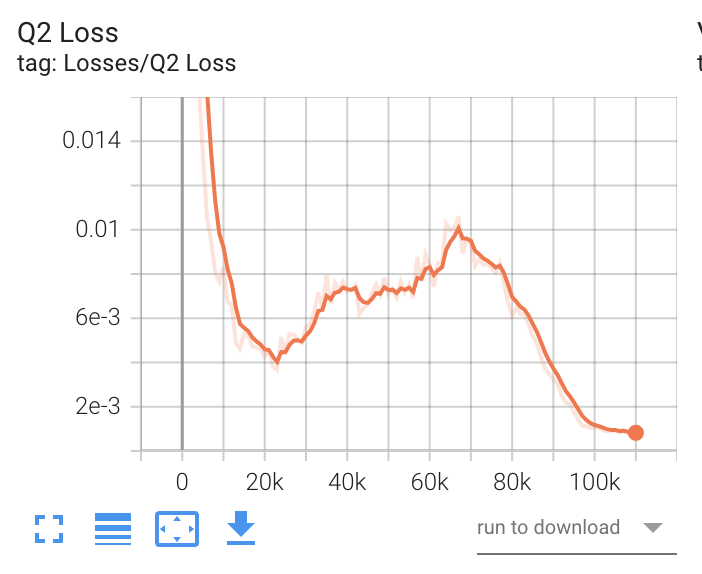

# 3-7 TensorBoard

ここで紹介するグラフの他に「セルフプレイ」「Curiosity」「模倣学習」「カリキュラム学習」専用のグラフが存在しますがここでは取り上げません。４のそれぞれの学習で確認してください

<br>

# TensorBoardとは

「TensorBoard」は「深層学習フレームワーク」が出力する学習状況の統計情報を可視化するツールです。  
「Unity MLAgents」は学習時に、「ml-agentsフォルダ」直下の「resultsフォルダ」に統計情報を出力します。これを「TensorBoard」で閲覧することによって、学習状況の詳細をリアルタイム、または学習後に把握することができます。

<br>

# TensorBoardの使用方法

「TensorBoard」の使用方法は次のとおりです。
### ①学習とは別のターミナルを開く
### ②Pythonの仮想環境で、「ml-agents フォルダ」の直下に移動して、以下のコマンドを入力
```
tensorboard --logdir=./results
```
### ③ブラウザで「localhost:6006」を開く
「TensorBoard」の画面が表示されます。

<br>

# TensorBoardの操作方法

TensorBoardを起動したら、「SCALARS」タブを選択してください。「SCALARS」タブは左側の「設定エリア」と右側の「表示エリア」に分かれています。


「設定エリア」の機能は、次の通りです

### ・データダウンロードリンクを表示
データをダウンロードするためのリンクをグラフの下に表示します。

<br>

### ・外れ値を無視してグラフをスケーリング
外れ値を無視して、グラフを整えます。

<br>

### ・ツールチップのソート
ツールチップのソート方法を指定します。

|項目|説明|
|---|---|
|Default|Nameのアルファベット順|
|Ascending|値の小さい順|
|Descending|値の大きい順|
|Nearest|マウスに近い順|

<br>

### ・グラフのスムージング
グラフにスムーズさを0~1で指定します。0はスムージングなしで、１は最もスムーズになります。

<br>

### ・グラフの横軸

グラフの横軸を指定します。通常は「STEP」で問題ありません。

|項目|説明|
|---|---|
|STEP|ステップ|
|RELATIVE|実行時間(初回からの差分)|
|WALL|時刻|

<br>

### ・グラフの表示・非表示

複数のグラフを選んで、比較することもできます。

右側の「表示エリア」は３つの領域に分かれています。各領域のタイトルをクリックすることで、領域のオープン・クローズを行うことができます。

|項目|説明|
|---|---|
|Enviroment|環境に関する統計情報|
|Losses|損失に関する統計情報|
|Policy|ポリシーに関する統計情報|

<br>

# TensorBoardのグラフ

３つの領域「Enviroment」・「Losses」・「Policy」について見ていきます。

## 「Enviroment」

強化学習の環境の学習結果を示すグラフ群です。
一番重要なグラフ群になります。

+ **Cumulative Rewad**

全エージェントの平均累積エピソード報酬を表すグラフです。継続して安定して（小さな振れ幅で）増加することが期待されます。



<br>

[Extrinsic Reward（外部報酬）とCumulative Reward（累積報酬）について](3_7_1.md)

<br>

+ **Episode Length**

全エージェントの環境内の各エピソードの平均の長さを表すグラフです。増加した方が良いか、減少した方が良いかは、学習環境によって異なります。



<br>

<br>

## [「Losses」](3_7_2.md)

ニューラルネットワークの損失（最適解との差）を示すグラフ群です。基本的に減少する（最適解との差が減る＝予測精度が上がる）ことが期待されます。

+ **Policy loss**

ポリシー関数の平均損失を表すグラフです。ポリシーがどの程度変化しているかを示します。学習が成功すると、減少します。



<br>

+ **Value Loss**

価値関数の平均損失を表すグラフです。モデルがどれだけうまく予測できるか示します。エージェントが学習している間は増加し、報酬が安定すると減少します。



<br>

+ **Q1 Loss(SAC)**

SACの１つ目のQ関数の損失を表すグラフです。



<br>

+ **Q2 Loss(SAC)**

SACの２つ目のQ関数の損失を表すグラフです。



<br>

<br>

## 「Policy」

ポリシーに関するグラフ群です。行動の決定のランダムさ（Entropy）、報酬シグナル別の平均累計報酬（Reward）、任意の時点で受け取ることを予測する将来の報酬（Estimate）、学習率（Learning Rate）などのグラフが提供されます。

[表記される項目が以前と異なるので追加](3_7_tensorboard_policy.md)


+ [**Entropy(PPO)**](3_5_5.md)  
行動の決定がどれだけランダムであるかを表すグラフです。継続して減少することが期待されます。
減少が早すぎるか、減少に時間がかかりすぎる場合は、「beta」を調整する必要があります。

<br>

+ **Entropy(SAC)**

行動の決定がどれだけランダムであるかを表すグラフです。学習中に最初に増加し、ピークに達し、エントロピー係数とともに減少します。  
これは、最初にエージェントが高いエントロピー係数の影響で、探索するようにランダムが奨励されているためです。減少が早過ぎるが、減少に時間がかかり過ぎる場合は、[「init_entcoef」](3_7_init_entcoef.md)を調整する必要があります。


<br>

+ **EntropyCoefficient(SAC)**

エントロピー係数を表すグラフです。SACで学習したエージェントは、問題を解決しながらランダムに動作することが奨励されます。  
エントロピー係数は、ランダムに行動するインセンティブと報酬を最大化するインセンティブのバランスをとります。この値は、学習中にエージェントがある程度のランダム性を保持するように自動的に調整されます。  
学習の開始時に着実に減少し、一定の小さな値に達すると安定します。減少が早過ぎるか、減少に時間がかかり過ぎる場合は、「init_entcoef」を調整する必要があります。


<br>

+ **Extrinsic Reward**

報酬シグナル「Extrinsic」の平均累積エピソード報酬を表すグラフです。他の報酬シグナルとのバランスを確認するために使います。


<br>

+ **Extrinsic Value Estimate**

エージェントが任意の時点で受け取ることを予測する将来の報酬を表すグラフです。累計報酬が増加するにつれて、増加することが期待されます。


<br>

+ **Learning Rate**

[学習率](3_5_4.md)を表すグラフです。「learning_rate_schedule」が「linear」でない限り、時間と共に減少します。


<br>


