# 3-7 TensorBoard

ここで紹介するグラフの他に「セルフプレイ」「Curiosity」「模倣学習」「カリキュラム学習」専用のグラフが存在しますがここでは取り上げません。４のそれぞれの学習で確認してください

<br>

# TensorBoardとは

「TensorBoard」は「深層学習フレームワーク」が出力する学習状況の統計情報を可視化するツールです。  
「Unity MLAgents」は学習時に、「ml-agentsフォルダ」直下の「resultsフォルダ」に統計情報を出力します。これを「TensorBoard」で閲覧することによって、学習状況の詳細をリアルタイム、または学習後に把握することができます。

<br>

# TensorBoardの使用方法

「TensorBoard」の使用方法は次のとおりです。
### ①学習とは別のターミナルを開く
### ②Pythonの仮想環境で、「ml-agents フォルダ」の直下に移動して、以下のコマンドを入力
```
tensorboard --logdir=./results
```
### ③ブラウザで「localhost:6006」を開く
「TensorBoard」の画面が表示されます。

<br>

# TensorBoardの操作方法

TensorBoardを起動したら、「SCALARS」タブを選択してください。「SCALARS」タブは左側の「設定エリア」と右側の「表示エリア」に分かれています。


「設定エリア」の機能は、次の通りです

### ・データダウンロードリンクを表示
データをダウンロードするためのリンクをグラフの下に表示します。

<br>

### ・外れ値を無視してグラフをスケーリング
外れ値を無視して、グラフを整えます。

<br>

### ・ツールチップのソート
ツールチップのソート方法を指定します。

|項目|説明|
|---|---|
|Default|Nameのアルファベット順|
|Ascending|値の小さい順|
|Descending|値の大きい順|
|Nearest|マウスに近い順|

<br>

### ・グラフのスムージング
グラフにスムーズさを0~1で指定します。0はスムージングなしで、１は最もスムーズになります。

<br>

### ・グラフの横軸

グラフの横軸を指定します。通常は「STEP」で問題ありません。

|項目|説明|
|---|---|
|STEP|ステップ|
|RELATIVE|実行時間(初回からの差分)|
|WALL|時刻|

<br>

### ・グラフの表示・非表示

複数のグラフを選んで、比較することもできます。

右側の「表示エリア」は３つの領域に分かれています。各領域のタイトルをクリックすることで、領域のオープン・クローズを行うことができます。

|項目|説明|
|---|---|
|Enviroment|環境に関する統計情報|
|Losses|損失に関する統計情報|
|Policy|ポリシーに関する統計情報|

<br>

# TensorBoardのグラフ

３つの領域「Enviroment」・「Losses」・「Policy」について見ていきます。

## 「Enviroment」

強化学習の環境の学習結果を示すグラフ群です。
一番重要なグラフ群になります。

+ Cumulative Rewad

全エージェントの平均累積エピソード報酬を表すグラフです。継続して安定して（小さな振れ幅で）増加することが期待されます。

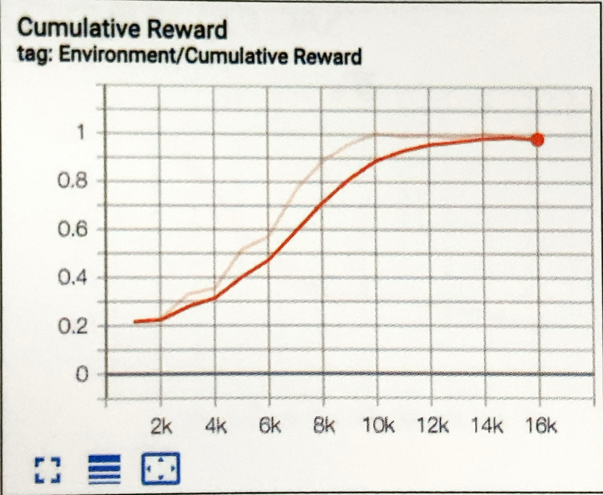

<br>

+ Episode Length

全エージェントの環境内の各エピソードの平均の長さ

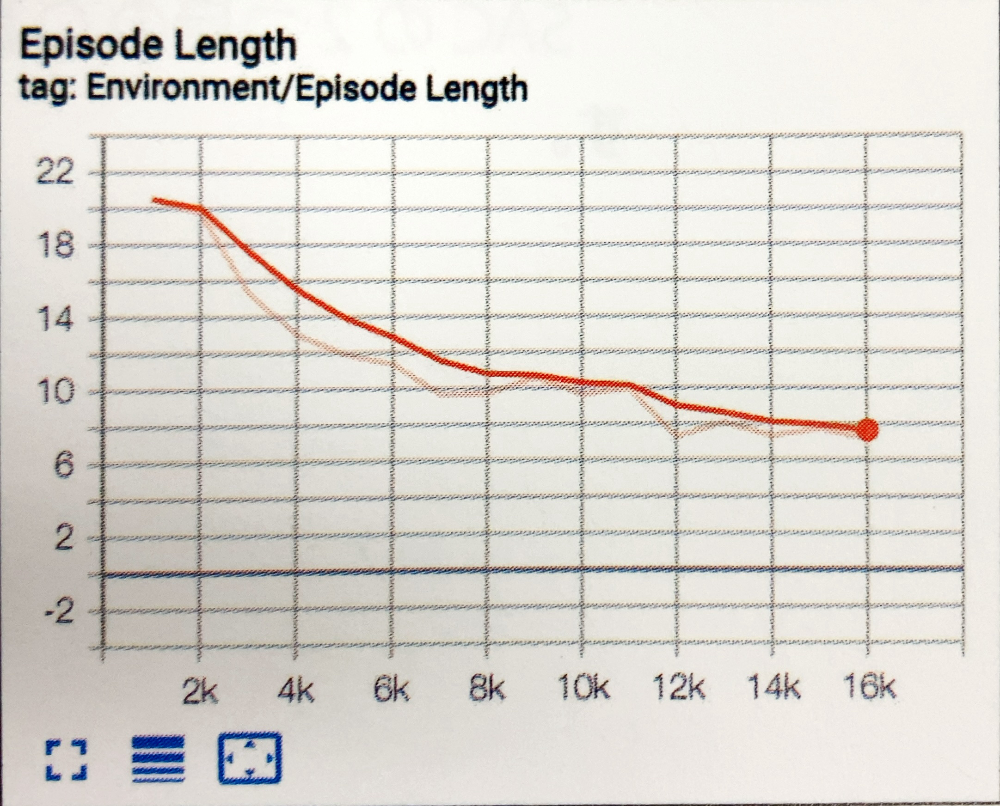

<br>

## 「Losses」

+ Policy loss

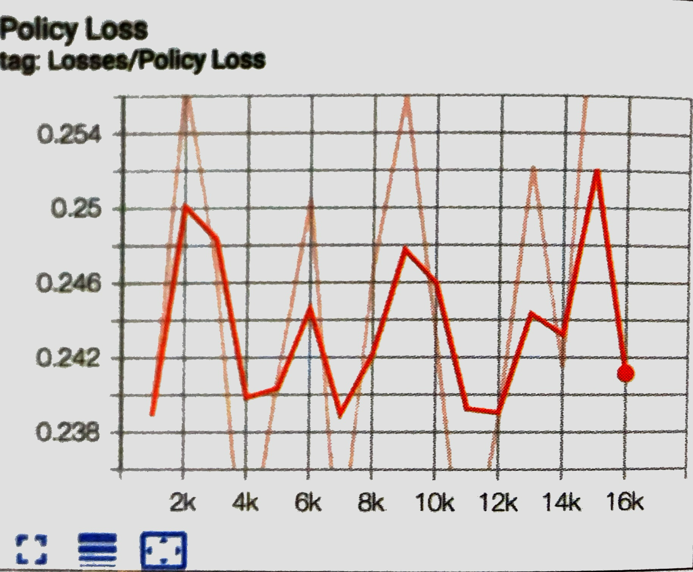

<br>

+ Value Loss

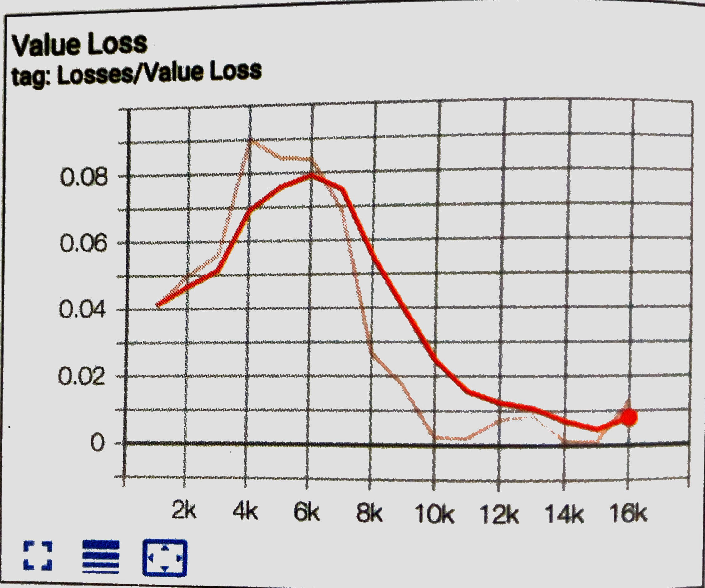

<br>

+ Q1 Loss(SAC)

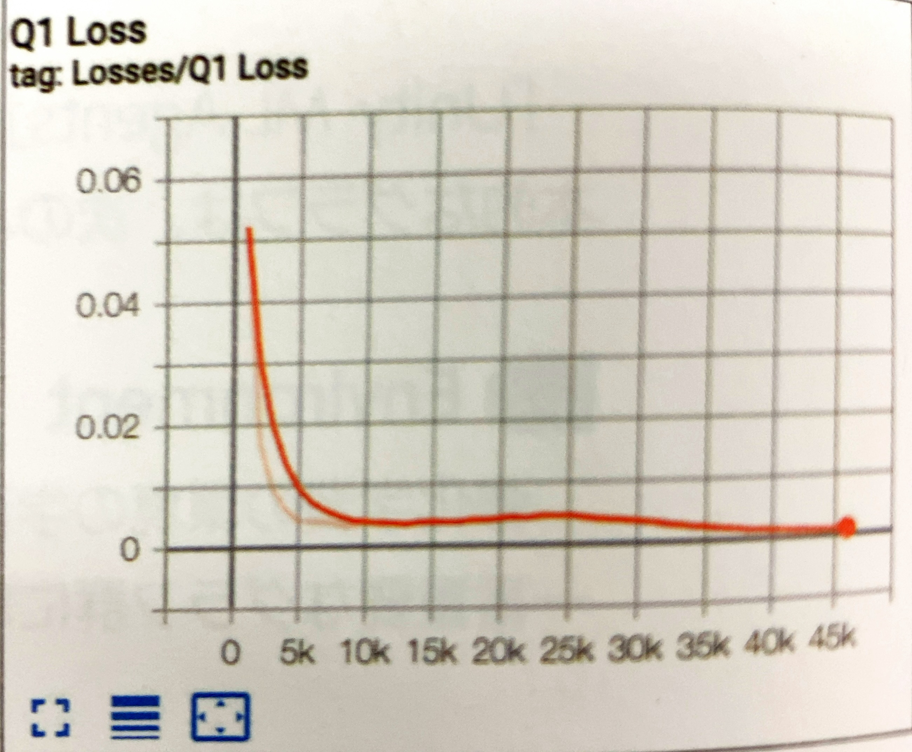

<br>

+ Q2 Loss(SAC)

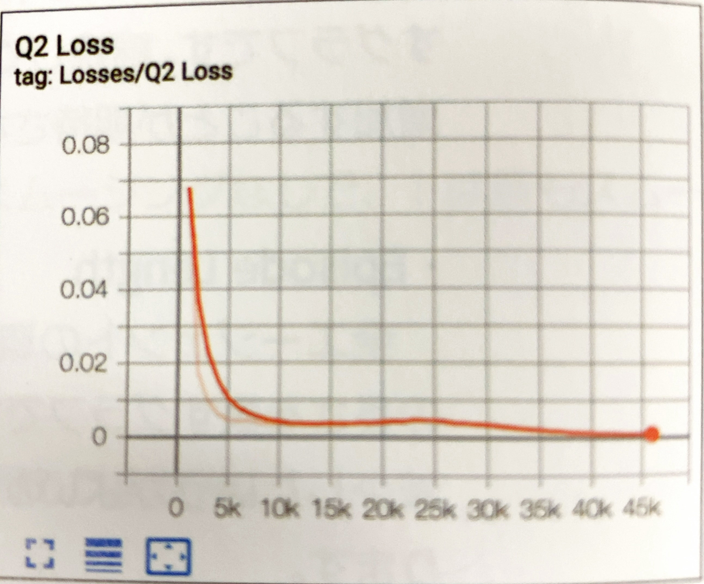

<br>

## 「Policy」

ポリシーに関するグラフ群です。行動の決定のランダムさ（Entropy）、報酬シグナル別の平均累計報酬（Reward）、任意の時点で受け取ることを予測する将来の報酬（Estimate）、学習率（Learning Rate）などのグラフが提供されます。

+ Entropy(PPO)  
行動の決定がどれだけランダムであるかを表すグラフです。継続して減少することが期待されます。
減少が早すぎるか、減少に時間がかかりすぎる場合は、「beta」を調整する必要があります。

<br>

+ Entropy(SAC)

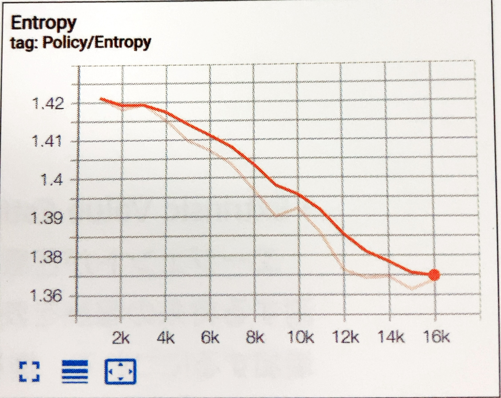

<br>

+ EntropyCoefficient(SAC)

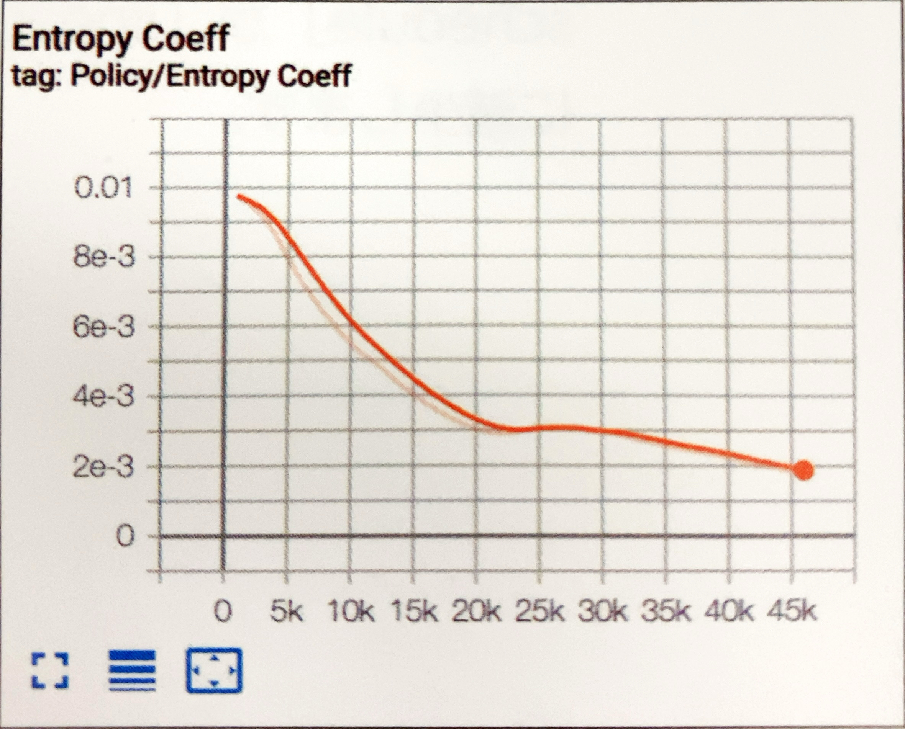

<br>

+ Extrinsic Reward

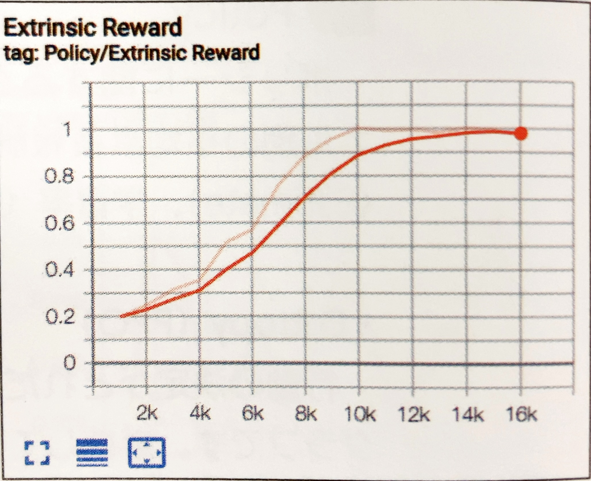

<br>

+ Extrinsic Value Estimate

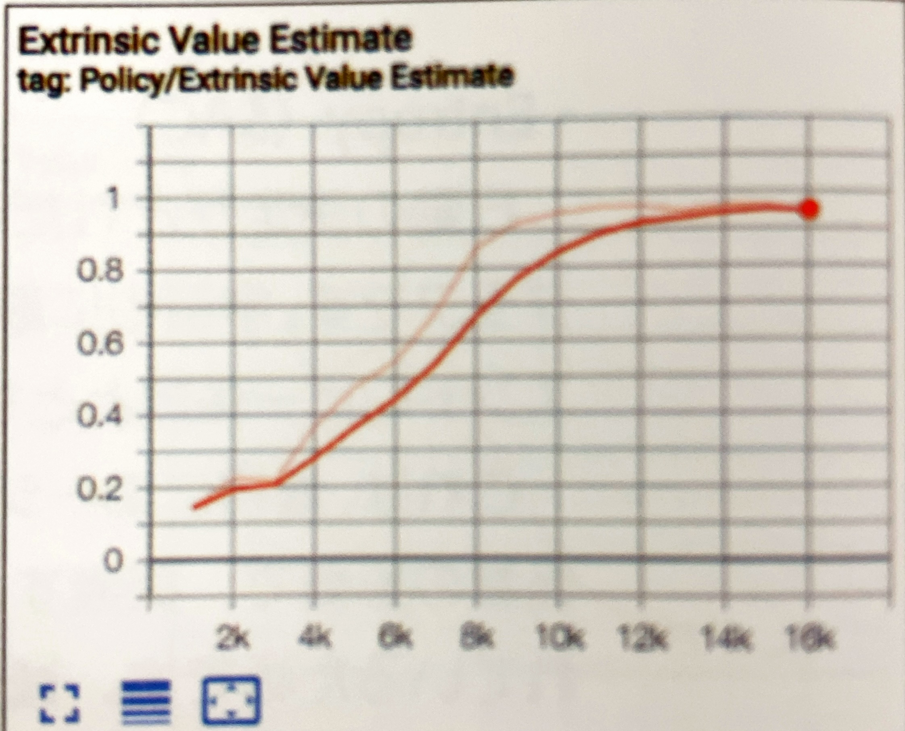

<br>

+ Learning Rate

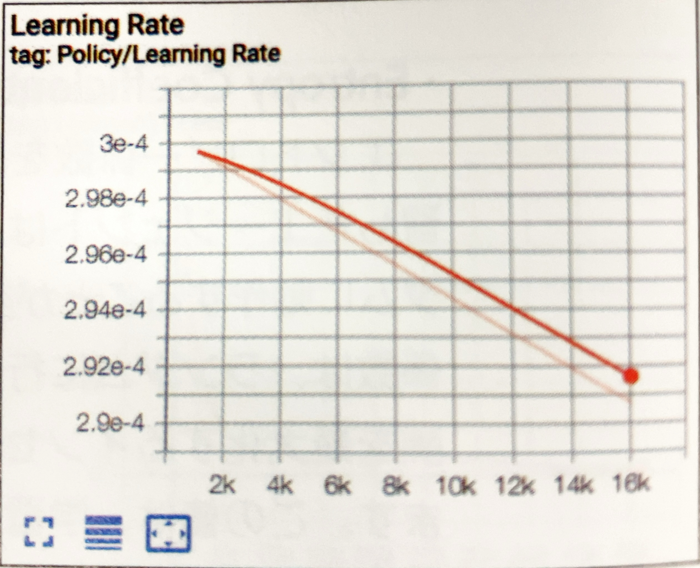

<br>


