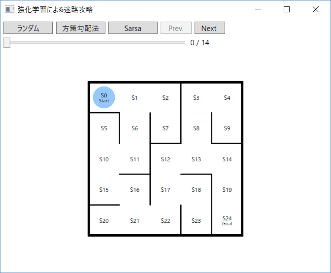

**Q関数**について

---

### **Q関数の基本的な考え方**

Q関数は、状態 \( s \) と行動 \( a \) のペアに対して「その行動を取ったとき、将来得られる累積報酬の期待値」を予測します。簡単に言えば、「この状態でこの行動を取ったら、どれくらい得するか？」を教えてくれるものです。

### **迷路ゲームの例**
例えば、エージェントが迷路を探索するゲームを考えてみましょう。  
エージェントの目標は、スタート地点からゴール地点にたどり着くことです。エージェントは各ステップで「上、下、左、右」という行動を選択することができます。報酬は次のように設定されています：
- **+100ポイント**: ゴールにたどり着いたとき
- **-1ポイント**: 毎回1ステップ動くごとに少し減点
- **+10ポイント**: 重要な中間ポイントを通過するとき

ここで、Q関数は「どの方向に進めば将来の報酬が高くなるか」を学習していきます。

---

### **Q関数の使い方**
- 状態 \( s \): 迷路内での現在位置
- 行動 \( a \): 取れるアクション（上、下、左、右）
- Q関数 \( Q(s, a) \): 「今この位置で上に進んだら、将来の累積報酬はどれくらいか？」などといった予測

---

### **具体例でのQ関数のイメージ**

#### **エージェントが状態 \( s_1 \) にいるとき**
- 今エージェントが迷路の途中、状態 \( s_1 \) にいるとします。このとき、エージェントは以下の3つの行動が可能です：
  - ( 上に進めない（\( a_1 \)） )
  - 下に進む（\( a_2 \)）
  - 左に進む（\( a_3 \)）
  - 右に進む（\( a_4 \)）

  エージェントがそれぞれの行動を取ったときのQ関数の予測が次のようになっているとしましょう：
  
  - ( \( Q(s_1, a_1) = 10 \) （上に進むと10ポイントの累積報酬が得られる場合）)
  - \( Q(s_1, a_2) = 5 \) （下に進むと5ポイント）
  - \( Q(s_1, a_3) = -2 \) （左に進むと累積で-2ポイント）
  - \( Q(s_1, a_4) = 20 \) （右に進むと20ポイント）

この場合、エージェントは **「右に進む（\( a_4 \)）」** のが最も高い報酬を得られると判断し、右に進む行動を選びます。

---

### **学習の流れ**

1. **初期状態**では、エージェントはどの行動が良いか分かりません。行動するたびに、どの行動がどれくらい報酬をもたらすかをランダムに試します。

2. **報酬を得る**たびに、エージェントはQ関数の予測を更新します。
   - 例えば、右に進んで実際にゴールに近づいたら、その行動のQ値（Q(s_1, a_4)）を高めに更新します。
   - 逆に、壁にぶつかってしまったら、その行動のQ値を低く更新します。

3. **繰り返し学習**しながら、各状態でどの行動が良いかを徐々に学んでいき、将来的に得られる報酬の予測が精度を増していきます。

---

### **まとめ**
- **Q関数**は、状態と行動のペアに対して「その行動を取ったときに将来得られる報酬」を予測する関数です。
- 迷路ゲームの例では、どの方向に進めばゴールにたどり着きやすいか、報酬を得やすいかをQ関数が学習します。
- エージェントは、Q関数の予測に基づいて最適な行動を選び、報酬を最大化するように動きます。

Q関数を使うことで、エージェントは「どの行動が最善か」を学習していくのです。

 

 

 

 

損失関数（**Loss Function**）とは、機械学習や強化学習において、モデル（エージェントなど）がどれだけ「間違った」予測や判断をしたかを定量的に評価するための関数です。損失関数を使って、モデルの誤差を数値化し、その値を最小化することを目指して学習が進められます。

### 損失関数の役割
損失関数は、モデルが出力した予測値と正解の値（理想的な値）の間にどれくらい差があるかを示します。一般的に、損失関数の値が大きければ大きいほどモデルの予測は間違っており、損失が小さくなるほどモデルの予測は正確に近づいていることを示します。

損失関数は、その誤差を基にしてモデルのパラメータ（例えばニューラルネットワークの重みなど）を更新し、学習が進むにつれて予測をより正確にするために使用されます。

### 具体的な例
#### 1. **分類タスク（例えば、猫か犬かを分類するタスク）**
モデルが「この画像は猫だ」と予測したとしますが、実際のラベルは「犬」だったとします。この誤差を損失関数で計算し、その値が大きい場合は「間違いが大きい」と評価されます。

- 使われる損失関数例：**クロスエントロピー損失関数**  
  これは、分類問題でよく使われる損失関数で、正しいクラスと予測クラスとの間の誤差を計算します。

#### 2. **強化学習タスク（エージェントが迷路を探索するタスク）**
エージェントが特定の行動を取ったとき、その行動が期待した報酬（たとえば、ゴールに近づいたかどうか）と実際に得た報酬の差を評価します。この差を損失関数で計算し、エージェントが次にもっと良い行動を取るように学習を進めます。

- 使われる損失関数例：**Mean Squared Error（MSE）**  
  Q関数やValue関数の予測と実際の報酬の差を計算し、その差を最小化するように学習します。

### 強化学習での損失関数
強化学習では、エージェントが取った行動とそれによって得られた報酬の差を損失関数を通して評価し、その結果に基づいてポリシーやQ関数、価値関数を改善していきます。以下のような損失関数が使われます。

- **Policy Loss**: エージェントが行動を選択する方針（ポリシー）の間違いを評価し、その誤差を小さくして方針を改善します。
- **Value Loss**: 状態の価値（将来得られる累積報酬）の予測と実際の報酬の差を評価し、予測精度を高めます。
- **Q-Loss**: エージェントが取った行動に対する報酬の期待値（Q関数）の予測誤差を評価します。

### まとめ
損失関数は、モデルの予測と実際の結果との誤差を数値化し、その誤差を元にしてモデルのパラメータを調整するための重要な指標です。損失関数を最小化することが、モデルを改善するための最終的な目標です。

 

 

 

 

Q1 Loss と Q2 Loss は、強化学習アルゴリズムで特に **Soft Actor-Critic（SAC）** という手法で使われる **Q関数** に関連する損失関数です。SACは、エージェントが最適な行動を学習するためにQ関数を2つ使用するのが特徴です。

### Q関数とは？
まず、**Q関数**（行動価値関数）について簡単に説明します。Q関数は、ある状態 \( s \) である行動 \( a \) を取ったときに、その後得られる **累積報酬の期待値** を表します。Q関数は、エージェントが「どの行動がどのくらい良いか（価値が高いか）」を判断するために使われます。

Q関数の役割は、エージェントがある状態において、次にどの行動を取るべきかを決める指針を与えることです。行動の価値が高いほど、エージェントはその行動を選びやすくなります。

---

### SACにおけるQ1 LossとQ2 Loss

SAC（Soft Actor-Critic）では、エージェントが行動を選択する際の不確実性を考慮し、より安定した学習を行うために**2つのQ関数**（Q1とQ2）を用います。この手法を **Double Q-Learning** とも呼びます。2つのQ関数を使う理由は、1つのQ関数のみを使用すると、過大評価に陥るリスクがあるためです。Q1とQ2を独立して学習させることで、行動価値の過大評価を防ぎ、学習を安定させることができます。

#### Q1 Loss
- **Q1 Loss** は、Q1関数が予測した行動価値と、ターゲットとして設定した理想的な行動価値との差（誤差）を表します。この誤差を基にQ1関数を学習して、行動価値の予測精度を高めます。

#### Q2 Loss
- **Q2 Loss** も同様に、Q2関数の予測とターゲットとの誤差を表します。Q1とは別に、Q2関数も学習させて予測精度を向上させます。

2つのQ関数を独立して学習させることで、行動価値の過大評価を抑制し、エージェントがより正確に行動を選べるようにします。

---

### なぜ2つのQ関数が必要なのか？
1つのQ関数を使っている場合、エージェントが行動価値を過大評価してしまう可能性があります。これが学習を不安定にし、最適なポリシーを見つけるのを難しくします。2つのQ関数を使用することで、これを防ぎ、行動価値のより安定した評価が可能になります。SACでは、エージェントが行動を選ぶ際に、Q1とQ2のうち**小さい方**の値を基に行動を決定します（**min(Q1, Q2)** のような方式）。これにより、過大評価された行動価値が選ばれるのを抑える効果があります。

### まとめ
- **Q1 Loss** と **Q2 Loss** は、それぞれのQ関数が正しい行動価値を予測できるようにするための誤差を計算するための損失関数です。
- 2つのQ関数を使うことで、過大評価のリスクを減らし、学習を安定させることができます。

