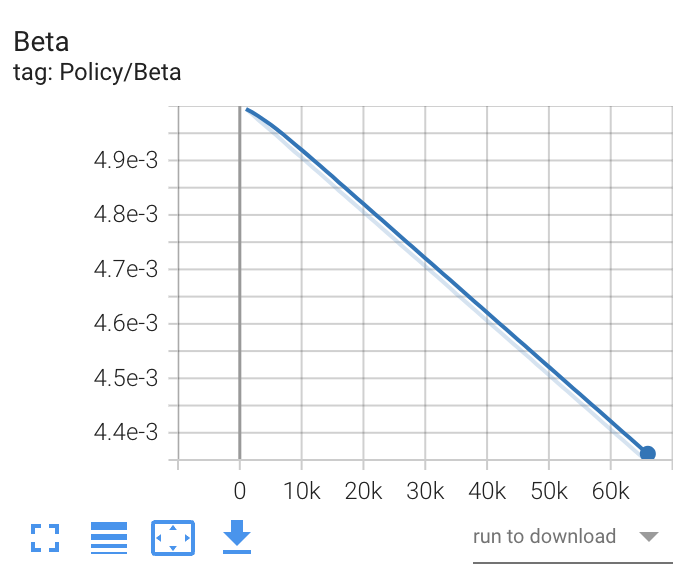
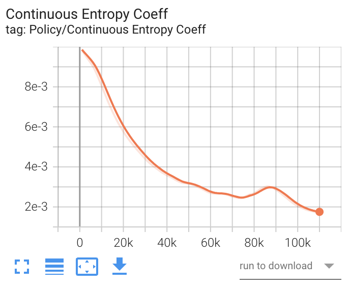
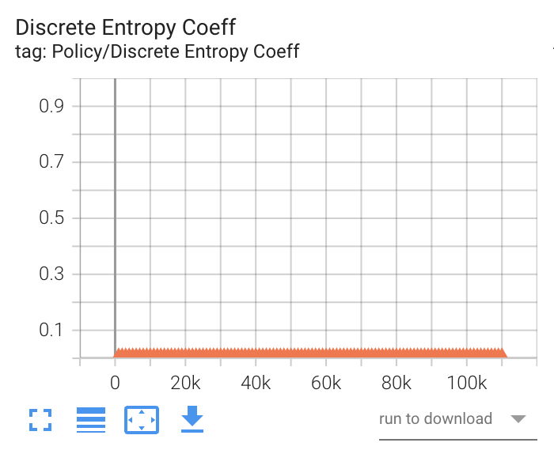
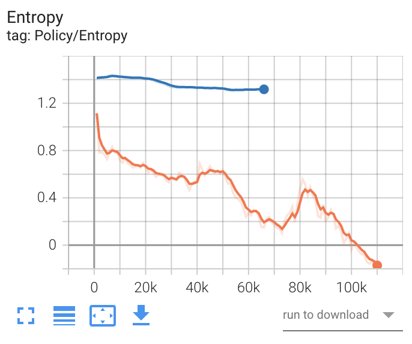
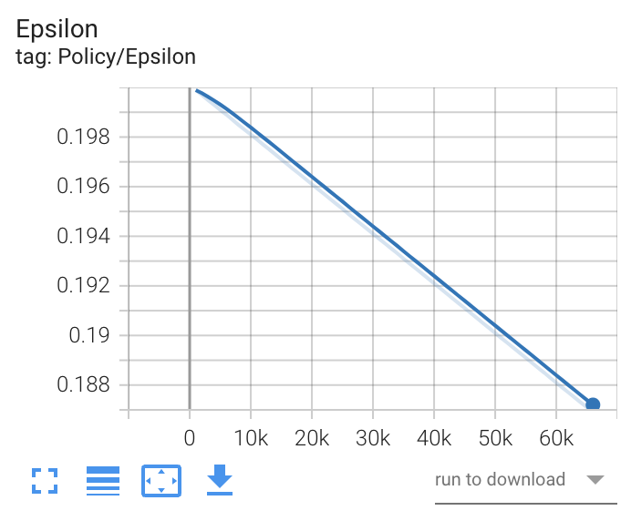
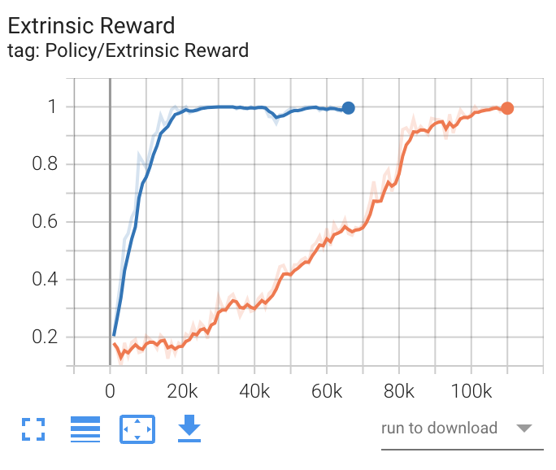
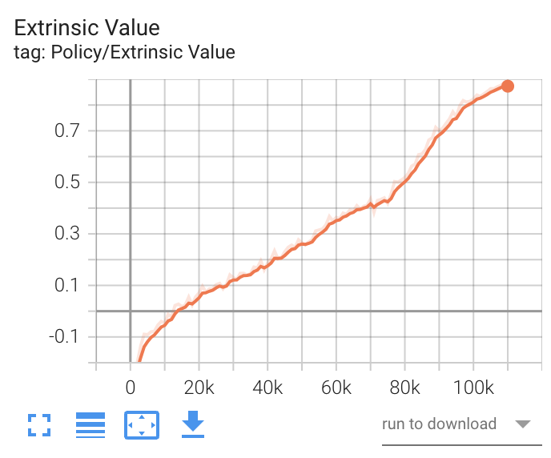
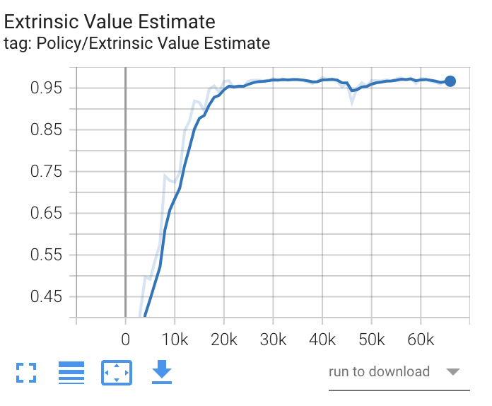
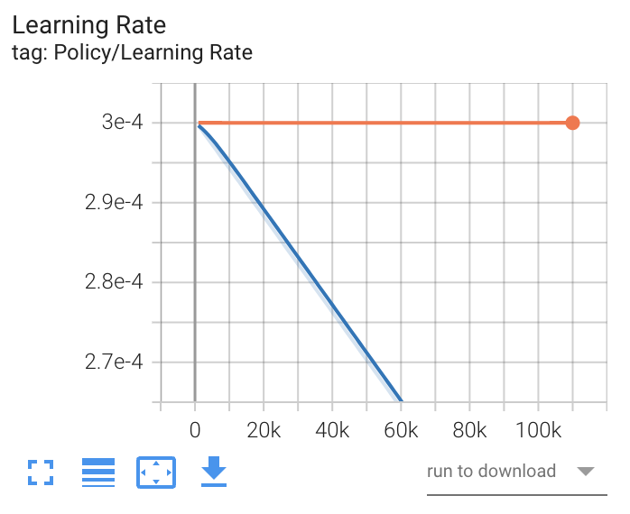

TensorBoardのPolicyセクションに表示される項目について、以下にそれぞれの項目の意味と役割を詳しく解説します。

## 1. **Beta**
- **説明**: βは、エージェントの探索と活用のバランスを調整するパラメータで、特に強化学習において[ポリシー](../1/1.md)の更新時に使用されます。一般的に、エージェントが探索する度合いを調整するために利用されます。

 

## 2. **Continuous Entropy Coeff**
- **説明**: 連続行動空間におけるエントロピーの係数です。この値は、エージェントが行動を選択する際の確率分布のエントロピー（多様性）を調整します。高い値はエージェントが多様な行動を選択することを促進し、低い値は行動の選択が安定することを促します。

 

## 3. **Discrete Entropy Coeff**
- **説明**: 離散行動空間におけるエントロピーの係数です。連続エントロピー係数と同様に、行動の多様性を調整します。エージェントが新しい行動を探索する際に重要です。

 

## 4. **Entropy**
- **説明**: エージェントが選択した行動の分布のエントロピーを示します。エントロピーが高いほど、エージェントが多様な行動を選択していることを示し、探索を促進する役割があります。

 

## 5. **Epsilon**
- **説明**: ε（イプシロン）は、ε-greedy方策における探索率を示します。特定の確率（ε）でランダムな行動を選択し、それ以外の場合は最適な行動を選択することで、エージェントは探索と活用をバランスさせます。

 

## 6. **Extrinsic Reward**
- **説明**: 外部から与えられる報酬の値です。エージェントが環境から得られる直接的な報酬を示します。具体的には、環境の状態に基づいてエージェントが受け取る報酬です。

 

## 7. **Extrinsic Value**
- **説明**: 外部報酬に基づく価値の推定値です。この値は、特定の状態において、将来的に得られる報酬の期待値を示します。Q関数や価値関数のような概念に基づいています。

 

## 8. **Extrinsic Value Estimate**
- **説明**: エージェントが外部報酬を基に推定した価値です。エージェントが現在の状態において、将来得られる累積報酬の期待値を示すために使用されます。

 

## 9. **Learning Rate**
- **説明**: エージェントがポリシーを更新する際に使用する[学習率](3_5_4.md)です。[学習率](3_5_4.md)が高いと、エージェントのポリシーは急速に変化しますが、安定性が失われる可能性があります。逆に、低いと更新が遅くなり、収束がより安定します。

 