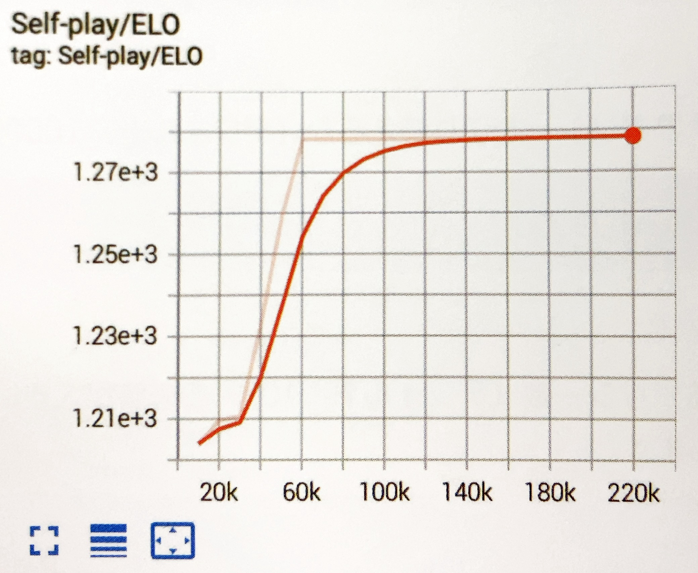
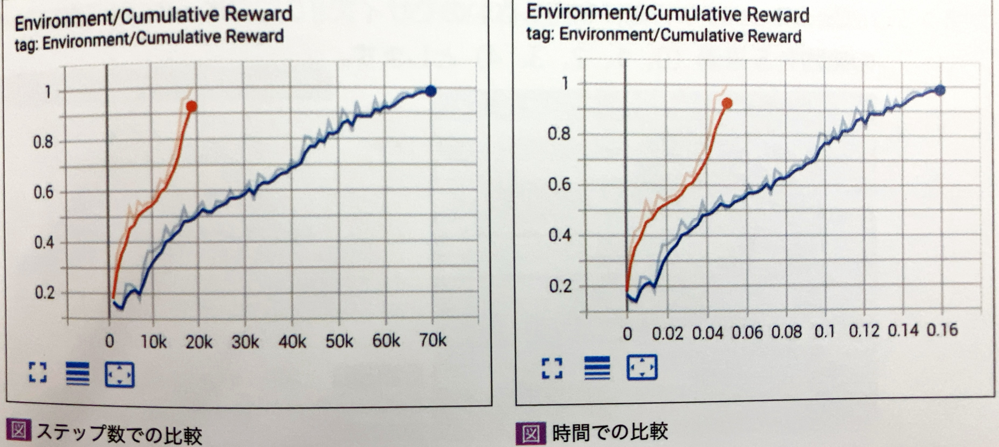

# SAC


## SACとは

「SAC」(Soft Actor-Critic)は、過去の任意の時点で収集された経験から学ぶ「オフポリシー」な学習アルゴリズムです。　  
収集した経験を経験バッファに格納し、学習中にランダムに取り出して学習します。  
「SAC」は「PPO」と比べて、過去のポリシーの経験を使い回す分、少ない経験数でたくさん学習できます。そのため、実世界のロボットなど、たくさんの経験の収集が難しい環境（学習の高速化やリセットが困難）でよく使われます。
Unity ML-Agentsでは、１ステップあたり約0.1秒以上かかる重い環境に適しています。

<br>

## SACの学習環境の準備

学習環境「RollerBall」を「SAC」で学習してみましょう。(サンプル 4_1)


<br>

## SACの学習設定ファイルの設定

今回は「SAC」で学習します。以下のように、ハイパーパラメータを設定してください。「init_entcoef」は、学習開始時にエージェントがどの程度探索するか指定するハイパーパラメータです。探索が多過ぎる場合は、この値を小さく調整します。

```yaml
behaviors:
  RollerBall:
    # トレーナー種別
    trainer_type: sac

    # 基本
    max_steps: 500000
    time_horizon: 64
    summary_freq: 1000
    keep_checkpoints: 5
    
    # 学習アルゴリズム
    hyperparameters:
      # PPOとSAC共通
      batch_size: 64
      buffer_size: 12000
      learning_rate: 0.0003
      learning_rate_schedule: constant
      
      # SAC専用
      buffer_init_steps: 0
      tau: 0.005
      steps_per_update: 10.0
      save_replay_buffer: false
      init_entcoef: 0.01
      reward_signal_steps_per_update: 10.0

    # ニューラルネットワーク
    network_settings:
      normalize: true
      hidden_units: 128
      num_layers: 2
    
    # 報酬
    reward_signals:
      #環境報酬
      extrinsic:
        gamma: 0.99
        strength: 1.0

```


## SACの学習の実行

「SAC」の学習を実行します

```
mlagents-learn ./config/sample/SacEx.yaml --run-id=SacEx-1 --env=SacEx --num-envs=8
```

<br>
学習効果のグラフを見てください。

70Kステップで学習できているかと思います。
今回は、PPOの方がSACより速く収束していると思いますが、環境によってはSACの方が優れている場合もあります。



<br>

# TensorBordのグラフで比較

Tensorbordのグラフを比較するには、「results」フォルダに、比較したい学習結果フォルダを配置します。  
そして、Tensorbordを起動します。
```
tensorboard --logdir=./results
```

「Runs」で比較したいグラフをチェックします。ステップ数で比較したい時は「STEP」、時間で比較したい時は「RELATIVE」を選択します。


