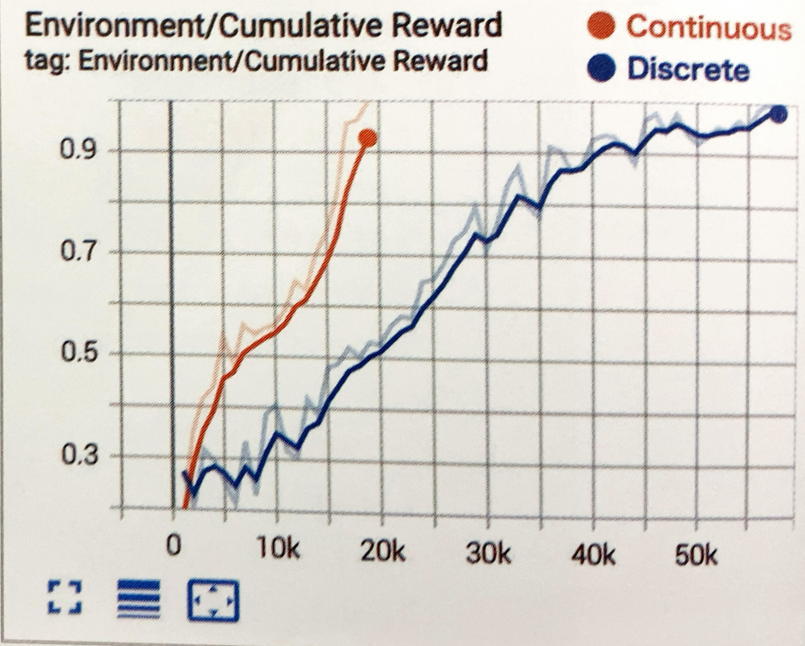

# Discrete

すでに作成した学習環境「RollerBall」では、行動を「Continuous」として学習しましたが、これを「Discrete」にカスタマイズして学習させてみる


## Discreteの学習環境の準備
「Discrete」は、離散値の要素を持つ整数配列
```
「行動」
・Discrete（サイズ１）
　0:移動(0:なし,1:上移動,2:下移動,3:左移動,4:右移動)
```
(サンプル 4_2)
学習環境のカスタマイズの手順

### ①「BehaviorParameters」を以下のように設定

Continuousな行動は利用しないのでサイズ「0」
Discreteな行動はサイズ「1」で値の範囲を5未満(0,1,2,3,4)とします


### ②スクリプト「RollerAgent.cs」のOnActionReceived()を以下のように変更
「RollerAgent.cs」の一部
```cs
// 行動実行時に呼ばれる
    public override void OnActionReceived(ActionBuffers actionBuffers)
    {
        // RollerAgentに力を加える
        Vector3 controlSignal = Vector3.zero;
        int action = actionBuffers.DiscreteActions[0];
        if (action == 1) controlSignal.z = 1.0f;
        if (action == 2) controlSignal.z = -1.0f;
        if (action == 3) controlSignal.x = -1.0f;
        if (action == 4) controlSignal.x = 1.0f;
        rBody.AddForce(controlSignal * 5);

(省略)
```


### ③スクリプト「RollerAgent.cs」のHeuristic()を以下のように変更
「RollerAgent.cs」の一部
```cs
    // ヒューリスティックモードの行動決定時に呼ばれる
    public override void Heuristic(in ActionBuffers actionBuffers)
    {
        var actionsOut = actionBuffers.DiscreteActions;
        actionsOut[0] = 0;
        if (Input.GetKey(KeyCode.UpArrow)) actionsOut[0] = 1;
        if (Input.GetKey(KeyCode.DownArrow)) actionsOut[0] = 2;
        if (Input.GetKey(KeyCode.LeftArrow)) actionsOut[0] = 3;
        if (Input.GetKey(KeyCode.RightArrow)) actionsOut[0] = 4;
    }
```
<br>

## Discreteの学習設定ファイルの設定

```yaml
behaviors:
  DiscreteEx:
    trainer_type: ppo

    max_steps: 500000
    time_horizon: 64
    summary_freq: 1000
    keep_checkpoints: 5

    #学習アルゴリズム
    hyperparameters:
      #PPOとSAC共通
      batch_size: 128
      buffer_size: 2048
      learning_rate: 0.0003
      learning_rate_schedule: linear

      #PPO用
      beta: 0.005
      epsilon: 0.2
      lambd: 0.95
      num_epoch: 3
    
    # ニューラルネットワーク
    network_settings:
      normalize: false
      hidden_units: 128
      num_layers: 2
    
    #報酬
    reward_signals:
      #環境報酬
      extrinsic:
        gamma: 0.99
        strength: 1.0

```

「batch_size」「buffer_size」は、「Continuous」と「Discrete」で典型的な範囲が異なるので調整が必要になります


#### `batch_size`
+ (典型的な範囲) Continuous + PPO : 512 ~ 5120
+ (典型的な範囲) Continuous + SAC : 128 ~ 1024
+ (典型的な範囲) Discrete : 32 ~ 512

#### `buffer_size`
+ (典型的な範囲) PPO : 512 ~ 5120
+ (典型的な範囲) SAC : 50000 ~ 1000000


## Discreteの学習の実行

「Discrete」の学習を実行します。

```
mlagents-learn ./config/sample/DiscreteEx.yaml --run-id=DiscreteEx-1 --env=DiscreteEx --num-envs=8
```

学習結果のグラフは次のとおりです。  
50Kステップで学習できています。  
今回は、「Continuous」の方が「Discrete」より速く収束していますが、多くの場合「Discrete」の方が速く収束します。




