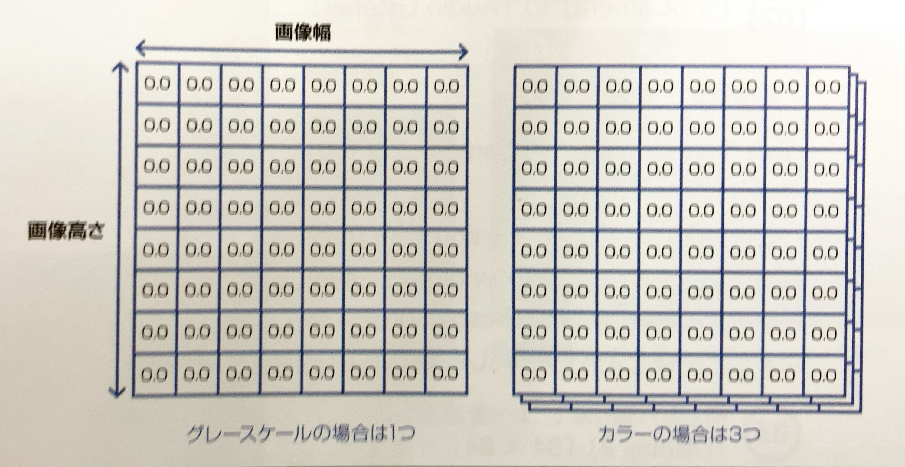
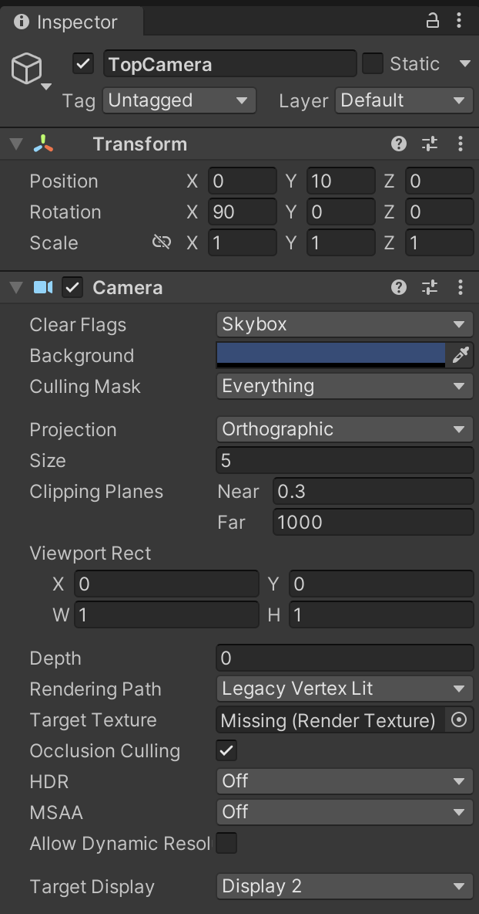
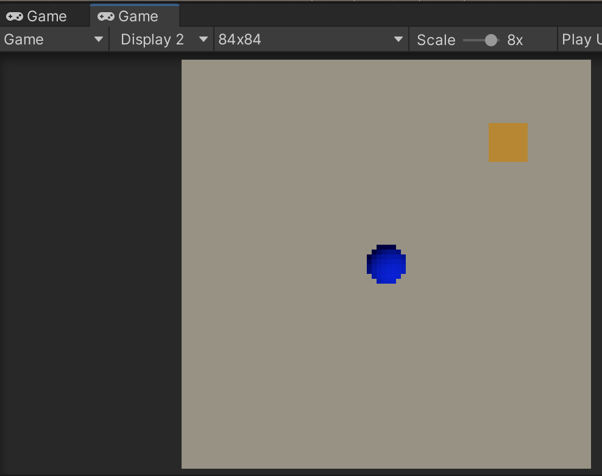
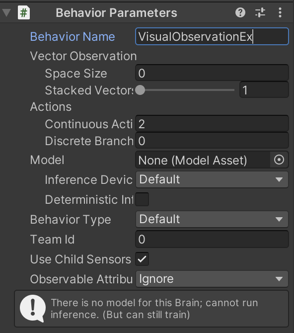
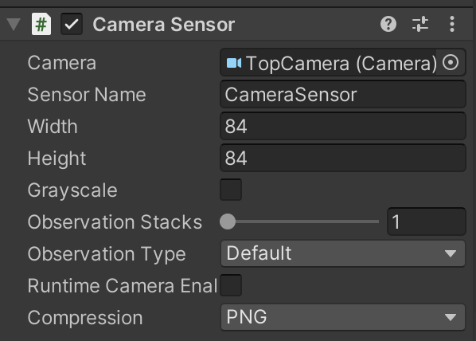
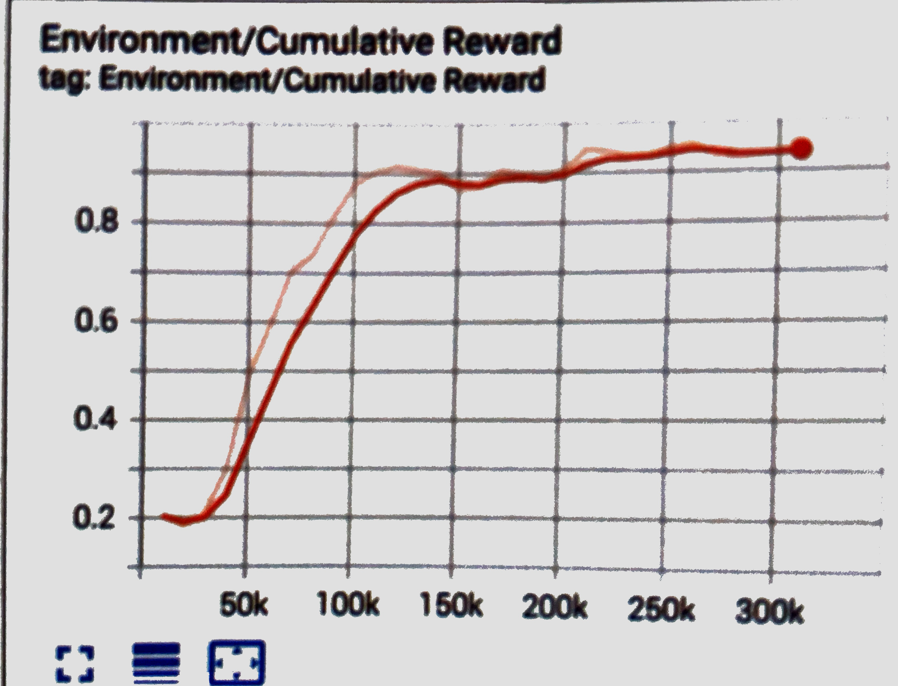

# 4-3 Visual Observation

「Visual Observation」は「カメラ」や「レンダーテクスチャー」の画像を「観察」として利用する学習環境です。

## Visual Observationとは

「Visual Observation」のデータ型を図で示すと、次のような「画像幅＊画像高さ」の２次元配列になります。グレースケールの場合は１つ、カラーの場合はRGBの３つの２次元配列で表現します。



<br>

## Visual Observationの実装手順

#### ①「カメラ」または「レンダーテクスチャ」の準備
学習に利用する画像を撮影するカメラ、またはレンダーテクスチャを準備します。

#### ②「Camera Sensor Coponent」または「Render Texture Sensor Component」の追加
「Camera Sensor Coponent」はカメラの画像、「Render Texture Sensor Component」はレンダーテクスチャの画像を観察として利用するためのコンポーネントです。


## Visual Observationの学習環境の準備

すでに作成した学習環境「RollerBall」を「VisualObservation」にカスタマイズして学習します。(サンプル 4_3)  

観察：VisualObservation(サイズ84✖︎84)

①新しいカメラ TopCamera を設定

②新しいGameビューを追加して「Display2」「84✖️84」を指定





③「BehaviorParameters」の設定



④「VectorObservation」は使わないので、「RollerAgent.cs」のCollectObservations()を削除

⑤エージェントに「Camera Sensor Component」を追加



|設定項目|説明|
|---|---|
|Camera|観察として利用するCameraオブジェクトの参照|
|Sensor Name|センサー名|
|Width|画像の幅|
|Height|画像の高さ|
|Grayscale|グレースケールかどうか|
|ObsesrvationStacks|スタックして観察対象に含める過去の観察のステップ数|
|ObsesrvationType|観察種別()|
|Compressioin|圧縮(None／PNG)|

<br>

## Visual Observationの学習設定ファイルの設定
今回は「PPO」で学習します。
```yaml
behaviors:
  VisualObservationEx:
    trainer_type: ppo

    max_steps: 500000
    time_horizon: 128
    summary_freq: 10000
    keep_checkpoints: 5

    hyperparameters:
      
      batch_size: 64
      buffer_size: 2024
      learning_rate: 0.0003
      learning_rate_schedule: linear

      beta: 0.01
      epsilon: 0.2
      lambd: 0.95
      num_epoch: 3

    network_settings:
      normalize: true
      hidden_units: 256
      num_layers: 1
      vis_encode_type: simple
    
    # 報酬
    reward_signals:
      extrinsic:
        gamma: 0.99
        strength: 1.0

```

## Visual Observationの学習の実行

```
mlagents-learn ./config/sample/VisualObservationEx.yaml --run-id=VisualObservationEx-1 --env=VisualObservationEx --num-envs=8
```

学習結果のグラフ例。220ステップで学習できています

