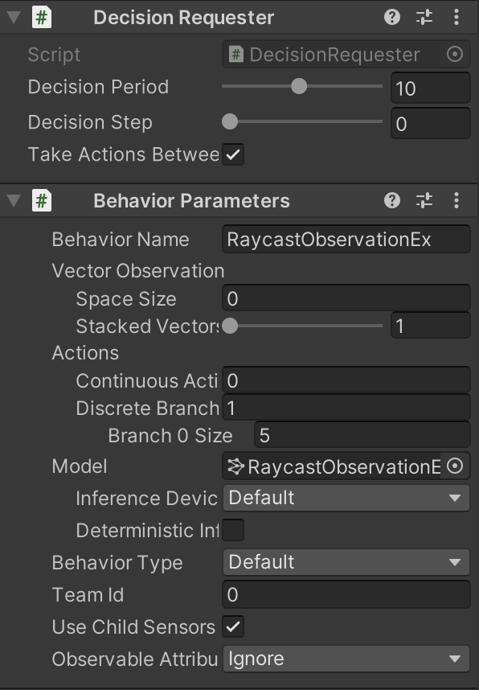
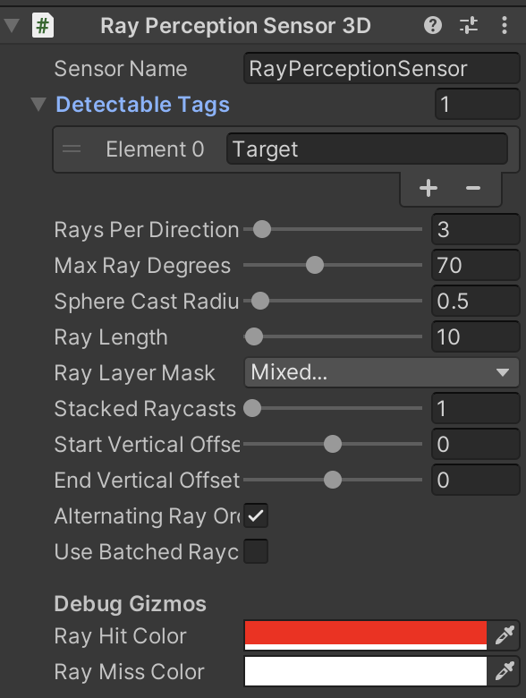
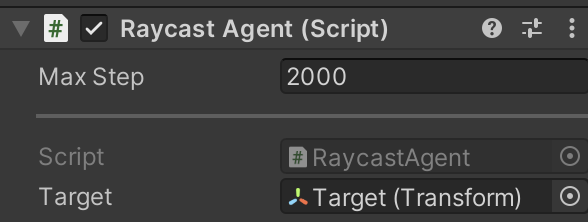
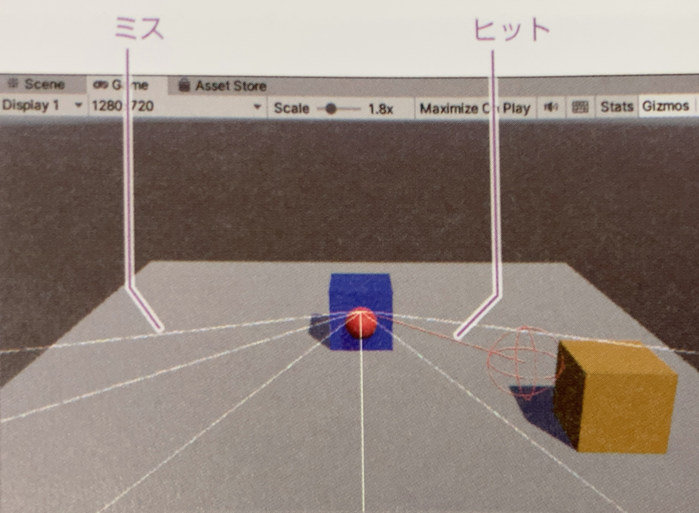
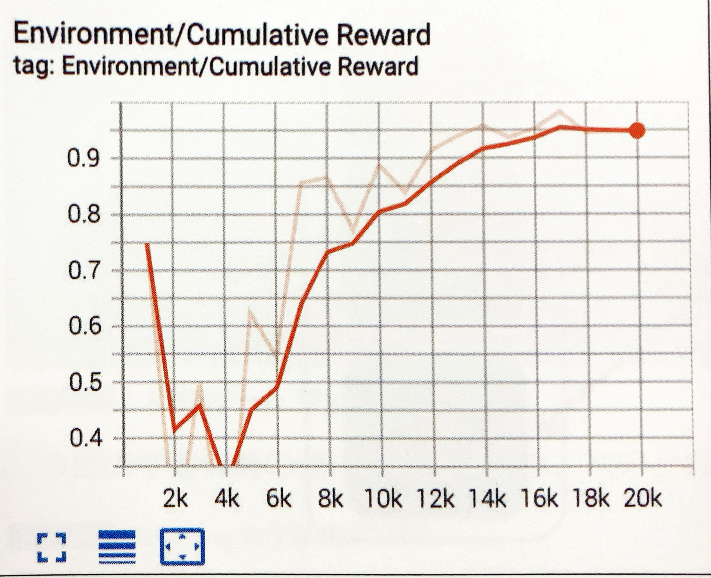

# 4-4 Raycast Observation

「Raycast Observation」では、エージェント周囲にレイ(光線)を飛ばした時のオブジェクトとヒットした場所と距離を「観察」として利用します。

<br>

## Raycast Observationとは

「Raycast Observation」のデータ型を図で示すと、次のような「浮動小数配列」になります
  
 レイとオブジェクトが衝突した場合はヒット数が「1」、ミスが「0」となり、エージェントとヒット場所との距離が保存されます。衝突しなかった場合はヒット数が「0」、ミスが「1」となり、距離も「0」になります。  
オブジェクトとレイの個数やレイをどの方向へ照射するかの判断は、環境に応じて人間が決定します。


<br>

## Raycast Observationの実装手順
#### ①レイの衝突判定を行うオブジェクトにタグを指定  

#### ②「Ray Perception Sensor Component 3D」または「Ray Perception Sensor Component 2D」の追加  
3D用または2D用にレイキャストを観察として利用するためのコンポーネント  


## Raycast Observationの学習環境の準備

以前作成した学習環境「RollerBall」をカスタマイズして「RaycastObservation」で学習します

学習環境の強化学習の要素を以下のように変更します。

<table>
  <tr>
    <td>観察</td> <td>・Raycast Observation</td>
  </tr>
  <tr>
    <td>行動</td> <td>・Discrete(サイズ1)<br>0:移動(0:なし,1:前進,2:後進,3:左回転,4:右回転)</td>
  </tr>
</table>

「Raycast Observation」は進行方向にレイを飛ばすので、進行方向を赤鼻で示すエージェント（RaycastAgent）に変更します。  
学習環境のカスタマイズの手順は、次のとおりです。

<br>

### Targetのタグの指定

<br>

### RaycastAgentのボディ(Rigidbody・Material)の追加

<br>

### RaycastAgentの赤鼻の追加

<br>


### エージェントのコンポーネントの追加

#### ①「RaycastAgent」に「Behavior Parameters」を追加

「Vector Observation」は使わないので、「Space Size」を「0」にします。行動はサイズ「1」で値の範囲「0 ~ 4」のDiscreteな行動を指定します。

#### ②「RaycastAgent」に「DecisionRequester」を追加

#### ③「RaycastAgent」に「Ray Perception Sensor Component3D」を追加
 




|設定項目|説明|
|---|---|
|Sensor Name|センサー名|
|Detectable Tags → Size|検出可能タグの数|
|Detectable Tags → Element X|検出可能タグの名前|
|Rays Per Direction|中心から左右のレイの数|
|Max Ray Degrees|最外のレイの正面からの角度|
|Sphere Cast Radius|レイの衝突判定の半径|
|Ray Length|レイの長さ|
|Ray Layer Mask|レイが衝突するレイヤーの制限|
|Stacked Raycast|「決定」に利用する過去の観察のスタック数|
|Start Vertical Offset|レイの始点の高さのオフセット|
|End Vertical Offset|レイの終点の高さのオフセット|
|Debug Gizmos → Ray Hit Color|レイのヒット時の色|
|Debug Gizmos → Ray Miss Color|レイのミス時の色|


#### ④スクリプト「RaycastAgent」の追加
「4-2 Discrete」では「上移動、下移動、左移動、右移動」で動かしましたが、今回は「前進、後進、左回転、右回転」で動かします

```cs
using System.Collections.Generic;
using UnityEngine;
using Unity.MLAgents;
using Unity.MLAgents.Sensors;
using Unity.MLAgents.Actuators;
using Unity.MLAgents.Policies;

// RaycastAgent
public class RaycastAgent : Agent
{
    public Transform target;
    Rigidbody rBody;

    // 初期化時に呼ばれる
    public override void Initialize()
    {
        rBody = GetComponent<Rigidbody>();
    }

    // エピソード開始時に呼ばれる
    public override void OnEpisodeBegin()
    {
        // RaycastAgentの落下時
        if (this.transform.localPosition.y < 0)
        {
            // RaycastAgentの位置と速度をリセット
            this.rBody.angularVelocity = Vector3.zero;
            this.rBody.velocity = Vector3.zero;
            this.transform.localPosition = new Vector3(0.0f, 0.5f, 0.0f);
        }

        // Targetの位置のリセット
        target.localPosition = new Vector3(
            Random.value*8-4, 0.5f, Random.value*8-4);
    }

    // 行動実行時に呼ばれる
    public override void OnActionReceived(ActionBuffers actionBuffers)
    {
        // RaycastAgentに力を加える
        Vector3 dirToGo = Vector3.zero;
        Vector3 rotateDir = Vector3.zero;
        int action = actionBuffers.DiscreteActions[0];
        if (action == 1) dirToGo = transform.forward;
        if (action == 2) dirToGo = transform.forward * -1.0f;
        if (action == 3) rotateDir = transform.up * -1.0f;
        if (action == 4) rotateDir = transform.up;
        this.transform.Rotate(rotateDir, Time.deltaTime * 200f);
        this.rBody.AddForce(dirToGo * 0.4f, ForceMode.VelocityChange);

        // RaycastAgentがTargetの位置に到着
        float distanceToTarget = Vector3.Distance(
            this.transform.localPosition, target.localPosition);
        if (distanceToTarget < 1.42f)
        {
            AddReward(1.0f);
            EndEpisode();
        }

        // RaycastAgentが落下
        if (this.transform.localPosition.y < 0)
        {
            EndEpisode();
        }
    }

    // ヒューリスティックモードの行動決定時に呼ばれる
    public override void Heuristic(in ActionBuffers actionBuffers)
    {
        var actionsOut = actionBuffers.DiscreteActions;
        actionsOut[0] = 0;
        if (Input.GetKey(KeyCode.UpArrow)) actionsOut[0] = 1;
        if (Input.GetKey(KeyCode.DownArrow)) actionsOut[0] = 2;
        if (Input.GetKey(KeyCode.LeftArrow)) actionsOut[0] = 3;
        if (Input.GetKey(KeyCode.RightArrow)) actionsOut[0] = 4;
    }
}
```

#### ⑤HierarchyウィンドウでRaycastAgentを選択し、Inspectorウィンドウで以下を設定





<br>

## RaycastObservationの視覚補助

Unityエディタの「Gizmos」を有効にした状態で、Inspector Windowの「Ray Perception Sensor 3D」またはRay Perception Sensor 2D」を表示すると、デバッグ用の視覚的補助が表示されます。

以下では、前方に７本のレイを飛ばし、ヒットしたレイは赤、ミスしたレイは白で表示されています。




<br>


## RaycastObservationの学習設定ファイルの設定

今回は「PPO」で学習します。以下のようにハイパーパラメータを設定してください

```yaml
behaviors:
  RaycastObservationEx:
    trainer_type: ppo

    max_steps: 500000
    time_horizon: 64
    summary_freq: 1000
    keep_checkpoints: 5

    hyperparameters:
      batch_size: 128
      buffer_size: 2048
      learning_rate: 0.0003
      learning_rate_schedule: linear

      beta: 0.005
      epsilon: 0.2
      lambd: 0.95
      num_epoch: 3

    network_settings:
      normalize: true
      hidden_units: 128
      num_layers: 2

    reward_signals:
      extrinsic:
        gamma: 0.99
        strength: 1.0
```

<br>

## RaycastObservationの学習の実行
```
mlagents-learn ./config/sample/RaycastObservationEx.yaml --run-id=RaycastObservationEx-1
```

学習結果のグラフは次のとおりです。20Kステップで学習できています。




