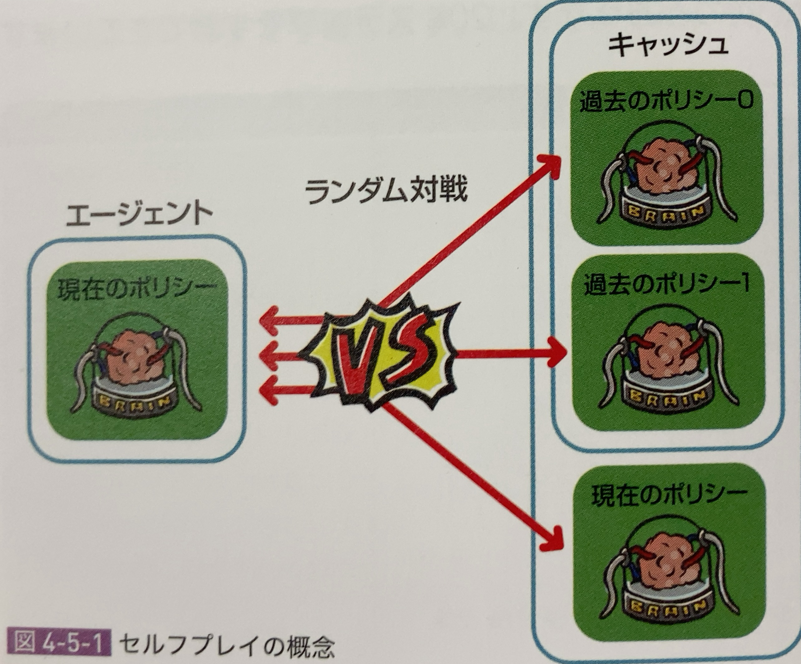
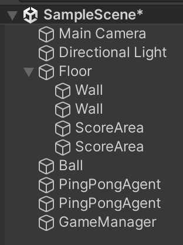
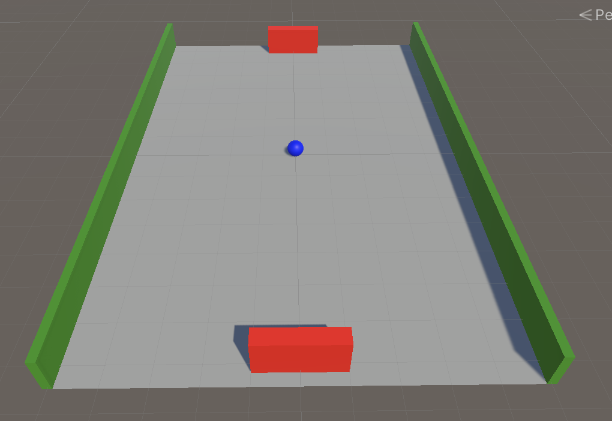

# 4-5 セルフプレイ

セルフプレイ（Self-Play）は、強化学習において、エージェントが自分自身や他のエージェントと競い合いながら学習を進める手法です。特に複雑な対戦型のタスクやマルチエージェント環境でよく利用され、囲碁AI「AlphaGo」などの著名な事例でも採用されています。

### セルフプレイの概要
セルフプレイでは、1つのエージェントが他のエージェントと同じ環境内で競争します。対戦相手が実際のプレイヤーや固定されたAIである必要はなく、エージェント同士で対戦しながら学習を進めます。この手法の利点は、エージェントがより強力な戦略を自ら発見し、学習が進むにつれて自分自身の弱点を補うようなプレイスタイルを獲得できることです。

### セルフプレイの利点
- **競争による強化**: エージェントが自分自身や他のエージェントと対戦することで、より高いスキルを獲得する可能性が高まります。競争があると、環境がエージェントにとって動的かつチャレンジングになり、より高度な学習が促されます。
- **適応力の向上**: 対戦相手のスキルがエージェント自身の学習によって進化するため、常に新たな戦略に適応し続ける必要があります。これにより、より多様で洗練された戦略を身に付けられるようになります。
- **探索と利用のバランス**: セルフプレイでは、エージェントが新しい戦略を探索するだけでなく、学んだ最適な行動を効率よく利用するためのバランスも重要になります。

### Unity ML-Agentsでのセルフプレイ
ML-Agentsでは、マルチエージェント環境や対戦型ゲームでセルフプレイが可能です。セルフプレイの設定は、学習設定ファイル（YAMLファイル）内のパラメータを指定することで簡単に行うことができます。


### セルフプレイの具体的な課題例
- **チェスや囲碁のような戦略ゲーム**: エージェントは、過去の自分や他のエージェントとプレイしながら戦略を最適化していく。
- **協力ゲームと競争ゲーム**: エージェントがチームを組んで協力するタスク、もしくは他のチームと競争するタスクを解く。
- **ゼロサムゲーム**: サッカーやキャプチャー・ザ・フラッグなど、エージェントが勝利を目指しつつ、相手を阻止するゲーム。

セルフプレイでは、エージェントが対戦相手と切磋琢磨することで、自己改善を促し、より高度な行動を学習できる点が強力です。


## セルフプレイ

「セルフプレイ」は「敵対的ゲーム」でエージェント同士を競い合わせることのより、上達させる学習方法です。  
「敵対的ゲーム」とは、2人のプレイヤーまたは2つのチームが対戦して勝敗を決める競技で、一方の利益が一方の損失になるゲームになります。 

「セルフプレイ」は、「現在のポリシー」およびキャッシュした複数の「過去のポリシー」とランダム対戦することで学習します。

「セルフプレイ」を利用しない場合は、「現在のポリシー」もしくは<u>特定の</u>「過去のポリシー」のみで対戦相手は変わりません。  
これでは、<u>特定の</u>ポリシー相手に強くなりますが、他のポリシーに対して強くなる値は限りません。

「セルフプレイ」を行うことによって、さまざまなポリシーに対して強くなることができるのです。



<br>

## セルフプレイの実装手順

### ①学習環境を敵対的ゲームとして実装
2人のプレイヤーまたは２つのチームが対戦して勝敗を決める競技で、一方の利益が一方の損失になるゲームを実装します。

### ②最終的な報酬を「+1」「0」「1」に設定
セルフプレイの学習指標である「ELO」の計算は、最終的な報酬が「+1」「0」「1」のいずれかであることに依存しています。

### ③チームIDの設定
「Behavior Parameters」の「Team ID」にチームIDを設定します。「セルフプレイ」を行うには、２人または２チームのエージェントをチームIDで区別します。

### ④学習設定ファイルでセルフプレイを指定
学習設定ファイルでセルフプレイ専用の設定を行う必要があります。


## セルフプレイの学習環境の準備

新たに学習環境「PingPong」を作成、「セルフプレイ」で学習します。  
ボールをパドルで打ち合い、後ろにそらしたほうが負けとなるゲームになります。


|項目|説明|
|---|---|
|観察|・Vector Observation(サイズ５、スタック２)<br>0:ボールのX座標,1:ボールのZ座標<br>2:ボールのX速度,3:ボールのZ速度<br>4:パドルのX座標|
|行動|・Discrete(サイズ１)<br>0:パドルの移動(0:なし,1:左移動,2:右移動)|
|報酬|・パドルでボールを打ち返した時に+0.1<br>・ボールを後ろにそらした時に±0.0(エピソード完了)|
|決定|・10ステップ毎|


GameObjectの配置





`ScoreArea.cs`
```cs
using System.Collections;
using System.Collections.Generic;
using UnityEngine;

// スコアエリア
public class ScoreArea : MonoBehaviour
{
    public GameManager gameManager;
    public int agentId;

    // ボールがスコアエリアに進入した時に呼ばれる
    void OnTriggerEnter (Collider other)
    {
        gameManager.EndEpisode(agentId);
    }
}
```


## GameManager

ゲームの管理を行うオブジェクト「GameManager」を追加します。  
「セルフプレイ」では、エピソード開始時とエピソード完了時の処理を、エージェント別ではなく、まとめて行います。

```
・void Start():スタート時に呼ばれる
・void Reset():エピソード開始時に呼ばれる
・void EndEpisode(int agentId):エピソード完了時に呼ばれる
```


`GameManager.cs`
```cs
using System.Collections;
using System.Collections.Generic;
using UnityEngine;
using Unity.MLAgents;

// GameManager
public class GameManager : MonoBehaviour
{
    public Agent[] agents;
    public GameObject ball;

    // スタート時に呼ばれる
    void Start()
    {
        Reset();
    }

    // エピソード開始時に呼ばれる
    public void Reset()
    {
        // エージェントの位置のリセット
        agents[0].gameObject.transform.localPosition = new Vector3(0.0f, 0.5f, -7.0f);
        agents[1].gameObject.transform.localPosition = new Vector3(0.0f, 0.5f, 7.0f);

        // ボールの位置と速度のリセット
        float speed = 10.0f;
        ball.transform.localPosition = new Vector3(0.0f, 0.25f, 0.0f);
        float radius = Random.Range(45f, 135f) * Mathf.PI / 180.0f;
        Vector3 force = new Vector3(
            Mathf.Cos(radius) * speed, 0.0f, Mathf.Sin(radius) * speed);
        if (Random.value < 0.5f) force.z = -force.z;
        Rigidbody rb = ball.GetComponent<Rigidbody>();
        rb.velocity = force;
    }

    // エピソード完了時に呼ばれる
    public void EndEpisode(int agentId)
    {
        if (agentId == 0)
        {
            agents[0].AddReward(1.0f);
            agents[1].AddReward(-1.0f);
        }
        else
        {
            agents[0].AddReward(-1.0f);
            agents[1].AddReward(1.0f);
        }
        agents[0].EndEpisode();
        agents[1].EndEpisode();
        Reset();
    }
}
```


## PingPongAgentの追加


<br>

① スクリプト

`PingPongAgent.cs`
```cs
using System.Collections.Generic;
using UnityEngine;
using Unity.MLAgents;
using Unity.MLAgents.Sensors;
using Unity.MLAgents.Actuators;
using Unity.MLAgents.Policies;

// PingPongAgent
public class PingPongAgent : Agent
{
    public int agentId;
    public GameObject ball;
    Rigidbody ballRb;

    // ゲームオブジェクトの生成時に呼ばれる
    public override void Initialize()
    {
        this.ballRb = this.ball.GetComponent<Rigidbody>();
    }

    // 観察取得時に呼ばれる
    public override void CollectObservations(VectorSensor sensor)
    {
        float dir = (agentId == 0) ? 1.0f : -1.0f;
        sensor.AddObservation(this.ball.transform.localPosition.x * dir); // ボールのX座標
        sensor.AddObservation(this.ball.transform.localPosition.z * dir); // ボールのZ座標
        sensor.AddObservation(this.ballRb.velocity.x * dir); // ボールのX速度
        sensor.AddObservation(this.ballRb.velocity.z * dir); // ボールのZ速度
        sensor.AddObservation(this.transform.localPosition.x * dir); // パドルのX座標
    }

    // ボールとパドルの衝突開始時に呼ばれる
    void OnCollisionEnter(Collision collision)
    {
        // 報酬
        AddReward(0.1f);
    }

    // 行動実行時に呼ばれる
    public override void OnActionReceived(ActionBuffers actionBuffers)
    {
        // PingPongAgentの移動
        float dir = (agentId == 0) ? 1.0f : -1.0f;
        int action = actionBuffers.DiscreteActions[0];
        Vector3 pos = this.transform.localPosition;
        if (action == 1)
        {
            pos.x -= 0.2f * dir;
        }
        else if (action == 2)
        {
            pos.x += 0.2f * dir;
        }
        if (pos.x < -4.0f) pos.x = -4.0f;
        if (pos.x > 4.0f) pos.x = 4.0f;
        this.transform.localPosition = pos;
    }

    // ヒューリスティックモードの行動決定時に呼ばれる
    public override void Heuristic(in ActionBuffers actionBuffers)
    {
        var actionsOut = actionBuffers.DiscreteActions;
        actionsOut[0] = 0;
        if (Input.GetKey(KeyCode.LeftArrow)) actionsOut[0] = 1;
        if (Input.GetKey(KeyCode.RightArrow)) actionsOut[0] = 2;
    }
}

```


② 「Behavior Parameters」の設定


③ 「Decision Requester」の設定


④もうひとつ「PingPongAgent」を追加、ID設定


<br>

## セルフプレイの学習設定ファイルの設定

```yaml
behaviors:
  SelfPlayEx:
    # トレーナー種別
    trainer_type: ppo

    #　基本
    max_steps: 50000000
    time_horizon: 1000
    summary_freq: 10000
    keep_checkpoints: 5

    # 学習アルゴリズム
    hyperparameters:
      # PPOとSAC共通
      batch_size: 1024
      buffer_size: 10240
      learning_rate: 0.0003
      learning_rate_schedule: constant
      
      # PPO用
      beta: 0.005
      epsilon: 0.2
      lambd: 0.95
      num_epoch: 3

    # ニューラルネットワーク
    network_settings:
      normalize: true
      hidden_units: 128
      num_layers: 2

    #　報酬
    reward_signals:
      # 環境報酬
      extrinsic:
        gamma: 0.99
        strength: 1.0
    
    # セルフプレイ
    self_play:
      save_steps: 50000
      team_change: 100000
      swap_steps: 50000
      window: 10
      play_against_latest_model_ratio: 0.5
      initial_elo: 1200.0

```

## セルフプレイの学習率

「セルフプレイ」では、「learning_rate_schedule」は「constant」を指定し、学習率を一定にします。常に新しい対戦相手と学習するので、学習を減らさない方が、より良い結果につながります。

## セルフプレイのハイパーパラメータ

「self_play:」下に、セルフプレイのパラメータを設定します

**`save_steps`**  
   何ステップ毎にポリシーを保存するか（デフォルト：20000）
   ```yaml
   典型的な範囲: 10000 ~ 100000
   ```
<br>

**`team_change`**  
   何ステップ毎に学習チームを切り替えるか（デフォルト：5*save_steps）
   ```yaml
   典型的な範囲: 4*save_steps ~ 10*save_steps
   ```

<br>

**`swap_steps`**  
   何ステップ毎に対戦相手のポリシーを切り替えるか（デフォルト：10000）。エージェント同士の入れ替え頻度を設定します。セルフプレイにおいては、一定のステップごとにエージェントが相手として入れ替わりながら対戦を行うことがあります。このパラメータはその交換頻度を指定します。
   ```yaml
   典型的な範囲: 10000 ~ 100000
   ```

<br>

**`window`**  
   対戦相手として保持するポリシー数（デフォルト：10）。この値が大きいと、対戦相手が多様であることを意味します。
   ```yaml
   典型的な範囲: 5 ~ 30
   ```

<br>

**`play_agent_latest_model_ratio`**  
   エージェントが現在のポリシーと対戦する確率(デフォルト:0.5)。現在のポリシーを常に更新しているため、更新毎に異なる対戦相手と戦うことになります。学習が不安定になる可能性がありますが、より良い結果につながる可能性もあります。
   ```yaml
   典型的な範囲:0.0 ~ 1.0
   ```
<br>

**`save_to_initial_buffer`**  
   セルフプレイの一部で、過去のバージョンのエージェントと対戦するためにリプレイバッファに状態を保存するかどうかを制御します。この機能を利用することで、現在のエージェントだけでなく、以前の学習段階にあるエージェントと対戦することが可能になり、学習の安定性が向上します。

   ```yaml
   save_to_initial_buffer: true
   ```

<br>

**`use_snapshots`**  
   エージェントが過去のスナップショット（保存されたエージェントの状態）と対戦する場合に使用します。これにより、エージェントは古いバージョンの自分自身と戦い続け、以前のバージョンとの相違点を学習できます。

   ```yaml
   use_snapshots: true
   ```

<br>

**`probability_for_old_version`**  
   過去のバージョンのエージェントと対戦する確率を設定します。これにより、エージェントは最新の自分とだけでなく、ある程度過去の自分とも対戦し、適応力を高めることができます。

   ```yaml
   probability_for_old_version: 0.5  # 50%の確率で古いバージョンのエージェントと対戦
   ```

<br>

**`team_id`**  
   チームベースの学習を行う場合、エージェントが所属するチームのIDを設定します。セルフプレイでは、エージェント同士を異なるチームに分けて、競争型の課題を与えることができます。
   ```yaml
   team_id: 0  # 0番のチームに所属
   ```
#### エージェントに team_id を指定する例
```cs
using Unity.MLAgents;

public class MyAgent : Agent
{
    public int teamId; // Inspectorで設定可能にする場合はpublicにする

    public override void Initialize()
    {
        // エージェントのチームIDが正しく設定されているかを確認する
        Debug.Log("Agent team ID: " + teamId);
    }

    // 行動をチームによって変える例
    public override void OnActionReceived(ActionBuffers actions)
    {
        if (teamId == 0)
        {
            // チーム0（例: 青チーム）の行動
            Debug.Log("Team 0 Action");
        }
        else if (teamId == 1)
        {
            // チーム1（例: 赤チーム）の行動
            Debug.Log("Team 1 Action");
        }
    }
}

```

#### エージェントがどの `team_id` かを把握する方法・取得例

```csharp
using Unity.MLAgents;

public class MyAgent : Agent
{
    public override void Initialize()
    {
        int agentTeamId = teamId;  // エージェントのチームIDを取得
        Debug.Log("Agent team ID: " + agentTeamId);
    }

    // 他のエージェントとの比較に利用
    void CompareTeams(MyAgent otherAgent)
    {
        if (teamId == otherAgent.teamId)
        {
            Debug.Log("We are on the same team!");
        }
        else
        {
            Debug.Log("We are on different teams!");
        }
    }
}
```

#### セルフプレイやチームバトルでの利用
- **対戦ゲーム**: たとえば、2つのエージェントが異なるチームに属している場合、`team_id` に基づいて対戦相手を区別し、エージェントがどのチームに属しているかに基づいて行動を調整します。
- **チームプレイ**: 協力型のシナリオで、同じ `team_id` を持つエージェントは協力して目標を達成し、異なる `team_id` のエージェントは敵として振る舞うように設定できます。

#### `team_id` の具体例
たとえば、サッカーゲームをシミュレートする場合、青チーム（`team_id = 0`）と赤チーム（`team_id = 1`）のエージェントに分け、それぞれが協力しながら対戦します。

#### 例: 複数チームの設定
```yaml
blue_team:
  self_play:
    team_id: 0  # 青チームに所属

red_team:
  self_play:
    team_id: 1  # 赤チームに所属
```

このように、`team_id` を使ってエージェントを区別することで、チームベースの戦略やセルフプレイの学習が可能になります。また、学習中にエージェントの行動を評価する際にも、この `team_id` を使って味方と敵を区別し、協力や競争を適切に扱えます。


<br>

**`initial_elo`** 

`initial_elo` は、セルフプレイ（self-play）の強化学習におけるエージェントの初期ランク（Eloスコア）を設定するパラメータです。このスコアは、チェスや他の対戦型ゲームにおいてプレイヤーの実力を数値化するために用いられる **Eloレーティングシステム** から取られています。

Eloシステムは、2人のプレイヤーが対戦したときに、それぞれのスキルレベルに基づいて勝敗後のレーティングを調整するシステムです。レーティングが高いプレイヤーが勝てば少しだけレーティングが上がり、低いプレイヤーが勝てば大きくレーティングが上がる仕組みです。

#### `initial_elo` の役割
セルフプレイ環境で、エージェント同士が対戦して学習を進める際、エージェントに初期のEloスコアを与えることができます。これにより、エージェント同士の相対的な実力差を数値的に管理しやすくなります。対戦結果に応じてエージェントのEloスコアは変動し、学習が進むにつれて強いエージェントが高いEloスコアを持つようになります。

#### Unity ML-Agentsにおける `initial_elo`
ML-Agentsでセルフプレイを設定する際に、各エージェントに `initial_elo` を設定して、初期の実力を指定することが可能です。これにより、学習の開始時点でエージェントにスキルの差を設定したり、特定のエージェントを優位に置くことができます。

##### 例: 初期Eloを設定したYAMLファイル
```yaml
self_play:
  initial_elo: 1200  # エージェントの初期Eloスコアを1200に設定
```

#### `initial_elo` が使用される場面
- **競争型のセルフプレイタスク**: エージェント同士が競い合う環境（例: 囲碁、チェス、サッカーなど）で、Eloスコアを利用してエージェントの実力を評価。
- **スキルレベルのトラッキング**: 複数のエージェントが同じ環境で異なるスキルレベルにある場合、初期Eloスコアでその差を反映し、適切なマッチメイキングやトレーニングを行う。
- **セルフプレイにおける進化的学習**: エージェントが過去の自分自身と対戦しながら進化する際、Eloスコアを元に強さの変化を測定し、学習の進展を評価。

Eloスコアの導入によって、セルフプレイ環境では、エージェントの実力を定量的に把握しながら学習を進めることができ、より効率的な強化学習が可能になります。

<br>

## セルフプレイの学習の実行

「セルフプレイ」の学習を実行します

```
mlagents-learn .\config\sample\SelfPlayEx.yaml --run-id=SelfPlayEx-1 --env=SelfPlayEx-1 --num-envs=8
```

「セルフプレイ」では、累計報酬は学習の進捗を示す正しい指標にはなりません。
自分が強くなることで、対戦相手(現在または過去の自分)も強くなるからです。  
そこで「Unity ML-Agents」では「ELO」と呼ばれる指標を提供します。

<br>

## セルフプレイ専用のグラフ

セルフプレイの使用時には、「TensorBoard」でセルフプレイ専用に「ELO」のグラフが提供されます。
「ELO」は、敵対的ゲームにおいて、相対評価で実力を表すために使われる指標の１つです。適切な学習を行うことで、「ELO」は着実に増加します。「ELO」で重要なのは「絶対値」ではなく「変化量」なので注意してください。

学習結果のグラフは、次のようになります。180Kステップで学習できます。


