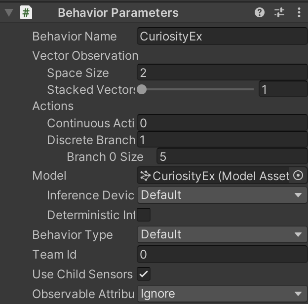
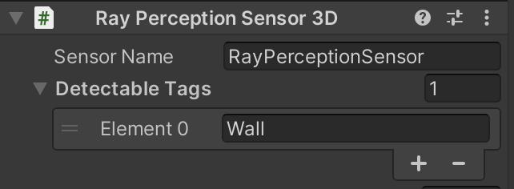
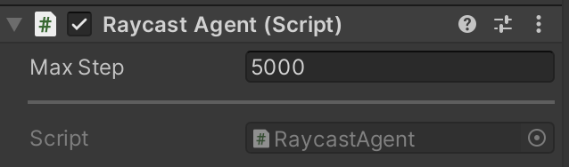
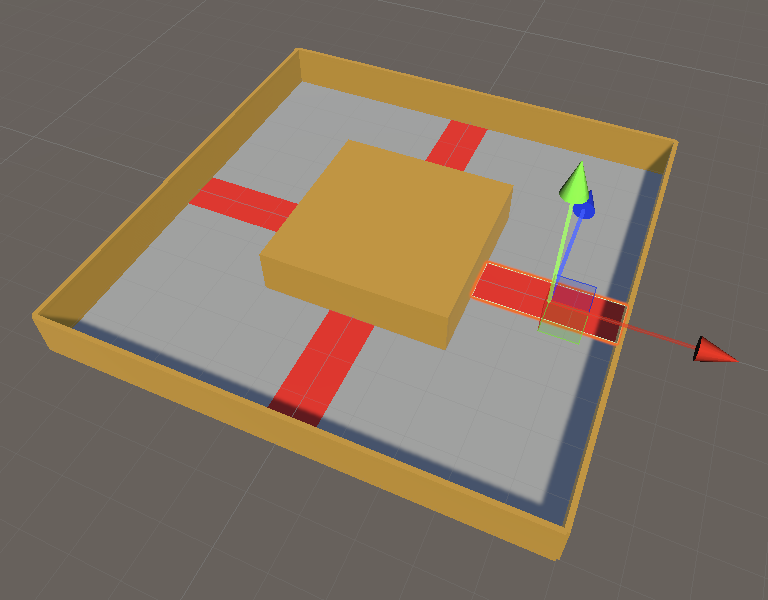
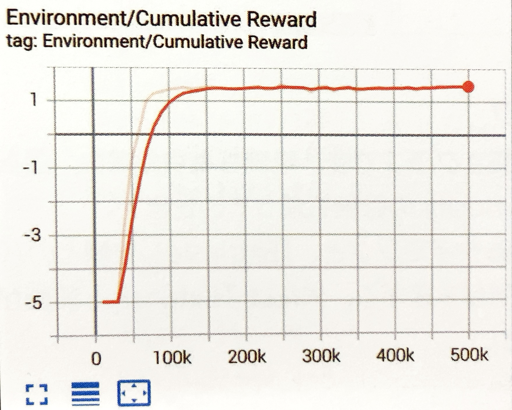
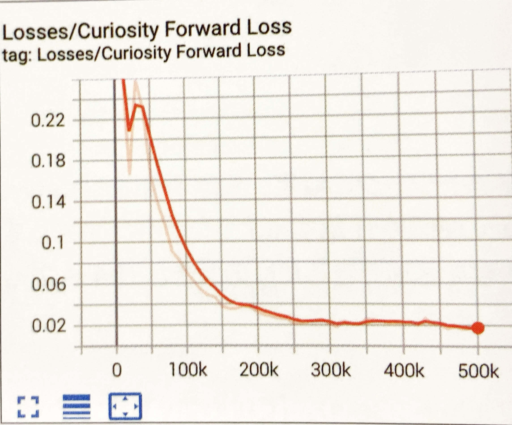
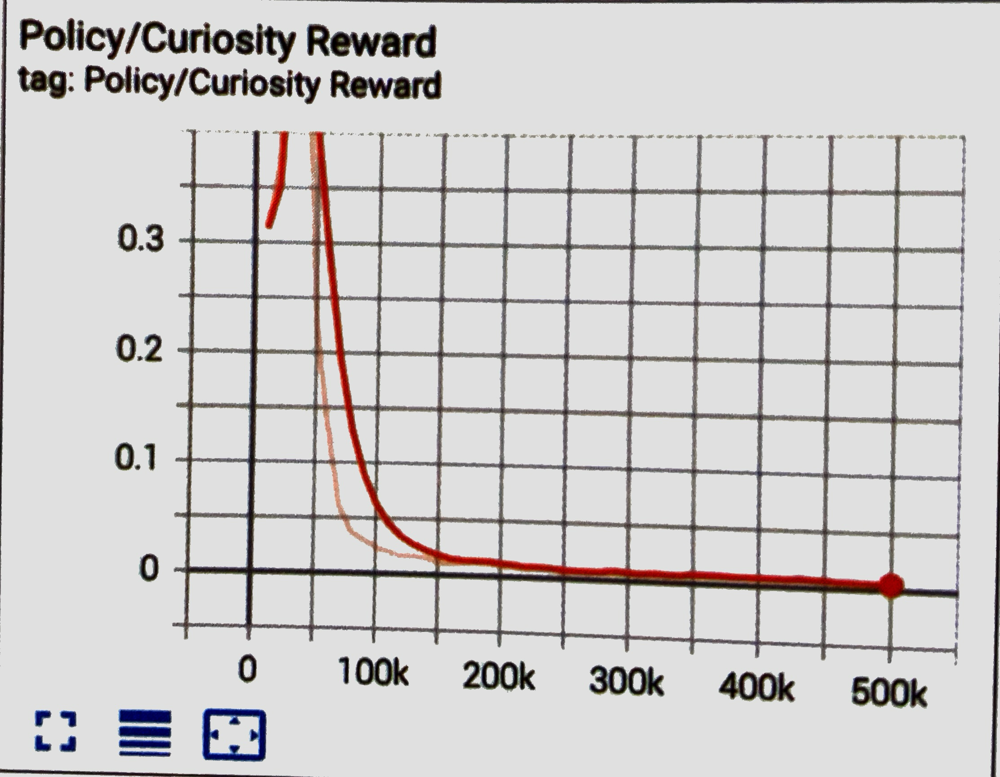
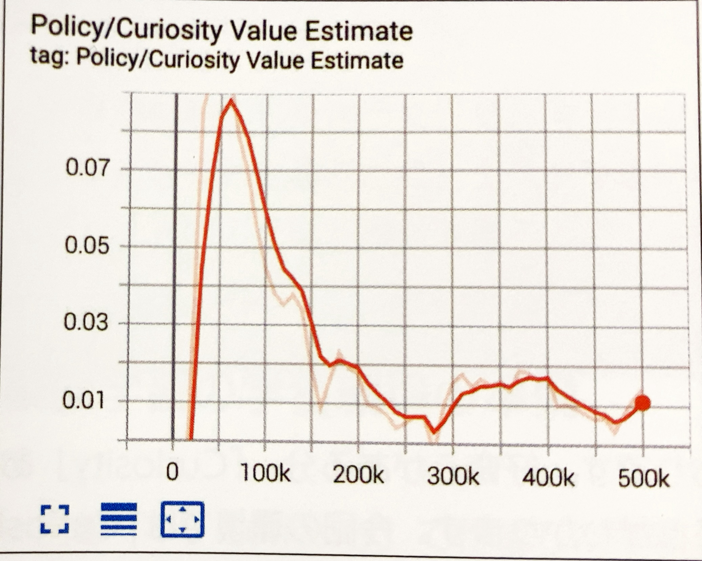
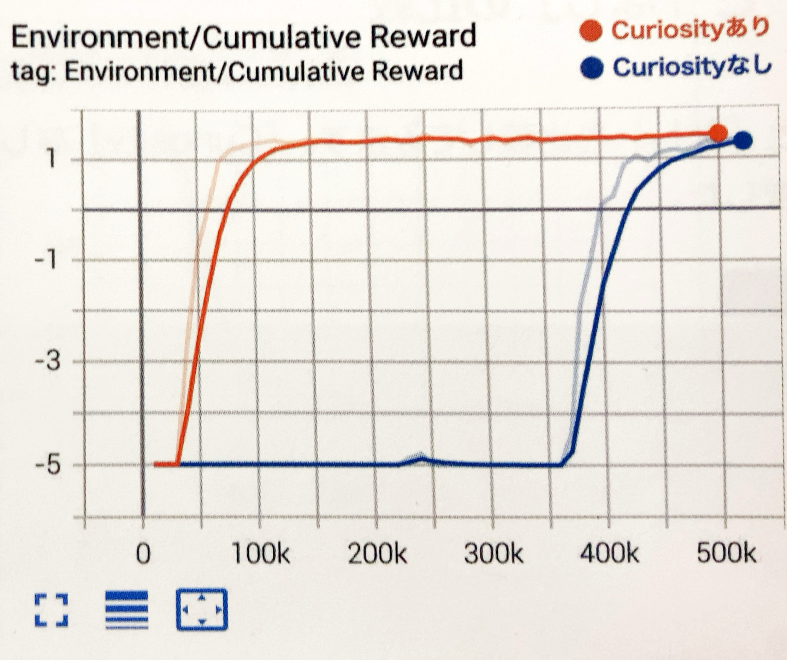

# 4-6 Curiosity

「Curiosity」は未知の状態に訪れたことに対して与えられる「報酬シグナル」です。「報酬」が少ない、または希少な環境では、エージェントは「報酬」を見つけることができないため、学習することができません。「Curiosity」を使うことで、エージェントに好奇心を持たせ、未知の状態への探索を促すことができます。

<br>

# Curiosityの学習環境の準備
「4-4 RaycastObservation」で作成したものをカスタマイズして、コースを反時計回りに周回することを学ぶ学習環境を作成し、「Curiosity」で学習します。


今回の学習環境の強化学習の要素は次のとおりです。

|項目|説明|
|---|---|
|観察|・Vector Observation(サイズ2)<br>0:RollerAgentのX速度,1:RollerAgentのZ速度<br>・Raycast Observation|
|行動|・Discrete(サイズ1)<br>0:移動(0:なし,1:前進,2:後進,3:左回転,4:右回転)|
|報酬|・ステップ毎に-0.001<br>・反時計回りに１周したときに+2.0(エピソード完了)|
|決定|・10ステップ毎|

<br>

# RaycastAgentの設定

① 「RaycastAgent」のタグに「Player」という名前のタグを設定

② 「Behavior Parameters」を設定



③ 「RayPerceptionSensor3D」を設定



④ スクリプト「RaycastAgent」を設定

`RaycastAgent.cs`
```cs
using System.Collections.Generic;
using UnityEngine;
using Unity.MLAgents;
using Unity.MLAgents.Sensors;
using Unity.MLAgents.Actuators;
using Unity.MLAgents.Policies;

// RaycastAgent
public class RaycastAgent : Agent
{
    Rigidbody rBody;
    int lastCheckPoint; // 最終チェックポイント
    int checkPointCount; // チェックポイント通過数

    // ゲームオブジェクト生成時に呼ばれる
    public override void Initialize()
    {
        this.rBody = GetComponent<Rigidbody>();
    }

    // エピソード開始時に呼ばれる
    public override void OnEpisodeBegin()
    {
        // 周回数のリセット
        this.lastCheckPoint = 0;
        this.checkPointCount = 0;
    }

    // 観察取得時に呼ばれる
    public override void CollectObservations(VectorSensor sensor)
    {
        sensor.AddObservation(rBody.velocity.x); // RaycastAgentのX速度
        sensor.AddObservation(rBody.velocity.z); // RaycastAgentのZ速度
    }

    // 行動実行時に呼ばれる
    public override void OnActionReceived(ActionBuffers actionBuffers)
    {
        // RaycastAgentに力を加える
        Vector3 dirToGo = Vector3.zero;
        Vector3 rotateDir = Vector3.zero;
        int action = actionBuffers.DiscreteActions[0];
        if (action == 1) dirToGo = transform.forward;
        if (action == 2) dirToGo = transform.forward * -1.0f;
        if (action == 3) rotateDir = transform.up * -1.0f;
        if (action == 4) rotateDir = transform.up;
        this.transform.Rotate(rotateDir, Time.deltaTime * 200f);
        this.rBody.AddForce(dirToGo * 0.4f, ForceMode.VelocityChange);

        // ステップ毎の報酬
        AddReward(-0.001f);
    }

    // チェックポイントに衝突時に呼ばれる
    public void EnterCheckPoint(int checkPoint)
    {
        // 次のチェックポイントに衝突
        if (checkPoint == (this.lastCheckPoint+1)%4)
        {
            this.checkPointCount++;

            // ゴール
            if (this.checkPointCount >= 4)
            {
                AddReward(2.0f);
                EndEpisode();
            }
        }
        // 前のチェックポイントに衝突
        else if (checkPoint == (this.lastCheckPoint-1+4)%4)
        {
            this.checkPointCount--;
        }

        // 最終チェックポイントの更新
        this.lastCheckPoint = checkPoint;
    }

    // ヒューリスティックモードの行動決定時に呼ばれる
    public override void Heuristic(in ActionBuffers actionBuffers)
    {
        var actionsOut = actionBuffers.DiscreteActions;
        actionsOut[0] = 0;
        if (Input.GetKey(KeyCode.UpArrow)) actionsOut[0] = 1;
        if (Input.GetKey(KeyCode.DownArrow)) actionsOut[0] = 2;
        if (Input.GetKey(KeyCode.LeftArrow)) actionsOut[0] = 3;
        if (Input.GetKey(KeyCode.RightArrow)) actionsOut[0] = 4;
    }
}
```

⑤ 「RaycastAgent」を設定



<br>

# チェクポイント✖︎4の設定



`CheckPoint.cs`
```cs
using System.Collections;
using System.Collections.Generic;
using UnityEngine;

// チェックポイント
public class CheckPoint : MonoBehaviour
{
    public RaycastAgent agent;
    public int checkPointId;

    // 他のオブジェクトとの交差開始時に呼ばれる
    void OnTriggerEnter(Collider other)
    {
        if (other.gameObject.tag == "Player")
        {
            this.agent.EnterCheckPoint(this.checkPointId);
        }
    }
}

```

<br>

# Curiosityの学習設定ファイルの設定

今回は「PPO」で学習します。以下のように、ハイパーパラメータを設定してください。

`CuriosityEx.yaml`
```yaml
behaviors:
  CuriosityEx:
    # トレーナー種別
    trainer_type: ppo

    # 基本
    max_steps: 10000000
    time_horizon: 128
    summary_freq: 10000
    keep_checkpoints: 5

    # 学習アルゴリズム
    hyperparameters:
      # PPOとSAC共通
      batch_size: 128
      buffer_size: 2048
      learning_rate: 0.0003
      learning_rate_schedule: linear

      # PPO用
      beta: 0.01
      epsilon: 0.2
      lambd: 0.95
      num_epoch: 3

    # ニューラルネットワーク
    network_settings:
      normalize: false
      hidden_units: 512
      num_layers: 2

    # 報酬
    reward_signals:
      # 環境報酬
      extrinsic:
        gamma: 0.99
        strength: 1.0

      # Curiosity報酬
      curiosity:
        gamma: 0.99
        strength: 0.005
        network_settings:
          hidden_units: 64
        learning_rate: 0.0003
```

<br>

## Curiosity報酬のハイパーパラメータ

「reward_signals:」下の「curiosity:」下にCuriosity報酬のパラメータを設定します。

- **`strength`**  
環境報酬とのバランス調整のため、Curiosity報酬に乗算する値（デフォルト：1.0）。
```
・典型的な値：0.001 ~ 0.1
```
<br>

- **`gamma`**  
将来の報酬割引率（デフォルト：0.99）。  
将来の報酬を重視する場合は大きな値、即時報酬を重視する場合は小さな値にします。
```
・典型的な値：0.8 ~ 0.995
```

- **`network_settings`**  
Curiosityモデルのニューラルネットワークの設定。設定項目はニューラルネットワーク「network_settings」と同様です。「hidden_units」は元の観測を圧縮するように十分に小さくする必要がありますが、期待される観察と実際の観察の区別できるだけの大きさ（64~256）が必要です。


- **`learning_rate`**
Curiosityモデルの学習率（デフォルト：3e-4）。「Curiosity Loss」が不安定な場合は、この値を減らす必要があります。
```
・典型的な値：1e-5 ~ 1e-3
```


<br>

# Curiosityの学習の実行

```
mlagents-learn .\config\sample\CuriosityEx.yaml --run-id=CuriosityEx-1 --env=CuriosityEx-1 --num-envs=8
```
学習結果のグラフは次のとおり



<br>

# Curiosity専用のグラフ

Curiosityの使用時には、「TensorBoard」でCuriosity専用のグラフも提供されています。

<br>

## Curiosity Foward Lossグラフ
「Curiosity」のフォワードモデル損失関数の平均を表すグラフです。モデルが２つの観察間で実行される行動をどれだけうまく予測できるか示します。



<br>

## Curiosity Inverse Lossグラフ
「Curiosity」のモデル損失の逆関数の平均グラフです。モデルが新しい観察をどれだけうまく予測できるか示します。


<br>

## Curiosity Reward グラフ
「Curiosity」の平均累計報酬を表すグラフです。単純な環境の場合、選択可能な未経験行動がなくなってしまうため、Curiosityの報酬も減っていきます。
「Curiosity」報酬が発生しているタイミングと、「Extrinsic」報酬とのバランスの確認にも利用します。「Curiosity」報酬が多すぎる、または「Extrinsic」報酬が多過ぎる場合は、「strength」で調整してください。



<br>

## Curiosity Value Estimate グラフ

エージェントが受け取る将来の「Curiosity」の平均累計報酬を表すグラフです。



<br>

# Curiosityの「あり」と「なし」の比較

「Curiosity」の「あり」と「なし」を比較してみます。「Curiosity」なしは、以下のハイパーパラメータで学習しました。

`CuriosityEx_B.yaml`
```yaml
behaviors:
  CuriosityEx:
    trainer_type: ppo

    max_steps: 10000000
    time_horizon: 128
    summary_freq: 10000
    keep_checkpoints: 5

    hyperparameters:
      # PPOとSAC共通
      batch_size: 128
      buffer_size: 2048
      learning_rate: 0.0003
      learning_rate_schedule: linear

      beta: 0.01
      epsilon: 0.2
      lambd: 0.95
      num_epoch: 3

    network_settings:
      normalize: false
      hidden_units: 512
      num_layers: 2

    reward_signals:
      extrinsic:
        gamma: 0.99
        strength: 1.0
```

学習結果のグラフは、次のとおりです。好奇心がある分、「Curiosity」ありのほうが早く報酬を見つけることができることがわかります。  
今回の環境では「Curiosity」なしでも、時間をかけることで報酬を見つけることができています。

